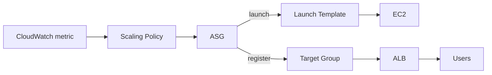
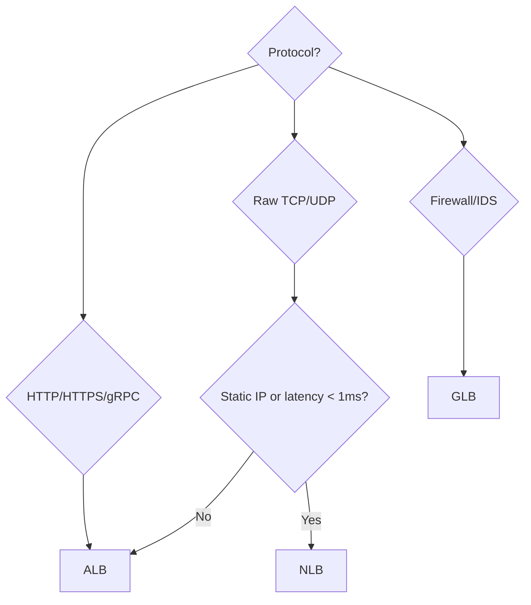

# Auto Scaling Groups + ELB

ASG and ELB are the pair that makes EC2 "elastic": ELB distributes traffic, ASG adds/removes instances based on load. Without these two, EC2 is just another cloud VM.

## 1. Launch Template

The "blueprint" for instances (AMI, type, SG, user-data, IAM role). Replaces the legacy Launch Configuration. Supports versioning and mixed-type fleets (multiple instance types + Spot + On-Demand mix).

```bash
aws ec2 create-launch-template \
  --launch-template-name web-tpl \
  --version-description v1 \
  --launch-template-data '{
    "ImageId": "ami-0abcd",
    "InstanceType": "t3.small",
    "SecurityGroupIds": ["sg-xxx"],
    "IamInstanceProfile": {"Name": "web-role"},
    "UserData": "'"$(base64 -w0 bootstrap.sh)"'"
  }'
```

## 2. Auto Scaling Group

Defines **where** (subnet/AZ), **how many** (min/max/desired), **how** (launch template), **what to monitor** (health check) and **when** to scale.



Key fields:

| Field | Meaning |
|---|---|
| `min/max/desired` | instance count bounds |
| `health-check-type` | `EC2` (status check) or `ELB` (more reliable) |
| `health-check-grace-period` | seconds before counting health (default 300) |
| `termination-policies` | `OldestInstance`, `NewestInstance`, `Default`, `AllocationStrategy` |
| `lifecycle-hooks` | pause launch/terminate for custom setup/teardown |
| `warm-pool` | pre-initialized instances in Stopped state, reduces cold start |

### Scaling policies

| Policy | Trigger | When |
|---|---|---|
| **Target tracking** | keeps metric at target (e.g. CPU 50%) | default, 80% of cases |
| **Step scaling** | adds N instances if metric is in range | non-linear scaling |
| **Scheduled** | cron-based (e.g. +10 every Monday 9:00) | known patterns |
| **Predictive** | ML on historical patterns | clear seasonal traffic |

Target tracking formula: the controller computes $n_{new} = n_{current} \cdot \frac{m_{current}}{m_{target}}$ with dead-band to avoid flapping.

## 3. ALB — Application Load Balancer

Layer 7 (HTTP/HTTPS/gRPC). Smart routing.

| Feature | Detail |
|---|---|
| Listener rules | path-based (`/api/*` -> TG-api), host-based (`api.example.com`), header, query |
| SNI | multiple certificates on the same 443 listener |
| Target groups | EC2/IP/Lambda/ECS |
| Health check | HTTP path + expected status code |
| Sticky sessions | `AWSALB` cookie (LB-generated) or app-managed |
| Authentication | OIDC/Cognito built-in (no app code) |
| WAF | native integration for OWASP rules |

```bash
aws elbv2 create-load-balancer --name web-alb --type application \
  --subnets subnet-a subnet-b --security-groups sg-alb

aws elbv2 create-target-group --name web-tg --protocol HTTP --port 80 \
  --vpc-id vpc-xxx --health-check-path /healthz --target-type instance
```

## 4. NLB — Network Load Balancer

Layer 4 (TCP/UDP/TLS). Ultra-low latency (<100ms p99), millions of RPS, **static IP per AZ** (useful for client whitelisting).

Features:
- Preserves the **client IP** (no need for X-Forwarded-For).
- Target type `ip` to point at on-prem IPs (via DX/VPN).
- Optional TLS termination (otherwise pass-through).
- Cross-zone load balancing **off by default** (avoids egress charges, but can cause hot spots).

## 5. GLB — Gateway Load Balancer

Layer 3. Designed for inserting **third-party firewalls** (Palo Alto, Fortinet) or IDS/IPS in-line with traffic via GENEVE encapsulation. You don't use this for normal web apps; it's for security-centric architectures.

## 6. When to use which



| Use case | LB |
|---|---|
| Public web app | ALB |
| gRPC API | ALB (supports gRPC) |
| UDP game server | NLB |
| High-volume MQTT/IoT | NLB |
| Client IP whitelist | NLB |
| Traffic inspection via appliance | GLB |
| WebSocket | ALB (ok) or NLB |

## 7. Health checks, stickiness and cross-zone

- **Health checks**: use a dedicated endpoint (`/healthz`) that checks only critical dependencies, NOT the whole app (avoids cascading failure).
- **Sticky sessions**: only if the app needs affinity (non-shared in-memory state). Better: external state (ElastiCache, DynamoDB).
- **Cross-zone**: ALB always on (free). NLB off by default — enable it for perfect balancing but mind inter-AZ data transfer cost.

## 8. Exercise

<details>
<summary>3-tier web app behind ALB; when to add Cognito vs WAF vs sticky?</summary>

- **WAF**: always, for OWASP top 10 protection, bot mitigation, per-IP rate limit. One-click integration with ALB.
- **Cognito**: if you want to handle user auth without writing login code. ALB redirects to Cognito Hosted UI; if user is authenticated, passes the `x-amzn-oidc-data` (signed JWT) header.
- **Sticky**: only if the app is stateful (in-memory sessions). The correct fix is to externalize session in Redis/ElastiCache, so every instance can serve any request.
</details>

<details>
<summary>ASG with 10 instances, target tracking on CPU 50%, but you see "flapping". Causes?</summary>

Possible causes:
1. **Health-check-grace-period** too low (instance doesn't finish booting in time).
2. CPU metric oscillates due to **GC pauses** (JVM) or cron jobs → use a composite metric (RequestCount + CPU).
3. Short **cooldown**: every scale-out triggers another immediate check. Use `default-cooldown` 300-600s.
4. Instance type too small, too sensitive to single heavy requests → bigger instances reduce variance.
5. Add a **warm pool** to shorten the "launching" to "in service" time.
</details>

> **Summary**: Launch Template + ASG (min/max/desired, lifecycle hooks, target tracking scaling, warm pool) for elasticity; ALB = layer 7, default for web/API/gRPC; NLB = layer 4 for latency/static IP/UDP; GLB to insert security appliances; health-check on a dedicated endpoint; sticky only when needed; cross-zone is a cost-vs-balance trade-off.
