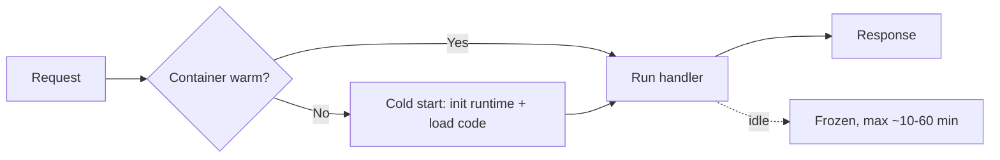

# Lambda deep dive

Lambda is AWS's "serverless compute": you write a function, AWS handles scaling, runs it in ephemeral containers and bills per millisecond. Here we go *under the hood* — what separates a slow Lambda from a fast one.

## 1. Execution model

Each invocation runs a **handler** (entry point) inside a **runtime** (Node.js, Python, Java, .NET, Go, Ruby or custom OCI). The **execution context** (container) is **reused** between invocations of the same concurrent function: globals, DB connections, SDK clients survive.

```python
# Best practice: initialize outside the handler
import boto3
s3 = boto3.client("s3")  # reused across invocations (warm)

def handler(event, context):
    return s3.list_buckets()
```



## 2. Cold start

When no warm container is available AWS must create one. Typical times:

| Runtime | Typical cold start |
|---|---|
| Lightweight Python/Node | 100-300 ms |
| Java/.NET | 500-3000 ms |
| Java + Spring Boot | 3-10 s |
| Container image | 200-1500 ms |
| Function in VPC (post hyperplane) | +50-150 ms |

Mitigations:
- **Provisioned Concurrency (PC)**: keeps N containers warm 24/7, fixed $/h. Great for web apps with tight SLA.
- **SnapStart** (Java/Python/.NET): AWS snapshots the already-initialized JVM/runtime, restore < 200 ms. Free.
- **Lambda SnapStart + priming**: initialize DB connections in the `beforeCheckpoint` hook.
- Keep package small, avoid heavy deps.
- Container image: cached base layer + fast bootstrap.

## 3. Configuration

| Limit | Value (2026) |
|---|---|
| Memory | 128 - 10 240 MB (in 1 MB steps) |
| Max duration | 15 minutes |
| Package size (zip) | 50 MB direct / 250 MB unzipped |
| Container image | 10 GB |
| Layers | 5 per function, 250 MB total |
| `/tmp` | 512 MB - 10 240 MB (configurable) |
| Env vars | 4 KB total, KMS-encrypted |
| Sync payload | 6 MB |
| Async payload | 256 KB |

CPU scales linearly with memory: at 1769 MB you get 1 full vCPU; at 10 240 MB ~6 vCPUs.

```bash
aws lambda update-function-configuration \
  --function-name my-fn \
  --memory-size 1024 \
  --timeout 30 \
  --environment 'Variables={DB_URL=...}' \
  --kms-key-arn arn:aws:kms:...:key/abcd
```

Cost trick: often **increasing memory reduces cost** because the function finishes much sooner (more CPU). Use **Lambda Power Tuning** to find the sweet spot.

## 4. Pricing

$$\text{cost} = N_{request} \cdot 0.20/10^6 + \text{GB-sec} \cdot 0.0000166667$$

With $N$ requests/month, duration $t$ ms at $m$ MB: $\text{GB-sec} = N \cdot t/1000 \cdot m/1024$.

Example: 10M req, 200 ms, 512 MB → ~$2 in requests + ~$17 in compute = $19/month.

## 5. Triggers and patterns

| Type | Trigger | Error behavior |
|---|---|---|
| **Sync** | API Gateway, ALB, Function URL, SDK invoke | error returned to client |
| **Async** | S3 event, SNS, EventBridge | retry x2 + DLQ/destination |
| **Poll-based** | SQS, Kinesis, DynamoDB Streams, MSK, MQ | Lambda polls; error = batch redone |

For async/poll: configure a **Dead Letter Queue** (SQS/SNS) or, better, **Destinations** (success+failure to SQS/SNS/EventBridge/Lambda).

```bash
aws lambda put-function-event-invoke-config \
  --function-name my-fn \
  --destination-config '{
    "OnFailure": {"Destination": "arn:aws:sqs:eu-west-1:123:dlq"},
    "OnSuccess": {"Destination": "arn:aws:events:eu-west-1:123:event-bus/main"}
  }'
```

## 6. VPC, layers, containers

**VPC**: only needed to reach private resources (RDS, ElastiCache). Since 2019 AWS uses **Hyperplane ENI** sharing, eliminating the historical 10s cold start. Still costs ~50-150 ms more.

**Layers**: reusable packages (custom SDKs, Python deps). Versioned, max 5 per function.

**Container image**: deploy an OCI image up to 10 GB. Useful for heavy ML models or when the zip isn't enough. Use the **AWS Lambda base image** (includes Runtime Interface Client).

```dockerfile
FROM public.ecr.aws/lambda/python:3.12
COPY requirements.txt .
RUN pip install -r requirements.txt
COPY app.py ${LAMBDA_TASK_ROOT}
CMD ["app.handler"]
```

## 7. Function URL vs API Gateway vs Lambda@Edge

| Feature | Function URL | API Gateway REST | API Gateway HTTP | Lambda@Edge |
|---|---|---|---|---|
| Cost | free | $$ | $ | $$ |
| Auth | IAM or public | IAM, Cognito, custom auth | JWT, IAM | none built-in |
| WAF | no (put CF in front) | yes | yes | via CF |
| Throttle/quota | no | granular | yes | no |
| Global latency | regional | regional | regional | global edge |

Lambda@Edge runs on CloudFront edges (600+ locations), Node/Python runtime, no custom env vars, 1 MB payload. Use cases: A/B testing, URL rewrite, edge auth.

## 8. Exercise

<details>
<summary>Python Lambda with 4-second cold start: causes and fixes?</summary>

Common causes:
1. **Huge package** (e.g. `pandas + scikit-learn` = 200 MB). Move to a layer or, better, container image.
2. **Heavy module-level imports**. Lazy-load: import inside the handler if only some paths need it.
3. **VPC config** using subnets without proper NAT/endpoints (DNS timeout).
4. **DB connections** rebuilt on every cold start. Initialize outside the handler (warm reuse).

Fixes:
- Raise memory to 1024+ MB → more CPU → faster init.
- Provisioned Concurrency for 2-5 units during peak hours.
- For Java: SnapStart (free, 10x improvement).
</details>

<details>
<summary>Lambda triggered by S3 ObjectCreated, you want exactly-once processing. How?</summary>

Async Lambda has auto-retry → you can get duplicates. Solutions:
- **Idempotency key**: use `bucket+key+etag` as ID; save to DynamoDB with `attribute_not_exists` condition.
- Powertools for AWS Lambda (Python/Node/Java) has an `@idempotent` decorator that does exactly this.
- DLQ/Destinations on failure so you don't lose events after the 2 retries.
</details>

> **Summary**: Lambda = event-driven compute, billed per ms · GB; warm container reused (init outside the handler); cold start mitigated with Provisioned Concurrency or SnapStart; max 15 min / 10 GB RAM / 10 GB image; sync/async/poll triggers with DLQ+Destinations; raising memory often costs less (linear CPU); Function URL for simple cases, API GW HTTP for modern APIs, Lambda@Edge for edge logic.
