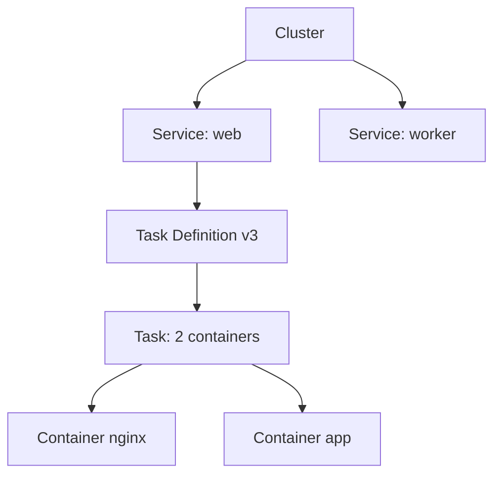
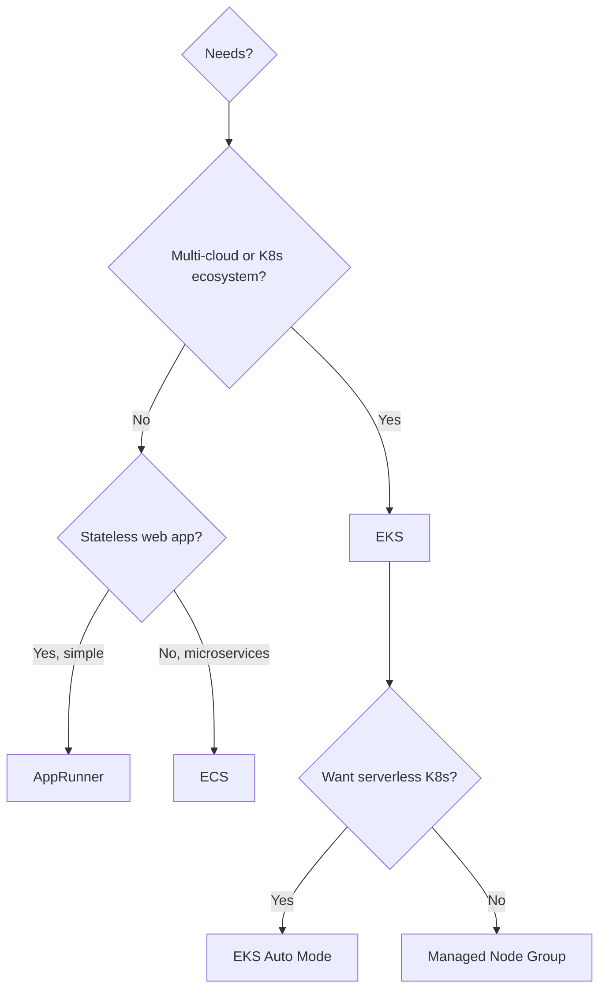

# Containers on AWS

AWS has 3 main ways to run containers: **ECS** (AWS-native orchestrator), **EKS** (managed Kubernetes) and **Fargate** (serverless compute used by both). Add **ECR** as the registry and **App Runner** as the "even more managed" option.

## 1. ECR — Elastic Container Registry

Private OCI/Docker registry. IAM-integrated (no long-lived Docker login passwords).

| Feature | Notes |
|---|---|
| Lifecycle policy | delete old tags (e.g. keep last 10) |
| Image scanning | Basic (free, OS) or Enhanced (Inspector, OS + libs) |
| Replication | auto cross-region or cross-account |
| Pull-through cache | proxy to Docker Hub / Quay / GitHub |
| Signing | sigstore/cosign integration |

```bash
aws ecr get-login-password --region eu-west-1 | \
  docker login --username AWS --password-stdin 123.dkr.ecr.eu-west-1.amazonaws.com

docker build -t my-app .
docker tag my-app:latest 123.dkr.ecr.eu-west-1.amazonaws.com/my-app:v1
docker push 123.dkr.ecr.eu-west-1.amazonaws.com/my-app:v1
```

## 2. ECS — Elastic Container Service

AWS proprietary orchestrator, simple and deeply integrated.

Hierarchy:



- **Cluster**: logical group.
- **Task Definition**: JSON with image, CPU, RAM, env, IAM role, network mode.
- **Service**: keeps N tasks running, integrates with ALB/Service Discovery, handles rolling/blue-green deploy.

Launch type:

| Type | Management | When |
|---|---|---|
| **EC2** | you manage nodes | fine control, GPU, custom Spot |
| **Fargate** | serverless | 2026 default for most cases |
| **External (ECS Anywhere)** | on-prem nodes | hybrid edge |

Network mode:
- `awsvpc` (Fargate default): each task has its own ENI and IP.
- `bridge` (EC2 only): classic Docker bridge.
- `host`: shares the host network.

## 3. EKS — Elastic Kubernetes Service

Upstream-compliant Kubernetes, control plane managed by AWS ($0.10/h per cluster). You (or EKS) manage the workers.

Compute options:

| Type | Description |
|---|---|
| **Managed Node Group** | EC2 managed by EKS (auto-upgrade, ASG underneath) |
| **Self-managed nodes** | you manage everything |
| **Fargate profile** | pods on Fargate, no nodes |
| **EKS Auto Mode** (2024+) | AWS manages nodes+addons+upgrades end-to-end |

**EKS Auto Mode** is the big new thing: you declare the cluster, AWS makes node provisioning decisions (Karpenter under the hood), addons (CoreDNS, kube-proxy, CNI, EBS CSI), patching. Brings EKS closer to the GKE Autopilot model.

**IRSA (IAM Roles for Service Accounts)**: binds a K8s ServiceAccount to an IAM role via OIDC. No more shared credentials on the node.

```bash
eksctl create cluster --name prod --region eu-west-1 --version 1.30 \
  --nodegroup-name mng-1 --node-type m7g.large --nodes 3

# IRSA: bind ServiceAccount to IAM
eksctl create iamserviceaccount --cluster prod --namespace app \
  --name s3-reader --attach-policy-arn arn:aws:iam::aws:policy/AmazonS3ReadOnlyAccess \
  --approve
```

## 4. Fargate

Serverless container compute. No EC2 to patch. Pay per vCPU + RAM by the second (with a 1-minute minimum).

Features:
- Per-task isolation (Firecracker microVM).
- No privileged daemonsets possible (on EKS this limits certain ops).
- Cold start typically 30-60 s (slower than Lambda).
- Spot compatible (Fargate Spot, ~70% off).
- Limits: 16 vCPU, 120 GB RAM, configurable ephemeral storage up to 200 GB.

## 5. App Runner

PaaS for web containers. Point at an ECR image (or GitHub repo) and App Runner deploys, scales, manages TLS. Similar to Cloud Run.

When: stateless web service when you don't want to manage ALB+ASG+ECS. Limit: less control (no sidecars, no complex VPC ingress).

## 6. ECS vs EKS — choosing

| Criterion | ECS | EKS |
|---|---|---|
| Learning curve | low | high |
| Multi-cloud portability | low | high (standard k8s) |
| Ecosystem (Helm, operators, etc.) | limited | rich |
| Control plane cost | free | $73/month per cluster |
| Initial deploy speed | minutes | hours-days |
| Team skill | "I know AWS" | "I know K8s" |

Rule of thumb: unless you have a strong reason for K8s (multi-cloud, team already knows it, Helm ecosystem) → **ECS+Fargate**. Otherwise EKS, and consider Auto Mode to reduce ops overhead.



## 7. Integration: ALB, Service Discovery, Secrets

- **ALB**: target group `ip` (for Fargate) or `instance` (for ECS-EC2 bridge). On EKS, use AWS Load Balancer Controller for Ingress.
- **Service Discovery**: ECS Service Connect (preferred) or Cloud Map (DNS A/SRV). On EKS, kube-dns + headless service.
- **Secrets**: mount from Secrets Manager / Parameter Store via the `secrets` field in the task def (ECS) or External Secrets Operator (EKS).
- **Auto-scaling**: Application Auto Scaling for ECS service (target CPU, RequestCountPerTarget); HPA + Karpenter for EKS.

## 8. Exercise

<details>
<summary>Stateless Python microservice you need to deploy. ECS-Fargate, EKS or App Runner?</summary>

Decision:
- **1 service, no sidecars, no K8s requirements** → **App Runner**. Simplest possible, ALB+TLS+autoscale included.
- **Multiple microservices, want shared ALB and service discovery** → **ECS-Fargate**. Richer setup but still manageable, no K8s to learn.
- **Team already on K8s, existing Helm charts, multi-cloud** → **EKS** (Auto Mode if you want serverless).

Rough cost for 1 always-on service, 0.5 vCPU + 1 GB:
- App Runner: ~$36/month
- Fargate (always on): ~$25/month
- EKS Fargate: ~$25/month + $73/month cluster
</details>

<details>
<summary>EKS, a pod must read from an S3 bucket. How to grant permissions without an access key?</summary>

**IRSA** (IAM Roles for Service Accounts):
1. Enable the OIDC provider on the cluster.
2. Create an IAM role with a trust policy that lets the specific ServiceAccount (`system:serviceaccount:app:s3-reader`) assume it.
3. Annotate the ServiceAccount with `eks.amazonaws.com/role-arn`.
4. The pod mounting that SA gets an OIDC token, the AWS SDK swaps it for temporary credentials via STS.

Alternatively, since 2023 there's **EKS Pod Identity** (simpler, no manual OIDC, just an EKS agent).
</details>

> **Summary**: ECR for registry (with scanning + lifecycle); ECS = AWS-native, simple, deep with Fargate; EKS = managed Kubernetes, rich but complex (Auto Mode simplifies it in 2024+); Fargate = serverless container for both; App Runner = PaaS for simple web; IRSA/Pod Identity for permissions without access keys; pick ECS+Fargate by default, EKS if you have K8s reasons.
