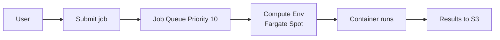
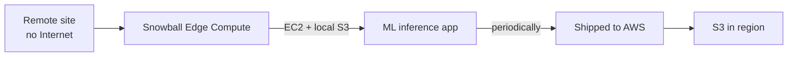

# Specialty compute

Beyond EC2, Lambda and containers there are services for specific needs: scientific batch workloads, 5G edge computing, on-prem hardware, managed VPS, classic PaaS. Knowing them prevents you from "reinventing the wheel" with raw EC2.

## 1. AWS Batch

Batch job orchestrator (HPC, simulations, genomics, ML training). You define jobs, AWS handles compute provisioning (EC2 or Fargate, Spot included), scheduling and retries.

Components:

| Concept | Description |
|---|---|
| **Compute Environment** | compute pool (EC2 ASG, Fargate, EKS). Managed or Unmanaged |
| **Job Queue** | priority queue, mapped to one or more CEs |
| **Job Definition** | job template (image, vCPU, RAM, retry, env) |
| **Job** | concrete instance submitted to the queue |



```bash
aws batch submit-job --job-name render-001 \
  --job-queue prod-queue \
  --job-definition render:3 \
  --container-overrides '{"environment":[{"name":"CHUNK","value":"42"}]}'
```

Useful patterns:
- **Array job**: launch N copies with index (`AWS_BATCH_JOB_ARRAY_INDEX`).
- **Multi-Node Parallel (MNP)**: 1 job using N MPI nodes (HPC).
- **Job dependencies**: DAG of dependencies (`--depends-on`).
- Spot compute env + retry strategy with `evaluateOnExit` to handle interruptions.

## 2. Lightsail

Managed VPS with fixed-tier pricing (e.g. $5/month = 1 vCPU + 2 GB + 60 GB SSD + 2 TB transfer). Designed for:
- Small WordPress / static web sites.
- Developers who don't want to touch VPC/IAM/SG.
- Demos, prototypes, side projects.

Key differences vs EC2:
- Simplified UI, pre-packaged "blueprints" (LAMP, Node, WordPress).
- Predictable pricing (no complicated GB-month EBS or egress GB).
- Limits: no deep integration with the rest of AWS (you can VPC-peer but it's limited).

When to move to EC2: as soon as you need auto-scaling, ALB, granular IAM or multi-service integrations.

## 3. Outposts

Physical AWS racks that AWS ships and installs in **your data center**. Same AWS API as in the cloud, managed by AWS via the regional control plane.

| Form factor | Description |
|---|---|
| **Outposts 42U rack** | full rack, 5 to 100+ kVA |
| **Outposts servers** | 1U/2U, for small sites (remote office, edge) |

Use cases: single-digit ms latency to local systems (factory floor, hospital, broadcast), strict data residency (data must not leave the premises), gradual migration.

Services on Outpost: EC2, EBS, ECS/EKS, RDS, S3 on Outposts. No Lambda, no local DynamoDB (they hop to the region).

## 4. Wavelength and Local Zones

| Service | Distance from carrier | Use case |
|---|---|---|
| **Wavelength** | inside the 5G network (Verizon, KDDI, Vodafone) | mobile gaming, AR/VR, V2X |
| **Local Zones** | metropolitan area (Milan, Boston, etc.) | user latency <10 ms, local regulatory |
| **Outposts** | your DC | on-prem hybrid |

Wavelength exposes EC2, EBS, ECS inside the carrier zone; traffic from the 5G device never leaves the carrier network toward the Internet.

## 5. Snow family for edge compute

Not just data transport: Snow devices can **run EC2/Lambda** offline.

| Device | Storage | Compute | Use case |
|---|---|---|---|
| **Snowcone** | 8/14 TB | 4 vCPU 4 GB | military edge, drones, mobile lab |
| **Snowball Edge Storage** | ~80 TB | light | bulk transfer |
| **Snowball Edge Compute** | ~42 TB | 52 vCPU + optional GPU | edge ML inference, IoT aggregation |



## 6. AWS App Runner — revisited

Already covered in section 17. Putting it in the specialty context: it's AWS's "containerized PaaS". Quick comparison:

| Service | Code or container? | Network management |
|---|---|---|
| Lambda | code (zip/image) | managed |
| App Runner | container | managed |
| Elastic Beanstalk | code | EC2 + ALB exposed |
| Lightsail | VPS | simplified |

## 7. Elastic Beanstalk

"Legacy" PaaS (2011) but useful for those who don't want IaC: upload a zip (Java, Python, .NET, Node, PHP, Ruby, Go, Docker) and Beanstalk creates EC2 + ALB + ASG + RDS + CloudWatch behind the scenes.

Pros:
- Zero IaC to get started.
- Rolling updates, blue-green, URL swap.
- You see and edit the underlying resources (EC2, ASG) in the console.

Cons:
- Magical: hard to debug when things go wrong.
- Conceptual lock-in: redoing it in CDK/Terraform later is work.
- Slow iteration vs App Runner or ECS.

```bash
eb init -p python-3.12 my-app --region eu-west-1
eb create my-env --instance-type t3.small
eb deploy
```

When: quick PoC, team without ops, classic monolithic app. For greenfield in 2026, consider App Runner or ECS+Fargate first.

## 8. Exercise

<details>
<summary>ML training pipeline with 10k parallel jobs of varying duration. Which service?</summary>

**AWS Batch** is ideal for this:
1. **Fargate Spot** compute environment (or EC2 Spot with GPU instances if needed).
2. Priority job queue (e.g. preview vs prod).
3. Job definition with the trainer container image, retry strategy that handles Spot interruption.
4. **Array job** of 10k instances, each `AWS_BATCH_JOB_ARRAY_INDEX` reads a different chunk from S3.
5. Dependencies for the final merge (`--depends-on type=N_TO_N`).

Alternatives: SageMaker Training Jobs (more ML-focused), Step Functions Map (for complex orchestration with other integrations).
</details>

<details>
<summary>Hospital with the requirement: patient data must not leave the building, but they want to use AWS. What?</summary>

**AWS Outposts** (rack or server):
- AWS hardware installed on premises.
- Same API and tooling as an AWS region.
- Data physically stays in the building (HIPAA/local GDPR compliance).
- EC2/EBS/ECS/RDS services locally; optional encrypted uplink to the region for backup or unavailable services.

Smaller edge alternative: Snowball Edge Compute (mobile, no permanent rack).
</details>

> **Summary**: AWS Batch for batch/HPC jobs (CE + queue + job def, array job + Spot); Lightsail = simplified managed VPS for small use cases; Outposts = AWS in your DC (compliance, single-digit ms latency); Wavelength = 5G edge; Local Zones = metropolitan; Snow family for offline edge; Elastic Beanstalk = legacy PaaS but useful to get started without IaC; App Runner = modern PaaS for web containers.
