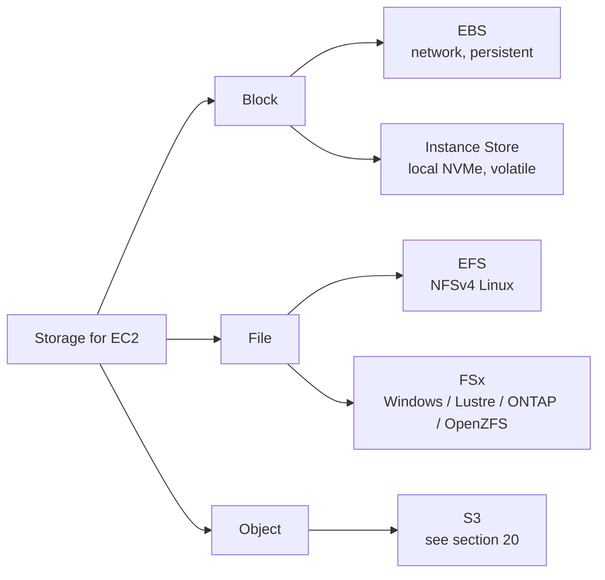

# EBS, EFS, FSx, Instance Store

Under EC2 (and many other services) sits a non-trivial storage choice: network-persistent block, shared filesystems, ephemeral local NVMe. Get this wrong and you'll pay 5x what you need to or lose data on the first `stop`.

## 1. The mental map



Rule of thumb: persistent single-instance → EBS; shared Linux → EFS; shared Windows AD → FSx Windows; HPC/ML scratch → FSx Lustre or Instance Store; ephemeral cache at extreme IOPS → Instance Store.

## 2. EBS — volume types

| Type | Tech | Max IOPS | Max throughput | Use case |
|---|---|---|---|---|
| **gp3** | SSD | 16,000 (default 3,000) | 1,000 MB/s (default 125) | modern default, web/app/small DB |
| **gp2** | SSD | 16,000 (3 IOPS/GB) | 250 MB/s | legacy, ~20% pricier than gp3 like-for-like |
| **io2 Block Express** | NVMe SSD | 256,000 per volume | 4,000 MB/s | mission-critical DB, SAP HANA |
| **st1** | HDD | 500 | 500 MB/s | sequential big data, logs |
| **sc1** | cold HDD | 250 | 250 MB/s | rare archive |

Key points:
- **gp3** decouples GB from IOPS/throughput → you pay only for what you need.
- **io2 Block Express** supports **multi-attach** (same volume on multiple EC2s in the same AZ) for SAN-like clusters (e.g. Oracle RAC). A cluster-aware filesystem is mandatory (GFS2, OCFS2), otherwise guaranteed corruption.
- An EBS volume lives in **a single AZ**: for cross-AZ you must snapshot and recreate.

## 3. Snapshots, FSR, DLM

EBS snapshot = incremental backup to S3 (AWS-managed, you don't see the bucket). Only blocks changed since the last snapshot are stored, but you can delete snapshot N and keep N+1 without losing data (AWS handles the dependencies).

```bash
# manual snapshot
aws ec2 create-snapshot --volume-id vol-abc --description "pre-upgrade"

# Fast Snapshot Restore: pre-warm in a specific AZ
aws ec2 enable-fast-snapshot-restores \
  --availability-zones eu-west-1a \
  --source-snapshot-ids snap-xyz
```

**Fast Snapshot Restore (FSR)**: without FSR, the first read of a block on a volume created from snapshot is slow (lazy load from S3). FSR pre-warms and gives full performance immediately — useful for tested disaster recovery. Expensive (~$0.75/AZ/h per snapshot).

**DLM (Data Lifecycle Manager)**: schedules automatic snapshots with a retention policy. Replaces cron scripts, works by tag.

Encryption: KMS at-rest (AWS-managed key or CMK), transparent. Snapshot of an encrypted volume → encrypted snapshot. To share encrypted snapshots cross-account you must share the CMK too.

## 4. EFS — managed NFS

NFSv4 filesystem shared across hundreds of EC2s (and Lambda, ECS, EKS). Auto-scales to petabytes, pay-per-GB.

| Mode | When |
|---|---|
| Performance: **General Purpose** | default, lowest latency |
| Performance: **Max I/O** | >7000 ops/s aggregate, slightly higher latency |
| Throughput: **Bursting** | scales with size |
| Throughput: **Provisioned** | fixed MB/s independent of size |
| Throughput: **Elastic** | auto-scales up to 10 GB/s, pay only for use |

**Lifecycle**: files not accessed for N days move to **IA** (Infrequent Access, ~92% cheaper) or **Archive** (~50% extra discount). Re-read? Auto-returns to Standard if you enable "intelligent tiering".

**Access Points**: app-level views of the filesystem with forced UID/GID and root directory, great for multi-tenant. **Mount target per AZ**: create one per AZ, EC2s mount the local one (lower latency + no cross-AZ data transfer).

```bash
sudo mount -t efs -o tls fs-0123abc:/ /mnt/efs
```

## 5. FSx — four managed file systems

| Variant | Protocol | Use case |
|---|---|---|
| **FSx for Windows File Server** | SMB | Windows shares with AD integration, native ACLs, DFS |
| **FSx for Lustre** | Lustre POSIX | HPC, ML training, high-bandwidth scratch, S3 linkage |
| **FSx for NetApp ONTAP** | NFS+SMB+iSCSI | lift-and-shift of on-prem NetApp filers, snapshots, dedup |
| **FSx for OpenZFS** | NFS | instant snapshots, clones, high compression |

**FSx for Lustre** is special: it mounts an S3 bucket as backing store, lazy-loads files from bucket to filesystem, async write-back. Result: HPC sees POSIX but data lives in S3.

## 6. Instance Store

NVMe physically attached to the host: ~1M IOPS, ~10 GB/s aggregate, sub-ms latency. Available only on `i*`, `d*`, `h*`, `m6id`, `c7gd`, etc. families.

Brutal gotchas:
- **Volatile**: stop, terminate, host failure → data lost.
- Not snapshottable.
- Can't hot-attach/detach.

Legitimate use cases: local cache (Redis cluster with replica elsewhere), HPC scratch, Spark shuffle, rebuildable indices (Elasticsearch with replica), DBs with sync replica (Cassandra, Aerospike).

## 7. When to use what — cheat sheet

| Scenario | Pick |
|---|---|
| EC2 root disk | EBS gp3 |
| Heavy OLTP DB | io2 Block Express |
| Shared content for 20 PHP web servers | EFS |
| Windows share with AD users | FSx for Windows |
| ML training on 50 TB of images | FSx for Lustre + S3 bucket |
| Ephemeral Redis cache, 800k IOPS | Instance Store (i4i) |
| Kafka data dir-style sequential log | st1 (or a fat gp3) |
| Two-node Oracle RAC cluster | io2 Block Express multi-attach |

## 8. Exercise

<details>
<summary>You have 12 stateless EC2s behind an ALB serving dynamic PDFs from common templates. Which shared storage for the templates?</summary>

**EFS Elastic throughput** + lifecycle to IA after 30 days.

Why:
- 12 Linux clients → NFS is natural.
- Templates change rarely, mostly read.
- Elastic throughput avoids provisioning, pays only effective use (read burst at deploy).
- Lifecycle IA for old templates still linked but rarely served.

Anti-pattern: copying templates to each instance's EBS at boot via user-data — becomes a nightmare when you update 100 templates and have to rebuild the AMI.
</details>

<details>
<summary>Single-node Postgres DB with 4 TB and ~30k sustained IOPS. Which EBS?</summary>

**io2 Block Express** at 4 TB with 30,000 provisioned IOPS.

Numbers:
- gp3 max 16k IOPS → insufficient.
- io2 Block Express scales to 256k IOPS, constant sub-ms latency.
- Daily snapshots via DLM + FSR pre-warm in a secondary AZ for fast DR.
- Encryption with a workload-dedicated CMK.

Managed alternative: RDS Postgres on io1/io2, gets you backup/PITR for free (section 23).
</details>

> **Summary**: EBS = persistent network block, gp3 is today's default, io2 Block Express for nasty workloads, incremental snapshots with DLM + FSR; EFS = multi-instance NFS with lifecycle to IA/Archive; FSx covers Windows/Lustre/ONTAP/OpenZFS; Instance Store = blazing local NVMe but volatile. The wrong pick costs money or loses data: think first about persistence, sharing, and required IOPS.
