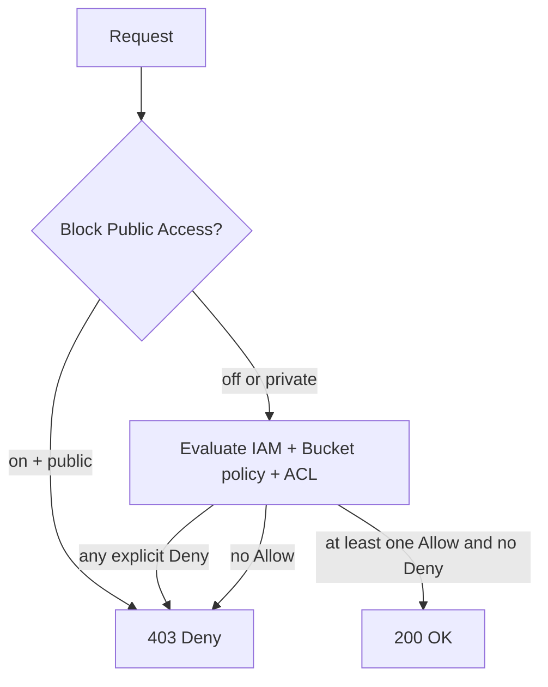

# S3 — deep dive

S3 (Simple Storage Service) is the very first AWS service (2006) and still the *backbone* of pretty much every cloud architecture: data lakes, backup, static hosting, log archive, CDN-friendly assets, Iceberg/Hudi lakehouses. Under its simplicity sits an enormous functional surface.

## 1. Primitives

- **Bucket**: globally unique container (name unique worldwide), regional.
- **Object**: blob up to **5 TB** (multipart upload mandatory >5 GB, recommended >100 MB).
- **Key**: string up to 1024 bytes; the "folder" illusion comes from `/` in the key.
- **Durability**: **eleven nines** (99.999999999%) — losing an object is practically legend.
- **Availability**: 99.99% for Standard (SLA 99.9%).
- **Consistency**: since December 2020, **strong read-after-write** on all operations (used to be eventual on overwrite/delete). No more artificial-delay hacks.

## 2. Storage classes

| Class | Storage cost | Retrieval | Min duration | Typical |
|---|---|---|---|---|
| **Standard** | $0.023/GB | none | none | hot data |
| **Standard-IA** | $0.0125/GB | $0.01/GB | 30 days | rebuildable backups |
| **One Zone-IA** | $0.01/GB | $0.01/GB | 30 days | recreatable replica, single AZ |
| **Intelligent-Tiering** | dynamic | none | 30 days | unpredictable access |
| **Glacier Instant Retrieval** | $0.004/GB | $0.03/GB ms | 90 days | archive but instant access |
| **Glacier Flexible Retrieval** | $0.0036/GB | $0.01-0.10/GB, 1-5 min or 3-5h | 90 days | archive with SLA recovery |
| **Glacier Deep Archive** | $0.00099/GB | $0.02/GB, 12 h | 180 days | "the warehouse", fiscal compliance |

**Intelligent-Tiering** is today's *recommended default* for generic workloads: AWS auto-moves between tiers (Frequent, Infrequent, Archive Instant, Archive, Deep Archive) by access pattern, costing only $0.0025/1000 objects of monitoring. No retrieval fees between the "instant" tiers.

## 3. Lifecycle, versioning, MFA delete

```bash
aws s3api put-bucket-lifecycle-configuration --bucket app-logs --lifecycle-configuration '{
  "Rules":[{
    "ID":"logs-tiering",
    "Status":"Enabled",
    "Filter":{"Prefix":"raw/"},
    "Transitions":[
      {"Days":30,"StorageClass":"STANDARD_IA"},
      {"Days":180,"StorageClass":"GLACIER"}
    ],
    "Expiration":{"Days":2555},
    "NoncurrentVersionExpiration":{"NoncurrentDays":90}
  }]
}'
```

**Versioning**: every overwrite/delete creates a new version, "delete" is a recoverable *delete marker*. Mandatory before enabling Object Lock or Replication. **MFA Delete**: requires MFA to delete versions, enabled only from the root account via CLI.

## 4. Replication

- **CRR** (Cross-Region Replication): async copy to a different region for DR / user latency / data compliance.
- **SRR** (Same-Region Replication): typically separates prod/log or changes the owner account.
- **RTC** (Replication Time Control): SLA 99.99% replicate within **15 minutes**, with CloudWatch metrics.

Requires versioning on both buckets. Doesn't replicate pre-existing objects (you must run a separate batch replication).

## 5. Encryption

All S3 is encrypted at rest by default since January 2023 (SSE-S3 baseline).

| Mode | Who manages the key | Audit | Cost |
|---|---|---|---|
| **SSE-S3** | AWS (AES-256) | no | included |
| **SSE-KMS** | KMS CMK | full CloudTrail | KMS API costs |
| **DSSE-KMS** | KMS, double encryption | yes | KMS x2 |
| **SSE-C** | you supply the key on every request | no | included |

**Bucket Key**: data-key cached at bucket level → 99% fewer KMS calls for write-heavy workloads. Almost always worth enabling with SSE-KMS.

In transit: HTTPS-only via bucket policy with `aws:SecureTransport=false` deny.

## 6. Policies, ACLs, Block Public Access

Three access layers, counterintuitive together:

1. **IAM policy** (on user/role): "who am I and what can I do?".
2. **Bucket policy** (on bucket): "what does this bucket grant, to whom?".
3. **ACL** (legacy, object/bucket): object-level granularity, discouraged today.

**Block Public Access** is the master switch above everything: when on (default since 2023), even if policy/ACL grant public, S3 denies. Disable it only with surgical awareness.



## 7. Advanced features

- **Object Lock** (WORM): immutable retention in **Governance** (override with special permission) or **Compliance** (immutable even for root, regulator-grade). Requires versioning.
- **Pre-signed URL**: temporary link granting put/get, signed with your credentials. Classic pattern: direct upload from browser without exposing creds.
- **S3 Select**: SQL over a single CSV/JSON/Parquet object, saves bandwidth and CPU.
- **Access Points**: dedicated endpoints with per-app/team policy, avoid a giant bucket policy.
- **Multi-Region Access Points**: global endpoint with auto failover across buckets replicated in multiple regions.
- **S3 Object Lambda**: transform the object on-the-fly during GET (PII redaction, image resize, format conversion).
- **Storage Lens**: org-wide dashboard on usage, classes, anomalies, cost recommendations.
- **Event Notifications**: trigger on PUT/DELETE to **SQS / SNS / Lambda / EventBridge** (EventBridge is the modern path, richer filters).
- **Transfer Acceleration**: upload via CloudFront edges, useful from distant continents.
- **Multipart Upload**: parts of 5 MB-5 GB, resume and parallelism. Mandatory >5 GB, recommended >100 MB. **Remember**: incomplete uploads linger and you pay for them — enable the "AbortIncompleteMultipartUpload" lifecycle rule.

## 8. Exercise

<details>
<summary>You must serve user video uploads up to 10 GB with auto-thumbnails. Architecture?</summary>

1. **Pre-signed URL** generated by API Gateway+Lambda → browser does **multipart upload** directly to S3 (no backend bandwidth).
2. **Bucket policy** HTTPS-only + Block Public Access on.
3. **Event Notification** `s3:ObjectCreated:CompleteMultipartUpload` → EventBridge → transcoding/thumbnail Lambda (or MediaConvert).
4. Thumbnails written to a dedicated bucket with **CloudFront** in front (see sec. 11).
5. Lifecycle rule: original videos → IA after 60 days → Glacier Flexible after 180.
6. Multipart "AbortIncompleteMultipartUpload" at 7 days to clean orphan parts.
</details>

<details>
<summary>Fiscal compliance: 10 years of immutable documents, rarely accessed but instantly when needed.</summary>

- **Versioning** on + **Object Lock Compliance** mode, 10-year retention.
- Storage class **Glacier Instant Retrieval**: $0.004/GB with ms access (perfect for "rare but instant").
- **SSE-KMS** with dedicated CMK, key policy excluding everyone from `kms:Disable`.
- **CRR Replication** to a secondary region with same Object Lock (DR).
- **CloudTrail data events** on the bucket for full audit.

Anti-pattern: Glacier Deep Archive — cheaper but 12h retrieve violates "instant".
</details>

> **Summary**: S3 is object storage with 11×9 durability, with classes from Standard to Deep Archive (managed via lifecycle or Intelligent-Tiering); versioning + Object Lock for immutability; CRR/SRR/RTC for DR; encryption SSE-S3 default, SSE-KMS + Bucket Key for audit/multi-tenant; security = Block Public Access + bucket policy + IAM; advanced features (Access Points, Object Lambda, Storage Lens, event notifications) make it far more than an "infinite disk".
