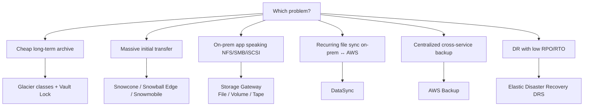

# Glacier, Snow, Storage Gateway, DataSync, AWS Backup

S3 and EBS/EFS cover "online" storage. For edge cases — 25-year compliance archives, migrating 500 TB out of a datacenter with no decent network, NFS shares still living on-prem, unified backups across 30 services, cross-region DR — AWS offers a galaxy of dedicated services. Let's see them together because they're often combined.

## 1. Decision map



## 2. Glacier — the three classes

| Class | Retrieval | Storage cost | Min duration | Use case |
|---|---|---|---|---|
| **Glacier Instant Retrieval** | ms | $0.004/GB | 90 days | archive but needs to be instant (medical compliance) |
| **Glacier Flexible Retrieval** | Expedited 1-5 min / Standard 3-5h / Bulk 5-12h | $0.0036/GB | 90 days | archive with flexible SLA (logs, raw video) |
| **Glacier Deep Archive** | Standard 12h / Bulk 48h | $0.00099/GB | 180 days | "the warehouse" — 10+ year fiscal backups |

Glacier is a **tier of S3**: you reach it via S3 API (and lifecycle), there's no longer a separate "Glacier Vault" for new projects (still exists for legacy).

**Vault Lock** (S3 Object Lock in Compliance mode is the modern equivalent): immutable WORM policy even for root; once locked, it can't be undone. For regulators SEC 17a-4, MiFID II, GDPR retention.

## 3. Snow family — physical transfer

When you have hundreds of TB and a 100 Mbps internet connection, do the math: 100 TB over a "pure" 100 Mbps is ~92 days. AWS ships you hardware:

| Device | Capacity | Form factor | Trait |
|---|---|---|---|
| **Snowcone** | 8 TB | pocket-sized (~2 kg) | edge, optional battery, IoT |
| **Snowball Edge Storage Optimized** | 80 TB usable | industrial briefcase | the migration workhorse |
| **Snowball Edge Compute Optimized** | 28 TB + GPU + 104 vCPU | briefcase | edge compute (ships, mines) |
| **Snowmobile** | 100 PB | 14 m container on a truck | deprecated in 2024 but worth knowing for context |

Typical flow: order from console → AWS ships → load (Snowball CLI / NFS / S3 adapter) → ship back with auto-updating E-Ink label → AWS ingests into S3 → data destruction certificate. Mandatory 256-bit encryption with KMS keys.

## 4. Storage Gateway — the hybrid bridge

VM (or hardware appliance) that runs on-prem and exposes local protocols to servers, persisting behind the scenes to S3/EBS/Glacier.

| Mode | On-prem protocol | AWS backing store | Use |
|---|---|---|---|
| **File Gateway** (S3 / FSx) | NFS, SMB | S3 (or FSx) | file shares with native cloud backup |
| **Volume Gateway — Cached** | iSCSI | S3 (hot local cache) | working set cached, infinite capacity |
| **Volume Gateway — Stored** | iSCSI | EBS snapshot | primary data local, snapshots on AWS |
| **Tape Gateway** (VTL) | iSCSI VTL | S3 + Glacier | replaces physical tape libraries |

Typical: legacy Windows apps that write to `\\fileserver\share` keep doing so, but files actually land in S3 with lifecycle to Glacier.

## 5. DataSync — accelerated online sync

Managed service to migrate/sync datasets between storage **on-prem ↔ AWS** (and between AWS services). Key differences vs `rsync` or `aws s3 sync`:

- **Throughput**: up to 10x faster over WAN thanks to parallelism, compression, integrated encryption.
- Automatic end-to-end **integrity verification**.
- Built-in **bandwidth throttling** and **scheduling**.
- Source/target: NFS, SMB, HDFS, self-hosted object stores, S3, EFS, FSx (all variants).
- Per-GB pricing (~$0.0125/GB).

```bash
aws datasync create-task \
  --source-location-arn arn:aws:datasync:eu-west-1:111:location/loc-nfs-on-prem \
  --destination-location-arn arn:aws:datasync:eu-west-1:111:location/loc-s3-target \
  --options TransferMode=CHANGED,VerifyMode=ONLY_FILES_TRANSFERRED \
  --schedule ScheduleExpression="cron(0 2 * * ? *)"
```

Classic combo: **DataSync** for ongoing delta, **Snowball** for the initial bulk.

## 6. AWS Backup — centralized backup

Orchestrator service that brings under one console and policy the backup of: EBS, EFS, FSx, RDS, Aurora, DynamoDB, S3, DocumentDB, Neptune, EC2 (AMI), Storage Gateway, Redshift, Timestream, on-prem VMware.

Concepts:
- **Backup plan**: schedule (e.g. daily at 02:00), retention (e.g. 35 days daily + 12 months monthly), copy cross-region/cross-account.
- **Backup vault**: encrypted container (own CMK) where recovery points live.
- **Vault Lock**: makes the vault WORM, immutable retention (even root cannot shorten or delete before term) — for financial/healthcare audits.
- **Backup policy via Organizations**: applies a policy to all accounts in the OU.

| Feature | Benefit |
|---|---|
| Tag-based selection | "anything tagged `backup=daily`" |
| Cross-region copy | native geographic DR |
| Cross-account copy | isolated bunker account (anti-ransomware) |
| Audit Manager integration | ready-made compliance reports |

Anti-pattern: ad-hoc manual snapshots across three different services, no retention. Guaranteed: in two years you lose track, pay three times, restore never tested.

## 7. AWS Elastic Disaster Recovery (DRS)

CloudEndure's successor. Continuous **block-level** replication of on-prem or cloud servers to a low-cost AWS *staging area* (powered-off EBS). At disaster:

- **RPO**: seconds (continuous replication).
- **RTO**: minutes (boot EC2 from staging volumes).
- **Drill**: isolated test failover in a dedicated VPC without impacting prod.
- **Failback**: reverse replication to return on-prem once resolved.

Use case: business continuity for legacy apps you can't rewrite cloud-native short term, but for which you need a credible DR plan.

## 8. Exercise

<details>
<summary>Italian bank: 800 TB of scanned documents on-prem, to be migrated to AWS, 10-year WORM retention, annual audit access.</summary>

1. **Snowball Edge Storage Optimized** x ~10 devices (80 TB each) for initial ingest → S3 Standard.
2. Lifecycle policy → **Glacier Instant Retrieval** after 7 days (ms access, very cheap).
3. **Object Lock Compliance mode** 10-year retention (immutable even for root).
4. **SSE-KMS** with dedicated CMK, key policy blocking disable/delete.
5. **CRR** to a secondary region (eu-south-1) with the same Object Lock for DR.
6. Separate **AWS Backup vault** with **Vault Lock** for the DynamoDB metadata index.
7. **DataSync** for incremental new documents post-migration.
</details>

<details>
<summary>B2B SaaS with stack on AWS: needs a DR plan with RPO < 5 min, RTO < 30 min, but the customer wants quarterly tested region failover.</summary>

- **AWS Backup** with daily plan + cross-region copy (CRR vault) for RDS, EFS, DynamoDB → RPO 24h isn't enough alone.
- **Aurora Global Database** or **DynamoDB Global Tables** for DBs → RPO seconds cross-region.
- **S3** Cross-Region Replication with **RTC** (15 min SLA).
- **Elastic Disaster Recovery** for stateful EC2/ECS → RPO seconds, RTO ~10 min.
- **Route 53 health check + failover** (sec. 11) for DNS cutover.
- **Quarterly drill**: use DRS's "recovery instances in isolated subnet" feature → doesn't touch prod, generates a report.

Result: RPO seconds-minutes, RTO 20-30 min, audit evidence for the customer.
</details>

> **Summary**: Glacier (3 classes) for cold archive + Object Lock for WORM; Snow family for massive physical migration; Storage Gateway as a hybrid NFS/SMB/iSCSI/VTL bridge to S3; DataSync for recurring accelerated online transfers; AWS Backup orchestrates cross-service backup with vault lock and cross-account/region copy; Elastic Disaster Recovery delivers seconds-RPO/minutes-RTO for enterprise DR. They often combine: initial Snowball + delta DataSync + AWS Backup + CRR + DRS = a complete story.
