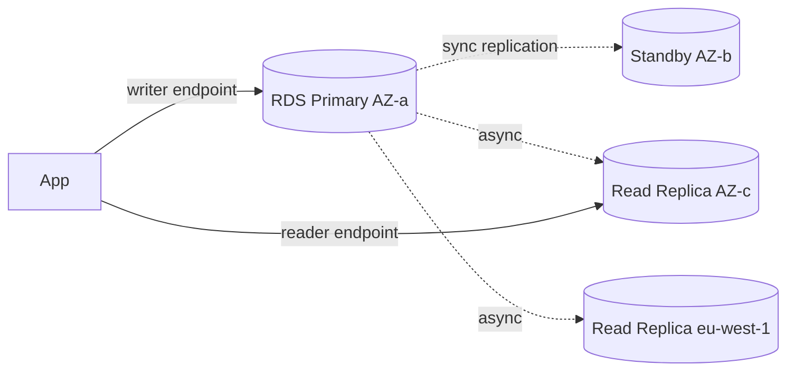

# RDS — managed relational DBs

RDS (Relational Database Service) takes patching, backups, failover, and replication off your plate for classic SQL DBs. You think about schema, queries, and indexes; AWS handles host, OS, replication topology, and maintenance. It's the "boring DB" you want in production when you don't need Aurora.

## 1. Supported engines

Six engines, each with license and feature quirks:

| Engine | License | Notes |
|---|---|---|
| **PostgreSQL** | open source | the "modern" preferred engine; extensions like `pg_stat_statements`, `pgvector`, PostGIS |
| **MySQL** | open source (community) | 5.7 / 8.0; broad compat |
| **MariaDB** | open source | MySQL fork, fewer recent features |
| **Oracle** | BYOL or License Included | Enterprise/Standard; TDE, OEM options |
| **SQL Server** | License Included (Express → Enterprise) | Multi-AZ via Mirroring/Always On |
| **Db2** | License Included | added 2023, targets IBM migrations |

For Postgres/MySQL Aurora (section 23) is often the better pick. Vanilla RDS still helps when you want full minor-version control, external logical replication, or extensions Aurora doesn't support.

## 2. Single-AZ vs Multi-AZ



- **Single-AZ**: 1 instance, 1 AZ. Downtime on failure or patching. Dev/test only.
- **Multi-AZ instance** (classic): primary + sync standby in another AZ, **standby NOT readable**. Automatic failover 60-120 s via DNS swap. 2x cost.
- **Multi-AZ DB Cluster** (Postgres/MySQL): 1 writer + 2 **readable standbys** synced, failover ~35 s, you can serve reads from standbys. ~2.5x cost.

Rule: production = always Multi-AZ. Don't disable it "to save $50".

## 3. Read Replicas

Async (typical lag < 1 s, but can climb to minutes under load). Up to **15** per primary. Cross-AZ, cross-region, even cross-account (Aurora). Use cases:

- Offload heavy analytical reads from the primary.
- Cross-region DR (promote the replica to standalone).
- Reporting on a different engine (Postgres → Postgres read replica → logical engine).

Promotion: a read replica can be **promoted** to standalone, breaking replication. Irreversible.

## 4. Backup and restore

- **Automated backup**: daily snapshot + continuous transaction log. Retention 1-35 days. Enables **Point-In-Time Recovery (PITR)** down to the second.
- **Manual snapshot**: you create it, unlimited lifetime, survives DB deletion.
- **Restore**: creates **a new instance** from the backup. No in-place restore.

```bash
aws rds restore-db-instance-to-point-in-time \
  --source-db-instance-identifier prod-db \
  --target-db-instance-identifier prod-db-restored \
  --restore-time 2026-05-21T10:15:00Z
```

Trap: deleting an instance with `--skip-final-snapshot` loses everything. Never. Always use `final-snapshot-identifier`.

## 5. Security and encryption

- **At rest**: KMS, enabled at creation (you can't turn it on later — must snapshot + encrypted copy + restore).
- **In transit**: SSL/TLS with `rds-ca-rsa2048-g1` cert. Force with `rds.force_ssl=1` (Postgres).
- **IAM database authentication**: log in with an IAM token instead of a password (Postgres/MySQL). Token valid 15 min.
- **Secrets Manager rotation**: automated password rotation via Lambda.
- Network: always in a private subnet, SG opening the DB port only to app SGs.

## 6. Parameter group, option group, maintenance

- **Parameter group**: all engine flags (`max_connections`, `shared_buffers`, etc.). The default is read-only — you must clone it.
- **Option group**: Oracle/SQL Server extras (TDE, S3 integration).
- **Maintenance window**: 30 min/week, AWS patches minor version and OS. You can force/delay.

## 7. RDS Proxy and blue/green

**RDS Proxy**: managed connection pooling in front of the DB. Mandatory for Lambda (which opens/closes a connection per invocation → saturates `max_connections` fast). Also reduces failover-induced errors by holding client connections during a swap.

**Blue/green deployment**: AWS spins up a "green" environment cloned from "blue" with the new version/parameter group, keeps it in sync via logical replication, and a switchover < 1 minute promotes green to primary. Game-changer for Postgres major version upgrades.

Other features to know:
- **Performance Insights**: wait events / top SQL dashboard, free 7-day retention.
- **RDS Custom** (Oracle/SQL Server): grants SSH/RDP OS access. Compromise between raw EC2 and managed RDS.
- **Storage Auto Scaling**: grows gp3/io1 automatically up to a cap.

## 8. Exercise

<details>
<summary>Lambda opens 5k connections/sec to an RDS Postgres with max_connections=200. What do you do?</summary>

The Lambda-RDS pattern without a proxy exhausts `max_connections` almost instantly (every cold start = new connection). Solutions:

1. **RDS Proxy**: managed pool, Lambdas talk to the proxy, it multiplexes onto few real DB connections. ~5 ms extra latency but eliminates the issue.
2. **Raising max_connections** isn't enough: needs proportional RAM, and the DB slows down with thousands of idle connections.
3. **Connection reuse intra-warm-container**: global var outside the handler. Helps but doesn't fix spikes.

Production: RDS Proxy + connection reuse + monitor `DatabaseConnections` in CloudWatch.
</details>

<details>
<summary>You must upgrade Postgres major 14→16 with downtime < 5 minutes. Strategy?</summary>

**Blue/green deployment**:
1. Create blue/green: AWS deploys a green cluster on PG 16 and syncs it via logical replication.
2. Test the app against the green endpoint (read-only initially).
3. Trigger the **switchover**: AWS briefly blocks writes on blue, waits for replication to catch up, and flips the endpoints. Typically < 1 min.
4. Blue stays available for a few hours in case rollback is needed.

Worse alternatives: in-place upgrade (10-30 min downtime, no fast rollback) or pg_dump/restore (hours of downtime).
</details>

> **Summary**: RDS = managed SQL DB (6 engines); production = Multi-AZ (instance or cluster); async read replicas up to 15; automated backup enables 1-35 day PITR; KMS encryption only at creation; RDS Proxy mandatory in front of Lambda; blue/green for major upgrades with < 1 min downtime.
