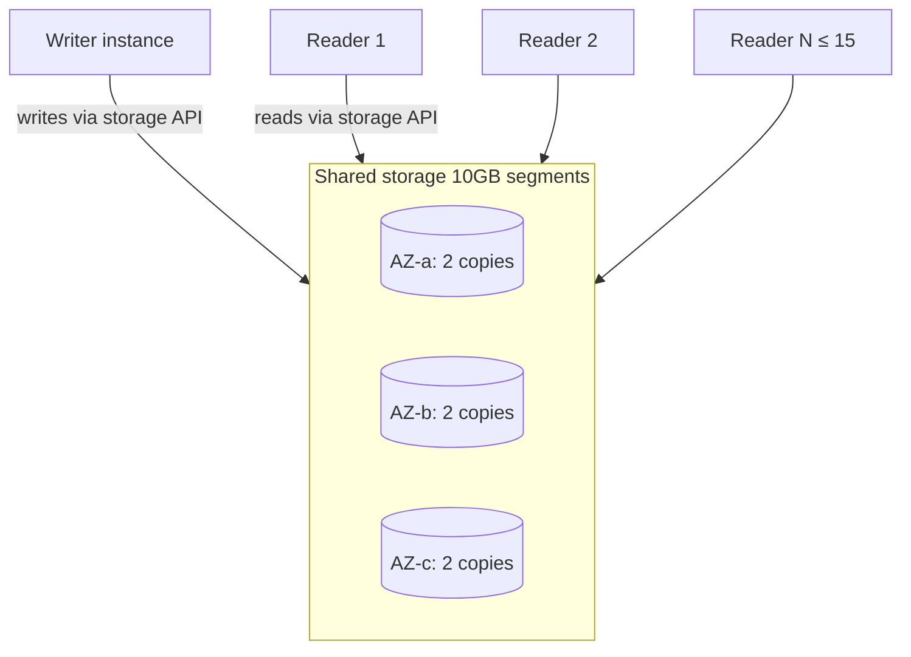

# Aurora deep dive

Aurora is the "AWS-native" relational DB: it speaks Postgres/MySQL protocol but under the hood ships a **custom distributed storage layer** that rewrites the rules for durability, replication, and scaling. It's the default for serious new OLTP workloads on AWS.

## 1. Architecture



Key ideas:
- **Compute and storage decoupled**. Instances are "stateless": they see the same logical volume via storage API.
- Storage is **distributed in 10GB segments**, **6 copies across 3 AZs** (4-of-6 quorum write, 3-of-6 read). Survives loss of 1 AZ + 1 copy with no data loss.
- The writer doesn't write files: it ships redo log records to the storage layer, which applies them. No full page writes, no datafile fsync → far less I/O than classic Postgres/MySQL.
- **Read replicas** read the *same* storage, not a replicated copy. Typical lag **< 100 ms**, up to **15** replicas per cluster.
- **~30 s failover**: a replica is promoted to writer on crash, no data re-stream needed because storage is shared.

## 2. Aurora Postgres vs MySQL

| Feature | Aurora Postgres | Aurora MySQL |
|---|---|---|
| Compatible versions | 13-17 | 5.7 / 8.0 |
| Backtrack (in-place rewind) | no | yes, up to 72h |
| Babelfish (T-SQL) | yes | no |
| pgvector / extensions | yes (50+ extensions) | limited to MySQL plugins |
| Parallel Query | no | yes |

Aurora Postgres is more feature-rich for greenfield (vector search, JSONB, extensions). Aurora MySQL wins for legacy MySQL migrations and for Backtrack.

## 3. Aurora Serverless v2

Capacity measured in **ACU** (Aurora Capacity Units, ~2 GB RAM + proportional CPU/network). You set **min and max ACU** (0.5 → 256). Aurora scales **continuously** (fractional ACU), in milliseconds, without dropping connections. v1 was 10x step-function scaling with cold start; v2 is production-grade.

- **Auto-pause** (min ACU = 0): sleeps after idle, first access pays a ~15 s cold start. Dev/sandbox only.
- **Cost**: ACU/hour + storage + I/O (unless I/O Optimized).
- Mix: a cluster can have Serverless v2 writer + provisioned readers, or vice versa.

When to use: bursty/unpredictable traffic, staging environments, multi-tenant SaaS with idle tenants.

## 4. Global Database

```bash
aws rds create-global-cluster \
  --global-cluster-identifier my-app-global \
  --source-db-cluster-identifier arn:aws:rds:eu-west-1:111:cluster:primary
```

- **1 primary region** (read/write) + up to **5 secondary regions** (read-only).
- Replication via dedicated storage layer, typical lag **< 1 s** cross-region (vs ~10 s with classic read replicas).
- **Regional failover** in 1-2 minutes (managed planned failover) or RTO < 1 minute with switchover.
- Use case: multi-region DR, low-latency geo-distributed reads, data-residency compliance.

## 5. Advanced features

- **Backtrack** (MySQL only): the DB's "ctrl+Z". You set a `BacktrackWindow` (e.g. 24h) and can rewind in-place to a timestamp without restoring. Saves you from `DELETE FROM accounts WHERE 1=1`.
- **Parallel Query** (MySQL): pushes analytical queries down to the storage layer, which executes in parallel across segments. 10x+ speedup on large scans.
- **Aurora Limitless** (Postgres, GA 2024): native managed sharding. A table is transparently partitioned across multiple "shard groups". Built for write-heavy workloads beyond a single writer.
- **Babelfish** (Postgres): a listener on port 1433 that speaks T-SQL and TDS, so SQL Server clients connect unchanged. SQL Server migrations without rewriting SPs (within compatibility limits).
- **Aurora I/O Optimized**: alternative pricing where you pay more compute (~30%) and storage (~125%) but **zero I/O charge**. Wins when I/O is > 25% of the Aurora bill.
- **RDS Data API**: connectionless HTTP API, ideal for Lambda + Aurora Serverless v2 without pooling.

## 6. Decision table

| Scenario | Pick |
|---|---|
| Serious OLTP, high TPS, multi-AZ required | Aurora provisioned |
| Bursty traffic or multi-tenant SaaS | Aurora Serverless v2 |
| Global app with users across 3 continents | Aurora Global Database |
| SQL Server migration without a rewrite | Aurora Postgres + Babelfish |
| Write workload beyond 1 writer | Aurora Limitless (Postgres) |
| Oracle / SQL Server engine | Classic RDS, not Aurora |

## 7. Pricing and gotchas

- Provisioned: `db.r6g.large` ~ $0.29/h + storage $0.10/GB-month + I/O $0.20 per million (no I/O Optimized).
- Serverless v2: ~ $0.12 per ACU-hour (0.5 ACU = $0.06/h minimum if not auto-paused).
- Cross-region replication for Global Database adds network egress cost.

Real anti-patterns:
- **Chronic read replica lag > 100ms**: usually an overloaded writer, not Aurora. Check `AuroraReplicaLag`.
- **Connection exhaustion**: Aurora also has `max_connections` proportional to RAM. In front of Lambda: **RDS Proxy** or **Data API**.
- **Backup retention 1 day**: default too low, raise to 7-14.

## 8. Exercise

<details>
<summary>Multi-tenant SaaS: 200 tenants, 5 active 24/7, 195 with occasional bursts. Aurora provisioned or Serverless v2?</summary>

**Serverless v2** is the natural fit:

- Min ACU 1, max ACU 32 → scales for the 5 active and bursts for the others.
- No over-provisioning for the "all active at once" worst case (rare).
- Auto-pause off in prod (cold start is user-visible), but staging can auto-pause.
- Typical cost: 1-3 ACU baseline average + controlled spikes.

A provisioned `db.r6g.xlarge` would cost ~$430/month flat even at night. Serverless v2 can halve that if load is truly bursty.

Measure with CloudWatch `ServerlessDatabaseCapacity` after 2 weeks and tune min/max.
</details>

<details>
<summary>Disaster: at 14:23 a dev ran `UPDATE orders SET status='cancelled'` without a WHERE on Aurora MySQL. What do you do?</summary>

If you enabled **Backtrack** (with `BacktrackWindow` > 1h):

```bash
aws rds backtrack-db-cluster \
  --db-cluster-identifier prod-orders \
  --backtrack-to 2026-05-21T14:20:00Z
```

In ~1-2 minutes the cluster rewinds **in-place**, no new instances, no endpoint changes. Writes after 14:23 are lost — that was the point.

If you DON'T have Backtrack (Postgres or MySQL without a window): the only path is PITR → restore into a new cluster → repoint the app or export/import data. Long downtime.

Lesson: for Aurora MySQL prod, **always enable Backtrack** (cheap, lifesaver).
</details>

> **Summary**: Aurora separates compute from shared 6x3AZ storage; up to 15 replicas with <100ms lag; Serverless v2 scales continuously in ACU; Global Database for DR and <1s geo-reads; Backtrack MySQL only; Babelfish to migrate SQL Server; I/O Optimized when I/O > 25% of the bill.
