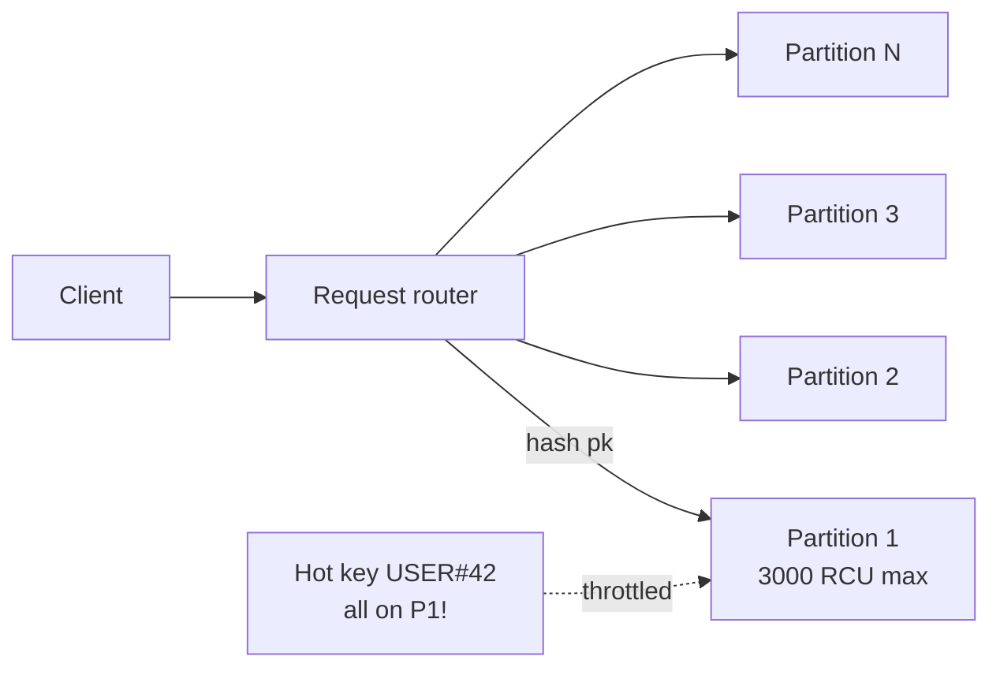

# DynamoDB deep dive

DynamoDB is AWS's serverless NoSQL: single-digit-ms latency at any scale, zero servers to manage, key-value/document model. It's a different mindset from SQL: you model **per access pattern**, not per entity.

## 1. Data model

Each **table** has a **primary key**:
- **Partition key (PK)** alone: hash key, unique per PK.
- **PK + Sort key (SK)**: composite key, multiple items per PK ordered by SK.

Each **item** is a dict with typed attributes (`S`, `N`, `B`, `BOOL`, `L`, `M`, `SS`, `NS`, `BS`). Schema-less beyond the key. **Max 400 KB per item**.

```bash
aws dynamodb put-item --table-name Orders --item '{
  "pk": {"S": "USER#42"},
  "sk": {"S": "ORDER#2026-05-21#001"},
  "amount": {"N": "129.90"},
  "status": {"S": "PAID"}
}'
```

Core operations:
- `GetItem` / `PutItem` / `UpdateItem` / `DeleteItem`: O(1), 1 item.
- `Query`: all items with the same PK, filterable by SK range. Fast.
- `Scan`: reads **the whole table**. Avoid in production.

## 2. Capacity: on-demand vs provisioned

| Mode | When | Cost |
|---|---|---|
| **On-demand** | unpredictable traffic, spikes, dev | ~$1.25 per million writes, $0.25 per million reads (eventual) |
| **Provisioned + auto scaling** | predictable steady traffic | fixed RCU/WCU, ~70% discount vs on-demand at scale |

Units:
- **WCU** (Write Capacity Unit) = 1 write/sec of an item ≤ 1 KB (larger items consume more WCU).
- **RCU** (Read Capacity Unit) = 2 eventually-consistent reads/sec or 1 strongly-consistent, on items ≤ 4 KB.

On-demand ↔ provisioned switch: allowed 1x per 24h per table.

## 3. Physical partitions and hot partitions

DynamoDB distributes data across **physical partitions** (storage shards) by PK hash. Each partition has a **hard limit**:

- **3000 RCU** and **1000 WCU** per partition.
- If 90% of traffic concentrates on one PK, that partition is "hot" → throttle (`ProvisionedThroughputExceededException`), even if table-level capacity is plenty.



**Real anti-patterns**:
- PK = `tenant_id` with one huge tenant and 1000 small ones.
- PK = `event_date` with all today's events on the same partition.
- A global counter with a fixed PK.

**Fixes**: write sharding (random 0-9 suffix on PK), time bucketing (`USER#42#2026-05-21`), or a GSI with a different PK.

## 4. Single-table design

Pattern where **all entities** of an app live in **one table**, distinguished by PK/SK prefixes (`USER#42`, `ORDER#2026...`, `PRODUCT#abc`). Pros:

- 1 `Query` on a PK = fetch every entity related to one aggregate (user + their orders + their cart).
- No client-side JOIN, no extra round trips.

Cons: the model is dense, must be drawn on paper (NoSQL Workbench helps) starting from access patterns. Schema migration is non-trivial.

## 5. GSI vs LSI

| Aspect | LSI (Local Secondary Index) | GSI (Global Secondary Index) |
|---|---|---|
| PK | same as base table | any attribute |
| SK | different | any attribute |
| Consistency | strong consistent possible | **only eventual** |
| Capacity | shared with table | **separate** (own RCU/WCU) |
| When created | **only at table creation** | anytime, up to 20 per table |
| Count limit | 5 per table | 20 per table |

Rule: **GSI by default**. LSI only when you know from day 1 you need strong consistency on an alternative query.

## 6. Streams, Global Tables, DAX, transactions

- **Streams**: CDC on changes. **24h** retention. Consumed with Lambda triggers or KCL. Use cases: secondary index in OpenSearch, audit log, denormalization, event fan-out.
- **Global Tables**: table replicated **active-active** across N regions. Write anywhere, read anywhere. Conflict resolution: last-writer-wins (timestamp). Built on Streams.
- **DAX** (DynamoDB Accelerator): write-through/read-through in-memory cache, **microsecond latency** (vs Dynamo's ms). Only supported SDK clients. Cluster on `dax.r5.large`+ nodes.
- **Transactions**: `TransactWriteItems` and `TransactGetItems` (up to 100 items, 4MB total). Costs **2x** normal ops. ACID across items/tables.
- **TTL**: set a numeric attribute (epoch sec); Dynamo deletes the item within 48h of expiry, **free**. Apparent deletion is immediate at `GetItem` (filtered out).
- **PITR backup**: continuous, 35 days back, restore into a new table.
- **Contributor Insights**: top-keys and top-throttled-keys dashboard.

## 7. Typical pricing

| Component | Cost (eu-west-1, indicative) |
|---|---|
| On-demand write | $1.25 per million WRU |
| On-demand read eventual | $0.25 per million RRU |
| Storage | $0.25 per GB-month (first 25 GB free tier) |
| Streams reads | $0.02 per 100k GetRecords |
| DAX `dax.r5.large` | ~$0.30/h |
| Global Tables | pay write-replica WCU per extra region |

## 8. Exercise

<details>
<summary>IoT app logs 50k sensors at 1 sample/sec. Dynamo schema for "last 100 samples of sensor X"?</summary>

**Anti-pattern**: PK = `sensorId`, SK = `timestamp`. Looks fine but goes hot: every sample for a sensor lands on the same partition. With very active sensors and small items, the real risk is **unbounded growth** of a single PK (Dynamo won't block it, but partitions grow).

**Recommended pattern**: PK = `SENSOR#<id>#<bucket>` where bucket = `2026-05-21-14` (hour). SK = `timestamp`.

- "Last 100 samples" query → `Query` on PK = `SENSOR#X#2026-05-21-14` with `Limit=100 ScanIndexForward=false`. If more hours needed, parallel query on 2-3 buckets.
- Spreads writes across many partitions (bucket changes every hour).
- TTL on samples > 30 days for cost control.

Optional GSI for cross-sensor query "all samples with value > threshold in 1h": PK = `ALERT#<hour-bucket>`, SK = `value#sensorId`.
</details>

<details>
<summary>You have a "total orders" counter receiving 5000 increments/sec via PutItem/UpdateItem. Continuous throttling. What now?</summary>

Classic hot partition: every `UpdateItem ADD #count :1` lands on 1 partition (PK = `COUNTER#orders`), capped at 1000 WCU.

**Write sharding**:
1. PK becomes `COUNTER#orders#<n>` with n in `0..49` (50 shards).
2. On write: pick random n, update that shard's `count`.
3. On read: `BatchGetItem` all 50 shards and sum.

Spreads 5000 writes across 50 partitions (100/s each, well under the limit). Read costs 50 RCU.

Alternatives:
- **App-side aggregation**: buffer in Lambda/SQS, flush a batch every 5s.
- **Atomic counter via Streams**: log raw events, compute aggregate in another table async.
</details>

> **Summary**: Dynamo = serverless ms-latency NoSQL; model per access pattern; PK+SK with 3000 RCU/1000 WCU per-partition cap (hot partition trap); GSI > LSI by default; single-table design powerful but must be designed; Streams 24h for CDC; Global Tables active-active; DAX for microseconds; transactions cost 2x.
