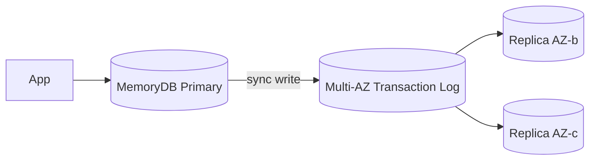

# Purpose-built DBs

AWS pushes the "**purpose-built database**" principle: instead of forcing Postgres to do everything, pick the right DB for each workload. Here we cover cache, graph, document, wide-column, time-series, and ledger.

## 1. ElastiCache Redis

Managed Redis, single-digit ms in memory.

| Topology | Pro | Con |
|---|---|---|
| **Single node** | simple, cheap | no HA |
| **Cluster mode disabled** + 1-5 replicas | automatic failover, read replicas | dataset cap = RAM of 1 node |
| **Cluster mode enabled** (sharded) | scales beyond 1 TB, multi-shard | complex client, no MULTI across shards |

Features: S3 snapshots, AUTH password, in-transit (TLS) and at-rest (KMS) encryption, online cluster resize, **data tiering** (DRAM hot + NVMe cold for cost cuts).

Classic use cases: session cache, DB query cache, leaderboard, rate limiting, lightweight pub/sub.

## 2. ElastiCache Memcached

Old-school managed Memcached. **Multi-thread** (uses every core), **client-side** sharding via consistent hashing. **No persistence**, no replicas → a node dies, its shard is lost. No data structures (strings only).

When to prefer it over Redis: pure monolithic cache where you want to exploit 32+ cores of one node without worrying about persistence. Otherwise, Redis wins.

## 3. MemoryDB for Redis

Redis-compatible **with durability**. Adds a **multi-AZ transaction log** where every write commits to 3 AZs **before** acknowledging. RTO in seconds, **zero data loss**, unlike ElastiCache Redis (where replication is async).



Trade-off: write latency slightly higher than ElastiCache (~ms vs sub-ms). Higher pricing.

Use case: when you want a **primary in-memory database** with durability, not just a cache. Low-latency apps with data SLA (e.g. trading book, critical sessions).

## 4. Neptune (graph)

Managed graph DB. Supports **3 query languages**:
- **Gremlin** (property graph, TinkerPop).
- **openCypher** (Neo4j-compat).
- **SPARQL** (RDF triple store).

Aurora-style architecture: shared 6x3AZ storage, up to 15 read replicas, < 30 s failover.

Use case: social graph, fraud detection (cycle/path detection), knowledge graph, recommendation engine, identity resolution.

## 5. DocumentDB (MongoDB-compatible)

MongoDB API **4.0 / 5.0** (not 6.0+). Aurora-style storage layer, separated from compute. Up to 15 replicas.

When it makes sense: legacy MongoDB app and you want AWS-managed without Atlas. When NOT: starting from scratch — consider Aurora Postgres with JSONB, often wins on cost and features.

## 6. Keyspaces (Cassandra-compatible)

AWS-managed implementation of the CQL Cassandra protocol. **Serverless** (on-demand) or **provisioned**. Backed by DynamoDB tech under the hood, not real Cassandra → some features missing (LWT batch limited), but 100% managed.

Use case: existing Cassandra migrations without managing a cluster. For greenfield wide-column projects, DynamoDB is the more AWS-native choice.

## 7. Timestream and QLDB

**Timestream**: serverless time-series. **Automatic tiering**: recent data in **memory store** (fast queries), then moved to **magnetic store** (cheap, long-term). SQL-like queries with native time-series functions (`bin`, `interpolate`, `derivative`).

```sql
SELECT bin(time, 1h) AS hour,
       avg(temperature) AS avg_temp
FROM "iot"."sensors"
WHERE sensor_id = 's-42'
  AND time > ago(7d)
GROUP BY bin(time, 1h)
ORDER BY hour;
```

Use case: IoT telemetry, custom app metrics, industrial monitoring.

**QLDB** (Quantum Ledger Database): immutable ledger DB with append-only journal and cryptographic verification (hash-chain proof). **Deprecating: end-of-support July 2025**. AWS suggests migrating to **Aurora Postgres with audit logging** (`pgaudit`) + a custom application-layer hash chain when needed.

Historical use case: financial registries, supply chain, tamper-evident audit trails.

## 8. Decision table + exercise

| Workload | Service |
|---|---|
| Hot DB query cache | **ElastiCache Redis** cluster mode disabled |
| Pure monolithic multi-core cache | **ElastiCache Memcached** |
| In-memory primary with durability | **MemoryDB** |
| Social graph, fraud rings | **Neptune** |
| Legacy MongoDB migration | **DocumentDB** |
| Legacy Cassandra migration | **Keyspaces** |
| IoT telemetry 100k points/sec | **Timestream** |
| Tamper-evident audit ledger | Aurora Postgres + pgaudit (QLDB deprecated) |
| OLAP in-memory on MySQL | **HeatWave on RDS MySQL** |

Note: **HeatWave on RDS MySQL** is an in-memory analytics accelerator: the same RDS MySQL instance can serve OLTP (traditional storage) and OLAP (HeatWave) without ETL to Redshift.

<details>
<summary>Fintech app: critical session tokens (losing one = user logged out, no big deal) + real-time account balances (losing = disaster). Same DB?</summary>

No, two different services.

- **Session tokens**: ElastiCache Redis cluster mode disabled + 1 replica. Auto failover; if a write was lost between async replication and a failover, the user just re-logs in. Cheap.
- **Real-time balances**: **MemoryDB**. Writes commit multi-AZ via transaction log before ACK. Zero data loss. Sub-ms read latency. Costs more but meets the SLA.

Anti-pattern: using ElastiCache Redis as "source of truth" for data you can't lose. Async replication = data-loss window.
</details>

<details>
<summary>Bank antifraud: detect rings of 5+ accounts that exchange transfers in a cycle within 24h. Which DB?</summary>

**Neptune** (graph).

Model: nodes = `Account`, edges = `Transfer { amount, ts }`.

Gremlin query "find cycles of length 3-7 with total flow > 10k€ in 24h":

```gremlin
g.V().hasLabel('Account').
  repeat(outE('Transfer').has('ts', gt(yesterday)).inV().simplePath()).
    times(7).emit().
  filter(__.path().count(local).is(gt(3))).
  filter(__.path().unfold().hasLabel('Account').
         is(eq(__.start())))   // cycle close
```

In Postgres you'd need slow recursive CTEs. In DynamoDB it'd be a full scan. Neptune was built for this: cycle/path detection in O(edges visited) with graph indexes.

Alternative: Amazon Neptune ML can do embedding + anomaly detection on complex patterns.
</details>

> **Summary**: ElastiCache Redis for HA cache, Memcached for pure multi-core cache, MemoryDB when you need in-memory durability; Neptune for graphs (Gremlin/openCypher/SPARQL); DocumentDB for legacy Mongo, Keyspaces for legacy Cassandra; Timestream for IoT/metrics; QLDB deprecated 2025 → Aurora Postgres with audit; HeatWave for in-place OLAP on RDS MySQL.
