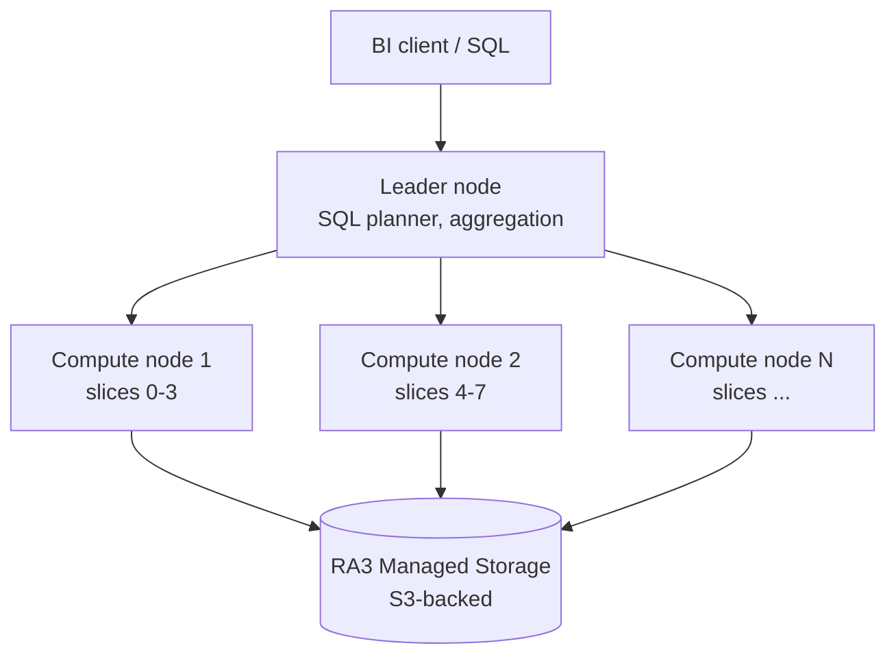

# Redshift — data warehousing

Redshift is AWS's managed data warehouse: columnar SQL **MPP** (Massively Parallel Processing) built for analytical queries on TB-PB datasets. It doesn't replace an OLTP — it replaces a Teradata/Snowflake.

## 1. MPP architecture



- **Leader node**: parsing, planning, distributing stages to computes, final aggregation. You never query computes directly.
- **Compute nodes**: each split into **slices** (1 slice per vCPU). Each slice runs its stage in parallel on local data.
- **Columnar storage**: the same column across millions of rows packed in few compressed blocks. An analytical query scans only the columns you ask for.

## 2. Node types and Redshift Serverless

| Type | Storage | When |
|---|---|---|
| **RA3** (ra3.xlplus, ra3.4xlarge, ra3.16xlarge) | **Managed storage** (S3 + local SSD cache), pay-per-GB decoupled from compute | modern default, scales compute and storage independently |
| **DC2** (dc2.large, dc2.8xlarge) | fixed local SSD | legacy, for < 1 TB datasets with latency priority, being phased out |
| **Redshift Serverless** | RA3 managed storage | no cluster to manage; capacity in **RPU** (Redshift Processing Units), pay-per-second |

Redshift Serverless: ideal for spiky workloads or new projects. You set base RPU (8-512) and max, pay when queries are active. Cold start ~5-10 s on the first query after idle.

## 3. Distribution and sort keys

**Distribution style**: how Redshift spreads rows across slices.

| Style | When |
|---|---|
| **AUTO** (default) | Redshift picks based on size — good to start |
| **KEY** | distribute by column (e.g. `user_id`) → JOINs co-located on the same key are fast, no shuffle |
| **ALL** | the **entire table replicated on every node** → only for small dimension tables (<2-3M rows) |
| **EVEN** | round-robin, no co-located JOINs but balanced load |

**Sort key**: how to physically order blocks for **zone-map pruning** (skip blocks that don't match the WHERE).

- **Compound** (default): effective if you always filter on the first column. E.g. sort key `(event_date, user_id)` is great for `WHERE event_date='2026-05-21'`.
- **Interleaved**: weighs every column equally. Good for ad-hoc queries on any key column, but VACUUM overhead.

```sql
CREATE TABLE events (
  event_id   BIGINT,
  user_id    BIGINT,
  event_date DATE,
  payload    SUPER
)
DISTKEY (user_id)
SORTKEY (event_date, user_id);
```

## 4. Spectrum, federated query, zero-ETL

**Redshift Spectrum**: query external data in **S3** via `EXTERNAL TABLE` (Parquet/ORC). Catalog on AWS Glue. You pay $5 per TB scanned (like Athena). Data lake pattern: hot data in Redshift-managed, cold/historical in S3 + Spectrum.

```sql
CREATE EXTERNAL SCHEMA spectrum_logs
FROM DATA CATALOG DATABASE 'logs_db'
IAM_ROLE 'arn:aws:iam::111:role/RedshiftSpectrumRole';

SELECT date_trunc('day', ts), COUNT(*)
FROM spectrum_logs.access_logs
WHERE ts > '2026-01-01'
GROUP BY 1;
```

**Federated query**: direct `SELECT` against Aurora/RDS Postgres without copying data. Filter push-down when possible.

**Zero-ETL integration**: AWS automatically replicates operational data into Redshift, no custom pipeline.
- **Aurora → Redshift**: continuous CDC, typical lag seconds.
- **DynamoDB → Redshift**: same, Streams events translated.
- Skips the classic Glue/Kinesis/Lambda stack to "land data in the warehouse".

## 5. Materialized Views, concurrency scaling, WLM

- **Materialized Views**: precomputed, `INCREMENTAL` or `FULL` refresh. Auto-refresh with `AUTO REFRESH YES`. The planner automatically rewrites queries to use them.
- **Concurrency scaling**: when the WLM queue fills, Redshift spins up **transient clusters** that serve extra queries. Pay-per-second, 1h free per day.
- **Workload Management (WLM)**: query queues with priority and memory allocation. **Automatic WLM** (modern default) manages dynamically; manual WLM for fine control.
- **AQUA** (Advanced Query Accelerator): hardware cache in front of S3 for Spectrum queries. Auto-enabled on RA3.

## 6. Redshift ML and analytics

Build ML models directly in SQL, training on SageMaker behind the scenes:

```sql
CREATE MODEL churn_predictor
FROM (SELECT age, plan, last_login_days, churn FROM customers)
TARGET churn
FUNCTION ml_fn_predict_churn
IAM_ROLE 'arn:...'
SETTINGS (S3_BUCKET 'my-ml-bucket');

SELECT customer_id, ml_fn_predict_churn(age, plan, last_login_days)
FROM customers;
```

Use cases: forecasting, classification, regression, anomaly detection — without moving data out of the warehouse.

## 7. Snapshots, cross-region copy, security

- **Automatic snapshots**: every 8h or every 5 GB of change. Retention 1-35 days.
- **Manual snapshots**: unlimited retention, cross-account shareable.
- **Cross-region snapshot copy** for DR: continuous copy to a secondary region.
- **Encryption** KMS at-rest, SSL in-transit.
- **VPC routing**: cluster in a private subnet; enhanced VPC routing forces COPY/UNLOAD traffic through the VPC (for S3 VPC endpoints).

## 8. Exercise

<details>
<summary>Migration: 5 TB of event logs in on-prem Postgres, analytical queries take hours. Target Redshift. What sizing and schema?</summary>

**Sizing**:
- 5 TB initial, growth 200 GB/month → RA3 with managed storage scales independently.
- Start: 2x `ra3.xlplus` (32 GB RAM, 4 vCPU each) or **Redshift Serverless** 32 RPU base if workload is spiky.
- Concurrency scaling for multi-user interactive queries.

**Fact table `events` schema**:
- `DISTKEY (user_id)` if your main JOINs are on users; otherwise `DISTSTYLE EVEN` for uniform spread.
- `SORTKEY (event_date, event_type)` — nearly all analytical queries filter by date range.
- Columnar storage auto-compresses; run `ANALYZE COMPRESSION` post-import.
- Small dimension tables (`users`, `products`): `DISTSTYLE ALL`.

**Data migration**:
- Export Postgres to Parquet → S3.
- `COPY events FROM 's3://.../' IAM_ROLE '...' FORMAT PARQUET;` (parallel across all slices).
- Hot data last year in Redshift; historical in S3 + Spectrum.

**Estimated cost**: ~$1.5k/month provisioned, or $400-800/month Serverless with ~30% active workload time.
</details>

<details>
<summary>You need to feed Redshift in near-real-time from DynamoDB (orders) + Aurora Postgres (users). Pipeline?</summary>

Old world (3+ services): DynamoDB Streams → Lambda → Kinesis Firehose → S3 → Glue → COPY into Redshift. Aurora: Debezium or Kinesis Data Streams → same. Constant maintenance, 5-15 min lag.

**2026 way: zero-ETL integration**:

1. Redshift console → "Integrations" → create **DynamoDB → Redshift** integration on the `orders` table. AWS replicates automatically.
2. Create **Aurora → Redshift zero-ETL** on the `users` Aurora Postgres cluster. Continuous CDC.
3. In Redshift, queries JOIN `orders` + `users` with typical lag of **seconds**.

Zero ETL code, zero infra to maintain, analytical lag down from 15 min to < 30 s. Extra cost is only Redshift storage (compute is what you have already).

Zero-ETL limits: source schema must be "reasonable" (no exotic types), DDL changes need handling, throughput subject to quotas.
</details>

> **Summary**: Redshift = MPP columnar data warehouse; RA3 with managed storage or Serverless RPU; KEY/ALL/EVEN/AUTO distribution + sort key for zone-map pruning; Spectrum to query external S3; federated query into Aurora/RDS; zero-ETL Aurora/DynamoDB → Redshift with no custom pipeline; auto-refresh Materialized Views; concurrency scaling for spikes; Redshift ML in SQL via SageMaker.
