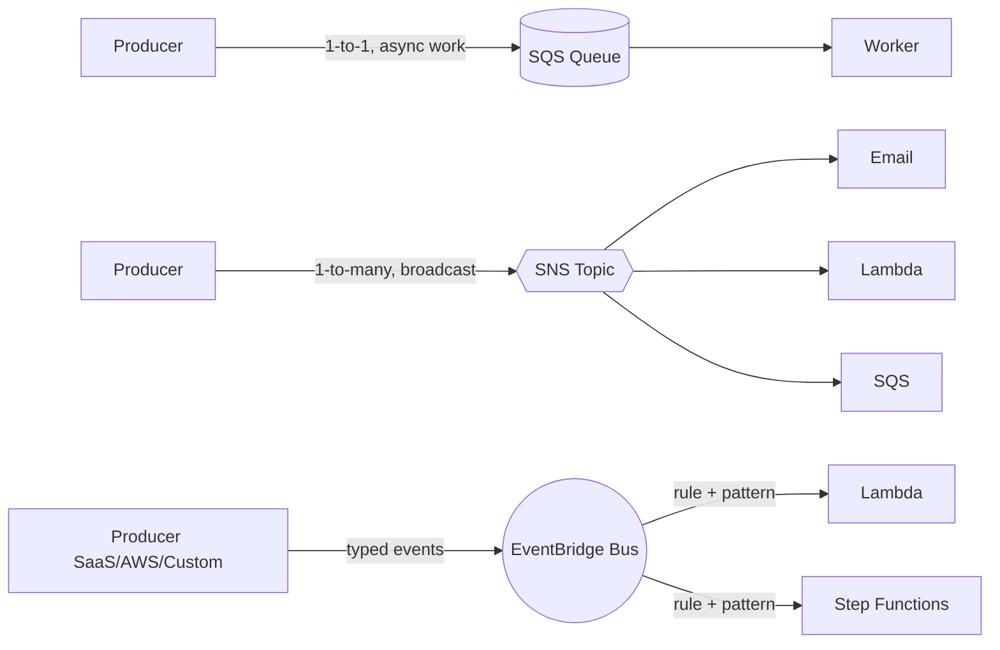

# SQS, SNS, EventBridge

Decoupling components is step one to scale. AWS gives you three primitives: **SQS** (point-to-point queues), **SNS** (pub/sub topics) and **EventBridge** (event bus with pattern matching). Knowing when to use which avoids messy architectures.

## 1. When to use what



Rule of thumb: **SQS** if the consumer does bulk work (job queue), **SNS** if you need static fan-out to a few targets, **EventBridge** if you want content-based filtering and dynamic routing.

## 2. SQS — managed queues

Two flavors:

| Feature | Standard | FIFO |
|---|---|---|
| Throughput | unlimited | 300 TPS (3000 batched), 70k high-throughput mode |
| Ordering | best-effort | guaranteed per MessageGroupId |
| Delivery | at-least-once | exactly-once (5 min dedup window) |
| Price | $0.40/M | $0.50/M |

Key concepts:
- **Visibility timeout**: on `ReceiveMessage`, the message becomes invisible for N seconds. If not deleted in time, it reappears. Default 30s, max 12h.
- **Long polling** (`WaitTimeSeconds=20`): cuts empty requests and cost. Always use it.
- **Dead-Letter Queue (DLQ)**: after N tries (`maxReceiveCount`) the message goes to a separate queue for analysis.
- **Delay queue**: 0-900s initial delay.
- **Message size**: max 256 KB. For larger payloads, the **Extended Client Library** stores the body in S3 and only a pointer travels in the queue.

```bash
aws sqs send-message \
  --queue-url https://sqs.eu-west-1.amazonaws.com/123/jobs \
  --message-body '{"orderId":"o-42"}' \
  --message-attributes 'priority={DataType=String,StringValue=high}'
```

## 3. SNS — pub/sub topics

A publisher publishes to a **topic**, N subscribers receive. Supported protocols: HTTP/HTTPS, email, SMS, mobile push, **SQS**, **Lambda**, Kinesis Firehose. Classic **fan-out**: SNS → N SQS queues, each consumed independently by a different service.

- **FIFO topic** + FIFO queue for end-to-end ordering.
- **Message filtering**: each subscription can carry a JSON filter policy and only receives matching events.
- **Message Data Protection**: masks PII automatically.

Gotcha: without filter policies every subscriber gets everything and you pay per delivery.

## 4. EventBridge — the event bus

3 bus types:
- **Default bus**: native AWS events (EC2 state change, S3 object created if enabled, etc.).
- **Custom bus**: your application events.
- **Partner bus**: events from SaaS (Datadog, Auth0, Shopify, Zendesk…).

A **rule** defines an **event pattern** (JSON) and up to 5 **targets**.

```json
{
  "source": ["myapp.orders"],
  "detail-type": ["OrderPlaced"],
  "detail": { "amount": [{ "numeric": [">", 1000] }] }
}
```

Advanced:
- **Schema Registry**: auto-discovers event types, generates code bindings.
- **Archive + Replay**: records all events and replays them for debug or backfill.
- **Pipes**: source → (filter + enrich) → target, replaces lots of glue Lambda code. Sources: SQS, Kinesis, DynamoDB Streams, MSK.
- **Scheduler**: managed cron that scales to millions of schedules (replaces CloudWatch Events Rules).

## 5. Latency and throughput

| Service | Typical latency | Throughput |
|---|---|---|
| SQS Standard | 10-100 ms | unlimited |
| SNS Standard | 30-100 ms | very high |
| EventBridge | 0.5-2 s end-to-end | 10k/s per region (raise) |

EventBridge is **not** sub-second realtime. For that use SNS or Kinesis.

## 6. Anti-patterns

- Using SQS as a "buffer to avoid scaling the DB": works until you hit chronic backlog. Fix the root cause first.
- Putting business logic in SNS/EventBridge filter policies: unreadable.
- Forgetting the DLQ: poison messages fill the queue and burn lambda invocations.
- Visibility timeout < average processing time → cascading duplicates.

## 7. Quick pricing

- **SQS**: $0.40/M standard requests. One long-poll `ReceiveMessage` = 1 request.
- **SNS**: $0.50/M publishes + per-protocol delivery cost (SMS is expensive!).
- **EventBridge**: $1/M custom events; AWS events free on the default bus.

## 8. Exercise

<details>
<summary>5 microservices must react to "OrderPlaced" each with different filters. What do you use?</summary>

**EventBridge custom bus**. One event, 5 rules with specific event patterns, 5 targets (Lambda / SQS / Step Functions). Advantages over SNS fan-out + SQS: richer filtering (numeric, exists, anything-but), schema registry, archive+replay for debug. SNS+SQS works but filtering is less expressive and debugging noisier.
</details>

<details>
<summary>Worker processes 10-minute videos. Recommended visibility timeout?</summary>

At least 12-15 minutes (with margin), or call `ChangeMessageVisibility` periodically as a heartbeat. If the worker crashes the message reappears and another worker picks it up. Set `maxReceiveCount=3` with a DLQ to avoid infinite loops on corrupt videos.
</details>

> **Summary**: SQS = 1-to-1 queues with visibility timeout and DLQ; SNS = pub/sub fan-out to a few targets; EventBridge = event bus with pattern matching, schema registry, Pipes and Scheduler. Pick based on target cardinality and filtering needs.
