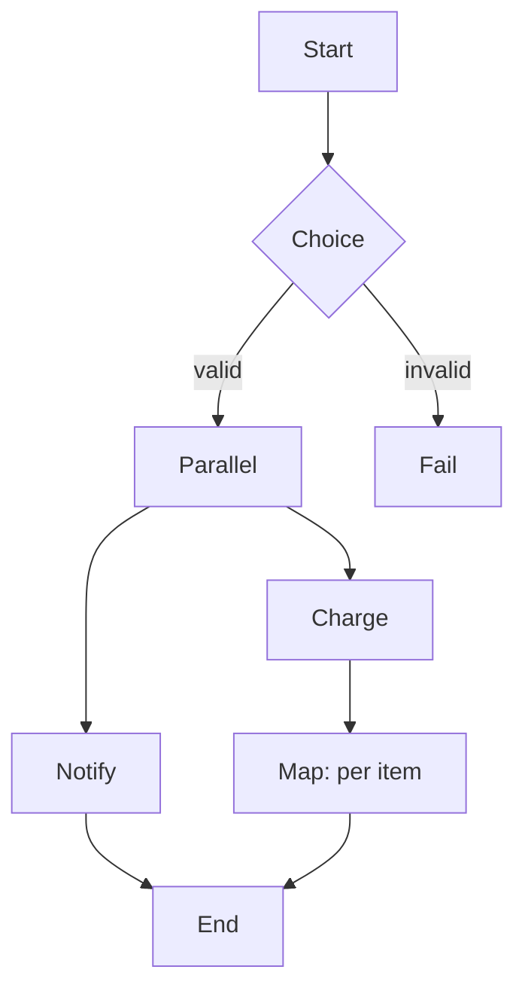

# Step Functions, MQ, AppFlow

Three very different services with a common thread: "moving and coordinating data between systems". **Step Functions** orchestrates workflows across AWS services, **MQ** offers traditional brokers for lift-and-shift migrations, **AppFlow** moves data to/from SaaS with no code.

## 1. Step Functions — managed workflows

A state machine defined in **ASL** (Amazon States Language, JSON). Each state is a `Task`, `Choice`, `Parallel`, `Map`, `Wait`, `Pass`, `Succeed` or `Fail`. Step Functions calls the integration, handles retry/catch, persists execution state (up to 1 year for Standard).

| Feature | Standard | Express |
|---|---|---|
| Max duration | 1 year | 5 minutes |
| Executions/sec | 2000 startup, 4000 transition | 100k+ |
| Price | $25/M transitions | $1/M invocations + GB-s |
| Audit | step-by-step in console | aggregated in CloudWatch Logs |
| Use case | long-running, audit-critical | high-volume event processing |

## 2. ASL — minimal example

```json
{
  "StartAt": "Validate",
  "States": {
    "Validate": {
      "Type": "Task",
      "Resource": "arn:aws:states:::lambda:invoke",
      "Parameters": { "FunctionName": "validateOrder", "Payload.$": "$" },
      "Retry": [{ "ErrorEquals": ["States.TaskFailed"], "MaxAttempts": 3, "BackoffRate": 2 }],
      "Catch": [{ "ErrorEquals": ["ValidationError"], "Next": "Reject" }],
      "Next": "Charge"
    },
    "Charge": { "Type": "Task", "Resource": "arn:aws:states:::sqs:sendMessage.waitForTaskToken", "End": true },
    "Reject": { "Type": "Fail", "Error": "Invalid" }
  }
}
```

## 3. Core state patterns



- **Task**: invokes a service (Lambda, ECS task, SNS, DynamoDB, Bedrock, …). Step Functions **natively integrates 220+ AWS services** without Lambda glue.
- **Choice**: branching on input values.
- **Parallel**: concurrent branches, aggregated output.
- **Map**: iterates over an array. **Inline** mode (max 40 concurrent) or **Distributed Map** that scales to **10,000 parallel executions** processing millions of items from S3 or inline JSON.
- **Wait**: static (`Seconds`) or absolute (`Timestamp`) delay.
- **waitForTaskToken** (`.sync` / `.waitForTaskToken`): pauses the workflow until an external system calls `SendTaskSuccess`. Pattern for human-approval or long-running async.

## 4. Error handling

No more scattered try/catch: `Retry` and `Catch` are declarative per state. Best practice:
- `States.ALL` as final catch-all, with specific ones before.
- Exponential backoff (`BackoffRate: 2`) to avoid hammering the downstream.
- Dedicated compensation state (saga pattern) for distributed rollback.

## 5. Workflow Studio

Visual drag-and-drop editor in the console that emits ASL. Useful to get started and to onboard people who don't know JSON. Output is always ASL, git-versionable.

## 6. Amazon MQ — traditional brokers

MQ is AWS-managed **ActiveMQ Classic / Artemis** and **RabbitMQ**. It exists for one reason: lift-and-shift migrations from on-prem apps already speaking JMS, AMQP 0-9-1, MQTT, STOMP, OpenWire. If you're cloud-native, **use SNS+SQS**: less ops, linear pricing. MQ shines for:

- **Legacy protocols**: JMS, AMQP, MQTT, STOMP.
- **Durable topics + selectors**: required by old apps.
- **Single-broker dev** or **active/standby** (multi-AZ).

Trap: MQ is a **managed but not serverless** broker. You pay the instance 24/7. mq.t3.micro is fine for moderate workloads; production usually mq.m5.large active/standby.

## 7. AppFlow — no-code SaaS integration

Bidirectional flows between **SaaS** (Salesforce, Slack, Marketo, ServiceNow, Zendesk, SAP, Google Analytics…) and **AWS** (S3, Redshift, EventBridge). Console-based: pick source → destination → field mapping → schedule/on-demand/event-triggered. Simple transformations (filter, mask, validate, arithmetic).

| Service | When |
|---|---|
| AppFlow | "I want Salesforce Opportunities into S3 every hour, no code" |
| EventBridge Partner bus | "I want to react in real time to SaaS events" |
| Glue / Lambda custom | full control, complex transforms |

## 8. Exercise

<details>
<summary>Pipeline: 50,000 CSV files in S3, for each call a validation Lambda and load into Redshift. Which Step Functions primitive?</summary>

**Distributed Map** with S3 source. It scans the bucket, fires up to 10,000 child executions in parallel, each calls the validation Lambda then a Redshift Data API Task. Aggregates results and handles retry/error per item. Without Distributed Map you'd split manually and orchestrate with SQS+Lambda.
</details>

<details>
<summary>Legacy on-prem Java EE app using JMS over ActiveMQ. Moving to AWS, what do you pick?</summary>

Phase 1 lift-and-shift: **Amazon MQ for ActiveMQ** in active/standby multi-AZ. The app doesn't change code (broker URL points to the MQ endpoint). Phase 2 (future): refactor to SNS+SQS when the team is ready. Going straight to SQS forces rewriting the JMS code, often not worth it for stable apps.
</details>

> **Summary**: Step Functions = ASL workflows with 220+ direct integrations, Standard for long-running and Express for high-volume, Distributed Map for massive fan-out; MQ for legacy broker migrations (JMS/AMQP/MQTT); AppFlow for no-code SaaS integration.
