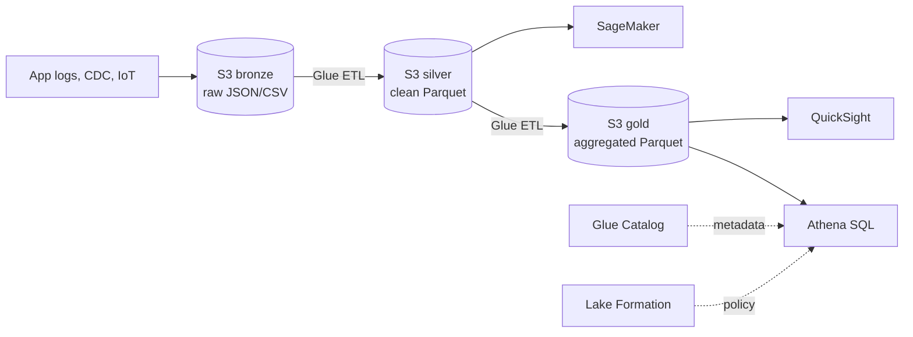

# Athena, Glue, Lake Formation — data lake

A **data lake** is "all your raw data in S3 + a catalog + a SQL engine". AWS delivers this with three services that compose: **Glue** (catalog + ETL), **Athena** (query), **Lake Formation** (security). Together they replace many classical data warehouses when data is semi-structured and query patterns irregular.

## 1. Medallion architecture (bronze/silver/gold)



Rule: **immutable bronze** (always rollback-able), **silver normalized partitioned Parquet**, **gold consumption-optimized** (BI, ML feature store).

## 2. Athena — serverless SQL on S3

Athena is **managed Trino** (formerly Presto). Key points:

- **Pricing**: $5 per **scanned** TB after compression. A poorly partitioned query can cost €€€.
- **Partition pruning**: `WHERE dt='2026-05-21'` on a partitioned table reads only that partition.
- **Columnar formats** (Parquet/ORC): read only requested columns. **~100x cheaper** than JSON/CSV.
- **CTAS** (`CREATE TABLE AS SELECT`): materializes results to S3 in optimized format.
- **Federated query**: also reads from RDS, DynamoDB, Redshift, on-prem (Lambda connectors).
- **Athena for Spark**: serverless PySpark notebooks, catalog integration.
- **Query Result Reuse**: caches results up to 7 days → identical query = $0.

### Example

```sql
-- External table over S3 Parquet partitioned by day
CREATE EXTERNAL TABLE orders (
  order_id string, user_id bigint, amount decimal(10,2)
)
PARTITIONED BY (dt string)
STORED AS PARQUET
LOCATION 's3://lake-silver/orders/';

MSCK REPAIR TABLE orders;  -- registers existing partitions

-- Query with partition pruning: scans ~50 MB instead of 50 GB
SELECT user_id, SUM(amount)
FROM orders
WHERE dt BETWEEN '2026-05-01' AND '2026-05-21'
GROUP BY user_id;
```

## 3. Glue — Data Catalog + ETL

| Component | What it does |
|---|---|
| **Data Catalog** | Managed Hive Metastore; shared by Athena, EMR, Redshift Spectrum, SageMaker |
| **Crawler** | Scans S3/JDBC and infers schema + partitions → populates the catalog |
| **Glue ETL** | Managed Spark or Python Shell jobs, pay-per-DPU-second |
| **Glue Studio** | Visual drag-and-drop UI generating PySpark code |
| **DataBrew** | No-code prep (250+ transformations), for analysts |
| **Glue Streaming** | Continuous jobs over Kinesis/MSK sources |
| **Job Bookmark** | Incremental state: only processes new files since last run |

Common trap: **crawlers cost money** if run every 5 minutes on large buckets. Often better to **register partitions manually** (`ALTER TABLE ADD PARTITION`) from the ETL job that just produced them.

## 4. Lake Formation — fine-grained security

Without Lake Formation, S3+Glue access control is "bucket or nothing". With LF you can grant:

- **Database / Table / Column level**: hide sensitive columns.
- **Row-level filter**: WHERE clause injected automatically (e.g. each user sees only their country's records).
- **Cell-level masking**: hash or redact at read time.
- **LF-Tags**: tag resources (`sensitivity=pii`) and grant permissions by tag.
- **Cross-account data sharing**: data mesh pattern — producer shares a database, consumers "link" it in their own account.

LF integrates transparently with Athena, Redshift Spectrum, EMR, Glue, QuickSight, SageMaker.

## 5. Costs: the most expensive mistake

10 TB bucket of gzip JSON logs. A `SELECT *` without WHERE costs **$50**. Same data in **Parquet + Snappy + partitioned by day**, same selective query costs **$0.05**. 1000x difference. Lesson: **never query JSON/CSV with Athena for recurring analytics**. Convert to Parquet with Glue once.

## 6. Open Table Formats: Iceberg, Hudi, Delta

Athena, Glue and EMR natively support **Apache Iceberg**, **Hudi**, **Delta Lake**. They add ACID, time travel, schema evolution, upsert over S3 without rewriting whole partitions. Iceberg is the AWS-recommended default since 2024.

## 7. Adoption pattern

1. **Logs in S3 + Glue Crawler + Athena**: already a basic data lake, zero cost at rest.
2. **Add Glue ETL** for bronze → silver partitioned Parquet.
3. **Lake Formation** when multiple teams or sensitive data arrive.
4. **Iceberg** when updates/deletes (GDPR) or CDC pipelines are needed.

## 8. Exercise

<details>
<summary>You have 5 TB of JSON logs in S3 and Athena costs $250/month. What do you do?</summary>

Two actions: (1) **Glue ETL** converting logs to **Snappy Parquet partitioned by `dt`**; reduces size ~5-10x and enables partition pruning. (2) Force queries to always include `WHERE dt=...`. Typical result: from $250 to $5-15/month. Bonus: enable **Query Result Reuse** for recurring dashboards.
</details>

<details>
<summary>Grant access to "orders" to 30 analysts, but `customer_email` must be hidden for 25 of them. How?</summary>

**Lake Formation column-level grant**: create two IAM groups (analyst, analyst-pii). Grant `SELECT` on all columns except `customer_email` to analyst, full `SELECT` to analyst-pii. Athena applies the filter automatically. Without LF you'd build two views and manage S3 grants manually — doesn't scale.
</details>

> **Summary**: Athena = serverless SQL over S3 ($5/scanned-TB), Glue = catalog + Spark ETL + crawler, Lake Formation = fine-grained security (column/row/cell). Bronze/silver/gold architecture in partitioned Parquet is the reference pattern; Iceberg for ACID and CDC.
