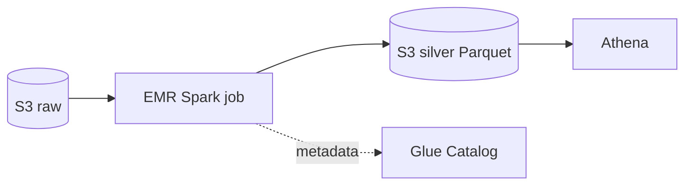

# EMR, Kinesis, MSK

Three families for high-volume data: **EMR** for batch big-data, **Kinesis** for AWS-native streaming, **MSK** for standard Kafka. Choice depends on volume, latency, existing ecosystem and how much cluster you want to babysit.

## 1. EMR — managed Hadoop/Spark

EMR (Elastic MapReduce) installs and configures **Spark, Hive, Presto/Trino, HBase, Flink, Hudi, Iceberg** on EC2, EKS or serverless. Three forms:

| Form | When |
|---|---|
| **EMR on EC2** | Maximum control, long-running or transient clusters |
| **EMR on EKS** | You already have EKS, want co-location with other workloads, multi-tenancy |
| **EMR Serverless** | Bursty jobs, no cluster to manage, pay-per-vCPU-second |

Typical EC2 architecture: **master** node + **core** nodes (HDFS storage + compute) + **task** nodes (compute-only, great for Spot at 70-90% discount). EMRFS replaces HDFS with **S3** as permanent storage: clusters become stateless and disposable (transient).



Trap: idle long-running cluster = burning money. For daily batch pipelines, **EMR Serverless** or **transient cluster via Step Functions** is almost always better.

## 2. Kinesis Data Streams

Ordered stream of records by **partition key**, split into **shards**. Each shard handles ~1000 records/s or 1 MB/s ingress, 2 MB/s egress.

- **Retention**: 24h default, up to 365 days at extra cost.
- **On-demand mode**: AWS manages shards automatically (up to 200 MB/s write, 400 MB/s read).
- **Enhanced fan-out (EFO)**: dedicated consumer with 2 MB/s **per consumer per shard** (no contention).
- **KCL** (Kinesis Client Library) for Java/Python consumers with DynamoDB checkpointing.

```bash
aws kinesis put-record \
  --stream-name events \
  --partition-key user-42 \
  --data $(echo -n '{"v":1}' | base64)
```

## 3. Kinesis Data Firehose

Fully serverless **delivery stream**. Buffers (by time or size) and lands to:
- S3 (with optional Parquet/ORC conversion via Glue schema)
- Redshift (via S3 + COPY)
- OpenSearch
- Generic HTTP endpoint (Datadog, Splunk, MongoDB Atlas)

Optional in-flight transformation with **Lambda**. Priced per GB ingested. The simplest way to turn "app logs → S3 Parquet ready for Athena".

## 4. Kinesis Video Streams

Video stream with Producer SDK for cameras/devices, configurable retention, integration with **Rekognition Video** for real-time or on-demand analysis. Unrelated to Data Streams under the hood.

## 5. MSK — Managed Streaming for Kafka

**Fully open-source managed Kafka**. Compatible with the whole ecosystem (Connect, Streams, Schema Registry, MirrorMaker, …).

| Service | When |
|---|---|
| **MSK Provisioned** | You pick brokers (e.g. kafka.m7g.large), storage, partition count |
| **MSK Serverless** | Pay-per-throughput, AWS manages capacity (up to 200 MB/s) |
| **MSK Connect** | Managed Kafka Connect for sink/source (Debezium CDC, S3 sink, etc.) |

MSK pays off if: you already use Kafka, you have existing Kafka producers/consumers, you want multi-region MirrorMaker, you need compaction or exactly-once transactions.

## 6. Kinesis vs Kafka: the call

| Aspect | Kinesis Data Streams | MSK |
|---|---|---|
| Operability | fully managed | managed but you see brokers |
| Pricing | per shard-hour + PUT payload | per broker-hour + storage |
| Ecosystem | AWS-centric | huge (Kafka Connect, Streams, ksqlDB) |
| Multi-region | manual or cross-region replica | MirrorMaker 2 |
| Latency | ~70-200 ms end-to-end | ~5-50 ms |
| Compaction | no | yes |
| Lock-in | AWS | portable |

Quick rule: greenfield AWS-only → Kinesis. Existing Kafka or third-party ecosystem → MSK.

## 7. Cost patterns

- Kinesis Data Streams on-demand is convenient but pricier at scale: pin shards when throughput is predictable.
- Firehose is the cheapest way to do "stream → S3" if you don't need replay with multiple consumers.
- MSK Serverless has a non-zero base cost (~$0.75/h per cluster): not for small workloads.
- EMR on Spot for task nodes: 70-90% savings on batch jobs.

## 8. Exercise

<details>
<summary>You must log 50,000 clickstream events/sec from a web app to S3 in Parquet. What do you pick?</summary>

**Kinesis Data Firehose** with Parquet conversion enabled (Glue schema). Buffering 128 MB / 5 min, dynamic partitioning by day (`!{partitionKeyFromQuery:dt}`). Zero cluster to manage, pay-per-GB. Add Lambda transform if normalization is needed. Athena queries the output directly. Kinesis Data Streams also works but requires custom consumers; MSK is overkill.
</details>

<details>
<summary>Heavy Spark job that runs 1h/day. EMR EC2, EKS or Serverless?</summary>

**EMR Serverless**. No cluster to spin up/down, no Spot capacity to manage, you pay only the actual vCPU-second. For 24/7 long-running clusters with > 4-6 hours of work per day EC2 + Spot becomes competitive, but below that threshold Serverless wins on ops + cost.
</details>

> **Summary**: EMR = managed Hadoop/Spark (EC2, EKS, Serverless), use Spot on task nodes; Kinesis = AWS-native streaming (Data Streams, serverless Firehose to S3/Redshift, Video); MSK = managed Kafka for existing ecosystems. Greenfield → Kinesis, existing Kafka → MSK.
