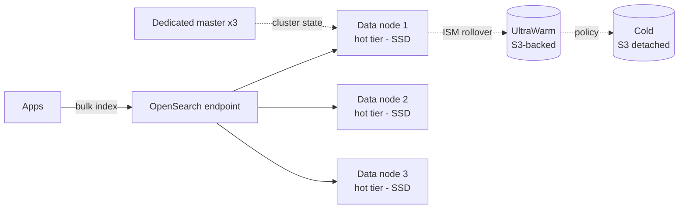

# OpenSearch and QuickSight

Two complementary Analytics services: **OpenSearch** is the search and log-analytics engine (AWS fork of Elasticsearch), **QuickSight** is the managed BI platform. Together they cover "find a needle in a haystack" and "present dashboards".

## 1. OpenSearch Service — managed search

Born as an open-source fork of Elasticsearch 7.10 after Elastic's license change. AWS handles install, patching, snapshots, scaling.

Two deployment models:

| Model | When |
|---|---|
| **Managed cluster** | full control (instance type, EBS, dedicated master), predictable workload |
| **OpenSearch Serverless** | pay-per-OCU (OpenSearch Compute Unit), variable workload, no sizing |

### Cluster architecture

Best practice: **3 dedicated master nodes** in production (avoids split-brain), odd-count data nodes across **3 AZs**, replica at least 1.

## 2. Tiered storage

- **Hot tier**: local SSD, fast queries, recent data.
- **UltraWarm**: read-only indices on S3 + local cache, ~80% cheaper, 10x slower.
- **Cold storage**: very old data, on-demand mounted, minimal cost.
- **Index State Management (ISM)**: policy that auto-**rollovers** (e.g. new index every 50 GB) and moves to UltraWarm after N days, then to Cold.

Classic trap: huge single indices (`logs-2026`) → painfully slow rebalances. Always use **time-based index patterns** (`logs-2026.05.21`) with rollover.

## 3. Main use cases

1. **Log analytics**: CloudWatch Logs / Firehose / Logstash → OpenSearch → Dashboards (ELK replacement).
2. **Application full-text search**: product catalog, internal search, knowledge base.
3. **Vector search for RAG**: since 2023 OpenSearch ships a **k-NN engine** (HNSW, IVF). You index document embeddings and search by cosine similarity. Building block for RAG with Bedrock.
4. **SIEM / security analytics** via the Security Analytics plugin.

### Security

- **Fine-grained access control** (FGAC): RBAC + document/field-level filters.
- **Cognito** or **SAML** for OpenSearch Dashboards (user login).
- Cluster always in a private VPC.

## 4. QuickSight — managed BI

Cloud-native BI: interactive dashboards, paginated reports, embedded analytics, automatic **ML insights**.

| Feature | Detail |
|---|---|
| **Datasource** | S3, Athena, Redshift, RDS, Aurora, Snowflake, Salesforce, CSV/Excel files, SaaS via JDBC |
| **SPICE** | In-memory columnar engine (10 GB free per user) for sub-second queries |
| **Direct Query** | Runs against the source every time (real-time data) |
| **Q** | Natural language: "what were sales last quarter by region?" → chart |
| **Generative BI with Q** | Generates stories, executive summaries, what-if analysis |
| **Embedded** | Secure iframe or JS SDK in your apps, dynamic RLS per tenant |
| **Paginated reports** | Pixel-perfect PDF/Excel scheduled (formerly Bursting) |

## 5. SPICE: the pricing secret

**SPICE** (Super-fast, Parallel, In-memory Calculation Engine) pre-loads data into compressed columnar RAM. A dashboard over 100 M rows answers in < 1 s **without querying the source every time**. Critical to:
- cap Athena cost (1 scan per SPICE refresh, not per view)
- protect transactional DBs (no interactive queries on top)
- stay offline-capable (source can be down, dashboard still works)

SPICE refresh: scheduled or incremental (new rows only).

## 6. Pricing models

| Type | Price |
|---|---|
| **Author Pro / Standard** | $24-50/user/month, builds dashboards |
| **Reader** | $3/user/month or **$0.30/session** (capped at $5/user/month) |
| **Embedded** | per-session API |
| **Q add-on** | extra per author/reader |

Session pricing is a killer for occasional use (e.g. 200 managers logging in 1x/month).

## 7. When to pick what

- **OpenSearch**: search text, logs, vectors. Not a BI tool.
- **QuickSight**: dashboards and reports. Not a search engine.
- **Athena + QuickSight** is the classic "data lake → BI" combo.
- **OpenSearch + QuickSight**: QuickSight connects as a datasource to visualize log aggregates.

## 8. Exercise

CloudWatch logs from 200 microservices, 500 GB/day, 90-day fast search + 1-year cold. OpenSearch architecture?

**Firehose → OpenSearch Managed** (or Serverless for variable load). Cluster: 3 dedicated `m6g.large` masters, 6 `r6g.xlarge` data nodes across 3 AZs, replica 1. **ISM policy**: rollover every 50 GB or 1 day, move to **UltraWarm** after 30 days, **Cold** after 90 days, **delete** at 365 days. Time-based index `logs-YYYY.MM.DD`. ~70% storage savings vs all-hot.

200 managers view a dashboard once a month. Author Pro for them?

No. **Reader with session pricing** ($0.30/session, capped $5/month/user). 200 × $5 = $1000/month vs 200 × $24 = $4800/month. Author only for those who create/edit dashboards. Bonus: embedded session if the dashboard lives inside an internal portal → even cheaper for anonymous aggregate use.

> **Summary**: OpenSearch = managed search/log/vector with tiered storage hot→UltraWarm→Cold and ISM; QuickSight = BI with in-memory SPICE, Q natural language, embedded and session pricing. Typical combos: Athena → QuickSight for BI, Firehose → OpenSearch for log analytics and RAG.
