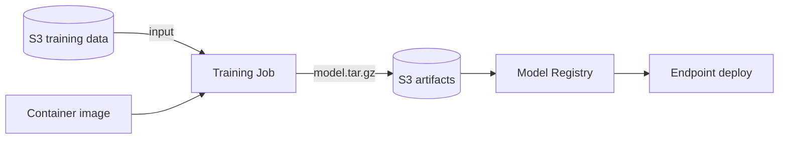

# SageMaker — overview

SageMaker is AWS' all-in-one ML platform: from notebook to production model, including distributed training, feature store, monitoring, MLOps pipelines. It's huge — this section covers the essentials and when to use them.

## 1. SageMaker Studio

Web IDE based on **JupyterLab** with:
- collaborative workspace for data scientists
- notebooks on elastic instances (ml.t3.medium → ml.p5.48xlarge)
- terminal, debugger, profiler, code editor (Code Editor IDE), RStudio
- git integration
- **Studio Lab**: free personal version with CPU/GPU, separate non-AWS account

Cost: you only pay for the notebook instance while it's running.

## 2. Training



Three approaches:

| Approach | When |
|---|---|
| **Built-in algorithms** | XGBoost, Linear Learner, Object Detection, Seq2Seq, k-NN — ready to use |
| **Script mode** (framework container) | your PyTorch / TF / HuggingFace code in an AWS-managed container |
| **BYO container** | custom ECR container with `train` as entrypoint |

Key features:
- **Managed Spot Training**: up to **90% savings** on interruptible jobs (checkpointing to S3).
- **Distributed training**: **data parallel** (SMDDP) and **model parallel** (SMP) for models that don't fit on one GPU.
- **SageMaker HyperPod**: persistent GPU clusters for training giant foundation models (weeks), with automatic resilience.
- **Warm pool**: keep the instance warm for N minutes after the job for fast iterations.

```python
import sagemaker
from sagemaker.pytorch import PyTorch

est = PyTorch(
    entry_point="train.py",
    role=role,
    instance_type="ml.p4d.24xlarge",
    instance_count=4,
    framework_version="2.3",
    distribution={"torch_distributed": {"enabled": True}},
    use_spot_instances=True, max_wait=7200, max_run=3600,
    checkpoint_s3_uri="s3://my-bucket/ckpt/"
)
est.fit({"train": "s3://my-bucket/train/"})
```

## 3. Inference: four flavors

| Type | Latency | Cost | Use case |
|---|---|---|---|
| **Real-time endpoint** | < 100 ms | instance 24/7 | sync API, steady traffic |
| **Serverless inference** | cold start 1-5 s, then < 100 ms | pay-per-request | variable / intermittent |
| **Asynchronous inference** | seconds-minutes | scales to 0 when idle | large payloads (1 GB), long processing |
| **Batch transform** | offline | temporary job | bulk predict on dataset (no endpoint) |

Plus:
- **Multi-model endpoint**: N models on one instance, loaded on-demand.
- **Multi-container endpoint**: pipeline of containers in series/parallel.
- **Inference Recommender**: benchmarks instances for latency/cost.
- **Shadow testing**: send % traffic to a new model without exposing it to users.

## 4. MLOps: Pipelines, Registry, Monitor

- **SageMaker Pipelines**: versioned DAG of steps (preprocess, train, eval, register, deploy) integrated with CI/CD. Replaces Step Functions for ML workflows.
- **Model Registry**: model catalog with versioning, approval workflow, lineage.
- **Model Monitor**: detects **data drift**, **model drift**, **bias drift**, **feature attribution drift** in production. Schedule baseline → periodic comparison.
- **Clarify**: pre-training and post-training bias detection, explainability (SHAP).

## 5. Feature Store

Centralized ML feature repository, **online** (DynamoDB, low-latency) + **offline** (S3 Parquet, history). Solves the classic "training/serving skew": the feature extraction code is single-source, used for both training (batch) and inference (real-time).

## 6. Ground Truth and AutoML

- **Ground Truth**: managed labeling (Mechanical Turk, vendors or internal team). Active learning to reduce required labels.
- **Autopilot**: tabular AutoML (regression/classification/time series). Generates inspectable notebooks.
- **Canvas**: **no-code** AutoML for business analysts, with generative AI for ready-made models.
- **JumpStart**: catalog of foundation models (Llama, Mistral, Stable Diffusion, etc.) and one-click solutions. Deploy in 2 clicks.

## 7. Costs & gotchas

- Notebook left on 24/7 = silent cost. Configure **idle shutdown** in Studio.
- Real-time endpoint = an instance you pay even with zero requests. For uneven traffic switch to **Serverless** or **Async**.
- Training on p4d/p5 instances without Spot = burning cash.
- Multi-model endpoint pays off when you have hundreds of similar models with sparse traffic.
- For RAG and custom LLMs evaluate **Bedrock** first (section 33): SageMaker custom only if you need deep fine-tuning or models not in the catalog.

## 8. Exercise

<details>
<summary>You must serve 50 XGBoost models (one per tenant), total traffic 100 req/min sparse. SageMaker architecture?</summary>

**Multi-model endpoint** on a single ml.m5.large (or two for multi-AZ). The 50 models sit in S3 and load on-demand into an LRU cache. Cost: 1-2 instances instead of 50. Alternative: **Serverless inference** for very sporadic traffic. A dedicated real-time endpoint per tenant = anti-pattern: 50 instances 24/7 = €€€.
</details>

<details>
<summary>Training a custom 10B-parameter model. Optimal cluster?</summary>

**SageMaker HyperPod** with 16-64 ml.p5.48xlarge (8x H100), distributed training via **SMP** (model parallel) + **SMDDP** (data parallel). FSx for Lustre as shared high-bandwidth storage for checkpoints. Spot not suitable: jobs are long and interruption loses hours. HyperPod handles automatic node failure recovery.
</details>

> **Summary**: SageMaker = end-to-end ML platform. Studio for dev, Training with Spot and distributed (HyperPod for foundation models), Inference in 4 flavors (real-time, serverless, async, batch), Pipelines + Registry + Monitor for MLOps, Feature Store against training/serving skew, AutoML (Autopilot, Canvas, JumpStart). For LLMs and RAG evaluate Bedrock before going custom.
