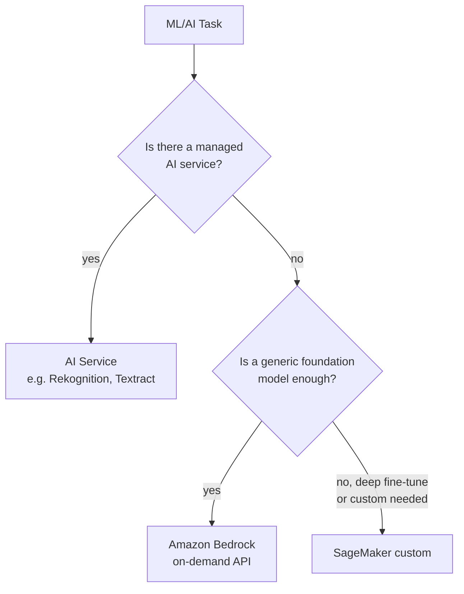

# Bedrock and AI services

In recent years AWS added two layers above SageMaker: **Bedrock** (GenAI foundation models as-a-service) and a family of **managed AI services** (Rekognition, Comprehend, Polly…) that solve specific tasks without training anything. Knowing when to use which (or SageMaker) is the key architectural call for ML on AWS.

## 1. The decision pyramid



Rule: **raise the abstraction level as much as possible**. Custom training on SageMaker is the last option, not the first.

## 2. Amazon Bedrock — foundation models on demand

Bedrock exposes models from multiple vendors via **one API**, with no infrastructure to manage:

| Provider | Models (examples) | Strong in |
|---|---|---|
| Anthropic | Claude (Opus, Sonnet, Haiku) | reasoning, agents, long context |
| Meta | Llama 3.x | open-weight, multilingual |
| Mistral | Mistral Large, Mixtral | efficiency, EU multilingual |
| Cohere | Command, Embed | RAG, multilingual embeddings |
| Amazon | Titan, **Nova** (Pro, Lite, Micro, Canvas, Reel) | text, image, video gen |
| Stability | Stable Diffusion XL | images |
| AI21 | Jamba | long context |

### Usage modes

- **On-demand** (pay-per-token): default, no capacity required.
- **Provisioned throughput**: reserved capacity for guaranteed latency/QPS.
- **Batch inference**: 50% discount, async over S3 datasets.
- **Cross-region inference**: automatic regional routing for resilience.

```python
import boto3, json
br = boto3.client("bedrock-runtime", region_name="eu-west-1")
resp = br.converse(
    modelId="anthropic.claude-sonnet-4-7-v1:0",
    messages=[{"role": "user", "content": [{"text": "Summarize: ..."}]}],
    inferenceConfig={"maxTokens": 1024, "temperature": 0.2}
)
print(resp["output"]["message"]["content"][0]["text"])
```

## 3. Bedrock features that change the design

- **Knowledge Bases**: managed RAG. Point at S3 / Confluence / SharePoint / web / Salesforce, Bedrock chunks, embeds (vector store OpenSearch Serverless / Aurora pgvector / Pinecone), serves `RetrieveAndGenerate`. No hand-built RAG pipeline.
- **Agents**: tool-use orchestration, action groups with OpenAPI/Lambda, Knowledge Base integration, session memory. Replaces frameworks like LangChain for many cases.
- **Guardrails**: input/output filters (PII, topic deny, harmful content, **contextual grounding** to reduce RAG hallucinations).
- **Bedrock Studio**: low-code environment to prototype agents and chatbots.
- **Model Customization**: fine-tuning (LoRA) and **continued pre-training** on your data.
- **Model Distillation**: use a large model as teacher to train a small task-specific one (90% perf, 10x cheaper).
- **Intelligent Prompt Routing**: routes each request to the "right" model (cheap vs powerful) based on estimated difficulty.
- **Bedrock Marketplace**: extra model catalog (HuggingFace, vendors) deployable in a few clicks.

## 4. Managed AI services — specific tasks

| Service | What it does |
|---|---|
| **Rekognition** | image/video: face, label, moderation, celebrity, custom labels |
| **Comprehend** | NLP: sentiment, entities, key phrases, language, topic modeling, **Medical** variant |
| **Translate** | 75+ languages translation, custom terminology |
| **Polly** | neural / generative TTS, 100+ voices, SSML |
| **Transcribe** | STT real-time/batch, speaker diarization, **Medical**/**Call Analytics** |
| **Textract** | OCR + extraction of forms/tables/signatures/queries (way past plain OCR) |
| **Lex** | conversational chatbots (same engine as Alexa) |
| **Personalize** | real-time recommender system |
| **Forecast** | AutoML time-series forecasting |
| **Fraud Detector** | ML-based online anti-fraud |
| **Kendra** | semantic enterprise search with connectors (KB alternative) |
| **Lookout for Equipment/Vision/Metrics** | industrial anomaly detection |
| **HealthLake / Comprehend Medical** | clinical FHIR data + medical NLP |

And the **Q** family:
- **Amazon Q Developer**: AI assistant in IDE (autocomplete, chat, agent, security scan).
- **Amazon Q Business**: enterprise chatbot over your corporate data with SSO, RBAC, plugins.

## 5. When Bedrock, when AI service, when SageMaker

| Need | Solution |
|---|---|
| Invoice OCR | **Textract** (no LLM needed) |
| Meeting transcription with speakers | **Transcribe** |
| Chatbot RAG over Confluence | **Bedrock Knowledge Bases** or **Q Business** |
| Agent executing tools against your systems | **Bedrock Agents** |
| E-commerce recommender | **Personalize** |
| Custom XGBoost on proprietary tables | **SageMaker** |
| Proprietary foundation model deep fine-tune | **SageMaker** (or Bedrock customization if model supported) |
| Defect detection on factory photos (few labels) | **Rekognition Custom Labels** or **Lookout for Vision** |

## 6. Pricing patterns

- AI services: per request/character/minute, no fixed cost.
- Bedrock on-demand: per **1k input/output tokens** (varies per model).
- Bedrock provisioned: $ per model-unit-hour, breaks even from ~5-10 stable RPS.
- Knowledge Bases: vector store storage + ingestion + retrieve fee.
- SageMaker: GPU/CPU instance hours.

## 7. Common gotchas

- RAG hallucinations: enable **Guardrails contextual grounding** or re-rank with citation enforce.
- Runaway agent cost: every tool-use step is a new model call. Cap `maxIterations`.
- Variable latency on on-demand when the region is saturated → **cross-region inference** or provisioned throughput.
- Don't confuse **Q Developer** (free up to some use, IDE-only) with **Q Business** (paid, enterprise app).
- Knowledge Bases on buckets full of scanned PDFs: pass through **Textract** first or you get empty chunks.

## 8. Exercise

<details>
<summary>Build an internal chatbot answering questions over 50,000 corporate documents (PDF, Word, Confluence). Stack?</summary>

Option 1 (fast): **Amazon Q Business** with Confluence + S3 connectors (for PDF/Word). SSO via IdC, RBAC mapped to source permissions, plugins for tickets. Zero code. Option 2 (more control): **Bedrock Knowledge Bases** (OpenSearch Serverless or Aurora pgvector vector store) + Bedrock Agents for orchestration + Guardrails. Custom frontend. For scanned PDFs first go through **Textract**. Custom SageMaker = overkill.
</details>

<details>
<summary>Mobile app must transcribe voice notes (Italian, regional accents) and extract dates/actions. Solution?</summary>

**Transcribe** (Italian + custom vocabulary for domain terms) → **Bedrock Claude Sonnet** with a structured prompt extracting dates, people, action items as JSON. Output validated with **Guardrails** (PII redaction, no sensitive content). For real-time apps use Transcribe streaming. Cost dominated by Transcribe per minute.
</details>

> **Summary**: AWS AI pyramid = managed AI services (specific) → Bedrock (foundation models + KB + Agents + Guardrails) → SageMaker custom. Bedrock unifies Claude/Llama/Mistral/Titan/Nova via single API; Knowledge Bases for RAG, Agents for tool-use, Guardrails for safety. Q Developer helps devs, Q Business brings GenAI to corporate data. Climb abstraction before going custom.
