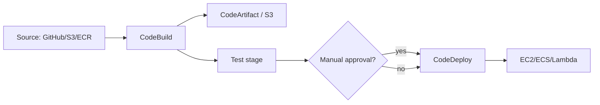
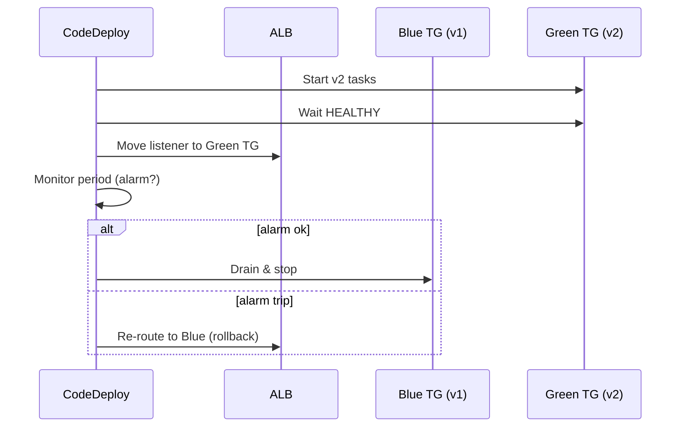

# CI/CD on AWS

A CI/CD pipeline turns "push to main" into "in production, safely, with auto-rollback" with no human in the loop. AWS provides a "Code*" family of composable services, but the real 2026 world is bimodal: AWS-native shops use CodePipeline + CodeBuild, GitHub-native shops use Actions with OIDC. Let's see both.

## 1. The Code* family (overview)



| Service | Role |
|---|---|
| **CodePipeline** | Orchestrator (source/build/test/deploy stages) |
| **CodeBuild** | Managed compute worker (Linux/Windows, x86/ARM) |
| **CodeDeploy** | Automated deploy to EC2/ECS/Lambda with hooks |
| **CodeArtifact** | Private repo for npm/pip/Maven/NuGet/generic |
| **CodeCommit** | Managed Git — **deprecated Jul 2024**, no new accounts |
| **CodeCatalyst** | End-to-end "all-in-one" experience (newer) |

## 2. CodePipeline — the orchestrator

Pipeline = sequence of **stages**; each stage = sequence of **actions**. Triggers: commit (GitHub/Bitbucket webhook), new S3 object, schedule, manual.

Action types: Source, Build, Test, Deploy, Approval, Invoke (Lambda). **Manual Approval** = pause for a human :thumbsup: (useful pre-prod), notify via SNS.

Pipeline "V2": parallel actions, variables across stages, concurrent executions per branch.

## 3. CodeBuild — the worker

Defined by a `buildspec.yml` in the repo. Runs in a managed container (Amazon Linux, Ubuntu, Windows) or **custom image** (your own from ECR).

```yaml
version: 0.2
phases:
  install:
    runtime-versions: { nodejs: 20 }
    commands: [ npm ci ]
  pre_build:
    commands:
      - aws ecr get-login-password | docker login --username AWS --password-stdin $ECR
  build:
    commands:
      - npm test
      - docker build -t $ECR/app:$CODEBUILD_RESOLVED_SOURCE_VERSION .
      - docker push $ECR/app:$CODEBUILD_RESOLVED_SOURCE_VERSION
artifacts:
  files: [ appspec.yml, taskdef.json ]
cache:
  paths: [ 'node_modules/**/*' ]
```

Useful features: **batch build** (matrix like classic CI), **local cache** (S3 or LOCAL Docker layer), **reports** (JUnit, code coverage), **VPC mode** (build inside VPC to reach private RDS).

## 4. CodeDeploy — release strategies

Three supported targets: EC2/on-prem (with agent), Lambda, ECS.

| Strategy | Where | Behavior |
|---|---|---|
| **In-place** | EC2 | Updates the same servers (rolling) |
| **Blue/Green** | EC2/ECS/Lambda | Spins new environment, shifts traffic, kills old |
| **Canary** | Lambda | 10% for 10 min, then 100% (preset `Canary10Percent10Minutes`) |
| **Linear** | Lambda | E.g. 10% every 10 min |
| **All-at-once** | Lambda | Full switch (for dev) |

`appspec.yml` defines **hooks** (`BeforeAllowTraffic`, `AfterAllowTraffic`, `BeforeInstall`...): you can attach a Lambda smoke test. **Automatic** rollback if a CloudWatch alarm trips during the monitor period.

## 5. ECS blue/green concretely



Requires a second target group (idle when blue is active). Cost: double compute during monitor period.

## 6. CodeArtifact and CodeCatalyst

**CodeArtifact**: private repo for dependencies (`npm`, `pip`, `mvn`, `nuget`, `generic`). Perks: upstream cache (public npmjs), IAM policy, no PAT tokens. E.g. `aws codeartifact login --tool npm --domain myorg --repository internal`.

**CodeCatalyst**: unified 2023+ platform with sources, CI workflows, cloud Dev Environments (Cloud9-like), issue tracker. Meant as "AWS' GitHub" — less adopted than Actions but useful in AWS-only shops.

## 7. GitHub Actions + OIDC (the popular alternative)

Most new projects use **GitHub Actions** and authenticate to AWS via **OIDC** (no long-term keys in the repo):

```yaml
permissions:
  id-token: write
  contents: read
jobs:
  deploy:
    runs-on: ubuntu-latest
    steps:
      - uses: aws-actions/configure-aws-credentials@v4
        with:
          role-to-assume: arn:aws:iam::1234:role/gh-deploy
          aws-region: eu-west-1
      - run: aws s3 sync ./dist s3://my-app/
```

The `role/gh-deploy` has a trust policy accepting only the GitHub OIDC provider + condition on `repo:myorg/myrepo:ref:refs/heads/main`. Zero secrets, full audit. Same logic for GitLab, Bitbucket, Buildkite, Circle.

## 8. Exercise

<details>
<summary>You must deploy a critical API on ECS Fargate with auto-rollback if p99 spikes. How do you wire the pipeline?</summary>

Setup:
1. **Source**: GitHub via webhook → CodePipeline (or Actions).
2. **Build** (CodeBuild): test, build image, push to ECR with `git-sha` tag.
3. **Deploy** (CodeDeploy Blue/Green on ECS): traffic shift `Canary10Percent5Minutes`.
4. **CloudWatch Alarm** on `TargetResponseTime` p99 and `5XXError` tied to Green TG.
5. CodeDeploy "Rollback on alarm" → auto-revert to Blue if alarm fires during monitor period.
6. SNS topic for Slack/PagerDuty notifications on rollback.

Extra cost: double capacity for ~10-30 min. Worth every cent.
</details>

<details>
<summary>You have long-term AWS keys in GitHub Secrets for deploys. Risks and fix?</summary>

**Risks**: keys that never expire, leaked via log/PR/fork, no clean audit of who used them, painful manual rotation. A repo accidentally published exposes the account.

**Fix**: **OIDC federation**. Create an OIDC Identity Provider in IAM pointing at `token.actions.githubusercontent.com`. Create a role with a trust policy requiring `sub: repo:org/repo:ref:refs/heads/main` (tight condition). In Actions, `aws-actions/configure-aws-credentials@v4` exchanges the GitHub token for temporary STS credentials (1 hour). Zero secrets in repo, perfect audit in CloudTrail.
</details>

> **Summary**: CodePipeline orchestrates source/build/test/deploy stages; CodeBuild runs buildspec; CodeDeploy does ECS/EC2 blue/green and Lambda canary with alarm-based rollback; CodeArtifact = private package repo; CodeCommit deprecated; modern alternative = GitHub Actions with OIDC, zero long-term keys.
