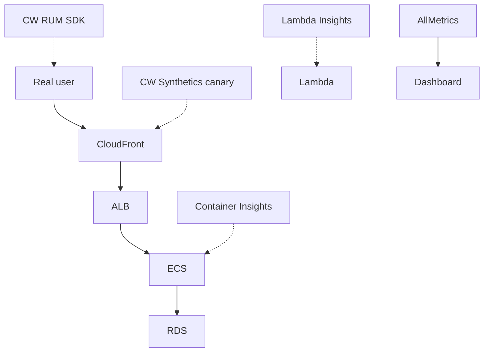

# Observability on AWS

"Observability" is not "I have a pretty graph"; it's the ability to answer new questions about the system without redeploying code. The three classic legs are **metrics, logs, traces**, plus audit (CloudTrail) and configuration governance (Config). AWS gives you all of it in-house — the real challenges are cost (Logs retention) and signal/noise (over-sensitive alarms).

## 1. CloudWatch Metrics

Model: **namespace** (e.g. `AWS/EC2`, `MyApp/Orders`) → **metric** (e.g. `CPUUtilization`) → **dimension** (e.g. `InstanceId=i-1`). Standard 1-min resolution, **high-resolution** 1 sec ($$$). Publish custom metrics:

```bash
aws cloudwatch put-metric-data \
  --namespace MyApp/Orders \
  --metric-name OrdersCreated \
  --dimensions Env=prod,Region=eu-west-1 \
  --value 1 --unit Count
```

**Embedded Metric Format (EMF)**: emit a special JSON payload in Lambda logs, CloudWatch extracts it as a metric without an API call. Cheaper, no extra latency. Great for Lambda.

## 2. CloudWatch Logs

Model: **log group** (logical, e.g. `/aws/lambda/myFn`) → **log stream** (one per process/container/Lambda invocation). Default retention = **NEVER** (infinite, pay storage forever). Always set it.

| Retention | When |
|---|---|
| 1-7 days | dev, debug |
| 30 days | normal prod app |
| 90 days | basic security/audit |
| 1 year+ | compliance (PCI 1 year minimum) |

**Subscription filter** → ship logs to Lambda, Firehose, Kinesis (e.g. push to OpenSearch or S3). **Logs Insights** query:

```
fields @timestamp, @message
| filter @message like /ERROR/
| stats count() by bin(5m)
| sort @timestamp desc
| limit 100
```

## 3. CloudWatch Alarms

States: `OK | ALARM | INSUFFICIENT_DATA`. Triggered by a statistic (Avg/Sum/p99) on a metric over a period.

- **Composite Alarm**: AND/OR over multiple alarms → reduces noisy paging ("high ALB 5xx **AND** high RDS CPU", not OR).
- **Anomaly Detection**: ML model on seasonal patterns ("is this anomalous for Monday 9am?").
- **Metric Math**: `error_rate = m1/m2 * 100` directly.

Actions: SNS (human alerting), Auto Scaling, EC2 reboot/recover, Systems Manager Incident Manager.

## 4. Dashboards, Synthetics, RUM, Insights



| Tool | Measures |
|---|---|
| **Dashboard** | Custom visual aggregator |
| **Synthetics** | Puppeteer/Selenium canary from AWS edge against URL/API |
| **RUM** (Real User Monitoring) | Browser JS SDK → real user metrics (Web Vitals) |
| **Container Insights** | ECS/EKS perf (CPU/MEM per task, pod) |
| **Lambda Insights** | Memory init, init duration, network |

## 5. AWS X-Ray and ADOT

Distributed tracing: each request receives a **trace ID** propagated in headers (`X-Amzn-Trace-Id`); each component emits **segments** (and subsegments for downstream calls). Result: visual **service map** with per-node latency + per-trace drill-down.

```python
from aws_xray_sdk.core import xray_recorder, patch_all
patch_all()  # auto-instrument boto3, requests, ...

@xray_recorder.capture('process_order')
def process_order(order):
    ...
```

**Sampling rule**: by default 1 req/sec + 5% (to avoid overpaying). Customizable per URL/service.

**ADOT (AWS Distro for OpenTelemetry)** is the strategic direction: standard OTel collector exporting to X-Ray *and* CloudWatch Metrics *and* other backends (Jaeger, Tempo). Multi-vendor or want open standards → ADOT.

## 6. CloudTrail — audit of who-did-what

Records every AWS API call. Event types:

- **Management events** (default ON, free 90 days): `RunInstances`, `CreateBucket`, `AssumeRole`.
- **Data events** (default OFF, extra cost): S3 `GetObject`, Lambda `Invoke`, DynamoDB `Query`.
- **Insights events**: volume anomalies (e.g. `DeleteObject` spike).

Best practice: **Organization Trail** (one trail in org root covers all child accounts, immutable logs in a dedicated S3 bucket with Object Lock). **CloudTrail Lake** = SQL-queryable data lake for investigations.

## 7. AWS Config

Snapshots configuration of every resource over time + evaluates **rules** (e.g. "all S3 buckets must have block public access"). Rule types: **AWS-managed** (200+ ready), **custom Lambda**, **custom Guard** (declarative DSL).

**Conformance Pack** = rule bundle for a standard (CIS, PCI, HIPAA). **Aggregator** = cross-account/region view. **Advanced Query** SQL-like: `SELECT resourceId WHERE configuration.encrypted = false`.

Cost: $0.003 per item per region — can balloon on large accounts.

## 8. Systems Manager (SSM) — operations swiss-army knife

| Module | What it does |
|---|---|
| **Parameter Store** | Key-value config (String, StringList, SecureString with KMS) |
| **Session Manager** | EC2 shell without SSH (see sec. 13) |
| **Run Command** | Execute on EC2 fleets ("yum update -y" on 500 hosts) |
| **Patch Manager** | OS patching on schedule + baseline |
| **State Manager** | "Keep these 500 hosts in this state" (idempotent) |
| **Automation** | YAML runbook (e.g. "snapshot + reboot RDS") |
| **Inventory** | Installed SW/HW inventory |
| **Incident Manager** | On-call rotation + runbook + chat collab |

## 9. Exercise

<details>
<summary>CloudWatch bill exploded to $5k/month. Where to start?</summary>

Three typical suspects:
1. **Logs ingestion + storage**: log groups without retention. Go to **CW Logs → Log Groups → Storage**, sort by bytes. Set 7/30-day retention on the top offenders.
2. **High-cardinality custom metric**: emitting metrics with `userId` as dimension → millions of unique metrics. Redesign (dimension = tier/region, not userId).
3. **Synthetics canaries** too frequent (every 1 min) across all regions. Scale to 5 min, reduce geos.

Quick win: enforce **Log Group retention** policy via a Config rule that blocks log group creation without retention.
</details>

<details>
<summary>You must understand why an API is slow for only 2% of requests. Which tool?</summary>

**X-Ray (or ADOT)**: the service map shows per-node latency, but for long-tail debug you enable **temporary 100% sampling** on the route, then search traces with `responsetime > 2s`. Often you'll find a downstream call (e.g. slow RDS query on an edge case, or Lambda cold start inside VPC) drives p99. Aggregate CloudWatch metrics tell you *that* it exists; X-Ray tells you *where* and *why*.
</details>

> **Summary**: CloudWatch (Metrics/Logs/Alarms/Dashboards/Synthetics/RUM) for metrics and logs with EMF and Insights queries; X-Ray/ADOT for distributed tracing and service map; CloudTrail for API audit (Org Trail + Lake); Config for configuration posture and compliance packs; SSM as ops swiss-army (Param Store, Session, Run Command, Patch, Incident Manager); watch Logs retention and custom metric cardinality.
