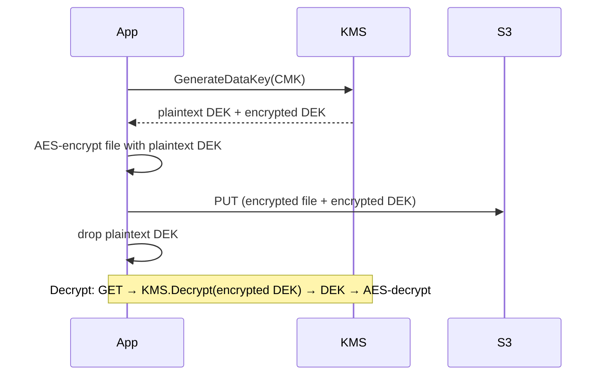

# Encryption on AWS

In an audit, the gap between "our crypto keys are secure" and "our crypto keys are **demonstrably** secure" is the gap between sleeping at night and failing due diligence. AWS provides KMS for keys, CloudHSM for paranoid cases, Secrets Manager / Parameter Store for secrets, ACM for TLS certs. Let's see them with real gotchas.

## 1. KMS — the heart

KMS manages **CMKs** (Customer Master Keys, now just "KMS keys"). Keys never leave the AWS HSM in cleartext. Types:

| Type | Who manages | Cost | When |
|---|---|---|---|
| **AWS owned** | AWS, shared | free | default S3/DynamoDB if unspecified |
| **AWS managed** (`aws/<service>`) | AWS, per your account | free | managed service with sane default |
| **Customer managed** (CMK) | you | $1/mo + $0.03/10k req | when you want key policy / rotation / audit |

CMKs support: yearly automatic rotation (one click), key policy + grant, multi-region replica, BYOK (import your key material). Algorithms: symmetric AES-256 GCM (default) or asymmetric RSA 2048/3072/4096 and ECC (signing, asymmetric encrypt).

## 2. Envelope encryption

Encrypting a big file directly with KMS isn't viable (4 KB limit). You use **envelope**:



Managed services (S3 SSE-KMS, EBS, RDS, etc.) do this for you. Cost: 1 KMS call per data key, not per byte → cheap.

## 3. Key policy, grant, conditions

A CMK has a mandatory **key policy** (who can use/administer it). Unlike other resources, the account admin too *must* be in the key policy explicitly, otherwise the key is "orphaned" and access is lost (known footgun: revoking admin by accident).

```json
{
  "Sid": "AllowAppDecrypt",
  "Effect": "Allow",
  "Principal": {"AWS": "arn:aws:iam::123:role/app"},
  "Action": ["kms:Decrypt", "kms:GenerateDataKey"],
  "Resource": "*",
  "Condition": {
    "StringEquals": {"kms:EncryptionContext:tenant": "acme"}
  }
}
```

**Encryption context**: key-value pairs that become part of authenticated AAD. If you encrypt with `{tenant: acme}` context, you must decrypt with the *same* context. Useful for multi-tenancy: prevents tenant A from decrypting tenant B's data even if they obtain CMK access.

**Grant** = programmatically issued temporary authorization (used by AWS services internally, e.g. EBS decrypting volumes on your behalf).

## 4. Multi-region key and cross-account

**Multi-region key**: keys with same key material across regions, same key ID. Useful for DR (DynamoDB Global Tables, S3 CRR to another region). Costs per *every* region as if it were a separate key (no discount).

**Cross-account**: combo of key policy (grant to an IAM role in another account) + IAM policy in the consumer account. It's an AND.

## 5. CloudHSM — when KMS isn't enough

CloudHSM = dedicated HSM (hardware appliance) certified **FIPS 140-2 Level 3** (KMS is L2/L3 depending on service, declared L3 since 2023). Use cases:

- Regulation requiring single-tenant HSM (some banking/PSD2).
- Custom crypto SDK (PKCS#11, JCE, OpenSSL engine).
- Keys for internal private CA with full custody.

Cost: ~$1.45/hour per HSM → $1k/month for a 2-node HA cluster. For 95% of cases, KMS more than suffices.

## 6. Secrets Manager vs Parameter Store

Both store secrets, but differently.

| Feature | Secrets Manager | Parameter Store (SecureString) |
|---|---|---|
| Price | $0.40/secret/month + $0.05/10k API | free (Standard) / $0.05/param (Advanced) |
| Automatic rotation via Lambda | yes, built-in for RDS/Redshift/DocDB | no (DIY) |
| Versioning | yes, with `AWSCURRENT`/`AWSPREVIOUS` labels | yes, history per parameter |
| Cross-region replication | yes, native | no (DIY) |
| Max size | 64 KB | 4 KB (Std) / 8 KB (Adv) |
| Multi-key JSON | yes, natural | yes but manual |

Rule of thumb: **DB password → Secrets Manager** (built-in rotation is worth $0.40). **Static API keys, app config → Parameter Store** SecureString. Never put cleartext secrets in Lambda env vars (visible in CloudTrail and CFN).

## 7. ACM — TLS certificates

**AWS Certificate Manager** issues public TLS certs **free** for use with AWS services (CloudFront, ALB, NLB, API GW). Validation by DNS (CNAME record in Route 53 — one click if Hosted Zone is in same account) or email.

```bash
aws acm request-certificate \
  --domain-name api.example.com \
  --subject-alternative-names "*.api.example.com" \
  --validation-method DNS
```

Auto-renewal if the cert is "in use" on an AWS service and DNS is still valid. You can't export the private key (the price of free): if you need it on EC2 in a custom way, use Let's Encrypt or ACM Private CA.

**ACM Private CA** (paid, ~$400/month + $0.75/cert after first 1000): to issue internal certs (e.g. service-to-service mTLS, IoT devices, Kubernetes certs). Expensive but avoids running your own PKI from scratch.

## 8. Exercise

<details>
<summary>You have DB passwords hardcoded in Lambda env vars. How do you migrate to the right solution?</summary>

Setup:
1. Create a Secrets Manager secret (`prod/myapp/db`) with JSON `{"username": "...", "password": "...", "host": "...", "port": 5432}`.
2. Enable **automatic rotation** with the built-in RDS Lambda (every 30 days, also rotates the DB user).
3. Lambda IAM role: `secretsmanager:GetSecretValue` only on that secret ARN.
4. In Lambda code, fetch + local-cache for container lifetime (5-15 min) — reduce API calls.
5. Remove env var, remove password from CFN/CDK (replace with `{{resolve:secretsmanager:prod/myapp/db:SecretString:password}}`).
6. Force-rotate the old password (it was in CloudTrail/git history → compromised).
</details>

<details>
<summary>You want tenant A to never read S3 objects encrypted for tenant B, even if A's IAM permissions accidentally become too broad. How?</summary>

Use KMS **encryption context** as second line of defense. When tenant A writes: encrypt with `EncryptionContext: {tenant: A}`. KMS key policy requires `kms:EncryptionContext:tenant` = principal-tag or sub-arn of tenant. Even if tenant A's role obtains `s3:GetObject` on a tenant-B object, KMS will refuse `Decrypt` because the context doesn't match.

Combined with bucket policy `aws:RequestTag/tenant`, you have two independent layers — one IAM bug isn't enough to leak data.
</details>

> **Summary**: KMS with customer-managed CMK for control + audit (envelope encryption, encryption context, multi-region); CloudHSM only for FIPS 140-2 L3 single-tenant; Secrets Manager for DB credentials with automatic rotation ($0.40), Parameter Store for app config (free); ACM public TLS free for AWS services, Private CA paid for internal mTLS.
