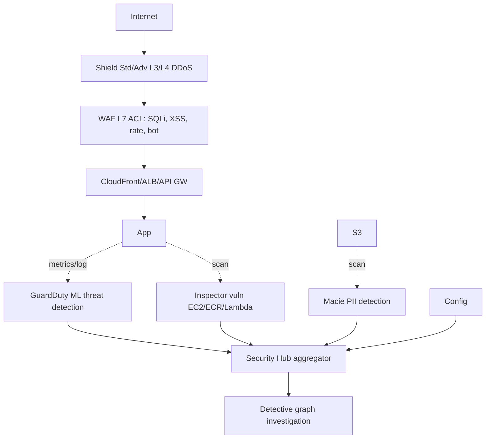

# Threat detection on AWS

Cloud security isn't "a firewall and done": it's a stack of specialised services, each for one layer of the "defense in depth" model. The challenge isn't buying them all — it's managing the firehose of findings they produce. The chapter ends with the aggregator (Security Hub) that merges them.

## 1. The full stack



## 2. WAF — L7 application firewall

WAF (Web Application Firewall) filters HTTP/HTTPS requests before they reach the app. Attaches to **CloudFront, ALB, API Gateway (REST), AppSync, App Runner, Cognito User Pool**.

Components:
- **Web ACL**: main object with an ordered ruleset.
- **Rule**: condition (e.g. "country = RU" or "URI contains `../`") + action (Allow/Block/Count/CAPTCHA/Challenge).
- **Rule group**: reusable bundle.

Rule sources:
- **AWS Managed Rules**: free-ish, "Core Rule Set", "Known Bad Inputs", "SQL Database", "Linux", etc.
- **Marketplace**: F5, Imperva, Fortinet.
- **Custom**: your own (e.g. block all POST > 1 MB on `/upload`).

Features: **Rate-based rule** (rate limit per IP), **Bot Control** (managed, distinguishes crawlers vs malicious bots), **CAPTCHA / Challenge** (JS challenge or reCAPTCHA-like).

## 3. Shield — DDoS protection

| | Standard | Advanced |
|---|---|---|
| Cost | free (always on) | $3000/month + traffic |
| Protects | L3/L4 (SYN flood, UDP refl, etc.) | L3/L4 + L7 |
| Cost protection | no | yes (refund of scaling during DDoS) |
| SRT | no | Shield Response Team |
| Health-based detection | no | yes |

Shield Advanced makes sense for critical workloads (banking, news, live gaming) — also the gate to on-call SRT. Otherwise, Shield Standard + WAF Bot Control cover 95%.

## 4. GuardDuty — continuous threat detection

"Always on" service that ML-analyses:
- **CloudTrail management/data events** (API anomalies)
- **VPC Flow Logs** (connections to known-bad IPs, port scans)
- **Route 53 resolver DNS query logs** (DNS tunneling, C2 chatter)
- **EKS audit logs** (pod escalation)
- **EBS volumes** (Malware Protection on-demand scan)
- **S3 Protection** (GetObject/PutObject anomalies)
- **RDS login monitoring** (Aurora MySQL/Postgres brute force)
- **Lambda Protection** (Lambda network behavior)

Output: **findings** with severity (Low/Medium/High) → EventBridge → automation (e.g. Lambda isolating a compromised instance).

Cost: complex (per event + GB analysed) — enabling in dev can surprise. Adds 1-3% of the bill in medium-sized accounts.

## 5. Inspector — vulnerability assessment

Continuous scan for **CVEs** and **network reachability** on:
- **EC2** (SSM agent): vulnerabilities in OS packages.
- **ECR container images**: layer scan.
- **Lambda function**: package dependencies (boto3, npm).

Output: finding with CVSS score, CVE ID, recommendation (e.g. "upgrade openssl to 3.0.13"). Integration with Jira via EventBridge or Security Hub.

Difference vs GuardDuty: Inspector = "**how could I be attacked**" (preventive), GuardDuty = "**I'm being attacked now**" (detection).

## 6. Macie, Detective, Firewall Manager

| Service | What it does |
|---|---|
| **Macie** | Finds PII (CC, SSN, fiscal code, IBAN) in S3 buckets via ML + regex |
| **Detective** | Builds graph from CloudTrail/VPC/GuardDuty → visual "who did what when" investigation |
| **Firewall Manager** | Centralized WAF / Shield / SG / Route 53 DNS firewall management across the org |
| **IAM Access Analyzer** | Finds: 1) unexpected external access 2) unused policies 3) policy validation 4) custom checks |
| **Audit Manager** | Auto-collects evidence for audits (SOC2, PCI, HIPAA, GDPR) |

Macie charges per GB scanned → enable on "sensitive" buckets (DB dumps, app logs), not a whole data lake blanket.

## 7. Security Hub — the aggregator

The "single pane of glass" collecting findings from GuardDuty, Inspector, Macie, IAM Access Analyzer, Config, third-party partners (Wiz, CrowdStrike, etc.) and scoring them against standards:

- **AWS Foundational Security Best Practices (FSBP)**
- **CIS AWS Benchmark v3.0**
- **PCI DSS 3.2.1**
- **NIST 800-53**

Cross-account/region aggregator. **Automated Security Response (SOAR)**: pre-built playbooks that auto-remediate (e.g. remove bucket public access, disable IAM user with compromised keys).

```json
{
  "SchemaVersion": "2018-10-08",
  "ProductArn": "arn:aws:securityhub:eu-west-1::product/aws/inspector",
  "Severity": {"Label": "HIGH"},
  "Title": "Vulnerability CVE-2024-XXXX in openssl",
  "Resources": [{"Type": "AwsEc2Instance", "Id": "arn:..."}]
}
```

## 8. Common anti-patterns

- **WAF in "temporary" `Count` mode** that stays for months → findings, zero protection.
- **GuardDuty enabled in only 1 region**: attackers pick idle regions.
- **Inspector without a PR-blocking pipeline**: you find CVEs but don't fix them.
- **Macie on all of S3** → huge bill. Target sensitive buckets.
- **Security Hub with 10k Low-severity findings** → no one looks. Filter, suppress accepted ones, automate the critical ones.

## 9. Exercise

<details>
<summary>An e-commerce site is hit by "credential stuffing" waves on /login (bots trying email/pwd pairs). How do you defend?</summary>

Layered:
1. **WAF Rate-based rule**: max 100 POST `/login` per IP per 5 min → Block.
2. **WAF Bot Control** managed rule: recognises 90% of bots by signature.
3. **WAF CAPTCHA action** on `/login`: bots must solve invisible challenge (JS check first).
4. Cognito User Pool with **Advanced Security** (risk-based auth: prompts MFA on anomalous geo/device).
5. GuardDuty on `IAMUser/AnomalousBehavior` to catch downstream compromised accounts.
6. CloudWatch alarms on WAF `BlockedRequests` + failed-login ratio → notify.

Extra cost: WAF ~$5/month + $0.60/M req + $10 Bot Control. Savings: CS time + fraud chargebacks.
</details>

<details>
<summary>Pentester uploaded 10k S3 objects with synthetic credit-card patterns. You want to find them without scanning the whole giant bucket. Which tool, how to cap cost?</summary>

**Amazon Macie** with **"Scheduled / One-time"** job + filters:
- Restrict by **bucket** (only the test bucket, not entire account).
- Restrict by S3 **prefix** (e.g. `s3://bucket/test/`).
- Restrict by **object size** (skip > 100 MB if you know cards are in small CSVs).
- 10% sampling for discovery-only.

Macie uses Managed Data Identifier for CREDIT_CARD_NUMBER (Luhn check) — findings in Security Hub. Cost is proportional to GB scanned, not object count.
</details>

> **Summary**: WAF L7 (managed rules + bot control + rate limit + CAPTCHA), Shield Std free + Advanced ($3k) for L3/4/7 DDoS; GuardDuty for ML threat detection on CloudTrail/VPC/DNS/EKS/S3/RDS/Lambda; Inspector for EC2/ECR/Lambda vulns; Macie for S3 PII; Detective for graph investigation; Security Hub aggregator with FSBP/CIS/PCI; always automate remediation or you'll drown in findings.
