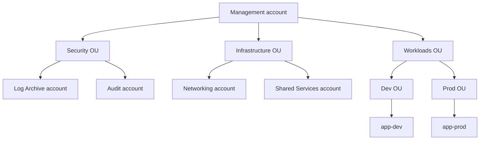

# Multi-account governance

At 5 accounts you can wing it. At 50, without governance, you have 50 copies of the same policy, 50 admin roles, 50 separate budgets and nobody understands where the bill goes. Control Tower + Organizations + Identity Center are the "account factory" AWS gives you — quick recap of Organizations and then into real governance (guardrails, SSO, tag policies).

## 1. Organizations — recap

Already covered in sec. 8: **management account** (root) + **OU** tree + **member accounts**. Key tools:

- **SCP** (Service Control Policy): negative guardrails limiting what IAM may do in an account. SCPs *never grant*, they only *deny*.
- **Consolidated billing**: one invoice, shared volume discounts.
- **Trusted access**: lets services (Config, Security Hub, GuardDuty, Backup) operate cross-account.



## 2. Control Tower — landing zone as a service

Control Tower automates **landing zone** creation: org setup "best-practice" with dedicated accounts (Log Archive, Audit), baseline OUs, SSO, CloudTrail org trail, Config aggregator, initial guardrails.

**Account Factory** = self-service for vending new accounts: a user fills a form ("account name, email, OU, baseline"), Control Tower creates the account, applies SCPs, configures SSO, etc. "By code" version: **Account Factory for Terraform (AFT)**.

**Guardrails** (now called "Controls"):

| Type | Example | Implementation |
|---|---|---|
| **Preventive** | "can't create resources outside eu-west-1" | SCP |
| **Detective** | "all S3 buckets must have versioning" | Config rule |
| **Proactive** | "IaC deploy of an EC2 without CostCenter tag is blocked" | CloudFormation hook |

Per guardrail: **Mandatory** (always on, can't disable), **Strongly recommended**, **Elective**.

## 3. AWS Identity Center (ex AWS SSO)

The *correct* way to manage human users in 2026: **single login** federated across all accounts. Replaces IAM users (which should only exist for legacy / break-glass).

Components:
- **Identity source**: built-in directory, or Microsoft Entra ID (ex Azure AD), Okta, Google Workspace via **SAML 2.0** + **SCIM** for provisioning.
- **Permission Set**: an IAM policy + session duration that becomes an IAM role in the target account.
- **Assignment**: `(identity source group) × (permission set) × (account)`.

User SSO logs in → sees the list of accounts/roles they can assume → clicks → gets temporary STS credentials. CLI: `aws sso login --profile dev-admin`.

## 4. ABAC with session tags

ABAC = Attribute-Based Access Control. Idea: instead of "Bob can access bucket-finance", "whoever has tag Department=Finance accesses resources with tag Department=Finance".

In Identity Center: map external directory attributes (e.g. `department` in Entra) to AWS session tags:

```json
{
  "Version": "2012-10-17",
  "Statement": [{
    "Effect": "Allow",
    "Action": "s3:GetObject",
    "Resource": "arn:aws:s3:::reports/*",
    "Condition": {
      "StringEquals": {
        "s3:ExistingObjectTag/Department": "${aws:PrincipalTag/Department}"
      }
    }
  }]
}
```

Benefit: zero new policies when hiring a new employee, just drop them in the right Entra group.

## 5. Resource Access Manager (RAM)

Share resources between org accounts **without** complicated cross-account IAM:

- **VPC subnet** (a "Networking" account owns the VPC, other accounts launch EC2/RDS directly in it).
- **Transit Gateway**.
- **Route 53 Resolver rules**.
- **License Manager configuration**.
- **CodeArtifact repository**.

Savings: 1 shared VPC instead of 50 VPCs + 50 peerings.

## 6. Service Catalog — stack vending

Publish curated CloudFormation "products" (e.g. "standard VPC", "RDS Postgres with backup") and end users in other accounts launch them from a self-service console. Great to democratize infra without granting raw permissions.

**TagOptions** enforce mandatory tags (CostCenter, Owner). **Constraints**: launch role (elevates permissions only at launch), notification, template.

## 7. StackSets, Health, Account Management

- **CloudFormation StackSets** with **delegated administrator**: delegate to a member account (not management) the right to launch stacks across the org. Auto-deploy when a new account joins an OU.
- **AWS Health Dashboard organization view**: aggregated events (maintenance, deprecations) across all accounts.
- **Account Management**: programmatic account closure (`CloseAccount` API), alternate contacts (billing, security, ops separate from root account email).

## 8. Tag, Backup, AI opt-out policies

Three "organization-wide" policies beyond SCPs:

| Policy | What it does |
|---|---|
| **Tag Policy** | Defines mandatory tags + valid values (e.g. `Env in [dev,stage,prod]`) |
| **Backup Policy** | Defines AWS Backup plan applied to all accounts |
| **AI services opt-out** | Excludes your data from AWS model training (Bedrock, Rekognition, Transcribe) |

Tag policy doesn't *enforce* (Config rule or IaC does); it flags compliance/violation. For real enforcement, use an SCP requiring tags.

## 9. Exercise

<details>
<summary>Greenfield: 0 accounts, want a "done-right" multi-account setup for 1 year. Where to start?</summary>

AWS "by-the-book" approach:
1. **Open management account** with dedicated email (not personal, group `aws-root@`).
2. Enable **Control Tower** in primary region (e.g. eu-west-1) → creates baseline OUs (Security, Sandbox, Workloads), Log Archive + Audit accounts, org trail.
3. Configure **Identity Center** with your directory (Entra/Okta), create permission sets (AdminAccess, PowerUser, ReadOnly, BillingViewer).
4. Create **Account Factory** baseline to vend new workload accounts.
5. **Mandatory guardrails** + a set of electives (e.g. "no public RDS", "mandatory MFA", "Log group retention required").
6. **GuardDuty + Security Hub + Config** delegated admin to Audit account, enabled across the org.
7. **Budget alerting** on every account, even dev.

Total time: 1-2 weeks. Saves 6 months of refactoring a year later.
</details>

<details>
<summary>80 employees on Okta. All engineers should get "PowerUser" on 10 dev accounts, only tech leads on prod. How do you model it?</summary>

In Okta create two groups: `aws-eng` (all engineers) and `aws-tech-leads` (subset). Sync via **SCIM** to Identity Center (auto-provisioning, no manual sync).

In Identity Center:
- Permission set `PowerUserAccess` (managed) + `ReadOnlyAccess`.
- Custom permission set `ProdAdmin` with session duration 1h (forced short to reduce blast radius).
- Assignment: group `aws-eng` × `PowerUserAccess` × {all dev accounts}.
- Assignment: group `aws-tech-leads` × `ProdAdmin` × {prod accounts} **+ MFA condition** + approval via IAM Identity Center session policy requiring a Jira ticket.

When an engineer leaves Okta, they lose *everything* the same day. When one joins, immediate access without a ticket.
</details>

> **Summary**: Control Tower for landing zone with baseline accounts (Log, Audit) and mandatory/elective/proactive guardrails; Identity Center for federated SSO (Entra/Okta) with permission sets and ABAC via session tags; RAM for sharing VPC/TGW/Route 53; Service Catalog for self-service IaC; StackSets delegated admin for cross-account deploy; Tag/Backup/AI opt-out as org-wide policies.
