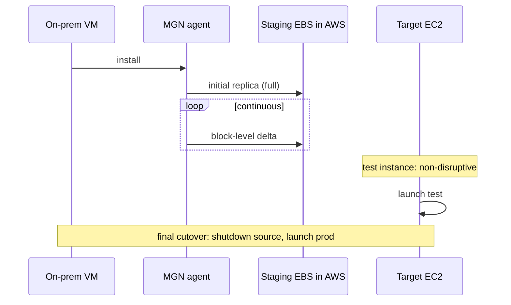

# Migration to AWS

A botched migration burns 18 months and the board's trust in the cloud. A good one frees infrastructure, cuts costs and enables managed services. The question isn't "how do I move VMs" — it's "**what** do I move, **how** do I modernize it, **in what order**". The AWS framework is "6 R's", and the tools cover every R.

## 1. The 6 R's

| R | What | Example |
|---|---|---|
| **Rehost** | "Lift and shift" — move VM as-is | VMware → MGN onto EC2 |
| **Replatform** | "Lift, tinker and shift" — small improvements | on-prem MySQL → RDS MySQL |
| **Repurchase** | Swap for SaaS | Exchange → Microsoft 365 |
| **Refactor / Re-architect** | Cloud-native rewrite | monolith → serverless microservices |
| **Retire** | Turn off, wasn't needed | the 10-20% of VMs discovered during discovery |
| **Retain** | Leave on-prem (for now) | legacy mainframe, non-cloud dependencies |

Typical wave: first Discovery, then Retire the forgotten ones, then massive Rehost to leave the datacenter, then Replatform/Refactor in phase 2.

## 2. Application Discovery + Migration Hub

**AWS Application Discovery Service**: discovers what you have on-prem.
- **Agent-based** (Linux/Windows): perf metrics, processes, network dependencies (who talks to whom).
- **Agentless** (OVA VMware): inventory + baseline perf with zero install.

**Migration Hub**: central console tracking all in-flight migrations (MGN/DMS/etc.) by app/wave/account. Aggregates progress, estimated cost, blockers. **Migration Hub Refactor Spaces** assists the strangler pattern (incrementally attaching cloud-native to legacy).

## 3. AWS Application Migration Service (MGN)

Successor to CloudEndure Migration. **Continuous block-level replication** from source VM to a "staging" EBS in AWS, then cutover at the right moment.



Cutover window: minutes to tens of minutes vs days of dump-restore. Works from: VMware, Hyper-V, physical, Azure, GCP. Also **Server Migration** for retired workloads (one-shot snapshot).

## 4. Database Migration Service (DMS) and SCT

**DMS** moves DB data with minimal downtime:
- **Homogeneous** (Oracle → Oracle, MySQL → MySQL): native, easy.
- **Heterogeneous** (Oracle → Aurora PostgreSQL, SQL Server → Aurora MySQL): combined with **Schema Conversion Tool (SCT)** to convert DDL, procedures, triggers.

Modes:
- **Full load** (one-shot snapshot).
- **CDC** (Change Data Capture: reads source transaction log and applies continuously to target).
- **Full + CDC**: initial full + ongoing CDC → cutover when lag = 0.

```bash
aws dms create-replication-task \
  --replication-task-identifier orcl-to-aurora \
  --source-endpoint-arn arn:... --target-endpoint-arn arn:... \
  --migration-type full-load-and-cdc \
  --table-mappings file://tables.json
```

DMS Serverless since 2023: auto-scaling of replication compute, no more manual instance sizing.

## 5. DataSync and Transfer Family

**DataSync**: high-speed file sync between on-prem NFS/SMB/HDFS/Object and S3/EFS/FSx (or between AWS storage). In-transit encryption, integrity check, incremental. Typical for migrating petabytes of NAS.

**AWS Transfer Family**: managed **SFTP/FTPS/FTP/AS2** server writing directly to S3 or EFS. For when your B2B partners "just want SFTP" and you don't want to babysit an EC2 with OpenSSH.

## 6. Snow family — offline transfer

When WAN bandwidth isn't enough. AWS ships you a physical appliance:

| Device | Capacity | When |
|---|---|---|
| **Snowcone** | 8-14 TB usable, portable (~2 kg) | edge IoT, small transfers, austere environments |
| **Snowball Edge Storage Optimized** | 80 TB usable | medium transfers |
| **Snowball Edge Compute Optimized** | 42 TB + GPU + EC2-compatible | edge compute + transfer |
| **Snowmobile** | 100 PB on a truck (40-ft container) | entire datacenter — discontinued 2024, replaced by multi-Snowball |

Bandwidth math: 100 TB over 1 Gbps = 10+ continuous days. Snowball arrives in 1 week, copy in 1-2 days, ship back. AES-256 hardware encryption with KMS.

## 7. Storage Gateway (hybrid recap)

Already covered: 3 modes — **File Gateway** (NFS/SMB → S3), **Volume Gateway** (iSCSI cached/stored), **Tape Gateway** (VTL → S3/Glacier). Useful during long "hybrid" migrations when you can't cut over immediately.

## 8. Wave planning

Strategies for ordering what to move when:

- **Big bang**: everything in a weekend (risky, rare post-2010).
- **Phased per app**: one app per wave (2-4 weeks), test, next.
- **Phased per dependency graph**: from Discovery — leaf apps first, climb to shared services.
- **Strangler**: new cloud-native sits alongside legacy, traffic migrated piece by piece via API GW / DNS.

Anti-pattern: migrating the DB **first** leaving the app on-prem → devastating WAN latency. Migrate app + DB together in the same wave, or use DMS CDC to minimize cutover.

## 9. Exercise

<details>
<summary>200 VMware VMs on-prem, 30 SQL Server DBs, you want to be off-datacenter in 12 months. Order and tools?</summary>

Months 1-2: **Discovery Service agentless** for inventory + dependency map. Identify 30-40 forgotten VMs → **Retire**.

Months 3-4: **MGN** to rehost 100 "vanilla" VMs (web, app servers). Continuous replication, weekly wave-by-wave cutover. Test instance to validate before cutover.

Months 5-8: DB migration. For SQL Server with existing license: rehost with MGN on EC2 (Microsoft BYOL). For 5-10 Replatform candidates: **DMS + SCT** to Aurora PostgreSQL (query refactor required) or RDS SQL Server (no app change). CDC for final cutover with minimal lag.

Months 9-11: remaining complex apps + 1-2 Refactor candidates (e.g. file storage → S3).

Month 12: final cutover, decommission datacenter, celebrate.

All tracked in **Migration Hub** with an executive dashboard.
</details>

<details>
<summary>You must transfer 500 TB of medical archives from on-prem NAS to S3 Glacier Deep Archive. WAN bandwidth 200 Mbps. How long via DataSync vs Snowball?</summary>

**DataSync over WAN**: 500 TB × 8 bit/byte ÷ 200 Mbps = ~230 days theoretical at sustained throughput (assuming full link, unrealistic). In practice ~6-9 months, saturating the corporate WAN → productivity hit.

**Snowball Edge Storage** (80 TB each): order 7 units, arrive in 1 week, parallel copy from NAS ~3-5 days, ship back, AWS imports to S3 in ~1 week per unit. **Total ~4-6 weeks**, WAN free, cost ~$300/device + shipping.

Trade-off: physical latency vs network latency. For 500 TB, physical shipping wins cleanly.
</details>

> **Summary**: 6 R's framework (Rehost/Replatform/Repurchase/Refactor/Retire/Retain); Application Discovery + Migration Hub for inventory and tracking; MGN for continuous block-level lift-and-shift; DMS + SCT for homogeneous/heterogeneous DB with CDC; DataSync for files, Transfer Family for managed SFTP; Snow family for offline >50 TB; phased wave planning by dependency, avoid big-bang and DB-before-app migration.
