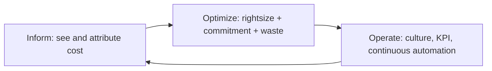

# Cost optimization and FinOps

"The bill grows faster than revenue" is the sentence that kicks off every FinOps project. The good news: on average 25-35% of AWS spend is optimizable without touching app features. The bad news: nobody optimizes on their own — you need a process (FinOps), not just a tool. Let's see both.

## 1. FinOps in 3 phases



| Phase | Questions | Tools |
|---|---|---|
| **Inform** | How much do we spend? Where? Who? | Cost Explorer, CUR, Tags, Budget |
| **Optimize** | Can we spend less? | Compute Optimizer, RI/SP, Spot, Trusted Advisor |
| **Operate** | How do we stay optimized? | Anomaly Detection, automation, monthly KPIs |

## 2. Inform — Cost Explorer, CUR, Budget

**Cost Explorer**: UI to explore cost by service/region/tag/account/usage type, with 12-month forecast. Daily granularity, 13-month retention (38 with history).

**Cost and Usage Report (CUR)**: granular line-by-usage dataset, exported to S3 in Parquet. Query with **Athena** or load into QuickSight for custom dashboards.

```sql
SELECT line_item_product_code,
       SUM(line_item_blended_cost) AS cost
FROM cur_table
WHERE year='2026' AND month='5'
  AND line_item_user_type='Usage'
GROUP BY 1
ORDER BY 2 DESC
LIMIT 20;
```

**Budget**: alerting on thresholds ($ or %), and **Budget Actions** that can *block IAM* or stop EC2 when exceeded (e.g. dev account capped at $500).

**Cost Anomaly Detection**: ML spotting unexpected spikes by service/tag → SNS notification.

## 3. Optimize 1 — Rightsizing

**Compute Optimizer** analyses utilization (CPU/RAM/network/IOPS) and recommends:
- **EC2**: downsize (m5.xlarge → m5.large) or generation upgrade (m5 → m7g Graviton).
- **ASG**: family balancing.
- **EBS**: gp2 → gp3 (cheaper at same IOPS).
- **Lambda**: optimal memory (more RAM = more CPU = sometimes cheaper because finishes faster).
- **RDS/Aurora**: instance class.

Historic quick win: **gp2 → gp3** is ~20% cheaper at equivalent perf, one command or `aws ec2 modify-volume`.

## 4. Optimize 2 — Reserved Instances and Savings Plans

For "always-on" workloads, prepay 1 or 3 years for 30-72% discount.

| Tool | Covers | Flexibility |
|---|---|---|
| **EC2 Reserved Instance (standard)** | EC2 of specific family/region | low (only AZ/size in family) |
| **EC2 Reserved Instance (convertible)** | swappable EC2 | medium, smaller discount |
| **RDS/ElastiCache/Redshift/OpenSearch RI** | that service | low |
| **Compute Savings Plan** | EC2 + Fargate + Lambda, any region/family | **high** |
| **EC2 Instance Savings Plan** | EC2 family + region | medium, bigger discount |
| **SageMaker Savings Plan** | SageMaker | low |

Commitment in **$/hour** (e.g. "I spend $3.20/h for 3 years"); coverage auto-applies to running instances. **Recommendations** in Cost Explorer (7/30/60-day lookback). Payment: All Upfront (max discount) / Partial Upfront / No Upfront.

Rule of thumb: cover 70-80% of baseline with SP, leave peak/dev on on-demand.

## 5. Optimize 3 — Spot

Already covered in sec. 14: -90% off on-demand, can be reclaimed with 2-min notice. For tolerant workloads (batch, CI, ML training, stateless web behind ASG): **Spot Fleet** with **capacity-optimized** allocation = lowest interruption probability.

## 6. Optimize 4 — Waste elimination

Most frequent line items I've zeroed out in audits:

| Waste | Typical cost | Fix |
|---|---|---|
| **NAT Gateway** for S3/DynamoDB traffic | $0.045/GB processed + $32/mo | **VPC Gateway Endpoint** (free!) |
| **NAT Gateway** for other AWS APIs | $0.045/GB | **Interface Endpoint** ($7.50/mo vs traffic) |
| **Orphan EBS snapshots** | $0.05/GB-mo | Lifecycle policy + cleanup script |
| **Detached EBS volumes** | $0.08/GB-mo gp3 | tag + alert + auto delete after 7d |
| **Unassociated Elastic IPs** | $3.6/mo each | release |
| **Infinite CloudWatch Logs retention** | $0.03/GB-mo | set 30/90-day retention |
| **Idle RDS / ELB / ECS tasks** | typical $50-500/mo each | Trusted Advisor + shutdown |
| **S3 versioning without lifecycle** | eternal duplicates | lifecycle "noncurrent → IA → expire 90d" |
| **Dev/staging 24/7** | 168h/week | **AWS Instance Scheduler** off 19:00-7:00 + weekend = -70% |

## 7. Storage tier optimization

- **S3 Intelligent-Tiering**: AWS auto-shuffles objects between tiers (Frequent → Infrequent → Archive Instant → Archive → Deep Archive) based on access pattern. $0.0025/1k objects monitor fee, but wins for heterogeneous data.
- **S3 Storage Lens**: org-wide dashboard on 28+ storage metrics, recommendations.
- **Aurora I/O Optimized**: for I/O-heavy workloads you pay more compute but 0 I/O — break-even ~25% IO/total.
- **RDS Reserved Instance** + **Multi-AZ** seriously evaluated: Multi-AZ doubles cost, goes on real prod, not dev.

## 8. Tags, allocation, showback/chargeback

Without tags, every cost discussion stalls at "we don't know who". Strategy:

1. **Mandatory tags** defined in **Tag Policy** + enforced in IaC (CDK Aspects or Terraform default_tags). Examples: `CostCenter`, `Owner`, `Env`, `Project`.
2. **Cost Allocation Tags** enabled in Billing Console (within 24h appear as Cost Explorer dimension).
3. **Tag Editor** to bulk-tag/fix existing resources.
4. **Showback** = monthly report to each BU "here's what you spent". **Chargeback** = BU actually pays the central IT. Use CUR + Athena/QuickSight.

## 9. Exercise

<details>
<summary>Prod account at $80k/month, must cut 25% in 3 months. Where to start?</summary>

Methodical approach:
1. **Week 1**: download CUR, classify by service. Top 3 are usually: EC2 (40%), RDS (15%), Data Transfer/NAT (10%).
2. **Week 2 quick wins**:
   - **S3/DynamoDB Gateway Endpoint** → -50% NAT cost = ~$2k/month.
   - **gp2 → gp3**: all volumes → -20% EBS = ~$1.5k/month.
   - **Log retention** policy → -50% CW Logs.
   - **Cleanup**: orphan snapshots, unused EIPs, detached volumes → ~$500/month.
3. **Week 3-4**: Compute Optimizer → rightsize 20% of EC2 → -$3k/month.
4. **Week 5-6**: **Compute Savings Plan** covering 80% baseline → -25% on EC2/Fargate/Lambda = ~$8k/month.
5. **Week 7-10**: switch off dev/staging off-hours with Instance Scheduler → -$2k/month.
6. **Week 11-12**: S3 tier review → Intelligent-Tiering on large buckets.

Total: ~$17k/month saved = 21%. To reach 25% also hit Spot-candidate workloads (CI batch) or Lambda memory reduction.
</details>

<details>
<summary>A Lambda processes 100M invocations/month from SQS, average 200 ms at 1024 MB. How do you cut cost without code change?</summary>

Two levers:
1. **Lambda Power Tuning**: open-source tool that tests the same function at 512/1024/2048/3008 MB. Often you find that at 1536 MB it runs in 130 ms instead of 200 ms → cost per invocation **equal or lower** (cost = GB-sec, shorter duration offsets more memory). Test before changing.
2. **Compute Savings Plan** covers Lambda. With 80M baseline invocations/month at 200 GB-sec each, commit ~$X/h SP → -17% on the total.
3. Bonus: switch to **arm64 Graviton** (no code change for most runtimes) → -20% price, often even faster.
</details>

> **Summary**: FinOps in 3 phases (Inform/Optimize/Operate); Cost Explorer + CUR + Budget for visibility; Compute Optimizer + RI/SP (Compute SP is the most flexible) + Spot to reduce; waste elimination (NAT → Gateway Endpoint, orphan EBS, log retention, dev off-hours) is the biggest quick win; tags + allocation + showback for culture; realistic target 20-35% cut with zero feature degradation.
