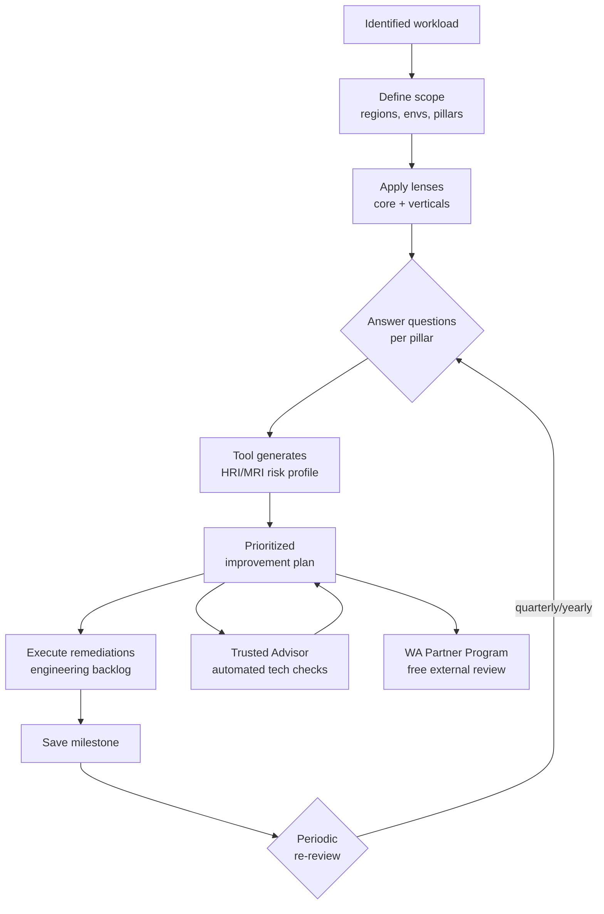

# Well-Architected Framework

The **Well-Architected Framework (WAF)** is the official AWS manual for designing and reviewing cloud workloads. It's not a product: it's a set of questions, principles and best practices grouped into **6 pillars**, supported by the **Well-Architected Tool** (free) to run formal reviews and track remediation over time.

## 1. The 6 pillars

Originally 5, **Sustainability** was added in 2021 as the sixth pillar in line with ESG goals.

| # | Pillar | Key question |
|---|---|---|
| 1 | **Operational Excellence** | How do you run and evolve the system in production? |
| 2 | **Security** | How do you protect data, systems and assets? |
| 3 | **Reliability** | How do you recover from failure and manage capacity? |
| 4 | **Performance Efficiency** | How do you use compute/storage/network efficiently? |
| 5 | **Cost Optimization** | How do you avoid waste and extract value from the cloud? |
| 6 | **Sustainability** | How do you minimize environmental impact (energy, hardware)? |

Each pillar has **design principles** (e.g. "automate everything", "design for failure", "stop guessing capacity") and **best practices** grouped by area.

## 2. Recurring design principles

Cross-pillar, they are the "cloud-native DNA":

- **Loosely coupled**: components communicate via API/events, not direct references.
- **Design for failure**: every component can fail; tolerate partial failures.
- **Automate everything**: IaC + CI/CD + automated runbooks. No manual production clicks.
- **Scale horizontally**: many small instances > one large (no SPOF, elastic capacity).
- **Test recovery**: chaos engineering, gameday, tested backup restores (not just taken).
- **Stop guessing capacity**: use auto-scaling, serverless, elastic managed services.
- **Right-size continuously**: monitoring and Compute Optimizer to avoid over-provisioning.

## 3. Well-Architected Tool — review

Free tool in the AWS console. Create a **workload** (name, environment, regions), pick the pillars and answer 40-60 questions per pillar.

Each answer produces one of three risk levels:

- **High Risk Issue (HRI)**: urgent remediation.
- **Medium Risk Issue (MRI)**: plan remediation.
- **No risk**: ok.

The tool generates a **prioritized improvement plan** with links to documentation and concrete actions. You can save **milestones** (snapshots of the review) to track progress over time, and use **custom lenses** to add company-specific questions (e.g. internal banking compliance).

## 4. Domain lenses

**Lenses** extend the framework to vertical domains with targeted questions.

| Lens | When to use |
|---|---|
| **Serverless** | Lambda + API Gateway + DynamoDB workloads |
| **SaaS** | Multi-tenant, isolation, per-tenant billing |
| **IoT** | Device fleet, edge processing, telemetry |
| **Machine Learning** | MLOps pipeline, training, inference |
| **Foundation Model Operations (FMOps)** | LLM/GenAI: RAG, evaluation, guardrails |
| **HPC** | MPI, EFA, FSx Lustre, parallel compute |
| **Data Analytics** | Lakehouse, Redshift, Athena, Glue |
| **Financial Services Industry** | Banking/insurance compliance |
| **Government / Healthcare** | Regulated sectors |

Multiple lenses can apply to the same workload (e.g. a multi-tenant GenAI system uses SaaS Lens + FMOps Lens).

## 5. Review architecture — diagram

## 6. Trusted Advisor — connection

**Trusted Advisor** is the "automated cousin": runs continuous technical checks (open Security Groups, underutilized EC2s, public S3 buckets, root MFA, service limits near cap) and classifies them by pillar. With **Business or Enterprise Support** all ~115 checks unlock; the Basic plan gives only 7.

WA review is **strategic and human**; Trusted Advisor is **tactical and automated**. They complement each other: TA produces evidence to answer WA questions.

## 7. AWS WA Partner Program

**Well-Architected Partners** (AWS-certified consulting firms) can run external reviews. AWS often funds **AWS credits** to cover HRI remediation costs (yearly-budgeted program, request via account manager). Useful for independent audits and to unlock funding.

## 8. Common anti-patterns

- **"One and done"**: review done once and never again. WA is a continuous process (re-review every 6 months).
- **Paper answers**: saying "yes we have backups" without tested evidence.
- **Ignoring Sustainability**: often skipped; actually overlaps with Cost (right-sizing = fewer watts).
- **Confusing core and specialized lenses**: the serverless lens does *not* replace the 6 core lenses — it integrates them.
- **No workload owner**: the remediation plan is unassigned and dies in a spreadsheet.

## 9. Exercise

A fintech app with Lambda + DynamoDB + Cognito, multi-tenant. Which lenses do you apply?

**Core WAF** (6 pillars, always) + **Serverless Lens** (Lambda architecture) + **SaaS Lens** (multi-tenant, isolation, metering) + **Financial Services Industry Lens** (PCI-DSS compliance, audit trail, encryption, KYC/AML controls).

Output: ~3x the questions of a base review, but complete coverage. Prioritize Security HRIs (e.g. tenant data leak) before Performance MRIs.

WA Tool flags an HRI "no multi-AZ on RDS". How do you respond?

1. Create an **engineering backlog ticket** with high priority.
2. Plan Multi-AZ enablement (requires ~10 min failover downtime or use Aurora with minimal disruption).
3. Add a **gameday** to the runbook to test failover (inject fault with Fault Injection Service).
4. Update the review in WA Tool, mark the question resolved, save **milestone "post-RDS-HA"**.
5. Add an automated Trusted Advisor check to prevent regressions.

> **Summary**: WAF = 6 pillars (Ops, Sec, Rel, Perf, Cost, Sustainability) + recurring design principles (loose coupling, design for failure, automate, scale horizontal, test recovery); WA Tool runs formal review with HRI/MRI + milestones; specialized lenses (Serverless, SaaS, FMOps, HPC...) extend the framework; Trusted Advisor is the complementary automated check; WA Partner Program can fund remediation with AWS credits.
