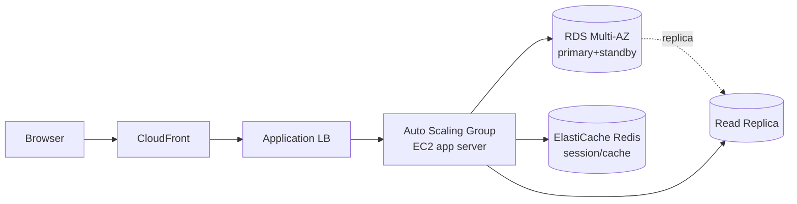
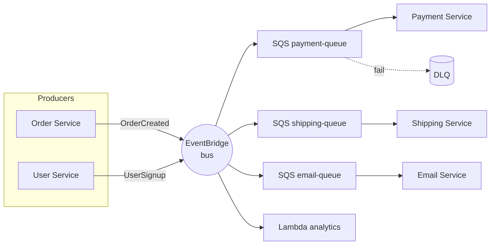

# Architecture patterns

There is no absolute "right" architecture: there are patterns that fit different contexts. Knowing them lets you choose consciously instead of reinventing. This section reviews the most-used patterns on AWS, when to apply them and their trade-offs.

## 1. Classic 3-tier

The "distributed monolith" pattern: **presentation / application / data**. 25+ years old, still very alive for enterprise apps.



Typical AWS stack: CloudFront → ALB → ASG of EC2 (Node/Java/.NET) → RDS Multi-AZ + Read Replica + ElastiCache. **Pros**: simple, easy debug. **Cons**: non-granular per-tier scaling, monolithic deploy.

## 2. Serverless web app

Modern pattern: zero servers to manage, pay-per-request cost, automatic scaling.

| Layer | Service |
|---|---|
| Static frontend | S3 + CloudFront (SPA React/Vue) |
| Auth | Cognito User Pool |
| API | API Gateway REST/HTTP |
| Business logic | Lambda (per endpoint or aggregated) |
| Database | DynamoDB (NoSQL key-value) |
| Search | OpenSearch Serverless |
| Image processing | Lambda + S3 trigger |

**Pros**: zero ops, instant scaling, cost-efficient below certain volumes. **Cons**: cold start, Lambda limits (15 min, 10 GB RAM), DynamoDB requires single-table modeling.

## 3. Event-driven

Services communicate via asynchronous **events** instead of synchronous calls. **EventBridge** is the central event bus; SNS/SQS cover pub-sub and queues.

Two styles:

- **Choreography**: each service reacts to events of interest, no coordinator. Simple but hard to debug (who did what?).
- **Orchestration**: a state machine (**Step Functions**) coordinates steps. More visible, cost per state transition.



Useful patterns:
- **Fan-out**: SNS → multiple SQS (each consumer has its queue).
- **Outbox**: write event to DynamoDB + stream → guarantee consistency between DB and published events.
- **Inbox**: dedupe incoming events via idempotent ID.

## 4. CQRS + Event Sourcing

**CQRS** (Command Query Responsibility Segregation): separates write (command) from read (query). **Event Sourcing**: the system-of-record is the event sequence, not current state.

AWS implementation:

- Write: API Gateway → Lambda → DynamoDB (append-only events).
- DynamoDB Streams → Kinesis Firehose → S3 (permanent audit log).
- Read: projections updated by Lambda (events → materialized view in Aurora or OpenSearch for complex queries).

Pros: free complete audit, time-travel, read scaling separate from write. Cons: complexity, eventual consistency, event schema migration is hard.

## 5. Microservices

Decompose the system into small services, each with its own DB and team. On AWS: **ECS Fargate** or **EKS** + **API Gateway** or **AWS App Mesh / Service Connect** + per-service DB.

Trade-off vs monolith:

| Aspect | Monolith | Microservices |
|---|---|---|
| Deploy | single | per service |
| Team scaling | bottleneck | independent |
| Latency | local, ns | network, ms |
| Debug | breakpoint | distributed tracing (X-Ray) |
| Consistency | DB transaction | saga + eventual |
| Infra cost | low | high (per-service overhead) |
| When | team < 20, small domain | team > 50, multiple domains |

**Modular monolith** is often the right choice for startups: modular code, single deploy; when the team grows, extract modules into services.

## 6. Saga pattern (distributed transactions)

In microservices you lose cross-service ACID transactions. A **saga** is a sequence of local transactions, each with its **compensating action** if it fails.

Implementation with **Step Functions**:

```yaml
StateMachine:
  StartAt: ReserveInventory
  States:
    ReserveInventory:
      Type: Task
      Resource: arn:aws:lambda:...:reserveInventory
      Catch:
        - ErrorEquals: ["States.ALL"]
          Next: FailOrder
      Next: ChargeCard
    ChargeCard:
      Type: Task
      Resource: arn:aws:lambda:...:chargeCard
      Catch:
        - ErrorEquals: ["States.ALL"]
          Next: ReleaseInventory  # compensating
      Next: ShipOrder
    ReleaseInventory:
      Type: Task
      Resource: arn:aws:lambda:...:releaseInventory
      Next: FailOrder
    ShipOrder: { Type: Task, End: true, ... }
    FailOrder: { Type: Fail }
```

## 7. Data mesh and other patterns

- **Data mesh**: each domain owns and publishes its own datasets as "data products" (with SLA, schema, governance). Lake Formation + Glue + cross-account sharing.
- **Throttling/backpressure**: API Gateway usage plans, SQS visibility timeout, Lambda reserved concurrency token bucket.
- **Bulkhead**: isolate resources per consumer (e.g. Lambda concurrency per tenant) to avoid noisy neighbor.
- **Circuit breaker**: caller stops requests to a failing service (App Mesh / client-side library).

## 8. Exercise

<details>
<summary>B2B SaaS startup, 5-dev team, MVP in 3 months. Which pattern?</summary>

**Modular serverless monolith**: API Gateway + 1 Lambda monorepo (Python/Node) well-structured into modules (auth, billing, core) + DynamoDB + Cognito. Single deploy, easy debug, automatic scaling, ~$0 cost at low volume.

**Don't** pick microservices: with 5 devs it would be huge overhead (network, deploy, tracing, observability) for zero benefit. Extract to microservices when the team exceeds 20-30 and modules start competing on code.
</details>

<details>
<summary>E-commerce: order needs inventory + payment + shipping. Sync or async?</summary>

**Async saga with Step Functions** (orchestration): API receives `POST /order`, writes order to DynamoDB with `PENDING` state, triggers Step Function that runs ReserveInventory → ChargeCard → ShipOrder, each with compensating action. Client polls or receives WebSocket update.

Pros: each step can retry, complete audit, manage timeouts. End-to-end sync (chained REST calls) is fragile: if shipping fails after charge, you have a payment without an order.
</details>

> **Summary**: 3-tier (ALB+EC2+RDS) for classic enterprise; serverless (S3+API GW+Lambda+DDB) for startup/event-driven; event-driven with EventBridge for loose coupling; CQRS+event sourcing for audit and read-scale; microservices only with large team and mature domain (prefer modular monolith first); saga with Step Functions for distributed transactions; resilience patterns (bulkhead, circuit breaker, throttling) are cross-cutting.
