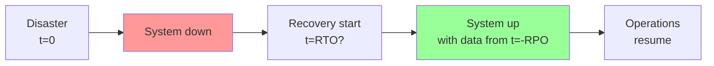
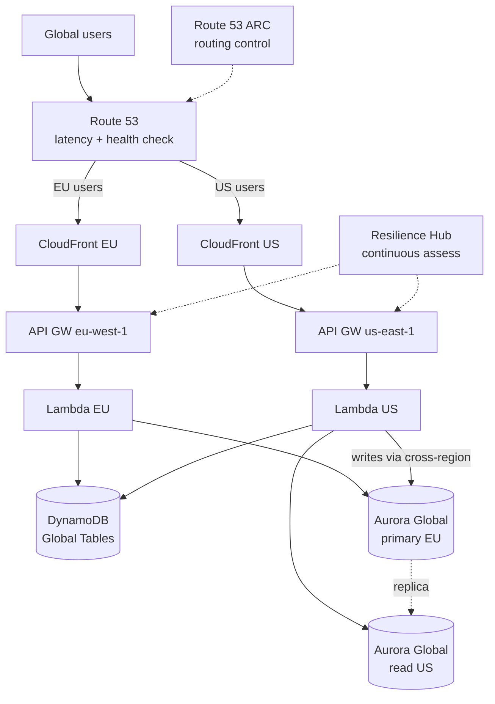

# Disaster Recovery and Multi-Region

A **Disaster Recovery (DR)** plan defines how to recover from a disaster: AWS region down, corrupted dataset, ransomware attack, single-vendor failure. The key question is not "if" it will happen, but "how much data do I lose" and "how long until I'm operational again".

## 1. RTO and RPO — the 2 metrics

- **RTO (Recovery Time Objective)**: max acceptable downtime. If RTO = 1h, the system must be restored within 1h of the disaster.
- **RPO (Recovery Point Objective)**: max acceptable data loss. If RPO = 5 min, I accept losing up to 5 min of transactions.

Example: a core bank has RPO=0 RTO=seconds (losing transactions is unacceptable). A blog with RPO=24h RTO=4h is fine. The more aggressive the goals, the higher the cost.

## 2. The 4 AWS DR strategies

| Strategy | RPO | RTO | Idle cost | When |
|---|---|---|---|---|
| **Backup & Restore** | hours-days | hours-days | very low | tier 3 apps, archives |
| **Pilot Light** | minutes | tens of min-hours | low | core off, data replicated |
| **Warm Standby** | seconds-min | minutes | medium | reduced infra always on |
| **Multi-site Active-Active** | near 0 | seconds | high (2x prod) | tier 0 critical |

### Backup & Restore

Regular snapshots (EBS, RDS) replicated cross-region. On DR you recreate infra (CloudFormation/Terraform) and restore. Cheap but high RTO (could take 1 day).

### Pilot Light

Infra "off" ready in the DR region: data continuously replicated (RDS cross-region snapshots, S3 CRR, DynamoDB Global), compute scaled to zero (ASG min=0). On DR: scale ASG, switch DNS. RTO 30-60 min.

### Warm Standby

Reduced version of the infra (e.g. 1 EC2 instead of 10) always running in the DR region. On DR: scale up and switch. RTO 5-15 min.

### Multi-site Active-Active

Traffic distributed across 2+ regions (Route 53 latency-based or geo). Each region serves everything. On DR: Route 53 health check removes the down region. RTO seconds. Cost: 2x and you must solve consistency.

## 3. AWS Elastic Disaster Recovery (DRS)

Managed service that performs **block-level replication** of servers (on-prem or cloud) to AWS. Continuous replication, RPO seconds. On DR: launch EC2 instances from the replica, RTO ~10 min.

Use case: lift-and-shift DR, physical DC migration, hybrid. Replaces CloudEndure (acquired 2019).

## 4. Cross-region database replication

| Service | Mechanism | RPO |
|---|---|---|
| **Aurora Global Database** | dedicated physical log shipping | < 1 sec, RTO < 1 min |
| **DynamoDB Global Tables** | multi-master, every region read+write | seconds (eventual consistency) |
| **RDS cross-region read replica** | async replication | seconds-minutes |
| **S3 CRR** (Cross-Region Replication) | async object copy | seconds-minutes |
| **EBS snapshot cross-region** | copied snapshots | hours (manual or EventBridge) |
| **ElastiCache Global Datastore** | Redis cross-region | < 1 sec |

Aurora Global is the gold standard for multi-region relational DBs: on DR the secondary can be promoted to primary in < 1 min with one API call.

## 5. Route 53 failover and routing policy

Route 53 implements **DNS failover** with health checks:

- **Failover routing**: primary active, secondary activated only if primary health check fails.
- **Latency-based**: client goes to the lowest-latency region.
- **Geolocation**: routing by country/continent (EU vs US compliance).
- **Weighted**: A/B testing or cross-region canary.
- **Multivalue answer**: returns up to 8 IPs, client-side load balancing.

Health check: HTTP/HTTPS/TCP endpoint, configurable threshold, CloudWatch alarm trigger.

**Route 53 Application Recovery Controller (ARC)**: for critical Active-Active, manual **routing control** (DR switch via atomic guaranteed API, not waiting on DNS TTL) + continuous **readiness checks** (verify the DR region is actually capable of serving).

## 6. Multi-region Active-Active architecture

## 7. Consistency challenges (CAP)

Multi-region active-active surfaces problems that single-region does not:

- **CAP theorem**: in case of partition between regions you choose between Consistency and Availability. AWS managed services pick A (DynamoDB Global, S3) → eventual consistency.
- **Last-writer-wins**: DynamoDB Global uses timestamps, last write wins. If two regions write the same item in the same window, you lose one.
- **Conflict resolution**: patterns like CRDT (counter), vector clock, or "all writes go to one region" (write follows reader).
- **Clock skew**: timestamps are not perfect across regions; NTP is not enough for global ordering. Use logical clock or coordination layer (DynamoDB conditional writes).

Rule of thumb: if you need **strong-consistent global transactions**, multi-region is hard and you probably must accept RTO > 0 (active-passive with Aurora Global).

## 8. Gameday and AWS Resilience Hub

**Gameday**: planned exercise where the team simulates a disaster (e.g. terminates the primary region, induces faults with **Fault Injection Service**) and verifies actual RTO/RPO. Best practice: at least 1-2 gamedays/year for critical workloads.

**AWS Resilience Hub**: tool that ingests CloudFormation/Terraform/CDK, computes target vs actual RTO/RPO, suggests improvements, integrates with FIS for automated tests. Free for the first 5 workloads.

## 9. Exercise

E-commerce with RTO=15 min, RPO=1 min. Which strategy?

**Warm Standby**: reduced infra always on in the DR region (1 small EC2, ASG min=1) + Aurora Global Database (RPO < 1s, RTO < 1min) + DynamoDB Global Tables + S3 CRR + Route 53 failover.

On DR (e.g. primary region down): Route 53 health check fails, traffic shifts to DR. ASG scales from 1 to N. Aurora secondary promoted primary via API. Total time: 5-10 min, within RTO.

Cost: ~20-30% more than primary alone, acceptable for a critical app. Multi-site active-active would be overkill (doubles cost to gain ~10 min RTO).

You have a legacy on-prem app. You want DR on AWS without rebuilding anything.

**AWS Elastic Disaster Recovery (DRS)**: install the DRS agent on every server (Windows/Linux), continuous block-level replication to AWS. RPO seconds.

On DR: from the DRS console you launch "recovery", the service spins up EC2 instances from the replica with same IP/config in a few minutes. RTO ~10 min.

Cost: you pay only the staging storage (EBS) + low per-server replication cost. Zero idle compute cost. When back to normal, failback to on-prem or keep living on AWS (de facto migration).

> **Summary**: RTO/RPO define objectives; 4 DR strategies (Backup-Restore < Pilot Light < Warm Standby < Multi-site, increasing cost decreasing RTO); Aurora Global + DynamoDB Global Tables + S3 CRR + Route 53 failover are the building blocks; multi-site active-active requires consistency handling (CAP, last-writer-wins); DRS for lift-and-shift; Resilience Hub + gameday + FIS for testing; an untested DR is a fake DR.
