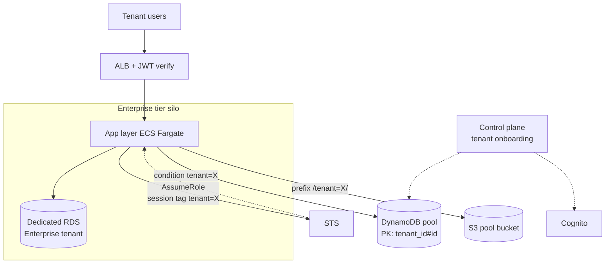
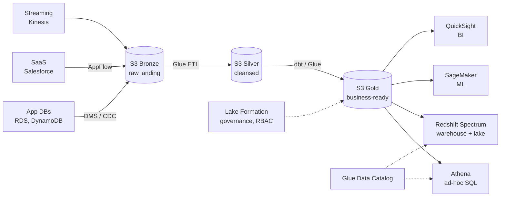

# Real-world reference architectures

**Reference architectures** are tested blueprints for recurring scenarios. AWS publishes dozens of free "AWS Solutions" (ready-to-deploy CloudFormation). This section covers the most-requested patterns, with services and trade-offs.

## 1. Multi-tenant SaaS

Three **tenant isolation** models:

| Model | Isolation | Cost | Example |
|---|---|---|---|
| **Silo** | per-tenant dedicated resources (separate account/VPC/DB) | high | banks, healthcare, dedicated enterprise |
| **Pool** | shared resources, tenants separated at app level (tenant_id key) | low | B2C SaaS, freemium |
| **Hybrid / Bridge** | mix: pool compute, silo DB for premium tier | medium | enterprise tier + free on same stack |

Pool isolation techniques:

- **IAM session tag**: assume role with tag `tenant=abc`, IAM policy references `${aws:PrincipalTag/tenant}` to limit access to DynamoDB items/S3 prefix.
- **Cell-based architecture**: groups of tenants in independent "cells" (e.g. 1000 tenants/cell). Limited blast radius, progressive cell-by-cell deploy.
- **Cognito user pool per tenant** or single pool with custom attribute.



## 2. IoT platform

Standard stack to manage device fleets:

- **AWS IoT Core**: managed MQTT broker, X.509 device auth, rules engine.
- **Greengrass**: edge runtime for local processing (latency < 100ms, offline).
- **IoT SiteWise**: time-series for industrial assets (OPC-UA, modbus).
- **Kinesis Data Streams + Firehose**: high-throughput ingestion, dumps to S3.
- **Timestream**: time-series DB for IoT analytics.
- **QuickSight / Grafana**: dashboards.

Pattern: device → MQTT IoT Core → Rules Engine → (Kinesis for analytics + Lambda for real-time alert + DynamoDB for shadow state). For OTA use Device Management.

## 3. Data platform / Lakehouse

"Modern data stack" architecture on AWS:



Medallion architecture (Bronze → Silver → Gold) + Lake Formation for row-level security and cross-account sharing. "Data mesh" pattern if multiple teams/domains.

## 4. Media streaming

Live broadcast (e.g. sports, events):

- **MediaLive**: live encoder (input RTMP/SRT, output HLS/DASH).
- **MediaPackage**: just-in-time packaging (DRM, SCTE-35 ad insertion).
- **MediaConnect**: secure contribution transport (replaces satellite).
- **MediaConvert**: file-based VoD transcoding.
- **CloudFront**: global CDN delivery.

Architecture: camera → MediaConnect (contribution) → MediaLive (encode) → MediaPackage (multi-bitrate HLS/DASH) → CloudFront → player.

## 5. E-commerce

Typical stack:

| Component | Service |
|---|---|
| Product catalog | DynamoDB (PK product_id, GSI by category) |
| Search | OpenSearch (BM25 + vector for "find similar") |
| Cart | ElastiCache Redis (TTL 24h, fast read) |
| Checkout | Step Functions (saga: inventory→payment→shipping) |
| Payments | Lambda + Stripe/Adyen + KMS for PCI tokenization |
| Notifications | SNS (email) + Pinpoint (mobile push) |
| Frontend | Next.js on Amplify Hosting or S3+CloudFront |
| Recommendation | Personalize or custom SageMaker |
| Analytics | Kinesis → S3 → Athena/QuickSight |

Trick: aggressive product caching on CloudFront (TTL 1h with cache invalidation on update via SQS), DynamoDB for orders/writes, OpenSearch for complex queries.

## 6. Gaming backend

- **GameLift FleetIQ / Anywhere**: matchmaking + managed game servers (spot pricing -75%).
- **DynamoDB**: player profiles, leaderboard (atomic score).
- **Lambda + API Gateway**: meta-game API (inventory, achievement).
- **AppSync GraphQL Subscriptions**: real-time chat / lobby update.
- **Kinesis + Personalize**: live analytics and in-game recommendations.

For global leaderboard: DynamoDB with score sort key + Redis sorted set cache for top 100 (sub-ms reads).

## 7. HPC (High Performance Computing)

For scientific simulation, CFD, finance:

- **AWS ParallelCluster**: open-source tool to orchestrate Slurm/PBS clusters on EC2.
- **EFA (Elastic Fabric Adapter)**: custom NIC for MPI/NCCL kernel bypass, μs latency.
- **FSx for Lustre**: POSIX parallel filesystem, TB/s throughput, integrated with S3 (sync on read/write).
- **Spot instances + capacity reservation**: 70-90% cost reduction for batch jobs.
- **Batch / Step Functions**: orchestrate DAG jobs.

## 8. Serverless data pipeline

For small batches or events:

```python
# CDK pseudocode
bucket = s3.Bucket("data-landing")
bucket.add_event_notification(
    s3.EventType.OBJECT_CREATED,
    eventbridge.EventBridgeDestination(rule_to_lambda)
)
# Lambda does validation/enrichment, writes to S3 processed
# Glue crawler updates Data Catalog
# Athena query, QuickSight dashboard
```

S3 → EventBridge → Lambda (transform) → S3 → Glue (catalog) → Athena. Cost: a few $/month per TB for sporadic access.

## 9. Exercise

<details>
<summary>IoT smart-home startup, 50k devices, telemetry every 30s. Architecture?</summary>

**Ingestion**: device → MQTT to IoT Core (X.509 auth). Rules Engine: 1 rule writes "shadow" (current state for mobile UI) to DynamoDB, 1 rule writes to Kinesis Data Streams for analytics.

**Analytics**: Kinesis Firehose → S3 Bronze (parquet) + Lambda for real-time anomaly detection (e.g. abnormal consumption) → SNS push notification to user.

**Mobile app backend**: API Gateway + Lambda + DynamoDB (shadow). Cognito for user auth.

**Cost-saving**: 50k * 2/min = 100k msg/min = ~$200/month IoT Core + $50 Kinesis + $20 S3 storage. No EC2.
</details>

<details>
<summary>B2B SaaS selling to small banks (10-100 users per tenant). Silo or pool?</summary>

**Pragmatic hybrid**: single AWS account, but for each bank tenant create a dedicated VPC + RDS (silo data) and a shared ECS Fargate cluster (pool compute) with task role assumed with session tag `tenant=X`.

Reason: banks often require data isolation for audit (mandatory silo DB), but shared compute cuts cost (one ECS cluster manages 100 tenants). Cognito user pool per tenant (URL `bank-x.yourapp.com`) or single pool with custom attribute.

New tenant onboarding: Step Functions automates creation of VPC + RDS + Secrets Manager secret + Route 53 record in ~10 min.
</details>

> **Summary**: multi-tenant SaaS pick silo/pool/hybrid based on compliance and cost, IAM session tag + cell-based; IoT = IoT Core + Greengrass + Kinesis + Timestream; lakehouse = Bronze/Silver/Gold on S3 + Glue + Lake Formation + Athena/Redshift; media = MediaLive/Package + CloudFront; e-commerce = DynamoDB+OpenSearch+Redis+Step Functions; gaming = GameLift + DynamoDB; HPC = ParallelCluster + EFA + FSx Lustre + Spot; serverless data pipeline = S3+EventBridge+Lambda+Glue+Athena.
