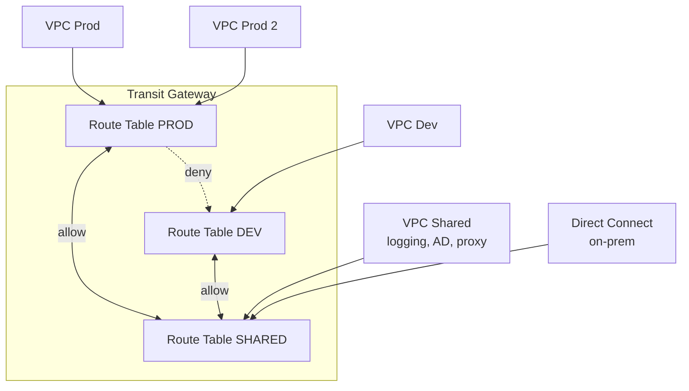

# Advanced networking deep dive

Once you understand VPC, subnets, NAT and VPC peering, AWS networking opens up to enterprise network engineer territory: BGP, TGW segmentation, multi-region managed backbones, zero-trust app access. This section covers the tools you need when a company grows beyond a single VPC.

## 1. BGP fundamentals

**BGP** (Border Gateway Protocol) makes the Internet work — and also AWS connections to on-prem (Direct Connect, Site-to-Site VPN, Transit Gateway Connect).

Key AWS concepts:

- **AS (Autonomous System) number**: identifies a "network" (AWS has its own ASNs; your Direct Connect has one, default private 64512).
- **AS-PATH**: list of traversed ASes; shorter = preferred.
- **Local preference**: internal priority; higher = preferred outgoing.
- **MED (Multi-Exit Discriminator)**: tells the peer which entry to prefer; lower = preferred.
- **Communities**: tags that enable custom policy (AWS supports standard communities to influence path).

Use case: route 2 Direct Connect links active-active. You manipulate AS-PATH prepending on the backup to make it less preferred; primary carries traffic, backup takes over if primary fails (BGP failover in 30-180s).

## 2. Transit Gateway route table design

TGW supports **multiple route tables** that enable **network segmentation** in logical firewall style. Typical "shared services / prod / dev" pattern:

Each VPC is "associated" to 1 route table (used for outbound routing) and "propagates" to 0-N route tables (who sees its routes). So Prod and Dev are isolated but both reach Shared (AD, logging, proxy).

## 3. TGW Connect and SD-WAN

**TGW Connect** is a GRE-based virtual attachment that lets you terminate SD-WAN appliances (Cisco SD-WAN, Aruba, Fortinet, Versa) directly on TGW, with BGP peering on the GRE tunnel. Advantages over classic VPN:

- **Throughput**: 5 Gbps per attachment vs 1.25 Gbps VPN.
- **Native BGP**: SD-WAN announces on-prem subnets via BGP, no static route hell.
- **Multipath**: automatic ECMP.

## 4. Cloud WAN — managed backbone

**AWS Cloud WAN** (GA 2022) is a managed global backbone that abstracts multi-region TGW. You configure a **core network** with JSON policy (segments, attachments, sharing) and AWS handles TGW peering, routes, path optimization.

| Component | Function |
|---|---|
| **Global network** | logical container |
| **Core network** | actual backbone, multi-region |
| **Segment** | logical partition (prod, dev, shared), policy-defined |
| **Attachment** | VPC, VPN, Connect, TGW attach |

Use case: enterprise with 30 VPCs in 8 regions, wants segmented any-to-any connectivity without managing 30 TGWs + 100 peerings.

## 5. AWS Network Firewall

Managed stateful network firewall, based on **Suricata** (open-source IDS/IPS). Placed in a dedicated subnet, inspects inter-VPC traffic, ingress/egress, intra-VPC.

Capabilities:

- **Stateful**: track TCP connections, "established/related" rules.
- **Suricata rules**: ~50k community rules (ET Open) + custom.
- **TLS inspection**: decrypt and inspect HTTPS (requires private CA).
- **Domain filter**: blacklist/whitelist FQDNs for egress.

Pattern: all VPC egress goes through Network Firewall to block data exfiltration, IDS active for detection.

## 6. Multi-account VPC sharing (RAM)

**AWS RAM (Resource Access Manager)** lets you share cross-account resources. For networking:

- **Subnet sharing**: "network" account owns the VPC, shares subnets with "app" account. App accounts launch EC2/RDS/Lambda in the shared subnet without seeing the VPC owner. Recommended pattern in **AWS Control Tower / Landing Zone**.
- **TGW sharing**: TGW in network account, app accounts attach their VPC.
- **License Manager / Route 53 Resolver rules**: shared via RAM.

Advantage: centralized networking, VPC cost and management on 1 account, autonomous business units.

## 7. Performance: jumbo frames, ENA Express, EFA

| Technology | Advantage | Use case |
|---|---|---|
| **Jumbo frames** (MTU 9001) | less overhead, +throughput | intra-VPC, EFS, S3 same-region. Internet/VPN: 1500 |
| **ENA Express** | TCP enhancement, lower p99 latency | EC2 nitro, automatic |
| **EFA (Elastic Fabric Adapter)** | OS-bypass network, μs latency | HPC, MPI, distributed ML training |
| **Cluster placement group** | physically close EC2s in 1 AZ | low latency + high throughput |

EFA is essential for LLM/HPC training: bypasses kernel, accesses HW directly via libfabric. Available on p4/p5, c5n, hpc7a instances.

## 8. PrivateLink for SaaS

**PrivateLink** is not just for AWS VPC endpoints: SaaS vendors can publish their service as an "endpoint service", and customers access via private VPC endpoint (no internet, no peering).

Architecture: SaaS deploys NLB in front of the service, exposes it as endpoint service, shares with customer account. Customer creates VPC endpoint pointing to the service. All traffic flows inside AWS network. Snowflake, Databricks, Datadog, Stripe use PrivateLink.

## 9. Verified Access — zero-trust

**AWS Verified Access** (GA 2023) eliminates the VPN for non-HTTP corporate apps. Identity provider (Okta, Entra ID, IAM Identity Center) + device trust (Jamf, CrowdStrike) verified for each request. Cedar policies (AWS language) decide access.

Pattern: employees access SSH bastion, Windows RDP, internal apps — no VPN, from any network, always authenticated per request.

## 10. Exercise

Enterprise with 5 regions, 40 VPCs, on-prem datacenter. Which topology?

**Cloud WAN + Direct Connect**: 1 global core network, 3 segments (prod, dev, shared-services), policy allows prod↔shared and dev↔shared, blocks prod↔dev.

On-prem: **2 Direct Connect** in 2 distinct locations (for physical HA) terminated on TGW Connect via SD-WAN appliance, active-active BGP with AS-PATH prepending to influence path.

Shared VPC hosts: Network Firewall (egress filter), Route 53 Resolver inbound endpoint (hybrid DNS), AD domain controller.

40 VPCs attached to Cloud WAN via RAM share. Cost: ~$500/month Cloud WAN + DX ~$1000-3000/month. Tradeoff vs manual TGW: less operations, more cost per attachment.

You need to connect VPC to Snowflake service without internet traffic. How?

**PrivateLink endpoint**: Snowflake offers PrivateLink (on Business Critical+ tier). From Snowflake console get the service name (e.g. `com.amazonaws.vpce.us-east-1.vpce-svc-xxx`).

Create VPC interface endpoint in private subnets: `aws ec2 create-vpc-endpoint --vpc-id vpc-xxx --service-name com.amazonaws.vpce... --vpc-endpoint-type Interface --subnet-ids ...`. Add SG allowing 443 from your app.

Configure Route 53 private hosted zone to resolve `xyz.snowflakecomputing.com` to the endpoint DNS name. From this point all Snowflake queries travel inside AWS backbone, no internet, ~10-20ms latency.

> **Summary**: BGP governs dynamic routing to on-prem (AS-PATH, local pref, MED); TGW with multiple route tables for prod/dev/shared segmentation; TGW Connect + SD-WAN for multipath BGP; Cloud WAN for managed multi-region backbone; Network Firewall (stateful Suricata) for inspection and egress filter; RAM share for VPC/subnet/TGW multi-account; EFA for HPC/MPI; PrivateLink as SaaS integration pattern; Verified Access for non-HTTP zero-trust apps; Route 53 ARC for critical atomic failover.
