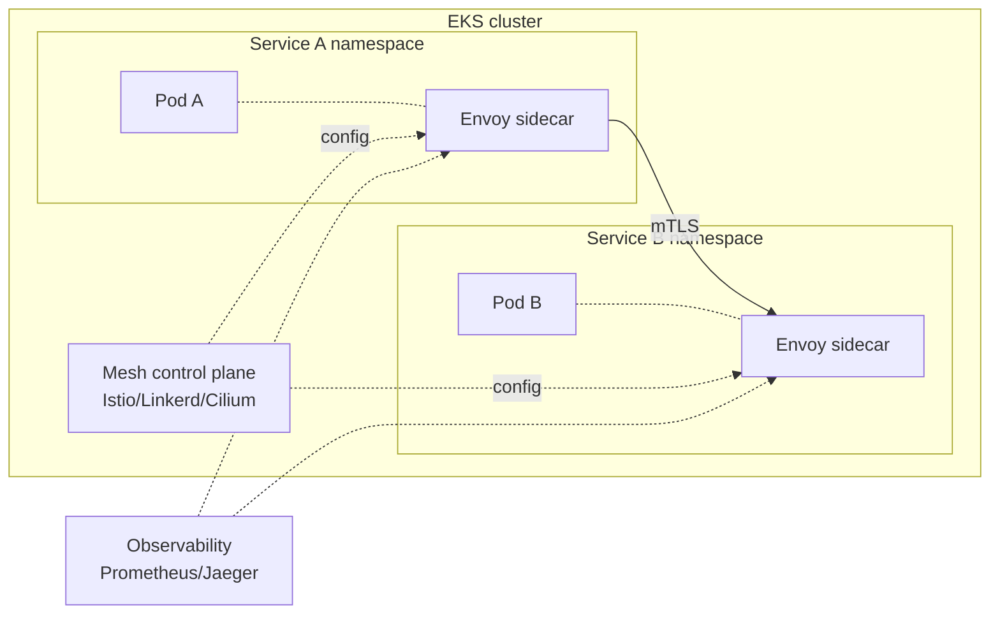

# Containers deep dive

Section for those going beyond "deploy a pod on EKS". We look at how the control plane really works, how to manage the data plane cost-effectively with Karpenter, CNI networking, modern service mesh (post-App Mesh) and GitOps patterns in production.

## 1. EKS — architecture

EKS is managed Kubernetes: AWS runs the **control plane** (API server, etcd, scheduler, controller manager) in an AWS-owned VPC, replicated in 3 AZs with 99.95% SLA. You pay $0.10/h (~$73/month) per cluster.

The **data plane** (where pods run) is yours, with 3 options:

| Option | What you manage | When |
|---|---|---|
| **Self-managed node group** | everything (AMI, scaling, patching) | full control, rare today |
| **Managed node group** | AWS manages ASG, drain, patching | classic default |
| **Fargate** | no nodes, pods on dedicated VM | small/medium pods, serverless |
| **EKS Auto Mode** (2024) | AWS manages nodes + addons + scaling end-to-end | new gold standard |

**EKS Auto Mode** (launched re:Invent 2024) is the most important addition: AWS installs Karpenter, AWS LB Controller, VPC CNI, EBS CSI, GuardDuty agent as "managed addons", picks instance types automatically. Cost ~12% premium per node, but eliminates ops.

## 2. Karpenter — next-gen autoscaler

**Karpenter** (open source, AWS-developed) replaces the older Cluster Autoscaler. Differences:

- **No rigid node group**: Karpenter picks the best instance type for pending pods (e.g. need 4 CPU/16GB → launches `m6i.xlarge` or `c6i.xlarge` or equivalent spot).
- **Fast**: scale-up in ~30s vs 2-5 min Cluster Autoscaler.
- **Consolidation**: moves pods and terminates underutilized nodes to optimize cost.
- **Spot first-class**: picks spot when possible, fallback on-demand on interruption.

```yaml
apiVersion: karpenter.sh/v1
kind: NodePool
metadata:
  name: default
spec:
  template:
    spec:
      requirements:
        - key: karpenter.sh/capacity-type
          operator: In
          values: ["spot", "on-demand"]
        - key: kubernetes.io/arch
          operator: In
          values: ["amd64", "arm64"]
        - key: karpenter.k8s.aws/instance-family
          operator: In
          values: ["m6i", "m7i", "m6g", "m7g", "c6i"]
  disruption:
    consolidationPolicy: WhenEmptyOrUnderutilized
    consolidateAfter: 30s
  limits:
    cpu: 1000
```

## 3. IAM for pods — IRSA and Pod Identity

Pods need AWS credentials to call DynamoDB/S3/SQS. Two mechanisms:

- **IRSA (IAM Roles for Service Accounts)**: pod assumes IAM role via cluster OIDC. Setup: 1 OIDC provider per cluster, annotation `eks.amazonaws.com/role-arn` on the ServiceAccount, role trust policy references OIDC.
- **EKS Pod Identity** (2023): new mechanism without OIDC, managed via `eks-pod-identity-agent` addon. Simpler (no OIDC setup), supports cross-account natively. **Preferred for new clusters**.

Both give the pod temporary credentials via SDK without storing access keys.

## 4. Networking — VPC CNI vs Calico vs Cilium

| CNI | Feature | When |
|---|---|---|
| **AWS VPC CNI** (default) | each pod gets a VPC IP, ENI secondary IP | EKS default, native SG integration |
| **Calico** | VXLAN overlay, advanced network policy | fine NetworkPolicy, VPC IP exhaustion |
| **Cilium** | eBPF-based, network + observability + service mesh | next-gen, performance, Hubble UI |

VPC CNI gives native performance (no overlay) but consumes many VPC IPs (one pod = one IP). For large clusters enable **prefix delegation** (each ENI gets a /28 = 16 IPs), ~16x density boost.

## 5. Ingress and Load Balancer Controller

**AWS Load Balancer Controller** (formerly ALB Ingress Controller) provisions ALB/NLB for K8s Service and Ingress:

- `Ingress` with annotation `kubernetes.io/ingress.class: alb` → creates ALB with IP target group.
- `Service type: LoadBalancer` with `service.beta.kubernetes.io/aws-load-balancer-type: external` → creates NLB.
- Supports target group binding (cross-namespace), pod readiness gate, WAF integration.

## 6. Service mesh — post App Mesh

**AWS App Mesh** was announced for deprecation in September 2024 (end-of-support 2026). Modern alternatives:



- **Istio**: feature-complete, complex; de-facto enterprise standard.
- **Linkerd**: minimal, Rust-based, easy install.
- **Cilium Service Mesh**: eBPF, no Envoy sidecar (sidecarless), lower overhead.

All offer: automatic mTLS, traffic splitting (canary/blue-green), retry/timeout policy, distributed observability.

## 7. GitOps with ArgoCD/Flux

GitOps = cluster state defined in Git, controllers pull and apply. On EKS:

- **ArgoCD**: rich UI, multi-cluster, ApplicationSet for mass generation, popular in enterprise.
- **Flux**: CLI-first, lighter, modular GitOps Toolkit.

Pattern: `infra/` repo contains Helm chart/Kustomize/raw YAML, ArgoCD `Application` syncs every 3 min. PR = deploy. Rollback = git revert.

Helm vs Kustomize: **Helm** is rich templating (reusable charts, values per env); **Kustomize** is patch overlay without templating (simpler, no Go DSL).

## 8. Scaling patterns

| Type | Scales | Trigger |
|---|---|---|
| **HPA** (Horizontal Pod Autoscaler) | number of pods | CPU/memory/custom metric |
| **VPA** (Vertical Pod Autoscaler) | pod resource requests | historical usage |
| **KEDA** | pod count (even to 0) | event-driven (SQS depth, Kafka lag, etc.) |
| **Karpenter** | number of nodes | pending pods |

Typical combo: HPA manages app replicas on CPU, KEDA manages workers on SQS length, Karpenter adds/removes nodes. VPA used less (requires pod restart).

## 9. Security and EKS-D / EKS Anywhere

- **Pod Security Standard** (privileged/baseline/restricted): namespace label, K8s rejects violating pods.
- **OPA Gatekeeper / Kyverno**: policy-as-code (e.g. "forbid images not from company ECR").
- **GuardDuty EKS Protection**: monitors K8s audit logs + runtime monitoring (eBPF) for malware/crypto-mining detection.
- **EKS Distro (EKS-D)**: same K8s distribution as EKS, open source, for on-prem use.
- **EKS Anywhere**: EKS-D + tooling for on-prem management (bare metal, vSphere). Paid subscription.

## 10. Upgrade strategy

Kubernetes releases 3 minors/year. EKS supports 4 versions in standard (+ 12 months **Extended Support** at extra cost). Pattern:

1. Test in dev/staging cluster first.
2. Upgrade control plane via console/Terraform.
3. Upgrade managed node group (drain + rolling).
4. Verify API deprecation (`kubectl convert`, `pluto`).

## 11. Exercise

<details>
<summary>Cluster with 200 microservices, high node cost, devs frustrated by slow scale. What do you do?</summary>

1. **Migrate to Karpenter** from Cluster Autoscaler: 30s vs 5 min scale, picks spot automatically, consolidates underutilized nodes. 30-60% compute savings, drastically faster scaling.
2. **Enable Graviton (ARM)** in NodePool requirements: add `m7g` and `c7g` to the pool, build multi-arch containers. ~20% discount on compatible workloads.
3. **Pod Disruption Budget** for critical services (prevents Karpenter consolidation from breaking availability).
4. **Spot ratio**: 70% spot for stateless workers, 30% on-demand for critical APIs.

Typical result: -40% compute bill, scale latency from 5min to 30s.
</details>

<details>
<summary>App in pod must write to DynamoDB. How do you grant permissions without access keys?</summary>

**EKS Pod Identity** (preferred for new clusters):

1. Install `eks-pod-identity-agent` addon (Auto Mode includes it).
2. Create IAM role `app-dynamodb-role` with required DynamoDB policy, trust policy `pods.eks.amazonaws.com`.
3. Create ServiceAccount `app-sa` in namespace.
4. Create `PodIdentityAssociation`: `aws eks create-pod-identity-association --cluster-name X --namespace Y --service-account app-sa --role-arn arn:aws:iam::...:role/app-dynamodb-role`.
5. In pod spec: `serviceAccountName: app-sa`.

boto3 SDK/AWS SDK gets credentials automatically from `AWS_CONTAINER_CREDENTIALS_FULL_URI`. No OIDC IRSA, simpler.
</details>

> **Summary**: EKS managed control plane + data plane (managed node group / Fargate / Auto Mode); Karpenter replaces Cluster Autoscaler with 30s scale and spot first-class; Pod Identity preferred over IRSA for new clusters; native VPC CNI (with prefix delegation for scale), Calico/Cilium for network policy; AWS LB Controller for ALB/NLB; App Mesh deprecated, pick Istio/Linkerd/Cilium; GitOps with ArgoCD/Flux + Helm or Kustomize; HPA+KEDA+Karpenter scaling; pod security standard + OPA + GuardDuty for security; EKS-D for on-prem.
