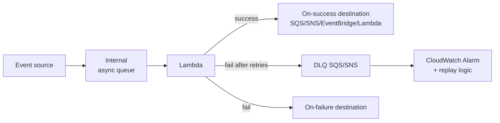

# Serverless patterns deep dive

Serverless is easy to start (1 Lambda + 1 trigger) but production requires specific patterns to handle cold start, idempotency, backpressure, distributed transactions. This section gathers patterns that save systems at scale.

## 1. Cold start — strategies

Lambda performs a cold start (~100ms-3s) when it must instantiate a new worker. Mitigation:

| Technique | Reduction | Cost |
|---|---|---|
| **Memory bump** (2-3 GB) | -30-50% (more CPU = faster init) | linearly more expensive |
| **Lambda SnapStart** (Java/Python/.NET) | -90% (pre-cached init snapshot) | free but versioning required |
| **Provisioned concurrency** | ~0 cold start | $$ (you pay for idle too) |
| **Smaller runtime** (Rust, Go, Node) | -50% (vs Java/Python big deps) | code refactor |
| **Lambda Layer + minimal dependency** | -20% | refactor |
| **Avoid VPC unless needed** | -200-500ms historical (Hyperplane fixed much) | architecture |

2026 best practice: SnapStart for JVM/Python, native runtimes (Rust/Go) for latency-critical, provisioned concurrency only for user-facing APIs with tight SLA.

## 2. Idempotency

Lambda has **at-least-once delivery** (SQS, SNS, EventBridge, S3 trigger): the same event can arrive 2+ times. Without idempotency = double charge, double order.

Pattern: **DynamoDB conditional write** with idempotency-ID key:

```python
import hashlib
from aws_lambda_powertools.utilities.idempotency import idempotent, DynamoDBPersistenceLayer

persistence = DynamoDBPersistenceLayer(table_name="idempotency-store")

@idempotent(persistence_store=persistence)
def lambda_handler(event, context):
    # Powertools automatic dedupe via event hash
    order_id = process_payment(event["order"])
    return {"order_id": order_id}
```

**Lambda Powertools** (Python/Java/TypeScript/.NET) includes an `@idempotent` decorator that does lock+TTL on DynamoDB automatically.

## 3. Async invocation pattern

Async Lambda (invoked by SNS/EventBridge/S3 or `InvocationType=Event`) has a dedicated lifecycle:



- **Retry**: 2 default async retries (configurable 0-2), exponential backoff.
- **Destination**: better than DLQ — sends metadata + result to SQS/SNS/EventBridge/Lambda for both success and failure.
- **DLQ**: SQS/SNS for messages failed after retry. Always configure.
- **Event source mapping** (SQS/Kinesis/DDB Stream/Kafka): batch, parallel, separate error handling (`ReportBatchItemFailures`).

## 4. EventBridge Pipes

EventBridge Pipes (2023) connects 1 source → 1 target with optional filter/transform/enrich, **without Lambda glue**. Example: DynamoDB Stream → filter only `INSERT` → enrich with Lambda → EventBridge bus.

Saves: no Lambda to "route" events, less cold start and code.

## 5. Transactional outbox

Problem: you write to DynamoDB + publish event to EventBridge. If the second fails after the first, the system is inconsistent.

**Outbox** solution: write only to DynamoDB (atomic), DynamoDB Streams trigger Lambda that publishes to EventBridge. Atomicity guaranteed by the DB.

## 6. Scatter-gather, fan-out, fan-in

**Scatter-gather**: send N tasks in parallel, aggregate results.

```yaml
# Step Functions Map
{
  "StartAt": "FanOut",
  "States": {
    "FanOut": {
      "Type": "Map",
      "ItemsPath": "$.tasks",
      "MaxConcurrency": 100,
      "Iterator": {
        "StartAt": "ProcessTask",
        "States": {
          "ProcessTask": { "Type": "Task", "Resource": "arn:...lambda...", "End": true }
        }
      },
      "ResultPath": "$.results",
      "Next": "Aggregate"
    },
    "Aggregate": { "Type": "Task", "Resource": "arn:...aggregator...", "End": true }
  }
}
```

**Step Functions Distributed Map** (2022) scales to 10k+ parallel executions reading from an S3 manifest — perfect for processing millions of files (e.g. data lake ETL).

Classic **fan-out**: SNS → multiple SQS, each consumer has its queue. **Fan-in**: multiple SQS → 1 aggregator Lambda (rare, usually done elsewhere).

## 7. Choreography vs orchestration

| Aspect | Choreography (EventBridge) | Orchestration (Step Functions) |
|---|---|---|
| Coordinator | none | central state machine |
| Visibility | hard tracing | native graph + history |
| Coupling | loose | medium (logic in state machine) |
| Cost | $1/M event | $25/M state transition (Standard), $0.000001/transition (Express) |
| Best for | event broadcasting, loose microservices | linear workflow with compensation |

Trick: Step Functions **Express** is 1000x cheaper than Standard for short workflows (< 5 min), but no detailed history. Use Express for ETL and mass processing, Standard for business workflows with audit.

## 8. Throttling, backpressure, bulkhead

- **Reserved concurrency** for Lambda: fixed throttle at N (e.g. 100), prevents draining account concurrency.
- **Provisioned concurrency**: also pre-warm.
- **SQS visibility timeout** + **maxReceiveCount**: implicit retry, DLQ after threshold.
- **API Gateway usage plan**: rate limit per API key, burst.
- **AppSync caching + DDB throttling**: GraphQL doesn't explode the DB.

Bulkhead pattern: Lambda with reserved concurrency per tenant prevents noisy neighbor.

## 9. API Gateway HTTP vs REST vs WebSocket vs AppSync

| Service | When |
|---|---|
| **API Gateway REST** | feature complete: usage plan, API key, request validation, custom authorizer, WAF |
| **API Gateway HTTP** | 70% cheaper, lower latency, no request validation/usage plan |
| **API Gateway WebSocket** | chat, server-side real-time push |
| **AppSync GraphQL** | mobile/web with GraphQL schema, real-time subscriptions, DDB/Aurora/Lambda resolvers |

2026 default: **HTTP API** if you don't need advanced REST features (3.5x cheaper). AppSync if you prefer GraphQL schema or need real-time subscriptions.

## 10. Anti-patterns

- **Monolithic Lambda** (`lambda-monorepo` with 100 endpoints in 1 handler): indiscriminate scaling, slow deploy, huge blast radius. Better 1 Lambda per domain or per endpoint.
- **Sync chain of Lambdas**: API GW → Lambda A → invoke Lambda B → invoke Lambda C. Cumulative latency, double cost (you pay B while A waits). Use Step Functions or async event.
- **Lambda in VPC without need**: with Hyperplane the 10s cold start issue is solved, but still + complexity (ENI, IP exhaustion). Only if you need RDS/ElastiCache.
- **No Powertools**: re-implementing structured logging, X-Ray tracing, idempotency, metrics... it covers everything for free.

## 11. Exercise

<details>
<summary>Serverless API with 10k RPS spikes and p99 SLA < 200ms. Architecture?</summary>

1. **API Gateway HTTP** (not REST: lower latency, 70% cheaper).
2. **Lambda** in Python with **SnapStart** or Rust for reduced cold start.
3. **Provisioned concurrency** = baseline RPS / 1000 (e.g. 10 RPS = 10k baseline, size after load test) + auto-scaling.
4. **Reserved concurrency** = 2x peak as safety margin.
5. **DynamoDB** on-demand mode + DAX cache for hot items.
6. **CloudFront** in front for static + cache for cacheable GETs.
7. **Powertools** for structured logging + tracing.

Expected p99: 50-100ms with DAX, < 200ms with cold DynamoDB. Cost: ~$200/day at 10k RPS (vs ~$1000 for equivalent ECS Fargate).
</details>

<details>
<summary>You must process 5 million S3 files with Lambda. How?</summary>

**Step Functions Distributed Map**: 1 state machine with `Type: Map`, `ItemReader` reading from S3 inventory (JSON manifest with 5M objects), `MaxConcurrency: 10000`.

Lambda invoked in batches (e.g. 100 files per execution to reduce overhead). Automatic throttling, per-item retry, aggregated output in S3.

Estimated time: 5M / 10k concurrency × time per batch (e.g. 5s) = 2500 seconds = ~40 min. Cost: $0.000001/transition × 5M = $5 + Lambda cost.

Without Distributed Map you would write pagination/parallelism logic by hand and manage failures: hours of code and bugs.
</details>

> **Summary**: cold start: SnapStart, native runtimes, provisioned concurrency; idempotency with Powertools + DDB conditional write; async pattern use destination > DLQ; EventBridge Pipes replaces glue Lambdas; outbox for DB+event consistency; scatter-gather with Step Functions Distributed Map (10k parallel); choreography (EventBridge cheap) vs orchestration (Step Functions visible); Express SF 1000x cheaper than Standard; throttling with reserved concurrency + usage plan; HTTP API default vs REST/AppSync; avoid monolithic Lambda and sync chains.
