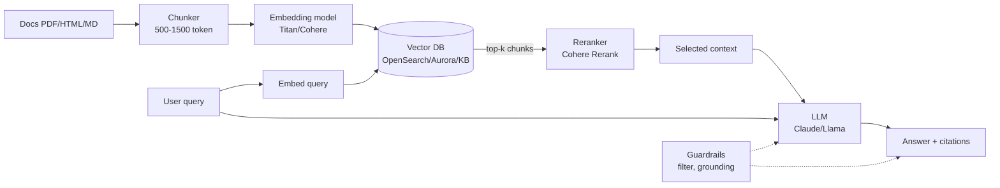

# Generative AI on AWS — RAG and Agents

GenAI in production is not "call an LLM". It's a system with retrieval, prompt engineering, guardrails, evaluation, cost optimization and agentic patterns. AWS offers **Bedrock** as a managed multi-model platform + related services. This section covers 2026 production patterns.

## 1. Foundation model selection

Bedrock offers dozens of models behind a single API:

| Model family | Provider | Strong at |
|---|---|---|
| **Claude** (Sonnet, Opus, Haiku) | Anthropic | reasoning, coding, agentic, long context |
| **Llama 3.x / 4** | Meta | open weight, fine-tuning customization |
| **Mistral / Mixtral** | Mistral AI | european, quality/cost balance |
| **Titan / Nova** | Amazon | embedding, lightweight, Bedrock-embedded |
| **Cohere Command R+** | Cohere | enterprise RAG, native citation |
| **Stable Diffusion / Titan Image** | Stability/Amazon | image generation |

Trade-off: "frontier" models (Opus, Claude 4.7) top quality but 10-30x cost vs a lightweight model (Haiku, Nova Lite). **Model routing**: send simple queries to cheap models, complex to Frontier (50-80% saving).

## 2. Production prompt engineering

- **System prompt**: role, constraints, output format (JSON schema). Reuse across calls.
- **Few-shot**: 2-5 examples in the prompt for structured tasks. Improves consistency.
- **Chain of thought**: ask the model to reason step-by-step (`<thinking>` tags Anthropic). Improves reasoning, +cost.
- **Output schema**: `<json>` tags or forced tool use for structured parseable output.
- **Prompt caching** (Bedrock 2024): cache system prompt + few-shot, pay 0.1x for cached tokens. 50-90% cost reduction for long chats.

## 3. RAG architecture pattern

**RAG (Retrieval-Augmented Generation)**: instead of training the model on your data, retrieve relevant context at runtime and inject it into the prompt.



## 4. Vector database choice

| Option | Feature | When |
|---|---|---|
| **OpenSearch Serverless vector** | auto-scaling, native BM25+vector hybrid | enterprise, already on OpenSearch |
| **Aurora PostgreSQL + pgvector** | relational DB + vector | hybrid struct+unstruct data |
| **Amazon Kendra** | managed enterprise search, SharePoint/Confluence connectors | NO manual embedding |
| **Bedrock Knowledge Bases** | end-to-end managed RAG (ingest S3 + chunk + embed + retrieve) | fast POC, simple |
| **MemoryDB / DocumentDB / RDS** | emerging vector | existing |
| **Pinecone / Weaviate** | 3rd party managed | advanced features not in AWS |

**Bedrock Knowledge Bases** (KB) is the fastest choice: point at S3 with your PDFs, KB automatically chunks + embeds + indexes in OpenSearch Serverless, exposes `Retrieve` and `RetrieveAndGenerate` APIs.

## 5. Chunking strategy

Wrong chunking = bad retrieval:

- **Fixed size** (500-1500 token): simple, can cut sentences.
- **Semantic** (separator: paragraph, section): preserves structure.
- **Hierarchical**: parent chunk (large) for context + child (small) for match. Bedrock KB supports natively.
- **Overlap**: 10-20% between chunks to avoid losing info at boundaries.

Token count: 1500 tokens ≈ 1000 words ≈ 1 dense page. For technical docs, hierarchical 1500/300 with 200 overlap.

## 6. Hybrid search and reranker

**Hybrid search**: combines **BM25** (keyword matching, high precision for literal queries) + **vector** (semantic, paraphrased queries). OpenSearch does it natively.

**Reranker**: take top 50 from retrieval, reorder with a stronger model (Cohere Rerank, Voyage AI). Top 5-10 goes to the LLM. Reduces context tokens, improves precision.

**Citation**: ask the model to cite used chunks (e.g. `<source>chunk_id</source>`), show to user for trust and hallucination debugging.

## 7. Bedrock Agents

**Bedrock Agents** orchestrate tool use, RAG, and multi-step reasoning automatically:

- **Action group**: APIs exposed as tools (OpenAPI schema or function definition); agent decides when to call; Lambda backend executes.
- **Knowledge base attach**: agent can retrieve from associated KB.
- **Agent memory**: preserves cross-session context per session_id (launched 2024).
- **Multi-agent collaboration** (2024): a "supervisor" agent delegates to specialist agents (e.g. CustomerAgent, RefundAgent, ShipAgent).

```python
import boto3
brt = boto3.client('bedrock-agent-runtime')
response = brt.invoke_agent(
    agentId='AGENT_ID',
    agentAliasId='ALIAS',
    sessionId='user-123-session-456',
    inputText='Refund order 1234',
    enableTrace=True
)
# Agent decides: calls action group GetOrder → ProcessRefund → reply
```

## 8. Guardrails

**Bedrock Guardrails** is a policy layer above any model:

- **Content filters**: block categories (hate, sexual, violence, misconduct) with low/medium/high thresholds.
- **Denied topics**: free text "competitor X products" → block.
- **Sensitive info filter**: regex/entities (PII, credit card, SSN) → block or redact.
- **Word filter**: word blacklist.
- **Contextual grounding check**: verifies the answer is supported by retrieved context (anti-hallucination). Score < threshold → fallback message.

Applicable to input (user) and output (model). Model-independent.

## 9. Evaluation

Without evaluation the system is a black box that hallucinates unknowingly.

| Technique | What it measures |
|---|---|
| **LLM-as-judge** | LLM judges responses vs reference (e.g. Claude judges Claude) |
| **Bedrock Model Evaluation Jobs** | managed job: automatic (truthfulness, robustness) or human review |
| **RAGAS** (open source) | RAG metrics: faithfulness, context relevance, answer relevance |
| **Embedding similarity** | cosine vs gold answer |
| **Production A/B test** | user thumbs-up/down + click-through |

Best practice: **golden questions** dataset (50-200) + continuous runs in CI/CD. Acceptance threshold for PR merge.

## 10. Production patterns

- **Semantic cache**: similar queries (cosine > 0.95) return cached answer. Cache via ElastiCache + embedding. 30-70% cost + latency saving.
- **Model routing/distillation**: classify query intent, route to right model (Haiku for simple, Opus for complex).
- **Streaming response**: SSE/WebSocket for typing-effect, reduces perceived latency.
- **Async batch**: for non real-time workloads (e.g. transcribe + summarize 1000 calls), Bedrock Batch API costs 50% less.
- **Provisioned throughput**: for predictable high-volume workloads, pay dedicated capacity instead of on-demand.

## 11. Agentic patterns

- **ReAct (Reasoning + Acting)**: think → tool → observation → think → tool... until final answer. Bedrock Agents default.
- **Plan-and-Execute**: model generates plan upfront, executes steps (more reliable for complex tasks).
- **Reflexion**: model critiques its own answer and retries.
- **Multi-agent debate**: 2+ agents discuss, supervisor consolidates.

## 12. Q Developer vs Q Business

- **Amazon Q Developer**: coding assistant (IDE plugin, CLI), generation, security scan, AWS expertise. ~$19/dev/month.
- **Amazon Q Business**: enterprise assistant for employees, SharePoint/Salesforce/Confluence connectors, no-code app builder. ~$20/user/month.

Both are "managed RAG/Agent" on AWS models. Cheap if you want to adopt GenAI without building a stack.

## 13. Exercise

<details>
<summary>Internal HR chatbot on 500 policy PDFs. POC in 2 days.</summary>

**Bedrock Knowledge Bases**:

1. Upload the 500 PDFs to S3 bucket.
2. Create KB in Bedrock console, point to bucket, pick Titan Embeddings v2 and Bedrock OpenSearch Serverless vector store (managed end-to-end).
3. Create Bedrock Agent with instruction "You are an HR assistant. Answer only based on company policy. Cite the section." Attach KB.
4. Add Guardrails: denied topic "competitor information", PII filter (redact employee ID), contextual grounding 0.7.
5. Frontend Lex/Streamlit/Chainlit calling `invoke_agent`.

Time: 1-2 days POC. Cost: ~$50/month at low volume (1k queries/day). Production hardening (eval, monitoring, semantic cache, custom UI) takes 2-4 more weeks.
</details>

<details>
<summary>You have an agent that calls APIs but sometimes hallucinates parameters. How do you fix it?</summary>

1. **Strict tool definition**: OpenAPI/JSON schema with all required, type, enum constraints. Bedrock forces the model to structure output per schema (function calling).
2. **Contextual grounding Guardrails**: set threshold (e.g. 0.8). If model generates unsupported text, fallback.
3. **Few-shot in instruction**: 2-3 examples of correct tool usage in agent system instruction.
4. **Validation Lambda**: before executing the API check parameters (e.g. order_id exists in DDB), if invalid return error to model which self-corrects.
5. **Eval set**: 50 queries with expected tool calls, regression test in CI. Reject merge if accuracy < 90%.
6. **Switch model**: Claude Sonnet/Opus have more reliable function-calling than smaller models; cost trade-off.
</details>

> **Summary**: Bedrock = multi-model platform (Claude, Llama, Mistral, Titan, Cohere) with cost routing; RAG = chunking + embedding + vector DB + hybrid search + reranker + citation; managed end-to-end Bedrock KB, OpenSearch/Aurora/Kendra alternatives; Bedrock Agents for tool use + memory + multi-agent; Guardrails for content/PII/grounding; eval with LLM-as-judge + RAGAS + golden dataset; production: semantic cache, model routing, streaming, batch, provisioned throughput; ReAct/Plan-Execute/Reflexion agentic; managed Q Developer/Business alternative. Anti-pattern: RAG without eval, prompt injection without guardrails.
