# Percorso, mindset, etica e legge

## Cosa stai per imparare

La cybersecurity non è una materia, è **molte** materie messe insieme: sistemi operativi, reti, crittografia, programmazione, psicologia (social engineering), diritto, gestione del rischio. Per diventare davvero competente devi:

1. **Capire come funzionano i sistemi** che attacchi o difendi. Non puoi bypassare un meccanismo se non sai come funziona quando "fa il suo lavoro". Il 90% degli aspiranti hacker fallisce qui: usano tool senza capire cosa fanno sotto.
2. **Pensare in modo avversario** — chiedersi sempre "in che modo questa cosa potrebbe rompersi se qualcuno lo volesse?". Questo si chiama **threat modeling**.
3. **Esercitarsi tantissimo** — leggere non basta. Devi rompere cose. Possibilmente cose tue, in laboratorio.
4. **Documentare tutto** — i pentester scrivono report, gli incident responder scrivono timeline. Saper scrivere chiaramente vale quanto saper exploitare.

## Come è strutturato il percorso

Le sezioni vanno seguite **in ordine** la prima volta. Sono organizzate per crescita progressiva:

| Blocco | Sezioni | Argomenti |
|---|---|---|
| **Fondamenta** | 01 – 02 | Architettura computer, OS, Linux, scripting |
| **Reti e protocolli** | 03 – 04 | TCP/IP, HTTP, TLS |
| **Crittografia** | 05 | Simmetrica, asimmetrica, hash, PKI |
| **Linguaggi per security** | 06 – 07 | OS internals, Python, C, Go |
| **Offensive base** | 08 – 11 | OSINT, scanning, OWASP, web avanzato |
| **Reti e AD** | 12 – 13 | MITM, Active Directory |
| **Binari** | 14 – 16 | Exploit dev, reverse, malware |
| **Mobile/Cloud** | 17 – 19 | Android/iOS, AWS/Azure/GCP, container |
| **Hardware/Wireless** | 20 – 21 | WiFi, SDR, firmware |
| **Difensiva** | 22 – 24 | Forensics, blue team, threat intel |
| **GRC e Red team** | 25 – 26 | Standard, normative, adversary emulation |
| **AI e closing** | 27 – 29 | AI security, capstone, cheatsheet |

Ogni pagina segue lo schema **Teoria → Esempi → Esercizi**. Gli esercizi hanno difficoltà crescente; le soluzioni sono nascoste in blocchi `
` (click per espanderle) — provaci sul serio prima di guardarle.

## Il mindset hacker (il vero significato)

"Hacker" originariamente significava **persona curiosa che capisce come funzionano i sistemi e li piega ai propri scopi** (spesso creativi). Solo i media usano "hacker" come sinonimo di criminale; nella comunità si distingue:

- **Black hat** — attaccante criminale, scopo personale/economico, illegale.
- **White hat** — pentester/security researcher, lavora con autorizzazione.
- **Grey hat** — opera senza autorizzazione ma con intento dichiarato non malevolo (es. trova un bug e lo segnala). Tecnicamente illegale nella maggior parte delle giurisdizioni.
- **Script kiddie** — usa tool altrui senza capire. Non è un complimento.
- **Hacktivist** — motivazione politica/ideologica.
- **State-sponsored / APT** — gruppi finanziati da stati. APT sta per *Advanced Persistent Threat*.

Il tuo obiettivo è diventare il secondo (white hat) o un ibrido professionista (red team / blue team / DFIR / researcher).

### Le 5 abitudini di chi ce la fa davvero

1. **RTFM** (*Read The Manual*) — leggi `man`, leggi le RFC, leggi i sorgenti.
2. **Reproduce, don't believe** — ogni tutorial va riprodotto a mano. Se un tutorial non funziona, c'è una ragione tecnica: trovala. Non saltare alla prossima guida.
3. **Lab everything** — hai trovato una CVE interessante? Mettila in lab. La leggi, la riproduci, scrivi un PoC, poi capisci come rilevarla.
4. **Write-ups** — scrivi quello che impari. Anche solo per te. Quello che non sai spiegare, non lo sai.
5. **Join the community** — Discord/Slack/Mastodon di security, conferenze (DEF CON, Black Hat, OffensiveCon, CCC, ESC, HITB, M0lecon, RomHack), CTF.

> **Errore tipico del principiante:** vuole "diventare un hacker in 30 giorni". La cybersecurity professionale richiede 2–3 anni di studio costante prima di sentirti minimamente competente su un'area, e una carriera per dominarne più di una. Non è una corsa.

## Costruire il tuo home lab

Avrai bisogno di un ambiente in cui far girare macchine virtuali isolate dalla rete di casa. Setup minimo consigliato:

### Hardware
- CPU con supporto virtualizzazione (Intel VT-x / AMD-V, abilitato in BIOS).
- **16 GB di RAM** (8 GB minimo se solo 1 VM alla volta).
- 100 GB di disco libero (le VM mangiano spazio).

### Software base
- **Hypervisor:** VirtualBox (gratis, semplice) o VMware Workstation Player (gratis per uso personale). Hyper-V su Windows va bene ma confligge con VirtualBox.
- **Attacker VM:** [Kali Linux](https://www.kali.org) o [Parrot OS Security Edition](https://parrotsec.org). Entrambe Debian-based con tool preinstallati.
- **Target VM 1 — Linux:** una Ubuntu Server 22.04 LTS o Debian 12 vanilla, da "sporcare" con servizi vulnerabili.
- **Target VM 2 — Windows:** una eval di Windows 10/11 + un Windows Server 2019/2022 per Active Directory.
- **Target prefabbricato:** [Metasploitable 2/3](https://docs.rapid7.com/metasploit/metasploitable-2/), [DVWA](https://github.com/digininja/DVWA), [OWASP Juice Shop](https://owasp.org/www-project-juice-shop/), [Vulnhub](https://www.vulnhub.com).

### Topologia di rete consigliata

Crea **due** reti virtuali nell'hypervisor:
- `lab-isolated` (Internal Network in VirtualBox, Host-Only senza gateway in VMware) — qui mettono target e attacker. Niente internet.
- `lab-nat` (NAT) — per scaricare update.

Usa una sola interfaccia per macchina dove possibile. Mai esporre VM vulnerabili su internet.

```mermaid
flowchart TB
    INET((Internet)) --> R[Router casa]
    R --> HOST[Host fisico<br/>Windows/Mac/Linux]
    HOST --> NAT{lab-nat<br/>NAT — solo update}
    HOST --> ISO{lab-isolated<br/>Internal — niente Internet}
    NAT --> K1[Kali VM]
    ISO --> K2[Kali VM<br/>attacker]
    ISO --> META[Metasploitable 2]
    ISO --> UBU[Ubuntu vulnerable]
    ISO --> DC[Windows DC<br/>+ Workstation]
    style INET fill:#3a0b0b,stroke:#ff4d4d
    style ISO fill:#0b3a1a,stroke:#00ff9c
```

### Snapshot, sempre

Prima di rompere qualcosa, fai uno snapshot. Quando hai finito o sei in confusione, torna allo snapshot. Ti risparmia ore.

## Etica e legge — la parte noiosa che ti salva la carriera

> **Avviso:** non sono un avvocato. Quanto segue è per orientarti. Per casi reali consulta un legale.

### Italia

Articoli del codice penale rilevanti:

- **Art. 615-ter c.p.** — *Accesso abusivo a un sistema informatico o telematico*. Pena: reclusione fino a 3 anni (fino a 5–8 anni con aggravanti, es. sistemi di interesse militare/sanitario). Si applica **anche se non rubi nulla**: il solo accedere senza autorizzazione è reato.
- **Art. 615-quater** — *Detenzione e diffusione abusiva di codici di accesso*. Riguarda password, chiavi, token.
- **Art. 615-quinquies** — *Detenzione, diffusione e installazione abusiva di apparecchiature, codici e altri mezzi atti a danneggiare o accedere a sistemi informatici*. Sì, in teoria può colpire chi possiede malware. La prassi distingue uso e intenzione.
- **Art. 617-quater** — *Intercettazione, impedimento o interruzione illecita di comunicazioni informatiche*.
- **Art. 635-bis / ter / quater / quinquies** — danneggiamento di dati, programmi, sistemi.
- **Art. 640-ter** — *Frode informatica*.
- **Art. 167 D.Lgs. 196/2003 (Codice Privacy) + GDPR (Regolamento UE 2016/679)** — trattamento illecito di dati personali.

### Internazionali

- **USA:** Computer Fraud and Abuse Act (CFAA), 18 U.S.C. § 1030. Pene severissime (caso Aaron Swartz).
- **UK:** Computer Misuse Act 1990.
- **UE:** Direttiva 2013/40/UE sugli attacchi ai sistemi di informazione, recepita dai vari paesi. **NIS2** (Direttiva (UE) 2022/2555) impone obblighi di sicurezza alle aziende di settori critici.

### La regola d'oro

**Mai testare un sistema senza autorizzazione scritta esplicita** del proprietario. "Sono curioso e non voglio fare danni" non è una difesa. Persino lo `nmap` indiscriminato contro un IP che non è tuo, in alcuni stati, può essere considerato accesso abusivo (vedi *State v. Riggs*, *US v. Phillips*, e in IT il caso Telecom).

Cosa puoi fare in totale tranquillità:

| Attività | Permesso? |
|---|---|
| Attaccare la tua VM Metasploitable in lab | ✅ |
| TryHackMe / HackTheBox / OverTheWire / picoCTF | ✅ |
| PortSwigger Web Security Academy / RangeForce | ✅ |
| Bug bounty con scope esplicito (HackerOne, Bugcrowd, Intigriti, YesWeHack) | ✅ con scope |
| Pentest aziendale **con contratto firmato** (PSA + Rules of Engagement) | ✅ |
| "Test" del WiFi del vicino, anche se "è aperto" | ❌ illegale |
| Provare credenziali su sito di terzi (anche solo *admin/admin*) | ❌ illegale |
| Scansionare con nmap un sito a caso che ti ispira | ⚠️ zona grigia, evita |
| Diffondere PoC pubblicamente prima della patch | ❌ etica e talvolta legge |

### Disclosure responsabile

Quando trovi una vulnerabilità in un software o servizio:

1. **Documenta** in privato (screenshot, request/response, versione, riproduzione).
2. **Contatta il vendor** via canale ufficiale (security.txt, security@, programma bug bounty).
3. **Concorda timeline.** Standard di settore: 90 giorni (Project Zero di Google). Si può estendere se la fix è complessa.
4. **Coordinated disclosure** quando la patch è disponibile o il termine scade.
5. **Richiedi CVE** se appropriato (MITRE, INCIBE per IT, …).

Non vendere zero-day a chiunque non sia un programma di acquisto vulnerabilità etico (ZDI, Crowdfense per ricercatori). Mai a gray market.

## Tipologie di lavoro nel settore

Per orientarti, ecco i ruoli reali. Non sei obbligato a fare l'offensivo: il "blue side" paga uguale e ha meno ego.

| Ruolo | Cosa fa | Stipendio IT junior (gross indicativo, 2026) |
|---|---|---|
| **SOC Analyst Tier 1** | Triage allarmi SIEM, escalation, primo livello incidenti | 25–35k € |
| **SOC Analyst Tier 2/3** | Analisi approfondita, hunting, response | 35–55k € |
| **Incident Responder / DFIR** | Analisi forense, IR su breach | 40–70k € |
| **Pentester (web/network)** | Test offensivi su scope cliente, report | 35–60k € |
| **Red Teamer** | Adversary emulation, simulazione APT | 50–90k € |
| **Application Security Engineer** | SAST/DAST, secure SDLC, threat modeling | 40–75k € |
| **Cloud Security Engineer** | Hardening AWS/Azure/GCP, IAM, CSPM | 45–80k € |
| **Malware Analyst / Threat Researcher** | Reverse engineering malware, threat intel | 45–80k € |
| **GRC Analyst** | Compliance ISO/NIS2/GDPR, audit | 30–55k € |
| **CISO** | Strategia security aziendale | 80–200k+ € |

Inizia da SOC L1 o pentester junior, poi specializzati.

## Certificazioni utili (la versione onesta)

Le cert non sostituiscono lo studio ma aprono porte HR. Ordine di valore percepito:

- **Entry / orientamento:** CompTIA Security+ (utile per HR, contenuto base), eJPT (INE/eLearnSecurity, pratica solida).
- **Pentest:** OSCP (Offensive Security) — la più rispettata per pentest junior/mid. eCPPT, BSCP (PortSwigger) per il web.
- **Pentest avanzato:** OSEP, OSWE, CRTO, CRTL.
- **Difesa:** Blue Team Level 1/2 (Security Blue Team), GCIH, GCFA, GNFA (SANS — care).
- **Cloud:** AWS Certified Security Specialty, AZ-500, GCP Pro Cloud Security.
- **Manageriali:** CISSP, CISM, CISA.

Non perdere tempo a "collezionare" cert. **OSCP + un'esperienza reale > 5 cert teoriche**.

## Esercizi

### Esercizio 0.1 — Setup lab
Scarica VirtualBox, crea due VM: Kali Linux + Metasploitable 2. Configurale entrambe in *Internal Network* `lab-isolated`. Verifica che si vedano (ping da Kali a Metasploitable).

Suggerimento

In VirtualBox, per ogni VM: Settings → Network → Adapter 1 → Attached to: *Internal Network*, Name: `lab-isolated`. Su Kali assegna IP manuale 192.168.56.10/24, su Metasploitable 192.168.56.20/24 (default credenziali `msfadmin/msfadmin`). Poi `ip addr` e `ping`.

### Esercizio 0.2 — Mindset legale
Per ognuno dei seguenti scenari decidi: legale (sì/no/dipende) e perché.

1. Trovi una SQL injection sul sito del Comune in cui vivi. La sfrutti solo per estrarre il tuo stesso record anagrafico.
2. Stai testando un sito iscritto al programma bug bounty di Acme su HackerOne. Trovi RCE e estrai 10k record cliente per "provarlo".
3. Hai installato Kali sul tuo PC e fai `nmap` di 8.8.8.8 dalla rete di casa.
4. Trovi un bug nel software open source di un'azienda; mandi la PoC pubblicamente su Twitter prima di avvisare.
5. Il tuo amico ti chiede di "testare" il sito della sua azienda dove lavora.

Soluzione

1. **Illegale.** Anche se è il "tuo" record, accedi senza autorizzazione (art. 615-ter). Il "limitarsi al proprio dato" non scrimina.
2. **Illegale anche se in scope.** I bug bounty proibiscono esfiltrazione massiva di dati: dimostra con 1 record o un proof-of-concept innocuo. 10k record può configurare violazione di privacy/contratto e sanzione GDPR.
3. **Zona grigia.** Tecnicamente uno scan TCP/SYN su un servizio pubblico (DNS di Google) è invasivo. Google non si lamenterà di un singolo `nmap -sS`, ma scanning continuo o intrusivo può portare a problemi con il tuo ISP. Evita.
4. **Eticamente sbagliato, potenzialmente illegale.** Disclosure non coordinato. Espone gli utenti a 0-day. Cattiva reputazione, possibili azioni legali.
5. **Dipende.** Serve autorizzazione scritta del **legittimo titolare** del sistema (la società), non dell'amico. Il tuo amico, se non è amministratore di sistema o legale rappresentante, non può autorizzarti.

### Esercizio 0.3 — Recon di te stesso
Cerca cosa è pubblicamente disponibile su di te:
- google `"il tuo nome" site:linkedin.com`
- `haveibeenpwned.com` con la tua email
- `dehashed.com` (gratuito con limiti)
- controlla le tue foto/post pubblici

Quanto attack surface emani? Cosa cambieresti?

### Esercizio 0.4 — Studio di un'incidente
Leggi i write-up di **uno** di questi grandi incidenti e identifica: vettore iniziale, lateral movement, exfil, errori della vittima, errori dell'attaccante.

- **Target 2013** (POS malware via HVAC supplier)
- **Equifax 2017** (Apache Struts unpatched)
- **SolarWinds 2020** (supply chain, SUNBURST)
- **MOVEit 2023** (Cl0p ransomware via 0day SQLi)
- **Colonial Pipeline 2021** (DarkSide, VPN no MFA)
- **Maersk / NotPetya 2017** (wiper diffuso via aggiornamento MeDoc)

Suggerimento

Per ogni incidente cerca: report ufficiale (CISA/NCSC), advisory vendor, analisi tecnica di Mandiant/CrowdStrike. Per NotPetya: Andy Greenberg, *Sandworm* (libro). Per SolarWinds: report Mandiant e Microsoft MSTIC.

## Glossario di base (lo userai ovunque)

| Termine | Significato |
|---|---|
| **CVE** | Common Vulnerabilities and Exposures — identificatore univoco di una vulnerabilità nota |
| **CVSS** | Common Vulnerability Scoring System — punteggio gravità (0–10) |
| **PoC** | Proof of Concept — codice/passi che dimostrano la vulnerabilità |
| **Exploit** | Codice che sfrutta la vulnerabilità per ottenere un risultato (es. esecuzione codice) |
| **Payload** | Cosa fa l'exploit dopo che è entrato (es. reverse shell) |
| **0-day / N-day** | Vulnerabilità non patchata pubblicamente / già patchata |
| **TTP** | Tactics, Techniques, Procedures (terminologia MITRE ATT&CK) |
| **IoC** | Indicator of Compromise — hash, IP, domain associati a un attacco |
| **IOA** | Indicator of Attack — comportamento sospetto in corso |
| **RCE** | Remote Code Execution |
| **LPE / EoP** | Local Privilege Escalation / Elevation of Privilege |
| **C2 / C&C** | Command and Control — server da cui l'attaccante controlla i malware |
| **APT** | Advanced Persistent Threat — gruppo organizzato, spesso stato-finanziato |
| **Recon** | Ricognizione, fase iniziale di un attacco |
| **Persistence** | Capacità del malware di sopravvivere a riavvii |
| **Lateral movement** | Spostamento dell'attaccante da un sistema all'altro nella rete |
| **Exfiltration** | Estrazione dei dati dalla rete vittima |
| **Defense in depth** | Strategia: più strati indipendenti di difesa |
| **Zero trust** | "Mai fidarsi, sempre verificare" — modello di sicurezza |

## Riferimenti per approfondire

- [OWASP Foundation](https://owasp.org) — base per web security
- [MITRE ATT&CK](https://attack.mitre.org) — tassonomia TTP attaccanti
- [NIST Cybersecurity Framework](https://www.nist.gov/cyberframework) — framework difensivo standard
- [CISA Known Exploited Vulnerabilities](https://www.cisa.gov/known-exploited-vulnerabilities-catalog) — vulnerabilità sfruttate in the wild
- [Krebs on Security](https://krebsonsecurity.com) — giornalismo cyber
- [Risky Business podcast](https://risky.biz) — settimanale
- Libri: *The Web Application Hacker's Handbook* (Stuttard, Pinto); *The Tangled Web* (Zalewski); *Practical Malware Analysis* (Sikorski, Honig); *Hacking: The Art of Exploitation* (Erickson); *Sandworm* (Greenberg); *Countdown to Zero Day* (Zetter); *The Cuckoo's Egg* (Stoll).

---

Pronto? Si parte dai fondamenti.
