# Matematica e teoria computazione

> Non puoi capire perché RSA funziona se non hai presente cosa significa "x mod n". Non puoi capire perché bcrypt è "lento di proposito" senza capire complessità. Non puoi valutare la sicurezza di una password senza capire l'entropia. Questa sezione è il **pacchetto minimo** per non essere bloccato. Spiego solo ciò che ti servirà davvero.

## Insiemi e funzioni (in 3 minuti)

Un **insieme** è una collezione di elementi distinti: $\{1, 2, 3\}$. Si scrive $x \in A$ ("x appartiene ad A"). 

Insiemi importanti in security:
- $\mathbb{Z}$ — interi: $\{..., -2, -1, 0, 1, 2, ...\}$
- $\mathbb{N}$ — naturali: $\{0, 1, 2, ...\}$
- $\mathbb{Z}_n$ — interi modulo $n$: $\{0, 1, ..., n-1\}$. È un cerchio: dopo $n-1$ torni a $0$.
- $\{0,1\}^n$ — stringhe binarie di $n$ bit. È l'insieme dei "messaggi" di dimensione fissa.

Una **funzione** $f: A \to B$ prende un input da $A$ e produce un output in $B$. Concetti chiave per security:

- **Iniettiva** (uno-a-uno): input diversi → output diversi. Niente collisioni.
- **Surgettiva** (su): ogni output di $B$ è raggiungibile.
- **Biettiva**: entrambe → invertibile. Un cifrario *deve* essere biettivo (altrimenti perdi dati).
- **One-way**: facile calcolare $f(x)$, difficile calcolare $f^{-1}(y)$. **Le funzioni hash sono one-way** (idealmente).
- **Trapdoor one-way**: come sopra, ma con un *segreto* puoi invertire facilmente. **RSA è trapdoor**: chi ha la chiave privata inverte, gli altri no.

### Esempio visivo

```
Funzione hash SHA-256:
       input qualsiasi                          output: 256 bit
  ┌───────────────────────────┐         ┌──────────────────────────────┐
  │ "ciao"                    │ ──f──▶  │ b133a0c0e9bee3be20163d2ad9 ..│
  │ "ciao mondo!"             │ ──f──▶  │ 8e0e5b3cd83d2c25b18a86ef0e ..│
  │ 4 GB di video             │ ──f──▶  │ 9d5e3c3a1f8a3e5b3cd83d2c25 ..│
  └───────────────────────────┘         └──────────────────────────────┘
                                          ▲
                                          │  Tutti gli output sono 256 bit.
                                          │  Sapendo solo l'output, non c'è
                                          │  modo "facile" di tornare all'input.
```

## Logica booleana — l'algebra dei bit

Un **bit** è 0 o 1. **Tre operazioni**:

| Op | Simbolo | Tabella |
|---|---|---|
| AND | $\land$ o `&` | $0\land 0 = 0$, $0\land 1 = 0$, $1\land 1 = 1$ |
| OR | $\lor$ o `|` | $0\lor 0 = 0$, $0\lor 1 = 1$, $1\lor 1 = 1$ |
| XOR | $\oplus$ o `^` | $0\oplus 0 = 0$, $0\oplus 1 = 1$, $1\oplus 1 = 0$ |
| NOT | $\lnot$ o `~` | $\lnot 0 = 1$, $\lnot 1 = 0$ |

**Proprietà cruciali di XOR** (devi memorizzarle):
1. **Auto-inverso**: $a \oplus a = 0$.
2. **Identità**: $a \oplus 0 = a$.
3. **Commutativo**: $a \oplus b = b \oplus a$.
4. **Associativo**: $(a \oplus b) \oplus c = a \oplus (b \oplus c)$.

Da (1) e (2) segue il fondamento di **mezzo mondo della crittografia**:

$$ c = m \oplus k \quad\Rightarrow\quad c \oplus k = m \oplus k \oplus k = m $$

Cioè: cifri facendo XOR del messaggio con una chiave. **Decifri rifacendo XOR con la stessa chiave**. Se $k$ è veramente casuale e usato una sola volta, è il **one-time pad**, l'unico cifrario **perfetto** (Shannon 1949).

**Perché allora non usiamo OTP per tutto?** Perché la chiave deve essere lunga come il messaggio e non riusabile. Logisticamente impraticabile.

### Esempio numerico XOR a mano

Messaggio: `0110 1001` (binario; in ASCII è `i`, 0x69)
Chiave:    `1010 0011` (random)

```
  0110 1001   ← m
^ 1010 0011   ← k
─ ─────────
  1100 1010   ← c
```

Per decifrare:
```
  1100 1010   ← c
^ 1010 0011   ← k
─ ─────────
  0110 1001   ← m  (recuperato!)
```

Esercizio: prendi `m = 0b01000001` (la 'A') e `k = 0b00001111`. Calcola $c$ a mano. Verifica con Python: `0b01000001 ^ 0b00001111`.

## Algebra modulare (la matematica di Internet)

Dato $n > 0$, **modulo $n$** significa "tieni solo il resto della divisione per $n$".

$$ 23 \mod 7 = 2 \quad(\text{perché } 23 = 3 \cdot 7 + 2)$$

$$ -3 \mod 7 = 4 \quad(\text{in Python}\colon -3\%7 = 4) $$

**Pensalo come un orologio.** Su un orologio a 12 ore: 14:00 = 2:00. È matematica modulo 12.

<figure class="diagram">
<svg viewBox="-150 -150 300 300" width="320" height="320" xmlns="http://www.w3.org/2000/svg">
  <circle cx="0" cy="0" r="120" fill="none" stroke="#00e6ff" stroke-width="2"/>
  <g font-family="JetBrains Mono, monospace" font-size="14" fill="#e8eef0" text-anchor="middle" dominant-baseline="middle">
    <text x="0"   y="-138">0/12</text>
    <text x="69"  y="-119">1</text>
    <text x="119" y="-69">2</text>
    <text x="138" y="0">3</text>
    <text x="119" y="69">4</text>
    <text x="69"  y="119">5</text>
    <text x="0"   y="138">6</text>
    <text x="-69" y="119">7</text>
    <text x="-119" y="69">8</text>
    <text x="-138" y="0">9</text>
    <text x="-119" y="-69">10</text>
    <text x="-69" y="-119">11</text>
  </g>
  <!-- arrow showing 14 → 2 -->
  <line x1="0" y1="0" x2="100" y2="-58" stroke="#00ff9c" stroke-width="2" marker-end="url(#arr)"/>
  <line x1="0" y1="0" x2="-58" y2="-100" stroke="#ff3da6" stroke-width="2" stroke-dasharray="4 4" marker-end="url(#arr2)"/>
  <defs>
    <marker id="arr" viewBox="0 0 10 10" refX="8" refY="5" markerWidth="6" markerHeight="6" orient="auto">
      <path d="M0,0 L10,5 L0,10 z" fill="#00ff9c"/>
    </marker>
    <marker id="arr2" viewBox="0 0 10 10" refX="8" refY="5" markerWidth="6" markerHeight="6" orient="auto">
      <path d="M0,0 L10,5 L0,10 z" fill="#ff3da6"/>
    </marker>
  </defs>
  <text x="0" y="0" font-family="JetBrains Mono, monospace" font-size="10" fill="#ffe066" text-anchor="middle">mod 12</text>
</svg>
<figcaption>Orologio modulo 12 — verde: posizione "2", magenta: "14" che cade nello stesso punto</figcaption>
</figure>

### Operazioni mod $n$

- **Somma:** $(a + b) \mod n$. Es: $(5+9) \mod 7 = 14 \mod 7 = 0$.
- **Moltiplicazione:** $(a \cdot b) \mod n$. Es: $(4 \cdot 5) \mod 7 = 20 \mod 7 = 6$.
- **Potenza:** $a^k \mod n$. Es: $3^4 \mod 7 = 81 \mod 7 = 4$.

In Python: `pow(3, 4, 7)` → 4. La forma a 3 argomenti è ottimizzata e gestisce numeri enormi.

### Inverso moltiplicativo

L'**inverso di $a$ modulo $n$** è quel $b$ tale che $a \cdot b \equiv 1 \pmod{n}$.

Esiste **se e solo se** $\gcd(a, n) = 1$ (cioè $a$ e $n$ sono **coprimi**). Si calcola con l'**algoritmo di Euclide esteso**, o in Python: `pow(a, -1, n)`.

Esempio: inverso di $3$ mod $11$. $3 \cdot 4 = 12 \equiv 1 \pmod{11}$. Quindi $3^{-1} \equiv 4$.

### Massimo Comun Divisore (MCD) — algoritmo di Euclide

$\gcd(a, b)$ = il più grande intero che divide sia $a$ che $b$. Algoritmo:

```python
def gcd(a, b):
    while b:
        a, b = b, a % b
    return a

print(gcd(48, 18))   # → 6
```

A mano:
```
gcd(48, 18)
  48 = 2·18 + 12   → gcd(18, 12)
  18 = 1·12 + 6    → gcd(12, 6)
  12 = 2·6 + 0     → gcd(6, 0) = 6
```

### Numeri primi e teorema di Fermat (mini)

**Primo**: divisibile solo per 1 e sé stesso. $2, 3, 5, 7, 11, 13, ...$.

**Piccolo teorema di Fermat**: se $p$ è primo e $\gcd(a, p) = 1$, allora $a^{p-1} \equiv 1 \pmod{p}$.

Esempio: $p = 7, a = 3$. $3^6 = 729 = 104 \cdot 7 + 1$. Quindi $3^6 \equiv 1 \pmod 7$. ✅

Da questo nasce il **test di primalità** di Fermat: se $a^{p-1} \not\equiv 1 \pmod{p}$, allora $p$ NON è primo. (Il contrario non sempre vale → si usa Miller-Rabin in pratica.)

### Funzione totient di Eulero $\varphi(n)$

$\varphi(n)$ = quanti interi in $[1, n-1]$ sono coprimi con $n$.

- Se $p$ è primo: $\varphi(p) = p - 1$ (tutti tranne 0).
- Se $n = p \cdot q$ (entrambi primi distinti): $\varphi(n) = (p-1)(q-1)$. **Questa è la formula di RSA.**

**Teorema di Eulero**: se $\gcd(a, n) = 1$, allora $a^{\varphi(n)} \equiv 1 \pmod{n}$.

Da qui RSA: scegliendo $e$ ed $e^{-1} = d$ mod $\varphi(n)$, si ottiene $m^{ed} = m^{1 + k\varphi(n)} = m \cdot (m^{\varphi(n)})^k = m$. **Magia matematica fatta software.**

### Esempio RSA "tascabile" (vedremo l'esempio "vero" nella 05b)

Sia $p = 11, q = 13$.
- $n = pq = 143$.
- $\varphi(n) = 10 \cdot 12 = 120$.
- Scegli $e = 7$ (deve essere coprimo con 120). $\gcd(7, 120) = 1$ ✅.
- Calcola $d = 7^{-1} \mod 120$. Verifica: $7 \cdot 103 = 721 = 6 \cdot 120 + 1$. Quindi $d = 103$.
- Chiave pubblica: $(n, e) = (143, 7)$. Chiave privata: $(n, d) = (143, 103)$.

Cifra il messaggio $m = 9$:
$$c = m^e \mod n = 9^7 \mod 143$$

$9^7 = 4{,}782{,}969$. $4{,}782{,}969 \mod 143 = 48$ (verifica: $4{,}782{,}969 = 33{,}447 \cdot 143 + 48$).

Decifra:
$$m = c^d \mod n = 48^{103} \mod 143 = 9 \quad ✅$$

(`pow(48, 103, 143)` in Python → 9). **Funziona.**

## Complessità computazionale (notazione $O$)

Quanto cresce il tempo di un algoritmo in funzione della dimensione dell'input $n$?

| Notazione | Significato pratico |
|---|---|
| $O(1)$ | costante (lookup hash table) |
| $O(\log n)$ | logaritmico (ricerca binaria) |
| $O(n)$ | lineare (scansione lista) |
| $O(n \log n)$ | sort efficiente (quicksort, merge sort) |
| $O(n^2)$ | due loop annidati (bubble sort) |
| $O(2^n)$ | esponenziale (brute force su $n$ bit di chiave) |
| $O(n!)$ | fattoriale (permutazioni) |

In security:
- AES-128 ha chiavi di 128 bit → brute force = $2^{128}$ tentativi. Anche a $10^{18}$ op/sec ci vorrebbero $\sim 10^{19}$ anni → impossibile.
- AES-256 → $2^{256}$. Più impossibile (a meno di quantum computer + Grover che lo riduce a $2^{128}$, ancora impossibile).
- SHA-256 collisioni → "birthday bound" $\sim 2^{128}$.
- bcrypt è **deliberatamente lento**: ogni hash costa $\sim 100$ ms invece di $\sim 0.1$ µs → brute force GPU rallentato di un fattore $10^6$.

### Birthday paradox

Probabilità di collisione in $N$ bit dopo $k$ tentativi $\approx k^2 / 2^{N+1}$.

Per $N = 256$ servono $k \approx 2^{128}$ tentativi per collisione 50%. **Questo è perché SHA-256 ha "sicurezza 128 bit" su collision, non 256.**

Stesso principio: in una stanza di 23 persone, c'è il 50% di chance che due abbiano lo stesso compleanno. Sorprende l'intuizione ma è matematica.

## Probabilità (giusto il minimo)

- $P(A) \in [0, 1]$.
- Eventi indipendenti: $P(A \land B) = P(A) \cdot P(B)$.
- Unione: $P(A \lor B) = P(A) + P(B) - P(A \land B)$.

In security:
- Probabilità che una password 8 char [a-z] sia indovinata al primo tentativo: $1 / 26^8 \approx 1/2 \cdot 10^{11}$.
- A 1M tentativi/sec: $26^8 / 10^6 \approx 200{,}000$ secondi = 2 giorni. **Password 8 lowercase = morte.**

## Entropia (Shannon)

L'**entropia** di una variabile aleatoria $X$ con possibili valori $x_i$ e probabilità $p_i$:

$$H(X) = -\sum_i p_i \log_2 p_i \quad\text{(in bit)}$$

Significa: numero medio di bit necessari per descrivere un valore di $X$.

- Coin flip giusto: $H = -(0.5 \log_2 0.5 + 0.5 \log_2 0.5) = 1$ bit.
- Coin truccato 90/10: $H \approx 0.47$ bit (sai già quasi sempre la risposta).
- Distribuzione uniforme su $n$ valori: $H = \log_2 n$.

### Entropia delle password

Una password random di 8 caratteri tra 95 (ASCII printable):
$$H = 8 \log_2(95) \approx 52 \text{ bit}.$$

Una passphrase 4 parole di un dizionario di 7776 (EFF):
$$H = 4 \log_2(7776) \approx 51.7 \text{ bit}.$$

**Più o meno equivalenti** dal punto di vista dell'attaccante! Ma la passphrase la ricordi.

> **Regola:** **80+ bit di entropia** è il minimo "sicuro" oggi (NIST 800-63). **128+ bit** per crittografia.

## Teoria dei grafi (cenno: ti servirà in AD)

Un **grafo** è una coppia $(V, E)$ — vertici e archi. In Active Directory hacking, **BloodHound** crea un grafo dove i nodi sono utenti/computer/gruppi e gli archi sono relazioni ("ha la sessione su", "può resettare la password di"...).

Algoritmi: shortest path (Dijkstra, BFS). Cerchi gli archi attacker → Domain Admin.

```mermaid
graph LR
    A[alice<br/>utente] -->|has_session| B[DESKTOP-01<br/>workstation]
    B -->|admin_to| C[SERVER-01<br/>file server]
    C -->|belongs_to| D[SQL_Admins<br/>gruppo]
    D -->|member_of| E[Domain Admins<br/>gruppo privilegiato]
    style A fill:#0b3a1a,stroke:#00ff9c
    style E fill:#3a0b0b,stroke:#ff4d4d,stroke-width:3px
```



Una catena di 4 archi dice: "comprometti alice → vai a SERVER-01 (lei lo amministra) → diventa membro di SQL_Admins (servizio) → Domain Admin". BloodHound trova questa catena automaticamente con un BFS.

## Macchine di Turing & decidibilità (vista da lontano)

**Una macchina di Turing** è un modello astratto di un computer: testa che legge/scrive su un nastro, stati finiti. Tutto ciò che un computer può fare, una MT può farlo (tesi di Church-Turing).

**Problema della terminazione (halting problem)**: dato un programma $P$ e un input $x$, terminerà o continuerà per sempre? **Indecidibile** (Turing 1936). Nessun algoritmo generale può risolverlo.

**Perché ti interessa?** Conseguenze in security:
- **Antivirus perfetto è impossibile**: rilevare con certezza se un programma è malevolo è equivalente al halting problem → indecidibile in generale.
- **Decompilation perfetta** dello stesso ordine.
- **Tutti i tool security sono euristici** (approssimazioni "abbastanza buone").

## Linguaggi formali (super-rapido — sezione 02b approfondisce)

- **Regular** (regex): riconosce pattern locali. Limitato (non bilanciamento parentesi).
- **Context-free** (parser BNF/PEG): parse di linguaggi di programmazione, HTML, JSON.
- **Context-sensitive, recursively enumerable**: progressivamente più potenti.

In security il **mismatch di parser** tra livelli diversi è una fonte enorme di bug (HTTP smuggling, XML/JSON ambiguity, polyglot file).

## Esercizi

### Es 0b.1 — Modular arithmetic by hand
Calcola **a mano** e poi verifica con Python:
1. $(17 + 25) \mod 11$
2. $(5 \cdot 7) \mod 13$
3. $3^{10} \mod 7$
4. $7^{-1} \mod 13$ (usa Euclide esteso o `pow(7, -1, 13)`)

<details><summary>Soluzioni</summary>

1. $42 \mod 11 = 9$.
2. $35 \mod 13 = 9$.
3. $3^{10} = 59049$. $59049 = 8435 \cdot 7 + 4$. Risultato: 4. (Oppure: $3^6 \equiv 1 \pmod 7$ per Fermat, $3^{10} = 3^6 \cdot 3^4 \equiv 3^4 = 81 \equiv 4$.)
4. $7 \cdot 2 = 14 \equiv 1 \pmod{13}$. Quindi $7^{-1} \equiv 2$.

</details>

### Es 0b.2 — XOR cipher reale
Decifra a mano questa stringa cifrata con XOR a singolo byte e chiave $k = 0x42$ (ASCII 'B'):

`hex = 2a 27 2d 2d 2e 62 35 2d 36 2d 30`

<details><summary>Soluzione</summary>

```python
ct = bytes.fromhex("2a 27 2d 2d 2e 62 35 2d 36 2d 30".replace(" ",""))
print(bytes(b ^ 0x42 for b in ct))
# b'hello world'
```

A mano: $0x2a \oplus 0x42 = 0010\,1010 \oplus 0100\,0010 = 0110\,1000 = 0x68 = $ 'h'. E avanti.

</details>

### Es 0b.3 — RSA tascabile
Con $p = 7, q = 11$, $e = 7$:
1. Calcola $n$, $\varphi(n)$.
2. Calcola $d$.
3. Cifra $m = 5$.
4. Decifra e verifica.

<details><summary>Soluzione</summary>

$n = 77$, $\varphi = 60$. $d = 7^{-1} \mod 60$. $7 \cdot 43 = 301 = 5 \cdot 60 + 1$, quindi $d = 43$.

$c = 5^7 \mod 77 = 78125 \mod 77 = 47$ (verifica: $78125 = 1014 \cdot 77 + 47$).

$m = 47^{43} \mod 77$. Con `pow(47, 43, 77)` = 5. ✅

</details>

### Es 0b.4 — Entropia
Calcola l'entropia (in bit) di:
1. Una password di 10 cifre.
2. Una password di 12 caratteri tra `[a-zA-Z]`.
3. Una password di 14 caratteri tra `[a-zA-Z0-9]`.
4. Una passphrase di 6 parole EFF (7776 parole nel dizionario).
5. Un PIN di 4 cifre.

<details><summary>Soluzioni</summary>

1. $10 \log_2 10 \approx 33$ bit. **Inadeguato.**
2. $12 \log_2 52 \approx 68$ bit. Borderline.
3. $14 \log_2 62 \approx 83$ bit. ✅
4. $6 \log_2 7776 \approx 77.5$ bit. ✅
5. $\log_2 10^4 \approx 13$ bit. **Brutto** ma su carte fisiche (con lockout) basta.

</details>

### Es 0b.5 — Birthday bound
SHA-1 ha output 160 bit. Quante operazioni servono per trovare una collisione attesa con 50%?

<details><summary>Soluzione</summary>

$\sim 2^{80}$ operazioni. SHAttered (Google 2017) ha ridotto via prefix attack a $\sim 2^{63}$ pratiche. Ecco perché SHA-1 è **morto** per security.

</details>

### Es 0b.6 — Complessità di un brute force
Una password 10 char tra `[a-z0-9]`. Lo spazio è $36^{10} \approx 3.6 \cdot 10^{15}$. A 1 GH/s (10^9 hash/sec): quanto tempo per esaurire l'intero spazio?

<details><summary>Soluzione</summary>

$3.6 \cdot 10^{15} / 10^9 = 3.6 \cdot 10^6$ secondi $\approx 42$ giorni. **Crackable** su GPU farm. Con hash veloce tipo NTLM, ore.

</details>

### Es 0b.7 — Halting problem implication
Spiega in 3 righe perché non può esistere un programma `is_malware(x)` che decide con certezza se `x` è malevolo per qualsiasi `x`.

<details><summary>Suggerimento</summary>

Definizione di "malevolo" arbitraria; per molte categorie (es. "esegue una syscall vietata"), serve simulazione completa di `x`, che è equivalente al halting → indecidibile. **Tutti i vendor AV** sono euristici (signature + ML + sandbox + behavior) → falsi positivi/negativi inevitabili.

</details>

## Concetti chiave

1. **XOR** è il fondamento di tutta la crittografia simmetrica. Auto-inverso.
2. **Mod n** è "orologio" — interi su un cerchio.
3. **Esponenziazione modulare** + **inverso** = base RSA.
4. **Coprimalità + totient** = base teorema RSA.
5. **Complessità $O$**: $2^{128}$ è impossibile, $2^{40}$ è una giornata su GPU.
6. **Entropia $H = -\sum p \log p$**: misura sicurezza vere-random.
7. **Birthday bound**: hash di $N$ bit → sicurezza collision $N/2$.
8. **Halting problem** → AV perfetto è impossibile, tutto è euristica.

Adesso hai gli attrezzi. Crittografia (sezione 5 + 5b) non sarà più magia.
