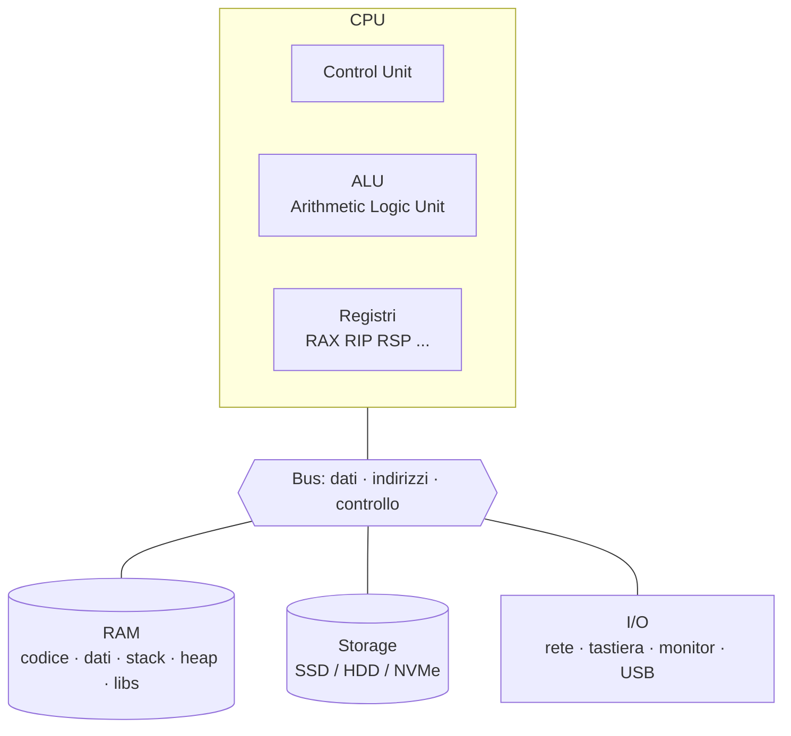
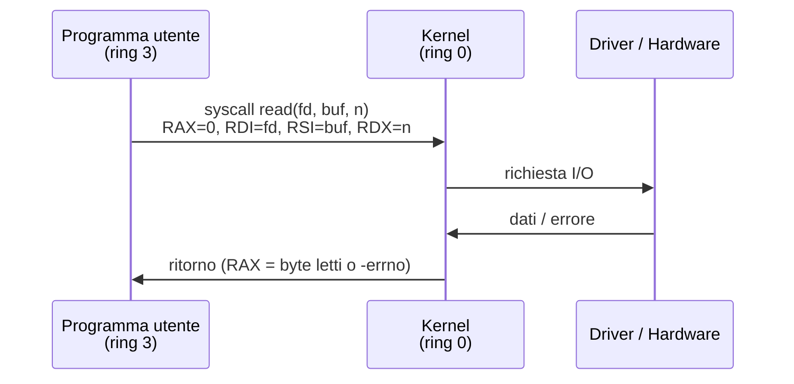

# Fondamenti di informatica per la security

## Perché ti servono questi fondamenti

In sicurezza informatica, il 99% degli attacchi sfrutta o un bug *o* un comportamento del sistema che il difensore non aveva capito. Esempi:

- **Buffer overflow:** sfrutta come la memoria è organizzata (stack/heap), come funzionano i registri della CPU, come il sistema operativo carica un binario.
- **SQL injection:** sfrutta come una stringa viene interpretata da un parser DB.
- **DLL hijacking:** sfrutta l'ordine di risoluzione dei path su Windows.
- **DNS rebinding:** sfrutta il caching DNS del browser e la Same-Origin Policy.

Se non sai cosa è un registro, un processo, un descrittore di file, un socket — non capirai mai *davvero* nessuna di queste. Quindi: stringi i denti, leggi questa sezione anche se "la sai".

## Architettura di un computer (modello di von Neumann)

Modello standard dal 1945:



**Concetti chiave:**

- La CPU esegue **istruzioni** prese dalla RAM.
- I **registri** sono memorie velocissime *dentro* la CPU (decine, non miliardi). Sull'architettura x86-64 i registri general purpose principali sono: `RAX, RBX, RCX, RDX, RSI, RDI, RBP, RSP, R8–R15`. Più registri speciali: `RIP` (instruction pointer — istruzione corrente), `RFLAGS` (flag di stato).
- La **memoria** è uno spazio indirizzato a byte (su x86-64, indirizzi a 64 bit).
- Il **bus** trasporta dati, indirizzi e segnali di controllo.

### Esecuzione di un'istruzione (semplificata)

Per ogni istruzione la CPU fa il ciclo *fetch–decode–execute*:

1. **Fetch:** carica l'istruzione all'indirizzo `RIP` dalla RAM.
2. **Decode:** interpreta gli opcode (es. `mov`, `add`, `jmp`).
3. **Execute:** esegue (es. ALU per somma, accesso memoria, salto).
4. Aggiorna `RIP` (di solito istruzione successiva, oppure target di salto).

**Perché ti interessa per la security?** Tutto l'exploit development (sezione 14) si basa su:
- *Controllare* `RIP` per dirottare il flusso.
- *Sapere* dove sono i tuoi dati in memoria (stack/heap).
- *Costruire* sequenze di istruzioni che facciano quello che vuoi (shellcode, ROP).

## Sistemi numerici (decimale, binario, esadecimale)

I computer lavorano in **binario** (base 2). Per leggibilità si usa **esadecimale** (base 16): 4 bit = 1 cifra hex.

| Decimale | Binario | Hex |
|---|---|---|
| 0 | 0000 | 0 |
| 1 | 0001 | 1 |
| 9 | 1001 | 9 |
| 10 | 1010 | A |
| 15 | 1111 | F |
| 16 | 10000 | 10 |
| 255 | 11111111 | FF |
| 256 | 100000000 | 100 |

**Notazioni:** in C/Python/most-lang: `0xFF` per hex, `0b11111111` per binario.

### Operazioni bitwise che devi conoscere

| Operazione | C/Python | Esempio |
|---|---|---|
| AND | `&` | `0b1100 & 0b1010 = 0b1000` |
| OR | `\|` | `0b1100 \| 0b1010 = 0b1110` |
| XOR | `^` | `0b1100 ^ 0b1010 = 0b0110` |
| NOT | `~` | `~0b1100 = ...11110011` |
| Shift left | `<<` | `0b0010 << 2 = 0b1000` |
| Shift right | `>>` | `0b1000 >> 2 = 0b0010` |

Verrai a contatto con XOR ovunque in crittografia (one-time pad, stream cipher, AES MixColumns, …). AND/OR/shift sono il pane del bit-twiddling (es. nei protocolli, nei flag, nelle maschere di rete).

### Rappresentazione di numeri

- **Unsigned** (senza segno): `uint8` da 0 a 255, `uint32` da 0 a $2^{32}-1$.
- **Signed** (con segno) in **two's complement**: `int8` da -128 a 127. Il bit più significativo è il segno. Per negare: invertire i bit e sommare 1. Esempio: `-1` in `int8` è `0xFF` (tutti 1).
- **Endianness:**
  - *Little-endian* (x86, ARM mode standard): byte meno significativo per primo in memoria. `0x12345678` in RAM: `78 56 34 12`.
  - *Big-endian* (network byte order, vecchi PowerPC, SPARC): `12 34 56 78`.

L'endianness ti morderà la prima volta che scriverai uno shellcode. Memorizzala.

### Esercizio 1.1 — Conversioni
Senza calcolatrice, converti:
- `0x4A` in decimale
- `217` in hex
- `0b10110101` in hex e decimale
- `-5` in `int8` (binario)

<details><summary>Soluzione</summary>

- `0x4A` = 4·16 + 10 = **74**
- `217` = 16·13 + 9 = **0xD9**
- `0b10110101` = `0xB5` = 128+32+16+4+1 = **181**
- `-5` two's complement int8: `+5` = `0000 0101` → invertito `1111 1010` → +1 = `1111 1011` = **0xFB**

</details>

## Memoria di un processo

Quando lanci un programma, l'OS crea un **processo** con uno spazio di indirizzi virtuale (su 64-bit: 256 TB teorici, ma solo 48 bit utilizzabili → 256 TB). Layout tipico Linux x86-64:

<figure class="diagram">
<svg viewBox="0 0 460 480" width="460" height="480" xmlns="http://www.w3.org/2000/svg">
  <style>
    .lbl { font-family: 'JetBrains Mono', monospace; font-size: 13px; fill: #e8eef0; }
    .addr { font-family: 'JetBrains Mono', monospace; font-size: 11px; fill: #8a9499; }
    .note { font-family: 'JetBrains Mono', monospace; font-size: 11px; fill: #ffe066; }
  </style>
  <text x="230" y="18" class="addr" text-anchor="middle">indirizzi alti — 0x7fff ffff ffff</text>
  <!-- stack -->
  <rect x="50" y="30" width="280" height="60" fill="#3a0b0b" stroke="#ff4d4d" stroke-width="2"/>
  <text x="190" y="65" class="lbl" text-anchor="middle">Stack (cresce ↓)</text>
  <text x="340" y="65" class="note">← var locali, RIP salvato</text>
  <!-- arrow down -->
  <line x1="190" y1="76" x2="190" y2="98" stroke="#ff4d4d" stroke-width="2" marker-end="url(#a)"/>
  <!-- free -->
  <rect x="50" y="100" width="280" height="80" fill="#0b0f10" stroke="#243035" stroke-width="2" stroke-dasharray="6 4"/>
  <text x="190" y="145" class="addr" text-anchor="middle">(libero — randomizzato da ASLR)</text>
  <!-- libs -->
  <rect x="50" y="190" width="280" height="50" fill="#11171a" stroke="#00e6ff" stroke-width="2"/>
  <text x="190" y="220" class="lbl" text-anchor="middle">Memory-mapped libs (libc.so, ...)</text>
  <!-- heap -->
  <line x1="190" y1="250" x2="190" y2="272" stroke="#00ff9c" stroke-width="2" marker-end="url(#a)"/>
  <rect x="50" y="280" width="280" height="60" fill="#0b3a1a" stroke="#00ff9c" stroke-width="2"/>
  <text x="190" y="315" class="lbl" text-anchor="middle">Heap (cresce ↑)</text>
  <text x="340" y="315" class="note">← malloc / new</text>
  <!-- bss -->
  <rect x="50" y="350" width="280" height="32" fill="#1d262b" stroke="#243035" stroke-width="2"/>
  <text x="190" y="370" class="lbl" text-anchor="middle">BSS (globali non init = 0)</text>
  <!-- data -->
  <rect x="50" y="382" width="280" height="32" fill="#1d262b" stroke="#243035" stroke-width="2"/>
  <text x="190" y="402" class="lbl" text-anchor="middle">Data (globali init)</text>
  <!-- text -->
  <rect x="50" y="414" width="280" height="44" fill="#11171a" stroke="#00e6ff" stroke-width="2"/>
  <text x="190" y="441" class="lbl" text-anchor="middle">Text (codice — RX, non scrivibile)</text>
  <text x="230" y="475" class="addr" text-anchor="middle">indirizzi bassi — 0x0000 0000 0000</text>
  <defs>
    <marker id="a" viewBox="0 0 10 10" refX="8" refY="5" markerWidth="6" markerHeight="6" orient="auto">
      <path d="M0,0 L10,5 L0,10 z" fill="currentColor"/>
    </marker>
  </defs>
</svg>
<figcaption>Layout di memoria di un processo Linux x86-64</figcaption>
</figure>

- **Stack:** LIFO. Ogni chiamata di funzione "pusha" un *frame* con argomenti, ritorno (RIP salvato), variabili locali. Cresce verso indirizzi bassi.
- **Heap:** allocazioni dinamiche. Cresce verso indirizzi alti. Gestito da `malloc/free` o `new/delete`.
- **Text/Code:** istruzioni del programma. Tipicamente **read-only** + executable.
- **Data/BSS:** variabili globali. Data = inizializzate, BSS = a zero.

### Mitigazioni che vedrai sempre

- **ASLR** (Address Space Layout Randomization) — gli indirizzi di stack/heap/libs sono randomizzati ad ogni avvio. Difende dagli exploit che hardcodano indirizzi.
- **DEP / NX** (Data Execution Prevention / No-eXecute) — pagine di stack/heap marcate non-eseguibili. Difende da "shellcode su stack".
- **Stack Canary** — un valore casuale messo tra variabili locali e RIP salvato; se viene sovrascritto da overflow, il programma aborta.
- **PIE** (Position Independent Executable) — anche il codice del binario è caricato a indirizzi randomici (richiede ASLR).
- **Full RELRO** (RELocation Read-Only) — la GOT è read-only dopo il loading, ostacola GOT overwriting.
- **CFI** (Control Flow Integrity), **CET** (Control-flow Enforcement Technology, hardware Intel) — limitano i target di jump/call.
- **W^X** (Write XOR eXecute) — una pagina può essere scrivibile *o* eseguibile, mai entrambi.

Conoscerle a memoria. Capirai cosa proteggono solo dopo la sezione 14.

## Sistemi operativi: ruoli e meccanismi

Un OS è il software che gestisce le risorse hardware e fornisce un'interfaccia ai programmi.

### Modalità kernel e user

La CPU x86-64 ha 4 *ring* di privilegio (0–3). In pratica:
- **Ring 0 (kernel mode):** ha accesso a tutto l'hardware, può modificare la mappa di memoria, gestire I/O.
- **Ring 3 (user mode):** vede solo la sua memoria virtuale, non può fare I/O diretto, deve chiedere al kernel via *syscall*.

Una **syscall** è una richiesta da user space al kernel: "leggi questo file", "apri una socket", "fork". Su Linux ce ne sono ~330. Esempi: `open`, `read`, `write`, `close`, `fork`, `execve`, `mmap`, `socket`, `connect`, `ptrace`, `prctl`.



Su x86-64 Linux, le syscall si chiamano con istruzione `syscall`, registri: `RAX` = numero syscall, `RDI/RSI/RDX/R10/R8/R9` = argomenti.

**Perché ti interessa:** quando reversi un malware, vedrai chiamate a syscall sospette (`ptrace` anti-debug, `mmap` con flag `PROT_EXEC`, `socket+connect` per C2). Quando scrivi shellcode, fai syscall direttamente. EDR e sandbox **hookano** le syscall per intercettare il malware.

### Processi e thread

- **Processo:** istanza in esecuzione di un programma. Ha PID, spazio di indirizzi proprio, file descriptor table, security context.
- **Thread:** unità di esecuzione *dentro* un processo. Tutti i thread di un processo condividono memoria. Cambio di contesto più leggero del cambio di processo.

Strutture chiave da ricordare:
- **PID** (Process ID) — numero univoco.
- **PPID** (Parent PID) — chi ti ha creato.
- **UID/GID** — utente/gruppo per controllo accessi.
- **EUID/EGID** — effective UID/GID, usati per i controlli (vedi setuid).
- **FD table** — tabella dei file descriptor aperti (`0`=stdin, `1`=stdout, `2`=stderr per convenzione).

### Creazione di processi

Su Unix: `fork()` (duplica il processo) + `execve()` (rimpiazza l'immagine con un altro programma). Su Windows: `CreateProcess` o `CreateProcessW` direttamente.

Su Linux:
```c
pid_t pid = fork();
if (pid == 0) {
    // sono il figlio
    execve("/bin/ls", argv, envp);
} else if (pid > 0) {
    // sono il padre
    waitpid(pid, NULL, 0);
}
```

Catene `fork+execve` sospette sono tipiche dei web shell, reverse shell, malware Linux: ti capiterà di filtrare strace e log auditd per cercarle.

### Scheduling, isolamento, cgroups, namespace

- **Scheduler:** decide quale processo gira su quale CPU e quando. Su Linux: CFS (Completely Fair Scheduler), prossimo EEVDF.
- **Namespace** (Linux): isolamento di risorse. Tipi: `mnt`, `pid`, `net`, `ipc`, `uts`, `user`, `cgroup`. Sono la base dei container.
- **cgroup** (Control Groups): limitano risorse (CPU, RAM, I/O). Anche questi base dei container.
- **Capabilities:** suddividono il vecchio "root onnipotente" in capability granulari (`CAP_NET_ADMIN`, `CAP_SYS_PTRACE`, …). `getcap`/`setcap`.

Ne riparleremo a fondo nella sezione 19 (container).

## File system

Su Linux/macOS tutto è (più o meno) un file:
- file regolari, directory
- *symbolic link* (puntatori) e *hard link* (più nomi per stesso inode)
- *device files* (`/dev/sda`, `/dev/null`, `/dev/urandom`)
- *sockets* e *pipe*
- file in `/proc/` e `/sys/` (interfaccia kernel)

### Permessi Unix classici

Ogni file ha owner (user), group, e una tripletta di permessi `rwx` per *owner / group / other*. `ls -l` mostra:

```text
-rwxr-xr-- 1 alice dev 1234 May 19 10:00 script.sh
│└─┬─┘└─┬─┘└┬┘
│  │    │   └─ other (r--)
│  │    └───── group (r-x)
│  └────────── owner (rwx)
└─ tipo: - file, d dir, l link, c char device, b block device, s socket, p pipe
```

Notazione ottale:
- `7` = rwx, `6` = rw-, `5` = r-x, `4` = r--, `0` = ---
- `chmod 755 file` = `rwxr-xr-x`

**Bit speciali (importantissimi in security):**

- **setuid** (`s` su owner-x, ottale `4xxx`) — il programma viene eseguito con i privilegi dell'**owner del file**, non di chi lo lancia. Esempio: `/usr/bin/passwd` è setuid-root perché solo root può scrivere su `/etc/shadow`. **Programmi setuid-root buggy sono la principale fonte di privesc locale su Linux.**
- **setgid** (`s` su group-x, ottale `2xxx`) — come setuid ma per il gruppo. Su directory: i nuovi file ereditano il gruppo della directory.
- **sticky** (`t` su other-x, ottale `1xxx`) — su una directory: solo l'owner del file (o root) può cancellare. Tipico di `/tmp`.

### ACL POSIX, Linux capabilities, xattrs

I permessi `rwx` classici sono troppo limitati. Estensioni:

- **POSIX ACL** (`getfacl` / `setfacl`) — permessi per utenti/gruppi multipli.
- **Linux capabilities** sui file (`getcap` / `setcap`) — sostituiscono setuid per dare permessi granulari (es. `cap_net_bind_service` per bind di porte < 1024 senza essere root).
- **Extended attributes** (`getfattr`/`setfattr`) — metadata custom. Usati anche da SELinux.

### Vulnerabilità FS classiche

- **Race conditions / TOCTOU** (Time-of-check vs Time-of-use): controlli su un file fatti prima di usarlo, ma tra check e use il file viene cambiato (es. con symlink). Es: `access()` poi `open()` — non fatelo.
- **Path traversal:** input utente come `../../etc/passwd` interpretato dal codice del server.
- **Symlink attack:** un file privilegiato segue un symlink controllato dall'attaccante per scrivere/leggere altrove.
- **World-writable file in cron/init:** se uno script eseguito da root è world-writable, chiunque lo modifica = privesc.

## Reti — strato basso (preparazione alla sezione 3)

Anticipiamo concetti che vedremo a fondo:

- **MAC address:** indirizzo della scheda di rete (livello 2, OSI). 48 bit, scritto come `aa:bb:cc:dd:ee:ff`.
- **IP address:** indirizzo logico (livello 3). IPv4 a 32 bit (`192.168.1.1`), IPv6 a 128 bit.
- **Porta:** identifica un servizio/socket su un host (livello 4). 0–65535. 0–1023 = "well-known".
- **Protocollo:** regole di comunicazione (HTTP, DNS, TLS, …).

Su Linux per vedere lo stato di rete:

```bash
ip addr               # interfacce
ip route              # tabella routing
ss -tulpn             # socket TCP/UDP in ascolto
ss -tan state established
```

Su Windows:

```powershell
ipconfig /all
netstat -ano
Get-NetTCPConnection
```

## Esercizi

### Esercizio 1.2 — Stack e funzioni
Compila e analizza:

```c
// hello.c
#include <stdio.h>
#include <string.h>

void greet(const char *name) {
    char buf[16];
    strcpy(buf, name);
    printf("Hello, %s\n", buf);
}

int main(int argc, char **argv) {
    if (argc > 1) greet(argv[1]);
    return 0;
}
```

Compilalo *senza protezioni*: `gcc -fno-stack-protector -z execstack -no-pie -o hello hello.c`.

1. Lancialo con un argomento di 100 caratteri. Cosa succede?
2. Apri con `objdump -d hello` e identifica `greet`.
3. Cosa pensi sia successo a `RIP` al ritorno di `greet`?

<details><summary>Spiegazione</summary>

`strcpy` copia tutta la stringa fino al `\0`, senza controllare la dimensione di destinazione. Stack frame di `greet`: `buf[16]` + salvato `RBP` + return address. 100 byte sovrascrivono tutto, incluso il return address → al `ret` la CPU salta a un indirizzo "controllato dall'attaccante" → segfault, perché 65 byte di 'A' (0x41) forma indirizzo `0x4141414141414141` non mappato. È il classico stack buffer overflow. Lo sfrutteremo davvero nella sezione 14.

</details>

### Esercizio 1.3 — Capabilities e SUID
Su una VM Linux:
- Trova tutti i file `setuid-root` (`find / -perm -4000 -user root -type f 2>/dev/null`). Quanti sono?
- Trova tutti i file con capability (`getcap -r / 2>/dev/null`).
- Per ognuno, prova a capire perché ha quel privilegio. Cerca su [gtfobins.github.io](https://gtfobins.github.io) i nomi: ce ne sono che permettono privesc se possono essere eseguiti?

<details><summary>Suggerimento</summary>

Tipicamente trovi `/usr/bin/passwd`, `/usr/bin/sudo`, `/usr/bin/mount`, `/usr/bin/chsh`, `/usr/bin/su`. GTFOBins è una lista di binari che possono essere usati per "scappare" da restrizioni o per privesc se mal configurati. Es: `find` con capability sospette può eseguire `-exec /bin/sh` → root shell.

</details>

### Esercizio 1.4 — Endianness
In una shell Python:

```python
import struct
v = 0xdeadbeef
print(struct.pack("<I", v).hex())   # little-endian
print(struct.pack(">I", v).hex())   # big-endian
```

Spiega l'output. Perché in shellcode/payload x86 si usa `struct.pack("<Q", addr)` per scrivere un puntatore a 64 bit?

<details><summary>Soluzione</summary>

`<I` = little-endian unsigned int 32-bit → `efbeadde`. `>I` = big-endian → `deadbeef`. Su x86/x86-64 la memoria è little-endian: il byte meno significativo è all'indirizzo più basso. Quando scrivi nel buffer un indirizzo per overwritare un puntatore, devi scriverlo nello stesso layout che la CPU si aspetta di leggere.

</details>

### Esercizio 1.5 — Esplora `/proc`
Su Linux:

```bash
cat /proc/cpuinfo
cat /proc/meminfo
cat /proc/self/maps          # mappa memoria del processo cat stesso
cat /proc/self/status        # stato, UID, capabilities
ls /proc/self/fd             # file descriptor aperti
cat /proc/sys/kernel/randomize_va_space   # 0=ASLR off, 1=parziale, 2=full
```

Cosa rappresenta `/proc/self/maps`? Trova quale libreria è caricata e a che indirizzo.

<details><summary>Spiegazione</summary>

`/proc/<pid>/maps` mostra la mappa virtuale del processo: ogni riga = un range di indirizzi, permessi (rwxp), offset, device, inode, path del file/anonymous. Lo userai sempre nell'exploit dev locale.

</details>

### Esercizio 1.6 — Identifica i tuoi file SUID e capabilities (CTF-style)
Su una VM "vulnerable" (es. TryHackMe "Linux PrivEsc"), enumera i SUID e cerca quali sono GTFOBins.

## Concetti chiave da memorizzare

1. **Modalità kernel/user, syscall** — l'attacco e la difesa spesso passano da qui.
2. **Layout memoria processo: text, data, bss, heap, stack** — base di exploit dev e reverse.
3. **Permessi Unix, SUID, capabilities** — base di privesc Linux.
4. **Endianness little vs big** — ti morderà.
5. **ASLR, NX, canary, PIE, RELRO** — sapere a memoria cosa fanno.
6. **Differenza processo vs thread** — diversi modelli di concorrenza e isolamento.
7. **Two's complement, XOR, shift** — tornano in crypto, reverse, network.

Tutto questo è fondamentale. Se ti sembra astratto, vedrai concretizzarsi nelle prossime sezioni.
