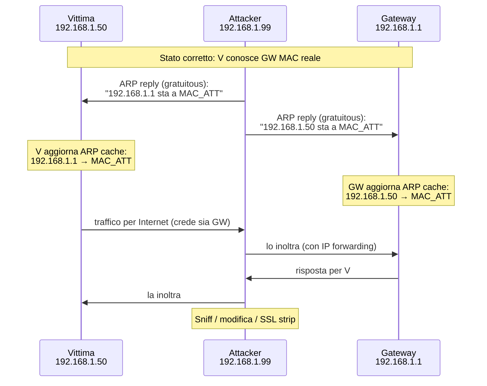
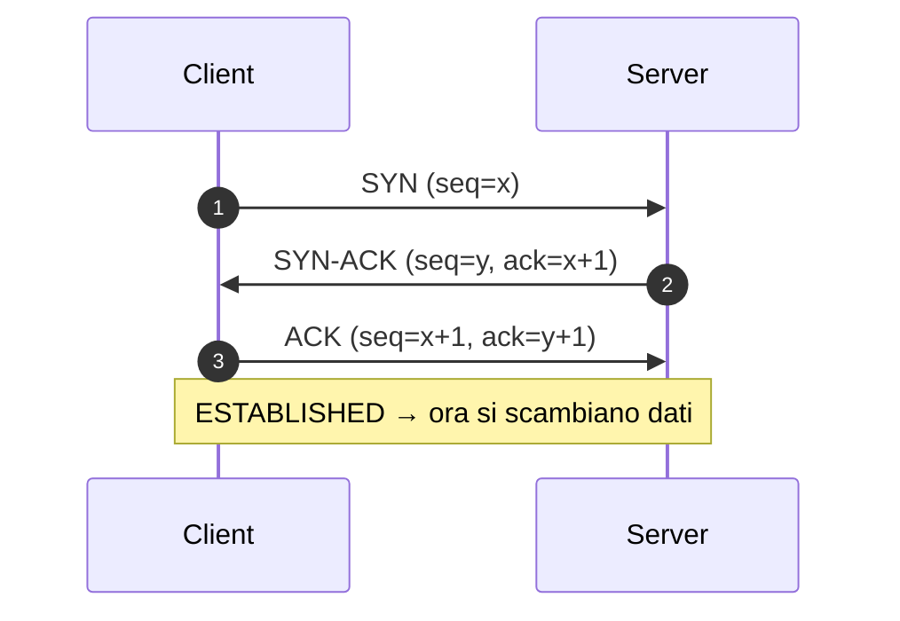
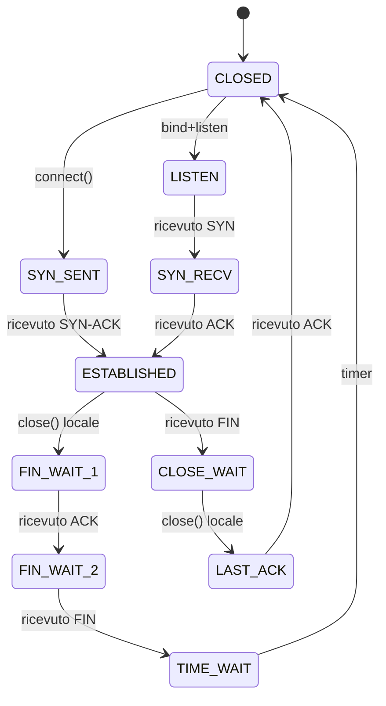

# Networking: dai cavi a TCP/IP

## Il modello OSI vs il modello TCP/IP

| Livello OSI | Livello TCP/IP | Esempi |
|---|---|---|
| 7 Application | Application | HTTP, DNS, SMTP, SSH, FTP |
| 6 Presentation | (incluso in Application) | TLS, ASN.1, JSON |
| 5 Session | (incluso) | RPC, session tokens |
| 4 Transport | Transport | TCP, UDP, QUIC, SCTP |
| 3 Network | Internet | IP (v4/v6), ICMP, IPsec |
| 2 Data Link | Link | Ethernet, Wi-Fi, ARP, MAC |
| 1 Physical | Link | Cavo, fibra, onda radio |

In pratica usiamo il modello TCP/IP a 4 strati. Il modello OSI a 7 è didattico: ti aiuta a ragionare sui ruoli ma nella vita reale "session" e "presentation" raramente si distinguono.

Concetto chiave: **incapsulamento**. Ogni livello aggiunge un header al payload del livello superiore.

```mermaid
flowchart TB
    A[HTTP request<br/>GET /api/users] --> B[+ TLS record header<br/>cifratura, MAC]
    B --> C[+ TCP header<br/>porte src/dst, seq, ack, flag]
    C --> D[+ IP header<br/>IP src/dst, TTL, proto]
    D --> E[+ Ethernet header<br/>MAC src/dst, EtherType]
    E --> F[bit fisici<br/>cavo / fibra / radio]
    style A fill:#0b3a1a,stroke:#00ff9c
    style F fill:#3a0b0b,stroke:#ff4d4d
```



Tutto il packet sniffing/spoofing/MITM lavora *togliendo* incapsulamenti per leggere o *modificando* un header per ingannare.

## Livello 2: Ethernet, MAC, ARP

### MAC address
48 bit, ogni scheda di rete ne ha uno. Convenzione: `aa:bb:cc:dd:ee:ff`. I primi 3 byte (OUI) identificano il vendor.

```bash
ip link show
ip link set dev eth0 address 02:00:00:00:00:01    # MAC spoofing
macchanger -r eth0                                 # random
```

### Switch
Funziona a livello 2: vede MAC, costruisce CAM table `MAC ↔ porta`. Limita il dominio di broadcast del singolo segmento.

**Attacchi switch tipici:**
- **MAC flooding** (CAM table overflow): satura la CAM con MAC fasulli → lo switch entra in modalità "hub" → ricevi tutto il traffico. Tool: `macof`.
- **VLAN hopping** (double tagging / DTP): abusare di trunk per saltare di VLAN.

### ARP (Address Resolution Protocol)
Mappa IP → MAC sulla LAN. Quando vuoi parlare con `192.168.1.1`, fai broadcast ARP "chi ha 192.168.1.1?". Il proprietario risponde "io, MAC è AA:BB:..".

ARP è **stateless e senza autenticazione**. Chiunque sulla LAN può rispondere a una request, o spammare ARP reply spontanee (gratuitous ARP). → **ARP spoofing / poisoning**: convinci la vittima che TU sei il gateway, e il gateway che TU sei la vittima. Il traffico passa da te. È il MITM classico in LAN.



Tool: `arpspoof`, `bettercap`, `ettercap`.

**Difese:**
- Static ARP (su host critici).
- DHCP snooping + Dynamic ARP Inspection (DAI) sugli switch enterprise.
- 802.1X port-based auth.
- VLAN segmentation.

Vediamo lo spoofing in pratica nella sezione 12.

## Livello 3: IP

### IPv4
32 bit, scritto come 4 ottetti decimali (`192.168.1.10`). Con la **subnet mask** (es. `/24` = `255.255.255.0`) si distinguono network e host.

```text
192.168.1.10/24
  network: 192.168.1.0
  broadcast: 192.168.1.255
  range usabili: 192.168.1.1 - 192.168.1.254
```

#### Classi private (RFC 1918) — non instradabili su internet
- `10.0.0.0/8`
- `172.16.0.0/12`
- `192.168.0.0/16`

#### Speciali
- `127.0.0.0/8` loopback (`127.0.0.1` = me stesso)
- `169.254.0.0/16` link-local (APIPA, quando DHCP fallisce)
- `0.0.0.0` "tutte le interfacce" / default route
- `224.0.0.0/4` multicast
- `255.255.255.255` broadcast limitato

### IPv6
128 bit, 8 gruppi di 4 hex separati da `:` con compressione. `2001:0db8:0000:0000:0000:ff00:0042:8329` → `2001:db8::ff00:42:8329`.

- `::1/128` loopback
- `fe80::/10` link-local (sempre presente)
- `fc00::/7` ULA (private)
- `2000::/3` global unicast (instradabili)

IPv6 ha autoconfigurazione (SLAAC), niente ARP (lo sostituisce NDP — Neighbor Discovery Protocol), niente NAT (in teoria), niente broadcast (multicast).

**Attenzione security:** molte reti hanno IPv6 abilitato di default ma firewall solo per IPv4 → bypass involontari. Verificare sempre `ip -6 ...`.

### Header IP (semplificato)

```text
0       4       8              16                              31
+-------+-------+--------------+-------------------------------+
| Ver=4 | IHL   | Type of Serv | Total Length                  |
+-------+-------+--------------+----------+--------------------+
| Identification               | Flags     | Fragment Offset    |
+-----------------------------+------+-----+--------------------+
| TTL          | Protocol     | Header Checksum                |
+--------------+--------------+--------------------------------+
| Source Address (32 bit)                                       |
+---------------------------------------------------------------+
| Destination Address (32 bit)                                  |
+---------------------------------------------------------------+
| Options (rare) ... + Padding                                  |
+---------------------------------------------------------------+
| Payload (TCP/UDP/ICMP/...)                                    |
```

Campi utili:
- **TTL** (Time To Live): decrementato di 1 ad ogni hop. Se arriva a 0 → ICMP TTL expired. Base di **traceroute**.
- **Protocol:** identifica il payload (1=ICMP, 6=TCP, 17=UDP, 47=GRE, 50=ESP, ...).
- **Flags+Fragment Offset:** frammentazione. Storicamente abusato per IDS evasion (ricostruzione ambigua).

### Routing
Il routing è il processo di decidere "su quale interfaccia mandare un pacchetto destinato a quell'IP". Ogni host ha una tabella; in mancanza di rotte specifiche → **default gateway**.

```bash
ip route
# default via 192.168.1.1 dev wlan0
# 192.168.1.0/24 dev wlan0 proto kernel scope link src 192.168.1.20

ip route add 10.10.10.0/24 via 192.168.1.254
```

### NAT (Network Address Translation)
La causa per cui hai un IP privato a casa ma navighi su internet. Il router riscrive l'IP sorgente in uscita col proprio IP pubblico, mantiene una tabella (IP+porta interna ↔ IP+porta esterna) e fa il contrario in entrata.

**SNAT** (Source NAT): traduzione in uscita (la cosa che fa il tuo router).
**DNAT** (Destination NAT): traduzione in entrata (port forwarding).
**PAT / NAPT:** NAT con porte (Linux iptables masquerade).

In pentest interno il NAT del target spesso è un ostacolo (non puoi raggiungere host privati direttamente da fuori) e si bypassa con tunnel/pivoting (vedi sezione 12).

### ICMP
Protocollo di controllo IP. Tipi famosi: 8 (echo request = ping), 0 (echo reply), 3 (destination unreachable), 11 (TTL expired, base traceroute), 5 (redirect — usato per attacchi).

`ping`, `traceroute`/`tracert`, `mtr` usano ICMP (o UDP per traceroute Unix di default — porte 33434+). Su molte reti enterprise ICMP è filtrato in egress: se ping fallisce non significa che l'host sia giù.

## Livello 4: TCP e UDP

### UDP
- Connectionless, senza handshake.
- Senza garanzia di consegna né ordine.
- Header: porte src/dst, lunghezza, checksum. Punto.
- Veloce, usato per DNS, DHCP, QUIC, VoIP, gaming, syslog, NTP.

### TCP
- Connection-oriented, con stati.
- Garantisce consegna in ordine e senza duplicati.
- Three-way handshake:



Chiusura:
- **FIN** + ACK in entrambi i sensi (graceful)
- **RST** (reset, "abbattere subito")

### Header TCP (rilevante)

```text
src port (16 b) | dst port (16 b)
sequence number (32 b)
ack number (32 b)
data offset | reserved | URG ACK PSH RST SYN FIN | window (16 b)
checksum (16 b) | urgent ptr (16 b)
options (TCP MSS, SACK, timestamp, window scale)
data...
```

**Flag rilevanti:**
- **SYN**: inizia connessione
- **ACK**: conferma ricezione
- **FIN**: chiusura graceful
- **RST**: chiusura forzata
- **PSH**: push immediato all'applicazione
- **URG**: dati urgenti (raramente usato)

**Stato porte (lato server):**
- **OPEN**: c'è un servizio in listen (risponde con SYN-ACK).
- **CLOSED**: nessun servizio (risponde con RST).
- **FILTERED**: il firewall blocca (nessuna risposta, o ICMP unreachable).

`nmap` distingue questi stati (sezione 9).

### Stati TCP che vedrai



`ss -tan` per vederli sul tuo sistema.

### Porte well-known
| Porta | TCP/UDP | Servizio |
|---|---|---|
| 20/21 | TCP | FTP (data/control) |
| 22 | TCP | SSH |
| 23 | TCP | Telnet (cleartext, evita) |
| 25 | TCP | SMTP |
| 53 | TCP/UDP | DNS |
| 67/68 | UDP | DHCP server/client |
| 80 | TCP | HTTP |
| 88 | TCP/UDP | Kerberos |
| 110 | TCP | POP3 |
| 123 | UDP | NTP |
| 135 | TCP | MS-RPC endpoint mapper |
| 137-139 | TCP/UDP | NetBIOS |
| 143 | TCP | IMAP |
| 161/162 | UDP | SNMP / trap |
| 389 | TCP/UDP | LDAP |
| 443 | TCP | HTTPS |
| 445 | TCP | SMB |
| 465 | TCP | SMTPS |
| 514 | UDP | syslog |
| 587 | TCP | SMTP submission (TLS) |
| 636 | TCP | LDAPS |
| 993 | TCP | IMAPS |
| 995 | TCP | POP3S |
| 1433/1521/3306/5432/27017 | TCP | DB (MSSQL/Oracle/MySQL/Postgres/Mongo) |
| 3389 | TCP | RDP |
| 5985/5986 | TCP | WinRM HTTP/HTTPS |
| 8080/8443 | TCP | HTTP/S alternative |

Memorizzare almeno le top 30. Saranno la prima cosa che cerchi su un target.

## DNS: i nomi del web

DNS traduce nomi (`www.example.com`) in IP. Gerarchia: root → TLD → autoritativo del dominio.

**Tipi di record principali:**
| Tipo | Cosa fa |
|---|---|
| A | nome → IPv4 |
| AAAA | nome → IPv6 |
| CNAME | alias verso altro nome |
| MX | mail server del dominio |
| TXT | testo libero (SPF, DKIM, verifiche, …) |
| NS | name server autoritativi |
| SOA | start of authority |
| PTR | reverse DNS (IP → nome) |
| SRV | service location (Kerberos, AD, …) |
| CAA | quali CA possono emettere cert per il dominio |
| DS / DNSKEY | DNSSEC |

```bash
dig example.com               # A
dig +short example.com
dig MX example.com
dig @8.8.8.8 example.com      # query a un resolver specifico
dig ANY example.com           # spesso filtrato
dig +trace example.com        # query dalla root
dig -x 8.8.8.8                # reverse
```

**Resolver pubblici:** 1.1.1.1 (Cloudflare), 8.8.8.8 (Google), 9.9.9.9 (Quad9).

**Attacchi DNS:**
- **DNS spoofing / cache poisoning** (vedi Kaminsky 2008) — iniettare risposte false nel cache di un resolver.
- **DNS hijacking** (a livello di registrar/account utente).
- **DNS amplification** — usare resolver aperti per DoS amplificato.
- **DNS tunneling** — esfiltrare dati incapsulati in query DNS (lento ma spesso passa firewall). Tool: `dnscat2`, `iodine`.
- **NXDOMAIN flood, NSEC walking.**

**Difese:** DNSSEC (firma), DoT/DoH (DNS over TLS / over HTTPS), DNS sinkholing per blue team.

## DHCP

Dynamic Host Configuration Protocol. Discovery automatica di config rete.

```text
Client → DHCPDISCOVER (broadcast)
Server → DHCPOFFER (offerta: IP X, lease Y, gateway Z, DNS W)
Client → DHCPREQUEST (accetto)
Server → DHCPACK
```

Cleartext, senza auth → un attaccante può:
- Diventare **rogue DHCP server** e dare ai client gateway/DNS controllati da lui.
- **DHCP starvation:** esaurire il pool del DHCP server reale e poi diventare il suo sostituto.

Difese: DHCP snooping su switch.

## Wireshark e tcpdump

I tuoi occhi sulla rete.

### tcpdump

```bash
sudo tcpdump -i eth0                  # tutto
sudo tcpdump -i eth0 -nn -v port 80   # solo HTTP, numerico, verbose
sudo tcpdump -i eth0 host 1.2.3.4
sudo tcpdump -i eth0 net 192.168.1.0/24
sudo tcpdump -i eth0 -w capture.pcap  # salva
sudo tcpdump -r capture.pcap          # leggi
sudo tcpdump -A 'port 80'             # ASCII payload (HTTP cleartext)
sudo tcpdump 'tcp[tcpflags] & (tcp-syn) != 0'  # solo SYN
```

Filtri BPF (Berkeley Packet Filter): `host`, `net`, `port`, `tcp`, `udp`, `icmp`, `and`, `or`, `not`, parentesi.

### Wireshark

GUI per analisi pcap. Filtri di display diversi da BPF: `ip.addr == 1.2.3.4`, `tcp.port == 443`, `http.request.method == "POST"`, `tls.handshake.type == 1`, `dns.qry.name contains "evil"`.

Funzioni killer:
- **Follow TCP stream** — ricostruisce la conversazione.
- **Decrypt TLS** se hai le SSL keys (var d'ambiente `SSLKEYLOGFILE`).
- **Statistics → Conversations / I/O Graph / Protocol Hierarchy.**
- **Expert Info.**

Userai Wireshark in CTF (challenge "Cattura il traffico"), in incident response, in network troubleshooting.

## Firewall e ACL

### iptables / nftables (Linux)

iptables è il vecchio motore (sostituito da nftables, syntax `nft`). Concetto: catene (INPUT, FORWARD, OUTPUT) con regole. Ogni regola: match → target.

```bash
# Drop tutto in input, accetta SSH e già stabilite
iptables -P INPUT DROP
iptables -A INPUT -m state --state ESTABLISHED,RELATED -j ACCEPT
iptables -A INPUT -i lo -j ACCEPT
iptables -A INPUT -p tcp --dport 22 -j ACCEPT

# Forward (per NAT/routing)
iptables -t nat -A POSTROUTING -o eth0 -j MASQUERADE

# Salvare regole
iptables-save > /etc/iptables.rules
```

In sicurezza: **default deny**, esposizione **minima**, log delle drop.

### Windows Firewall, ufw, firewalld
- **ufw:** wrapper amichevole di iptables (`ufw allow 22`).
- **firewalld:** wrapper su nftables/iptables con zone (public, internal, dmz, ...).
- **Windows Defender Firewall:** profili Domain/Private/Public, regole inbound/outbound. Configurabile via PowerShell (`New-NetFirewallRule`).

## VLAN e segmentazione

Una **VLAN** (Virtual LAN) divide logicamente uno switch in domini di broadcast separati (tag 802.1Q nei frame). Permette segmentazione senza più switch fisici.

In sicurezza la segmentazione è centrale: rete OT staccata dall'IT, server in DMZ, workstation non a contatto diretto con DB. **Zero Trust** porta questo principio all'estremo: nessuna implicita fiducia in base alla posizione di rete.

## Esercizi

### Esercizio 3.1 — Subnetting a mano
Per ognuno: trova network address, broadcast, range host usabili, numero di host.

1. `10.20.30.40/26`
2. `192.168.1.130/29`
3. `172.16.5.0/20`

<details><summary>Soluzione</summary>

1. `/26` → 6 bit host → 64 IP, 62 usabili. `10.20.30.0/26` ha 0-63; `40` cade qui. Network `10.20.30.0`, broadcast `10.20.30.63`, host `10.20.30.1`–`10.20.30.62`.
2. `/29` → 3 bit host → 8 IP, 6 usabili. Subnet contenente `.130`: blocchi `.128`–`.135`. Net `192.168.1.128`, broadcast `.135`, host `.129`–`.134`.
3. `/20` → 12 bit host → 4096 IP, 4094 usabili. Mask `255.255.240.0`. Subnet contenente `172.16.5.0`: `172.16.0.0`–`172.16.15.255`. Net `172.16.0.0`, bc `172.16.15.255`, host `172.16.0.1`–`172.16.15.254`.

</details>

### Esercizio 3.2 — Cattura il tuo handshake
1. `sudo tcpdump -i any -w handshake.pcap host example.com`
2. In un'altra shell: `curl https://example.com` (o apri il browser).
3. Stoppa, apri con Wireshark.
4. Identifica: DNS query, TCP SYN, SYN-ACK, ACK, TLS Client Hello, Server Hello, certificate, application data, FIN.

### Esercizio 3.3 — Decrittare HTTPS in lab
1. Setta `export SSLKEYLOGFILE=~/sslkeys.log` prima di lanciare Firefox/Chrome.
2. Cattura traffico (`tcpdump -w cap.pcap`).
3. In Wireshark: Edit → Preferences → Protocols → TLS → "(Pre)-Master-Secret log filename" → seleziona il file.
4. Ora vedi HTTP in chiaro.

Cosa dimostra questa procedura sulla sicurezza di TLS? Cosa serve all'attaccante per fare questo lato vittima senza accesso fisico alla macchina?

<details><summary>Spiegazione</summary>

TLS è sicuro contro chi sniffa la rete senza chiavi. Per decrittare serve la chiave privata del server **oppure** le pre-master keys delle sessioni (cosa che il browser ti regala se chiedi). Senza compromettere uno dei due endpoint, lo sniffing puro non basta. Per questo gli attacchi MITM moderni puntano a:
- **Sostituire il certificato** (trust store compromesso, Burp/mitmproxy con CA installata).
- **Downgrade** (SSL strip, TLS downgrade, raro oggi con HSTS).
- **Compromettere il client** (malware) o il server (leak chiave privata).

</details>

### Esercizio 3.4 — DNS deep dive
1. Trova tutti i record NS di `wikipedia.org`. Quanti sono?
2. Trova l'MX di `google.com` con priorità.
3. Trova SPF (record TXT che inizia con `v=spf1`) di `microsoft.com`.
4. Cerca CAA di `letsencrypt.org`. Cosa significa?

<details><summary>Comandi</summary>

```bash
dig NS wikipedia.org +short
dig MX google.com +short
dig TXT microsoft.com | grep spf
dig CAA letsencrypt.org +short
```

CAA dice quali CA sono autorizzate ad emettere cert per il dominio. È una protezione contro CA fraudolente.

</details>

### Esercizio 3.5 — Mappa la tua rete domestica
Da Kali in lab (o sulla tua rete, con cautela):
- `ip addr` e `ip route` → identifica gateway e subnet.
- `arp -a` → host nella tua LAN.
- `nmap -sn 192.168.1.0/24` (host discovery, senza port scan).
- `nmap --top-ports 100 -sV 192.168.1.0/24` (solo sulla TUA rete).

Quanti host attivi? Quali servizi? Qualche printer/IoT esposto?

### Esercizio 3.6 — Tunnel SSH dinamico in pratica
1. Su VPS (anche un container locale): `ssh -D 1080 user@vps`.
2. Configura Firefox: Preferences → Network → Manual proxy → SOCKS5 127.0.0.1:1080, e "Proxy DNS when using SOCKS v5".
3. Naviga: il tuo IP visto da `whatsmyip.com` è quello del VPS.

Come limita un'azienda questa tecnica?

<details><summary>Spiegazione</summary>

- Egress firewall: SSH outbound bloccato su porte non standard / verso destinazioni non whitelistate.
- DPI / SSL inspection per riconoscere SSH non autorizzato.
- ZTNA / forward proxy che richiede auth e bloccano traffico non standard.
- Restrizioni sui binari (es. AppLocker su Windows impedisce di lanciare `ssh.exe` non firmato).

</details>

### Esercizio 3.7 — Sniffa HTTP cleartext
In lab: un client Linux + server con un servizio HTTP non-TLS. Cattura con tcpdump, ricostruisci con Wireshark "Follow TCP Stream". Cosa vedi se l'utente fa login con `POST /login` body cleartext? Cosa cambia con HTTPS?

## Concetti chiave

1. **OSI/TCP-IP encapsulation:** comprendere come ogni livello aggiunge header → base di sniffing/spoofing.
2. **MAC vs IP vs porta:** identità di livello 2/3/4.
3. **ARP è non autenticato, base del MITM in LAN.**
4. **TCP three-way handshake e stati delle porte:** base di scanning.
5. **DNS: gerarchia, record, tipi di attacchi.**
6. **NAT crea problemi di raggiungibilità (e per questo serve pivoting in pentest).**
7. **Wireshark/tcpdump + filtri** — strumenti indispensabili.

Nelle prossime sezioni passiamo allo strato applicativo (HTTP/TLS) e poi al "perché tutto questo è hackabile".
