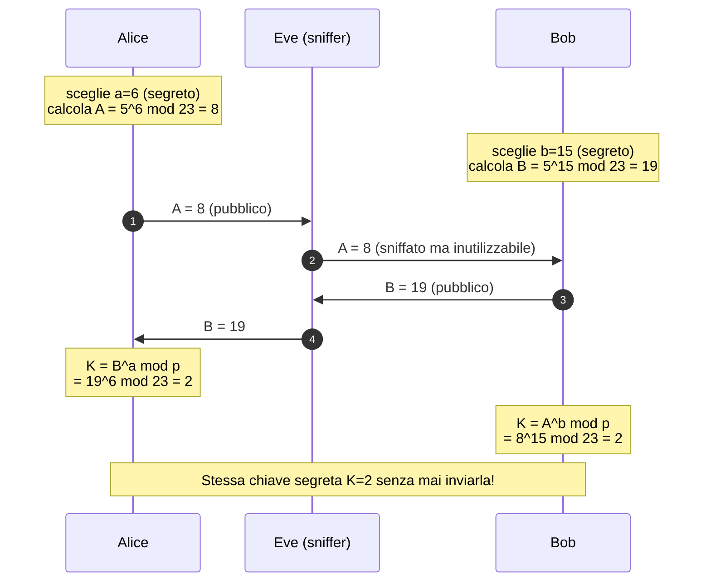
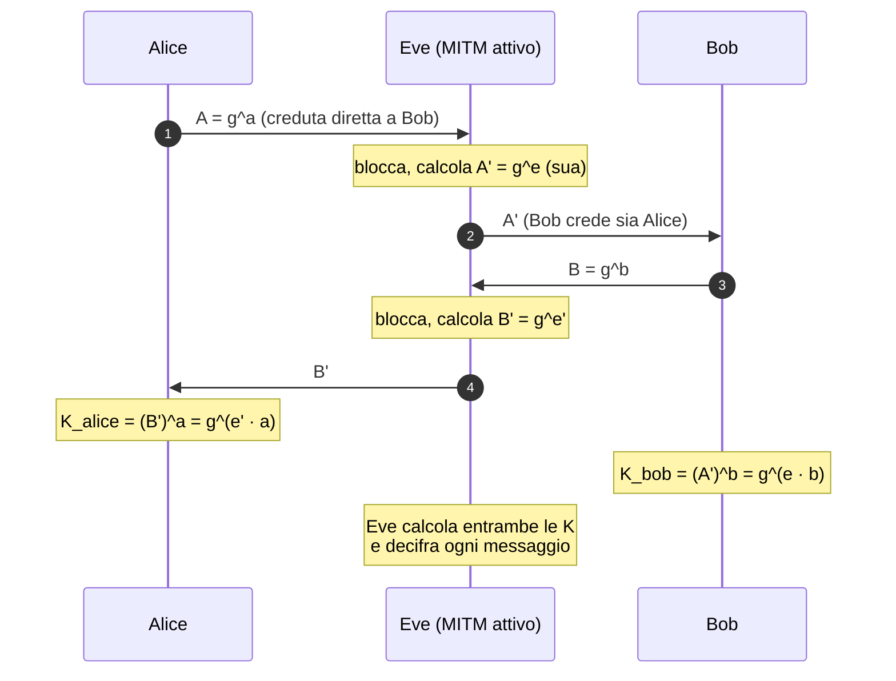
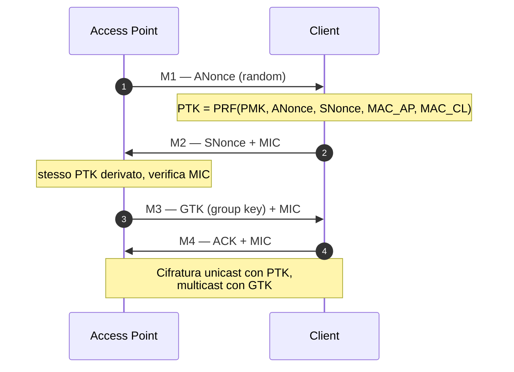

# Crittografia — esempi numerici passo-passo

> Tutto il "perché funziona" della crittografia diventa ovvio quando ti siedi a fare i conti su un foglio. Qui calcoliamo tutto **a mano** (con `pow(a,b,n)` per i conti più grandi). Niente passi saltati.

## 1. RSA — cifratura e decifratura passo-passo

### Generazione delle chiavi

Scegliamo due primi piccoli (in produzione: 1024 bit ciascuno!):
- $p = 61$, $q = 53$.

Calcoli:
- $n = pq = 61 \cdot 53 = 3233$.
- $\varphi(n) = (p-1)(q-1) = 60 \cdot 52 = 3120$.
- Scegli $e$ coprimo con $\varphi$: $e = 17$. Verifica: $\gcd(17, 3120) = 1$ ✅.
- Calcola $d = e^{-1} \mod \varphi(n)$. Con Euclide esteso o `pow(17, -1, 3120)` → $d = 2753$. Verifica: $17 \cdot 2753 = 46801 = 15 \cdot 3120 + 1$ ✅.

**Chiave pubblica:** $(n, e) = (3233, 17)$. **Chiave privata:** $(n, d) = (3233, 2753)$.

### Cifra il messaggio $m = 65$ (codice ASCII di 'A')

Cifratura: $c = m^e \mod n = 65^{17} \mod 3233$.

Calcolo step-by-step con **esponenziazione modulare ripetuta** (necessario per non far esplodere i numeri):

$$ 65^{17} = 65^{16} \cdot 65^1 = (65^8)^2 \cdot 65 $$

A mano (mod 3233 ad ogni step):
```
65^1   = 65
65^2   = 4225          → 4225 mod 3233 = 992
65^4   = 992^2 = 984064 → mod 3233 = ?
        984064 / 3233 = 304.4...  → 304 · 3233 = 982832  → 984064 - 982832 = 1232
65^4   ≡ 1232
65^8   = 1232^2 = 1517824 → mod 3233 = ?
        1517824 / 3233 = 469.5 → 469 · 3233 = 1516277 → 1517824 - 1516277 = 1547
65^8   ≡ 1547
65^16  = 1547^2 = 2393209 → mod 3233 = ?
        2393209 / 3233 ≈ 740.4 → 740 · 3233 = 2392420 → 2393209 - 2392420 = 789
65^16  ≡ 789

65^17  = 65^16 · 65^1 = 789 · 65 = 51285
        51285 mod 3233 = ?
        51285 / 3233 ≈ 15.86 → 15 · 3233 = 48495 → 51285 - 48495 = 2790
65^17  ≡ 2790
```

Quindi $c = 2790$. Verifica in Python: `pow(65, 17, 3233)` → 2790 ✅.

### Decifra

$m = c^d \mod n = 2790^{2753} \mod 3233$.

A mano è proibitivo, in Python: `pow(2790, 2753, 3233)` → **65**. ✅

**Funziona perché**: per Eulero, $m^{\varphi(n)} \equiv 1 \pmod n$ se $\gcd(m,n)=1$, e visto che $ed \equiv 1 \pmod{\varphi(n)}$, esiste $k$ con $ed = 1 + k\varphi(n)$. Quindi:
$$m^{ed} = m^{1 + k\varphi(n)} = m \cdot (m^{\varphi(n)})^k \equiv m \cdot 1^k = m \pmod n.$$

### Forma testuale "magica"

```
Alice                                        Bob
 │ genera (p,q) segreti                        │
 │ calcola n, e, d                             │
 │ pubblica (n, e) ─────────────────────────►  │
 │                                             │ vuole inviare m=65
 │                                             │ calcola c = m^e mod n = 2790
 │ ◄───────── c=2790 ──────────────────────────┤
 │ calcola m = c^d mod n = 65                  │
 │ legge "A"                                   │
```

Senza la chiave privata, anche conoscendo $n=3233, e=17, c=2790$, l'unico modo (senza scoperte matematiche) è **fattorizzare 3233 = 61·53**. Su 3233 fa ridere. Su un $n$ di 2048 bit (~617 cifre decimali) servirebbero migliaia di anni di CPU.

### Perché RSA "textbook" è insicuro (importantissimo)

Cifra $m_1 = 2$ e $m_2 = 3$ con stessa chiave $(e=17, n=3233)$:
- $c_1 = 2^{17} \mod 3233 = 131072 \mod 3233 = 131072 - 40\cdot 3233 = 131072 - 129320 = 1752$.
- $c_2 = 3^{17} \mod 3233$. `pow(3,17,3233)` = 3055. Verifica.

Ora $c_1 \cdot c_2 \mod n = 1752 \cdot 3055 \mod 3233 = ?$. Con Python: `(1752 * 3055) % 3233 = 1486`.

E $(m_1 m_2)^e \mod n = 6^{17} \mod 3233 = ?$. `pow(6, 17, 3233) = 1486`. **Identico.**

Cioè: $E(m_1) \cdot E(m_2) = E(m_1 \cdot m_2)$. Questa è la **proprietà moltiplicativa di RSA**. Permette **attacchi chosen-plaintext** (puoi modificare il cipher in modo prevedibile). Per questo si usa **padding OAEP** che spezza la proprietà aggiungendo dati random.

### Padding RSA: PKCS#1 v1.5 vs OAEP

RSA "raw" cifra solo `m < n`. Per cifrare un blocco arbitrario di byte, lo si **padding-ifica** a esattamente `k = |n|` byte (es. 256 per RSA-2048).

#### PKCS#1 v1.5 (vecchio, vulnerabile)

```
EM = 00 || 02 || PS || 00 || M
     │     │     │    │     │
     │     │     │    │     └── messaggio (k-3-len(PS) byte)
     │     │     │    └────── separatore
     │     │     └──────── padding random (>= 8 byte di NON-zero)
     │     └────────── tipo block (02 = encrypted)
     └────────── 0x00 iniziale
```

Problema: si può **discriminare** un cipher "padding valido" da uno "non valido" via comportamento del server (errore vs OK). Bleichenbacher 1998 dimostra che con queste informazioni si può recuperare un `m` cifrato in $\sim 2^{20}$ query (qualche ora). Tutti i protocolli che usano PKCS#1 v1.5 in modalità interattiva → vulnerabili. Es. **ROBOT attack 2017** trovò questo in TLS 1.2 di Facebook, F5, Cisco.

#### OAEP — Optimal Asymmetric Encryption Padding

L'algoritmo:

```
                ┌─────────────────────┐
                │     messaggio M     │
                └─────────────────────┘
                          │
                  ┌───────┴───────┐
                  │               │
                  ▼               ▼
        ┌───────────────┐  ┌──────────┐
        │ M || 00..00   │  │ random r │
        │ (k0 byte)     │  │ (k1 byte)│
        └───────┬───────┘  └────┬─────┘
                │               │
                ▼               │
            G(r) MGF1           │
                │               │
                ▼               │
              XOR               │
                │               │
                ▼               │
            X = M||000 ⊕ G(r)   │
                │               │
                ├─► H(X) MGF1   │
                │       │       │
                │       ▼       │
                │      XOR ◄────┘
                │       │
                │       ▼
                │    Y = r ⊕ H(X)
                │       │
                └───────┴────► EM = 0x00 || X || Y
                              poi RSA(EM)
```

`MGF1` è una "mask generation function" basata su SHA-256. Effetto:
- L'output è **indistinguibile da random**.
- Senza la chiave privata, non si può fare verifica di padding "valido vs non" → **niente padding oracle**.
- Anche la **proprietà moltiplicativa** è rotta perché il padding random rende non lineare.

**Pratica:** in Python `cryptography`:

```python
from cryptography.hazmat.primitives.asymmetric import padding
from cryptography.hazmat.primitives import hashes

ciphertext = pub_key.encrypt(
    message,
    padding.OAEP(
        mgf=padding.MGF1(algorithm=hashes.SHA256()),
        algorithm=hashes.SHA256(),
        label=None
    )
)
```

**Mai** `padding.PKCS1v15()` se hai scelta.

## 2. Diffie-Hellman — scambio di chiavi a mano

Alice e Bob vogliono concordare una chiave segreta **senza** averla mai inviata in chiaro, su un canale che chiunque può ascoltare.

**Parametri pubblici** (concordati o standard): un primo $p$ e un generatore $g$. Esempio educational: $p = 23$, $g = 5$.



**Entrambi arrivano a $K = 2$.** Eve, che ha visto $g=5, p=23, A=8, B=19$, dovrebbe calcolare $\log_5 8 \mod 23$ (cioè $a=6$) — il **problema del logaritmo discreto** — che è "facile" su $p=23$ ma su $p$ di 2048 bit diventa intrattabile.

### Verifica algebrica

$$ K = A^b = (g^a)^b = g^{ab} $$
$$ K = B^a = (g^b)^a = g^{ba} = g^{ab} $$

Stesso valore. ✅

### Calcoli step

$5^6 \mod 23$:
```
5^1 = 5
5^2 = 25 = 23·1 + 2 → 2
5^4 = 2^2 = 4
5^6 = 5^4 · 5^2 = 4 · 2 = 8
```

$5^{15} \mod 23$ (Bob): 
- $5^{15} = 5^{8+4+2+1}$. 
- $5^1 = 5$. $5^2 = 2$. $5^4 = 4$. $5^8 = 4^2 = 16$. 
- $5^{15} = 16 \cdot 4 \cdot 2 \cdot 5 = 640 \mod 23 = 640 - 27\cdot 23 = 640 - 621 = 19$. ✅

$19^6 \mod 23$ (Alice):
- $19^2 = 361 \mod 23 = 361 - 15\cdot 23 = 361 - 345 = 16$.
- $19^4 = 16^2 = 256 \mod 23 = 256 - 11\cdot 23 = 3$.
- $19^6 = 19^4 \cdot 19^2 = 3 \cdot 16 = 48 \mod 23 = 2$. ✅

### Man-in-the-middle classico (perché serve l'autenticazione)



DH "puro" è **vulnerabile a MITM**. Per questo TLS combina DH con **firma** del server (per autenticarlo): l'attaccante in mezzo non sa firmare con la chiave privata del server, smascherato.

## 3. ECC visualizzato (curva ellittica)

Una curva ellittica su reali: $y^2 = x^3 + ax + b$. Esempio $a = -1, b = 1$:

<figure class="diagram">
<svg viewBox="-200 -180 400 360" width="500" height="450" xmlns="http://www.w3.org/2000/svg">
  <!-- assi -->
  <line x1="-190" y1="0" x2="190" y2="0" stroke="#5b6669" stroke-width="1"/>
  <line x1="0" y1="-170" x2="0" y2="170" stroke="#5b6669" stroke-width="1"/>
  <text x="185" y="-6" fill="#8a9499" font-family="JetBrains Mono" font-size="11">x</text>
  <text x="6" y="-165" fill="#8a9499" font-family="JetBrains Mono" font-size="11">y</text>
  <!-- curva y^2 = x^3 - x + 1, parametrizzata, due rami -->
  <path d="M -160,-15 Q -140,-30 -120,-50 Q -90,-80 -50,-90 Q -20,-95 0,-90 Q 30,-85 60,-70 Q 100,-50 140,-25 Q 170,-12 195,0"
        fill="none" stroke="#00e6ff" stroke-width="2"/>
  <path d="M -160,15 Q -140,30 -120,50 Q -90,80 -50,90 Q -20,95 0,90 Q 30,85 60,70 Q 100,50 140,25 Q 170,12 195,0"
        fill="none" stroke="#00e6ff" stroke-width="2"/>
  <!-- punti P, Q, R, P+Q -->
  <circle cx="-80" cy="-70" r="5" fill="#00ff9c"/>
  <text x="-105" y="-78" fill="#00ff9c" font-family="JetBrains Mono" font-size="13">P</text>
  <circle cx="40" cy="55" r="5" fill="#00ff9c"/>
  <text x="45" y="73" fill="#00ff9c" font-family="JetBrains Mono" font-size="13">Q</text>
  <!-- retta tra P e Q estesa -->
  <line x1="-160" y1="-126" x2="150" y2="100" stroke="#ffe066" stroke-width="1.5" stroke-dasharray="5 4"/>
  <!-- terzo punto sulla retta (R) e il suo riflesso (P+Q) -->
  <circle cx="120" cy="84" r="5" fill="#ff3da6"/>
  <text x="125" y="100" fill="#ff3da6" font-family="JetBrains Mono" font-size="13">R</text>
  <line x1="120" y1="84" x2="120" y2="-84" stroke="#ff3da6" stroke-width="1" stroke-dasharray="3 3"/>
  <circle cx="120" cy="-84" r="5" fill="#ff3da6"/>
  <text x="125" y="-75" fill="#ff3da6" font-family="JetBrains Mono" font-size="13">P+Q</text>
  <text x="-180" y="-150" fill="#e8eef0" font-family="JetBrains Mono" font-size="11">y² = x³ − x + 1</text>
</svg>
<figcaption>Addizione su curva ellittica: P + Q = riflesso del terzo punto di intersezione</figcaption>
</figure>

**Addizione di punti** (intuizione grafica):
1. Tira la retta tra $P$ e $Q$.
2. La retta interseca la curva in un terzo punto $R'$.
3. Rifletti $R'$ rispetto all'asse $x$ → $R = P + Q$.

**Raddoppio**: tangente in $P$ → terzo punto → riflesso.

In modular arithmetic (curve $y^2 \equiv x^3 + ax + b \pmod p$), questa addizione diventa puramente algebrica con formule esplicite.

### Esempio numerico minimal

Curva $y^2 = x^3 + 2x + 3 \pmod{97}$. Verifica che $P = (3, 6)$ sia un punto: $6^2 = 36 \equiv 27 + 6 + 3 = 36 \pmod{97}$ ✅.

Calcoliamo $2P$:
- Slope (tangente): $\lambda = (3x^2 + a) / (2y) = (27 + 2) / 12 = 29/12 \pmod{97}$.
- $12^{-1} \mod 97$ = ? `pow(12, -1, 97) = 89` (verifica: $12 \cdot 89 = 1068 = 11 \cdot 97 + 1$).
- $\lambda = 29 \cdot 89 \mod 97 = 2581 \mod 97 = 2581 - 26 \cdot 97 = 2581 - 2522 = 59$.
- $x_3 = \lambda^2 - 2x = 59^2 - 6 = 3481 - 6 = 3475 \mod 97 = ?$ $3475 / 97 \approx 35.8$ → $35 \cdot 97 = 3395$ → $3475 - 3395 = 80$. $x_3 = 80$.
- $y_3 = \lambda(x - x_3) - y = 59 \cdot (3 - 80) - 6 = 59 \cdot (-77) - 6 = -4549 \mod 97$. $-4549 + 47 \cdot 97 = -4549 + 4559 = 10$. $y_3 = 10$.

Quindi $2P = (80, 10)$. Verifica: $10^2 = 100 \equiv 3 \pmod{97}$? $100 - 97 = 3$ ✅. E $80^3 + 2\cdot 80 + 3 = 512000 + 160 + 3 = 512163 \pmod{97}$? $512163 / 97 = 5279.0... \cdot 97 = 5279 \cdot 97 = 512063$. $512163 - 512063 = 100$. Wait, 100 mod 97 = 3 ✅.

**ECDH funziona analogamente a DH ma con "$nP$" (n-volte addizionato) al posto di $g^n$**. Il problema duro: dato $P$ e $nP$, trovare $n$ (logaritmo discreto su curva ellittica, ECDLP). Sui parametri standard (P-256, Curve25519) intrattabile.

## 4. AES round 1 dettagliato

AES-128 cifra blocchi di 128 bit (16 byte) usando una chiave 128 bit. Esegue **10 round**. Ogni round (tranne ultimo) ha 4 step:

1. **SubBytes** (S-box): sostituzione non-lineare byte-per-byte tramite tabella fissa.
2. **ShiftRows**: rotazione righe della matrice 4x4.
3. **MixColumns**: mescolamento lineare delle colonne.
4. **AddRoundKey**: XOR con la subkey del round.

### Esempio: input 128 bit
Stato iniziale (16 byte come matrice 4x4 column-major):

```
Stato (hex):
   32  88  31  e0
   43  5a  31  37
   f6  30  98  07
   a8  8d  a2  34
```

**Step 0 (AddRoundKey con chiave originale)** — non lo facciamo, partiamo da round 1.

**SubBytes**: sostituisci ogni byte con S-box[byte]. La S-box è una tabella 256-elementi pubblica.
```
S-box[0x32] = 0x23
S-box[0x88] = 0xc4
S-box[0x31] = 0xc7
...
```

Risultato (tabellato):
```
   23  c4  c7  e1
   1a  be  c7  9a
   42  04  46  c5
   c2  5d  3a  18
```

**ShiftRows**:
- Riga 0: no shift.
- Riga 1: shift sinistra 1.
- Riga 2: shift sinistra 2.
- Riga 3: shift sinistra 3.

```
   23  c4  c7  e1        ← invariata
   be  c7  9a  1a        ← shift left 1
   46  c5  42  04        ← shift left 2
   18  c2  5d  3a        ← shift left 3
```

**MixColumns**: ogni colonna $C$ è moltiplicata (in $GF(2^8)$) per la matrice fissa:
```
[ 2 3 1 1 ]
[ 1 2 3 1 ]
[ 1 1 2 3 ]
[ 3 1 1 2 ]
```

Su prima colonna $(23, be, 46, 18)$ (in hex). Operazioni in $GF(2^8)$. Si ottiene una nuova colonna. La matematica è completamente fissa, niente segreto.

**AddRoundKey**: XOR con la subkey del round 1 (derivata dall'originale via "key schedule" che è una piccola routine ricorsiva). Output del round 1.

**Continui 9 round.** L'ultimo salta MixColumns.

> Il punto: AES è una **rete di sostituzione-permutazione (SPN)**. Non c'è "magia matematica", c'è ingegneria di confusione (S-box) + diffusione (ShiftRows + MixColumns). Tutto trasparente, tutto pubblico, sicurezza nella chiave.

In Python con `pycryptodome`:
```python
from Crypto.Cipher import AES
key = bytes.fromhex("2b7e151628aed2a6abf7158809cf4f3c")
pt  = bytes.fromhex("3243f6a8885a308d313198a2e0370734")
ct  = AES.new(key, AES.MODE_ECB).encrypt(pt)
print(ct.hex())   # 3925841d02dc09fbdc118597196a0b32
```

Questo è esattamente l'esempio NIST FIPS-197.

## 5. Padding oracle — decifri byte per byte un cipher CBC senza la chiave

Setup:
- Cipher in CBC senza MAC, PKCS#7 padding.
- Server riceve cipher, decifra, restituisce response **diversa** se padding è "buono" vs "rotto".
- Questo è l'**oracolo**.

### Come funziona PKCS#7

Padding aggiunge byte ai dati per arrivare a multiplo di 16 (per AES). Se mancano $n$ byte: aggiungi $n$ byte tutti di valore $n$.
```
"hello"  (5 byte) → padded a 16 byte:
   68 65 6c 6c 6f 0b 0b 0b 0b 0b 0b 0b 0b 0b 0b 0b
                  └─────── 11 byte di 0x0b ──────────┘
```

Se i dati sono già multiplo di 16, aggiungi un blocco intero di 0x10. Il decoder controlla l'ultimo byte $p$ e verifica che gli ultimi $p$ byte siano tutti uguali a $p$.

### Attacco

In CBC, decifratura di blocco $C_n$: $P_n = D_K(C_n) \oplus C_{n-1}$.

Se tu **modifichi** $C_{n-1}$ → modifichi $P_n$ corrispondentemente. **Senza** modificare $D_K(C_n)$ (che non sai).

Diciamo $D_K(C_n) = I_n$ (l'intermediate). Allora $P_n = I_n \oplus C_{n-1}$.

**Obiettivo**: scoprire $I_n$ byte per byte. Una volta che hai $I_n$, $P_n$ vero = $I_n \oplus C_{n-1}$ vero.

#### Trovare l'ultimo byte di $I_n$

Manda al server: $C'_{n-1} \| C_n$ dove $C'_{n-1}$ ha byte casuali ma con l'ultimo byte $b$ variabile (da 0 a 255). Lo decoder calcola $P'_n = I_n \oplus C'_{n-1}$. Se l'ultimo byte di $P'_n$ è $0x01$ (padding valido di lunghezza 1), il server **accetta** il padding.

```
I_n[15] ⊕ C'_{n-1}[15] = 0x01
→ I_n[15] = 0x01 ⊕ C'_{n-1}[15]
```

In **al più 256 query** trovi il giusto $C'_{n-1}[15]$, quindi $I_n[15]$.

#### Trovare il penultimo byte

Ora vuoi padding `02 02` agli ultimi due posti. Imposta $C'_{n-1}[15] = I_n[15] \oplus 0x02$ (così sai che il padding finirà con `02`). Poi varia $C'_{n-1}[14]$ da 0 a 255 finché server accetta → trovato $I_n[14]$.

E così via, **byte per byte**, fino a recuperare $I_n$ intero — quindi $P_n$. In **~256 query × 16 byte = ~4096 query** decifri un blocco.

### Codice (pseudo)

```python
def find_byte(C_prev_known, C_target, position):
    """Trova I[position] modificando C_prev byte `position`."""
    target_pad = 16 - position
    # imposta byte da position+1 a 15 per ottenere target_pad nei finali
    for guess in range(256):
        C_new = bytearray(C_prev_known)
        C_new[position] = guess
        for i in range(position + 1, 16):
            C_new[i] = I[i] ^ target_pad   # I[i] già noto
        ct = bytes(C_new) + C_target
        if oracle(ct):    # ritorna True se padding accept
            return guess ^ target_pad     # I[position]
```

**Lab guidato:** [PortSwigger Padding Oracle Lab](https://portswigger.net/web-security/cryptography/lab-padding-oracle-attack). Risolvilo con `padbuster` automatizzato e poi rifallo a mano per capire.

> **Storico noto:** POODLE (SSLv3, 2014), .NET FormsAuth (2010), Steam server-side, JSF state.

## 6. Length extension a mano

Hash SHA-256 è basato su Merkle-Damgård. Date:
- $h = \text{SHA-256}(\text{secret} \| m)$ (firma "ingenua")
- $\text{len}(secret)$ noto.

**Senza** sapere `secret`, calcoli $h' = \text{SHA-256}(\text{secret} \| m \| \text{pad} \| \text{ext})$ per qualsiasi `ext`.

**Come?** Il "stato interno" finale di SHA-256 su `secret||m` è proprio $h$ (con piccolo trick di rappresentazione). Riprendi computazione da $h$ aggiungendo `ext`. Tool: `hashpump`, `hash_extender`, libreria Python.

```bash
hashpump -s '6d5f807e23db210bc254a28be2d6759a' \
         -d 'count=10&lat=37.351&user_id=1&long=-119.827&waffle=eggo' \
         -k 14 -a '&waffle=liege'

# Output: nuovo hash h' e payload completo (con secret rimpiazzato da pad)
```

**Mitigazione**: usa HMAC ($\text{HMAC}(K, m) = H(K_{outer} \| H(K_{inner} \| m))$, doppia chiamata) oppure SHA-3 (immune a length extension by design).

## 7. Visualizzazione del 4-way handshake WPA2



**Cosa cattura `airodump`**: gli scambi M1-M4 (specialmente M2 con MIC). Da M1+M2 + SSID:
- PMK = PBKDF2(passphrase, SSID, 4096, 32) → richiede candidate.
- PTK = PRF(PMK, ANonce, SNonce, MACs) → calcolabile.
- MIC = HMAC-MD5(PTK, M2 frame) → verifica.

L'attacco offline (`aircrack-ng` / `hashcat -m 22000`): per ogni candidate passphrase, calcoli PMK, PTK, MIC. Se MIC quadra → trovata. Velocità su GPU moderna: ~$10^6$/sec su WPA-PBKDF2.

## Esercizi

### Es 5b.1 — Cifra/decifra RSA a mano
Con $p=11, q=13, e=7$:
1. Calcola $n$, $\varphi$, $d$.
2. Cifra $m=9$.
3. Decifra $c$ ottenuto.

(Verifica con Python.)

<details><summary>Soluzione</summary>

$n=143, \varphi=120, d=103$. $c = 9^7 \mod 143 = 48$. $m = 48^{103} \mod 143 = 9$. ✅

</details>

### Es 5b.2 — DH a mano
Con $p=11, g=2$, $a=5$ (Alice), $b=4$ (Bob): calcola $A$, $B$, $K$.

<details><summary>Soluzione</summary>

$A = 2^5 \mod 11 = 32 \mod 11 = 10$. $B = 2^4 \mod 11 = 16 \mod 11 = 5$. $K_A = B^a = 5^5 \mod 11$. $5^2=25 \mod 11 = 3$; $5^4 = 9$; $5^5 = 45 \mod 11 = 1$. $K_B = A^b = 10^4 \mod 11$. $10 \equiv -1$, $10^4 \equiv 1$. ✅ $K=1$.

</details>

### Es 5b.3 — Fattorizza un piccolo $n$
$n = 247$. Trova $p, q$ a mano, deriva $d$ (avendo $e=5$).

<details><summary>Soluzione</summary>

Provi divisori. $247 / 13 = 19$. Quindi $p=13, q=19$. $\varphi = 12 \cdot 18 = 216$. $d = 5^{-1} \mod 216$. Estesa: $5 \cdot 173 = 865 = 4 \cdot 216 + 1$. $d = 173$.

</details>

### Es 5b.4 — RSA proprietà moltiplicativa
Con la chiave del paragrafo 1 ($n=3233, e=17$), cifra $m_1=2$ e $m_2=3$. Mostra che $c_1 c_2 \mod n = E(m_1 m_2)$.

### Es 5b.5 — Padding oracle in pratica
PortSwigger ha lab gratuiti su padding oracle. Risolvilo. (Cerca "padding oracle" nei lab.)

### Es 5b.6 — AES first round con OpenSSL
Usa OpenSSL per cifrare con AES-128 in mode "ECB single block" (`-nopad`):
```bash
echo -n "3243f6a8885a308d313198a2e0370734" | xxd -r -p | \
  openssl enc -aes-128-ecb -nopad -K 2b7e151628aed2a6abf7158809cf4f3c | xxd -p
```

Compara con valore atteso `3925841d02dc09fbdc118597196a0b32` (FIPS-197). Match?

### Es 5b.7 — Implementa HMAC a mano (riprendi sez 5)
Già visto, ma rifallo senza guardare. Verifica con `hmac.new`.

### Es 5b.8 — Length extension lab
Setup uno script Python che firma cleartext con `sha256(secret + msg)` e accetta solo input con firma valida. Senza modificare lo script, usa `hash_extender` per forge un nuovo input valido.

## Concetti chiave

1. **RSA** è esponenziazione modulare; sicurezza = difficoltà fattorizzazione $n$.
2. **DH** è esponenziazione modulare in gruppi; sicurezza = log discreto.
3. **ECC** è la stessa idea su curve ellittiche, con $k$ + $kP$. Chiavi più corte, stessa sicurezza.
4. **AES** è rete di sostituzione-permutazione, 10 round in AES-128.
5. **Padding oracle** trasforma "errori distinguibili" in decryption byte-per-byte.
6. **Length extension** richiede HMAC o SHA-3 per essere battuta.
7. **WPA2** offline crack = brute force PBKDF2 + match MIC.

Tutto è aritmetica. La sicurezza viene da numeri **enormi** + algoritmi specifici. Quando vedi formule, ricordati che dietro ci sono i calcoli che hai fatto tu su 60 secondi a mano.
