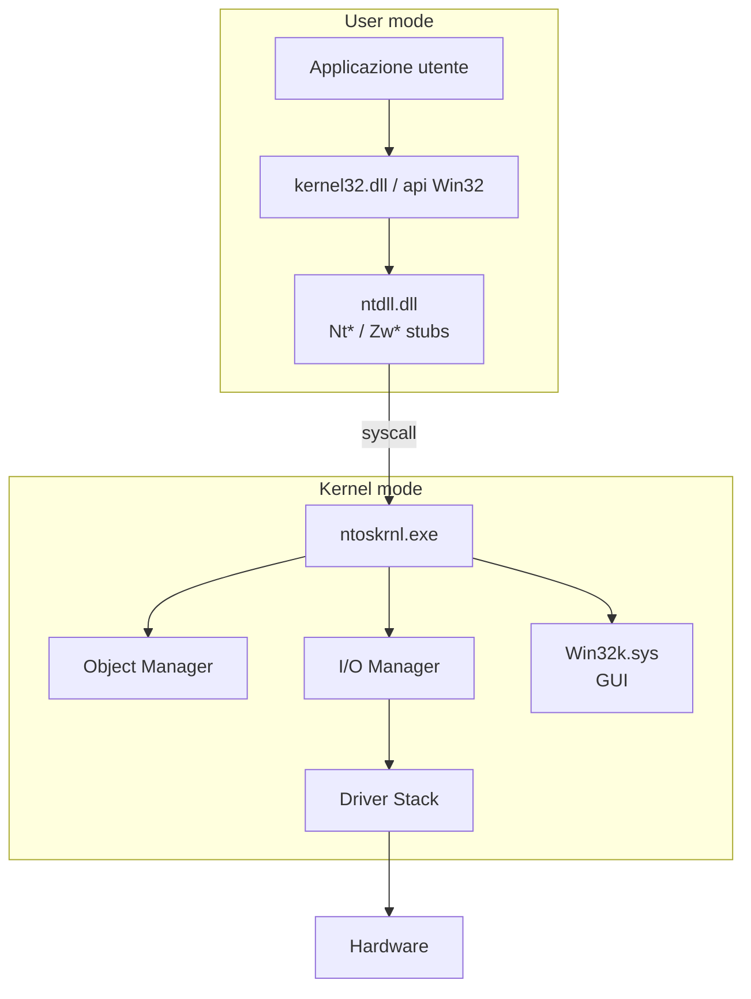

# OS internals: Linux e Windows in profondità

## Perché ti interessano gli internals

Non c'è privesc, persistence, evasion EDR, malware analysis senza capire come l'OS funziona dentro. Questa sezione mette le basi avanzate. Ne userai pezzi in **tutte** le sezioni successive (14 exploit dev, 15 reverse, 16 malware, 22 forensics).

## Boot e startup (Linux)

```text
Power → UEFI/BIOS firmware → bootloader (GRUB/systemd-boot) → kernel (vmlinuz) 
   → initramfs (driver di base) → root filesystem → /sbin/init (PID 1, oggi systemd)
   → target multi-user → servizi
```

Punti dove si annida malware:
- **UEFI implant** (LoJax, MosaicRegressor) — sopravvive alle reinstallazioni.
- **Bootloader bootkit** (BlackLotus su UEFI Secure Boot 2023 — bypass Baton Drop).
- **initramfs modificato**.
- **systemd unit/timer/service** (sezione 02).
- **kernel module rootkit** (vedremo dopo).

### Misure difensive moderne
- **Secure Boot**: solo bootloader firmati con chiavi nel firmware.
- **Measured Boot + TPM**: ogni step misurato (hash), salvato in PCR del TPM. Si possono validare a remoto via attestazione.
- **Verified boot** (Android, ChromeOS): catena di trust kernel/system.
- **Linux IMA / EVM**: integrità dei file in esecuzione.

## Kernel Linux: aree chiave

### Loadable Kernel Modules (LKM)
Il kernel è monolitico ma estendibile con `.ko`. Caricati con `insmod`/`modprobe`.

```bash
lsmod                          # moduli caricati
modinfo nf_conntrack
sudo dmesg | tail              # log kernel
```

**Rootkit kernel-mode:** modulo che intercetta syscall, nasconde processi/file, apre backdoor. Famosi: Diamorphine, Reptile, knark. Sintomi di compromissione: differenza tra `/proc/*/` direct ls vs `ps`, hidden PIDs, ramo `modules` modificato.

### eBPF — il "kernel modulare" senza modulo

**eBPF** (extended Berkeley Packet Filter) è una "macchina virtuale" che vive **dentro il kernel** e esegue programmi inviati dall'userspace. Il programma è scritto in C ristretto (no loop unbounded, no pointer arithmetic free), compilato in bytecode, **verificato** dal kernel prima dell'esecuzione (no crash, no out-of-bounds, terminazione garantita).

A cosa serve:
1. **Observability** — `bcc`, `bpftrace`, `Pixie`: profiler/tracer senza overhead percettibile. Vede ogni syscall, ogni open(), ogni connect().
2. **Networking** — **XDP** intercetta pacchetti a livello driver di rete (più veloce di iptables). **Cilium** sostituisce kube-proxy.
3. **Security** — **Falco**, **Tetragon**, **Tracee**: detection runtime in-kernel.

#### Esempio: trace di tutti gli `openat()` con bpftrace

```bash
sudo bpftrace -e '
  tracepoint:syscalls:sys_enter_openat {
    printf("%s %s\n", comm, str(args->filename));
  }
'
```

Output istantaneo per ogni file aperto da qualsiasi processo nel sistema. Zero `strace`, zero recompile, zero modulo kernel.

#### Come "sandbox" → meglio dei kernel module

| | Kernel module classico (`.ko`) | eBPF |
|---|---|---|
| Caricamento | `insmod` (richiede root + signing) | `bpf()` syscall (richiede CAP_BPF) |
| Sicurezza | accede a tutto il kernel | verifier blocca codice unsafe |
| Crash kernel possibile? | **sì** | **no** (per design) |
| Hot reload | difficile | banale |
| Aggiornamento kernel | spesso rompe | ABI stabile |

#### Lato attaccante / "Bad BPF"

Lo strumento è neutrale → si può abusare:
- **Hide processes / files** intercettando syscall del listing.
- **Network backdoor**: filtra/triggera su pacchetti specifici.
- **Tracing reverse**: eBPF può leggere memoria di altri processi (con CAP_BPF/CAP_SYS_ADMIN).
- **Persistence**: programmi eBPF "auto-attach" tramite cgroup/socket programs.

Esempio rumoroso: [boopkit](https://github.com/krisnova/boopkit), [TripleCross](https://github.com/h3xduck/TripleCross), [bad-bpf](https://github.com/pathtofile/bad-bpf).

**Detection lato blue team:**
- `bpftool prog show` → lista programmi caricati.
- `cat /sys/kernel/debug/tracing/events/` → tracepoint attivi.
- EDR moderni (CrowdStrike, SentinelOne) hanno baseline eBPF "legitimo" vs anomalo.
- Audit `bpf()` syscall via auditd.

### LSM (Linux Security Modules) — MAC

Discretionary access control (DAC) = i permessi rwx classici. **MAC** (Mandatory Access Control) = il kernel impone regole che neanche l'owner può aggirare.

- **SELinux**: politiche per dominio (subject, object, class). Modalità `enforcing`, `permissive`, `disabled`. Si vedono nel context (`ls -Z`, `ps -Z`).
- **AppArmor**: profili per binario, path-based. Più semplice di SELinux.
- **smack, Tomoyo**: meno comuni.

In pentest, un servizio confinato SELinux può limitare gli exploit anche con RCE. Negli stessi processi è comune trovare `setenforce 0` come prima azione (audit relativo). Audit log di SELinux: `/var/log/audit/audit.log`.

### Namespace e cgroup (riepilogo)
Già accennati: la base dei container. `unshare`, `nsenter`, `setns()`. `cgroup v2` modello unificato. Le breakout dei container sfruttano:
- mount/proc errati (`/proc/self/exe`, `/sys/fs/cgroup`).
- capabilities lasciate al container (`CAP_SYS_ADMIN` = quasi root host).
- shared kernel: una LPE kernel = host root da container.

Vedremo nella sezione 19.

### Capabilities (granularità del root)

Su Linux, root tradizionale = onnipotenza. Capabilities suddividono. Esempi:
- `CAP_NET_BIND_SERVICE`: bind di porte < 1024 da non-root.
- `CAP_SYS_PTRACE`: ptrace di altri processi.
- `CAP_SYS_ADMIN`: enorme, "quasi root".
- `CAP_NET_RAW`: socket raw (ping, sniffing).
- `CAP_DAC_OVERRIDE`: bypass dei permessi DAC.
- `CAP_CHOWN`: chown senza essere owner.

Visibili con `getcap`, settati con `setcap`. `capsh --print` mostra le effettive del processo corrente.

### seccomp
Restringe le syscall che un processo può fare. Modalità:
- `SECCOMP_MODE_STRICT`: solo `read`, `write`, `exit`, `sigreturn`.
- `SECCOMP_MODE_FILTER`: BPF programmi decidono.

Usato in: Chrome sandbox, Docker, systemd (`SystemCallFilter=`), runtime moderni.

### Linux Audit (auditd)

```bash
auditctl -l
auditctl -w /etc/passwd -p wa -k passwd_changes
ausearch -k passwd_changes
```

Logga eventi syscall a un demone userland. Pesante ma cruciale per detection. Falco e Sysmon-for-Linux sono alternative moderne.

### Strumenti di analisi
- `strace -fp PID` — trace syscall.
- `ltrace` — trace libcall.
- `perf` — profiling kernel + user.
- `bpftrace 'tracepoint:syscalls:sys_enter_openat { printf("%s %s\n", comm, str(args->filename)); }'` — eBPF one-liner.
- `dmesg`, `journalctl -k`, `journalctl -u service`.

## Linux privilege escalation — come si fa

Da utente non privilegiato → root. Vie comuni:

1. **Kernel exploit** — CVE non patchata, modulo bug. Es: DirtyPipe (CVE-2022-0847), DirtyCow (CVE-2016-5195), pwnkit polkit (CVE-2021-4034). Affidabile ma lascia tracce di crash.
2. **Binari SUID buggy** — GTFOBins. Es: `find / -perm -4000` → vediamo se `vim`, `nmap`, `awk` con setuid → escape a shell.
3. **Capability mal data** — `getcap -r / 2>/dev/null` → es. `python3` con `cap_setuid+ep` → privesc.
4. **Sudo misconfig** — `sudo -l` mostra cosa puoi fare. Se posso eseguire `/usr/bin/less` come root → escape a shell con `!sh`. Se `NOPASSWD` su comando con wildcard → tipico bypass.
5. **PATH hijacking** — script root chiama `tar` senza path assoluto, e l'utente controlla un dir nel PATH che precede `/usr/bin`. Crea `tar` malevolo.
6. **LD_PRELOAD/LD_LIBRARY_PATH** — quando consentito da config (sudoers `env_keep`), iniezione libreria.
7. **Cron job vulnerabili** — script root in directory world-writable.
8. **Servizi locali esposti** (Redis senza auth bindato su 0.0.0.0, Docker socket /var/run/docker.sock leggibile dal tuo gruppo → escape host).
9. **NFS no_root_squash** + share mount.
10. **Credenziali in plaintext** in `.bash_history`, `~/.aws/credentials`, `.git/config`, log.

Tool: **LinPEAS**, **linenum**, **linux-smart-enumeration**, **LinEnum**. Lanci uno, leggi output, segui le piste.

### Esercizio 6.1 — Privesc Lab
Vai su TryHackMe → "**Linux PrivEsc**" e "**Linux PrivEsc Arena**". Sono guidati, tutti i vettori sopra ci sono.

## Windows internals — overview

Modello kernel diverso ma proprietà simili. Punti chiave:

### Architettura



Le applicazioni Windows chiamano API Win32 (`CreateFileW`) che internamente chiamano `Nt*`/`Zw*` di `ntdll.dll`, che fanno la syscall vera. Ogni versione di Windows ha **numeri syscall diversi**: malware che fa "direct syscall" deve risolverli a runtime.

### Processi, thread, fibers
- **Process** (PID): EPROCESS struct nel kernel. Contiene PEB (Process Environment Block) in user mode.
- **Thread** (TID): ETHREAD/TEB.
- **Job**: gruppi di processi con quote/limiti.
- **Service**: SCM (Service Control Manager) li gestisce.

### Token
Ogni processo ha un **access token** che rappresenta il security context:
- **SID** dell'utente.
- **SID dei gruppi** + flag (enabled, mandatory, ...).
- **Privilegi** (es. `SeDebugPrivilege`, `SeImpersonatePrivilege`, `SeBackupPrivilege`).
- **Owner, primary group, default DACL**.
- **Integrity level** (Low, Medium, High, System).

Gli attacchi spesso passano da:
- **Token impersonation / theft**: rubare token di un processo SYSTEM. Tool: `incognito`, `Token Manipulation` in Cobalt Strike, Rubeus per Kerberos.
- **JuicyPotato / RoguePotato / PrintSpoofer**: se hai `SeImpersonatePrivilege` (default per service account), bypass UAC/privesc da service → SYSTEM.

### Integrity level
Vincenza di MAC su Windows. Un processo Low non può scrivere su oggetti High/System. Per default IE/Edge tab girano Low (isolamento sandbox).

### ACL e DACL
Ogni oggetto securizzabile (file, registry key, processo, mutex) ha un security descriptor → **DACL** (Discretionary ACL) + **SACL** (audit) + Owner + Group.

ACE (entries): `Allow/Deny` + SID + Access Mask (es. `GENERIC_READ | DELETE`).

### Registry
DB gerarchico. Hives:
- `HKLM` (HKEY_LOCAL_MACHINE) — config sistema.
- `HKCU` (CURRENT_USER) — config utente corrente.
- `HKU` — tutti gli utenti.
- `HKCR` — Classes (file associations).
- `HKCC` — config corrente.

Chiavi calde per security:
- `HKLM\Software\Microsoft\Windows\CurrentVersion\Run` — autorun all'avvio.
- `HKCU\...\Run` — per utente.
- `HKLM\System\CurrentControlSet\Services` — servizi.
- `HKLM\System\CurrentControlSet\Control\Lsa` — config LSA (NTLM, Kerberos).
- `HKLM\Software\Microsoft\Windows NT\CurrentVersion\Image File Execution Options` — IFEO (debugger, anche per persistence/evasion).

### UAC (User Account Control)
Quando un utente Admin esegue qualcosa, gli viene dato un token "filtrato" (Medium IL) per default. Per eseguire ad alta integrità, prompt UAC. **Bypass UAC** sono molti (CMSTPLUA, ICMLuaUtil, fodhelper, eventvwr, sdclt — vedi UACMe). Microsoft non li considera bug security perché UAC è "convenience", non "security boundary".

### Mandatory Integrity (riepilogo) e AppContainer
AppContainer (UWP/EDGE old) — sandbox più stretto di Low IL. Win32 app moderne possono usare AppContainer manualmente. Windows Sandbox & WDAG sono basati su Hyper-V container.

### Windows Defender + ASR + WDAC + AMSI
- **Defender** AV/EDR built-in.
- **ASR** (Attack Surface Reduction) regole bloccano comportamenti rischiosi (Office spawning macro, scripts da email, …).
- **WDAC / AppLocker**: code integrity policy. Specifica binari/script firmati ammessi.
- **AMSI** (Antimalware Scan Interface): script engines (PowerShell, JScript, VBScript, MSHTA, MS Office macro) passano contenuto a AMSI prima di eseguirlo, che lo offre a Defender. **AMSI bypass** è un'arte:
  - patch in-memory di `AmsiScanBuffer`.
  - reflection PowerShell sul campo `amsiInitFailed`.
  - hooking di `AMSI.dll`.

### Sysmon (Sysinternals)
Driver di logging dettagliato (creazione processi con cmdline+hash, file mod, network, image load, DNS, named pipe, registry, WMI...). Output in Event Log. **Pane quotidiano dei SOC**. La community ha config noti (SwiftOnSecurity, Olaf Hartong) — adattare alle proprie esigenze.

### ETW (Event Tracing for Windows)
Tracing kernel + user. EDR moderni si attaccano qui (ETW provider). **ETW bypass / patching** è tecnica avanzata.

## Windows privilege escalation

Come Linux ma con specificità:

1. **Token privileges** — se hai `SeImpersonatePrivilege` / `SeAssignPrimaryTokenPrivilege` → Potato attack → SYSTEM.
2. **Unquoted Service Path** — servizio path `C:\Program Files\My App\bin\app.exe` non quoted: se l'attaccante può scrivere `C:\Program.exe` o `C:\Program Files\My.exe` → eseguito da SYSTEM all'avvio.
3. **Weak Service Permissions** — un servizio High-integrity ma chiunque può `sc config` o sostituire il binary.
4. **AlwaysInstallElevated** — chiavi registry che permettono MSI install elevati per ogni utente → privesc.
5. **DLL Hijacking / Sideloading** — applicazione cerca DLL in ordine specifico; se attaccante scrive in dir scrivibile letta prima → load DLL malevole.
6. **Credenziali** — `c:\unattend.xml`, GPP cpassword, `c:\Windows\Panther\`, Credentials Manager, browser, RDP saved.
7. **Print Nightmare** (CVE-2021-34527), **EFSPotato**, **CertifiedPotato** — exploit pubblici noti.
8. **AD-related** (sezione 13): tokens cached, Kerberos.

Tool: **WinPEAS**, **SharpUp**, **PowerUp**, **PrivescCheck**, **Watson** (manca patch?).

## Sysinternals — strumenti che devi conoscere

- **Process Explorer** — task manager pro.
- **Process Monitor (procmon)** — log per evento: file/registry/network/process. Filtra. Quando un'app fallisce o un malware fa qualcosa, lo vedi.
- **Autoruns** — mostra TUTTI gli autostart (Run keys, services, scheduled tasks, drivers, shell extensions...). Il primo tool aprito su un sistema sospetto.
- **TCPView** — connessioni TCP/UDP con processo.
- **Handle** — handle aperti.
- **PsExec / PsList / PsKill** — remoto admin.
- **Sigcheck** — verifica firme digitali.
- **Strings** — estrae stringhe da binari.
- **WinObj** — esplora Object Manager namespace.

Tutti su [docs.microsoft.com/sysinternals](https://learn.microsoft.com/sysinternals/) o `live.sysinternals.com`.

## PE format (cenni)

Un eseguibile Windows è un PE/COFF: header DOS legacy, PE signature `PE\0\0`, COFF header, Optional Header (entry point, ImageBase), sections (.text, .data, .rdata, .reloc, .rsrc), import table (IAT — librerie e funzioni importate), export table.

Le tecniche di reverse e malware analysis (sezione 15) si appoggiano qui. **Strumenti:** `dumpbin`, `pestudio`, `CFF Explorer`, `Detect It Easy`.

## Esercizi

### Esercizio 6.2 — Esplora un servizio Windows
1. Lancia `Process Explorer` come admin.
2. Trova il processo `lsass.exe`. Quale utente? Integrity? Quali handle ha (named pipes, registry)?
3. `Threads` tab — quanti thread? Stack di uno → vedi le funzioni in `ntdll`/`lsasrv`.
4. Perché LSASS è il target preferito di credenziali (Mimikatz, secretsdump)?

<details><summary>Suggerimento</summary>

LSASS mantiene in memoria: hash NTLM degli utenti loggati, ticket Kerberos, credenziali DPAPI master key. `Mimikatz sekurlsa::logonpasswords`, `lsadump::dcsync`. Per questo Microsoft introduce **Credential Guard** (Hyper-V isola LSASS in VM Secure Kernel), e Defender protegge LSASS process dumping con ASR rules.

</details>

### Esercizio 6.3 — Procmon su processo sospetto
Lancia un binario qualsiasi e cattura con Procmon: quante operazioni di file/registry fa in 5 secondi? Filtra per process name. Quanti DLL load?

### Esercizio 6.4 — Linux capabilities privesc
Su una VM dove l'utente ha cap `cap_setuid+ep` su `/usr/bin/python3`:

```bash
python3 -c 'import os; os.setuid(0); os.system("/bin/bash")'
```

Spiega. Cosa mitiga? Cosa si dovrebbe mai non fare?

<details><summary>Soluzione</summary>

`setcap cap_setuid+ep /usr/bin/python3` permette a chiunque esegua `python3` di chiamare `setuid` con UID a piacere. Il binario non controlla chi lo chiami. Privesc immediato a root. **Non si dà mai cap_setuid a un interprete generico.** Le capabilities vanno su binari single-purpose (es. `ping` con `cap_net_raw`).

</details>

### Esercizio 6.5 — Sudo misconfig
File `/etc/sudoers.d/deploy`:

```text
deploy ALL=(root) NOPASSWD: /usr/bin/find /etc/myapp -name *.log -delete
```

Trova il bypass.

<details><summary>Soluzione</summary>

- `find` ha `-exec`. L'utente può inserire qualunque `*.log` (wildcard espansa da shell): `sudo find /etc/myapp -name 'anything.log' -delete -exec /bin/bash \;`
- Oppure: wildcard non quoted nei sudoers permette di iniettare opzioni. Su `sudo find /etc/myapp -name *.log -delete`, l'utente può creare nomi file che diventano flag (es. file chiamato `--exec=...`).
- GTFOBins su `find`.

Lezione: mai sudo con wildcard. Mai sudo a `find`, `vi`, `less`, `awk` senza ristrizioni. Usa un wrapper esplicito.

</details>

### Esercizio 6.6 — Sysmon config
Scarica [sysmon-modular](https://github.com/olafhartong/sysmon-modular) (Olaf Hartong). Installa Sysmon con `sysmonconfig.xml`. Lancia `cmd /c whoami`. Apri Event Viewer → Applications and Services → Microsoft → Windows → Sysmon → Operational. Vedi l'evento 1 (Process Create)? Quale parent? Quale image hash?

### Esercizio 6.7 — Strace di un'app
`strace -f -e trace=openat,read,write,connect,socket curl https://example.com`. Spiega le syscall che vedi. Quale syscall apre la connessione TCP?

### Esercizio 6.8 — eBPF observability one-liner

```bash
# Lista syscall fatte da un PID per 10 secondi
sudo bpftrace -e 'tracepoint:raw_syscalls:sys_enter /pid == 1234/ { @[probe] = count(); } interval:s:10 { exit(); }'

# File aperti in modo write da chiunque
sudo bpftrace -e 'tracepoint:syscalls:sys_enter_openat /args->flags & 1/ { printf("%s %s\n", comm, str(args->filename)); }'
```

Provalo. Spiega cosa fa ciascuno.

## Concetti chiave

1. **Linux:** kernel monolitico, LKM, eBPF, namespaces, cgroups, capabilities, seccomp, LSM.
2. **Windows:** processes/threads, tokens, SID, ACL, IL, UAC, registry, services, Sysmon, ETW, AMSI.
3. **Privesc Linux:** SUID, capability, sudo misconfig, kernel exploit.
4. **Privesc Windows:** token privileges (Potato), unquoted service path, weak ACL, DLL hijack.
5. **Detection in-host:** SELinux/AppArmor + auditd + Falco su Linux; Sysmon + ETW + EDR su Windows.
6. **Memorizza:** Process Explorer, Autoruns, Procmon, strace, bpftrace.

Le prossime sezioni si appoggiano su questo. Inizia a "vedere" un computer come fatto di processi, token, syscall, mappa di memoria, descrittori. Non più "Word", "Chrome".
