# OSINT e ricognizione

> *"Recon is 80% of pentest."* Conoscere il target — domini, IP, tecnologie, persone, dipendenze — è ciò che distingue un pentest "guidato dai tool" da uno mirato e efficace.

## Recon passivo vs attivo

| | Passivo | Attivo |
|---|---|---|
| Definizione | Raccolta da fonti pubbliche, senza toccare il target | Interazione diretta col target (probe) |
| Risk per target | Nullo | Visibile in log/IDS |
| Esempi | Google, DNS pubblico, CT log, leaks, social | nmap, web fuzzing, banner grabbing |

In red team / engagement con OPSEC alto: massimizzi passivo prima di passare ad attivo. In bug bounty quotidiano: spesso passi diretto ad attivo perché lo scope lo prevede.

## Discovery di domini e sottodomini

### Passivo

**Certificate Transparency log** — chiunque emetta un cert TLS, deve loggarlo. Il log è pubblico. Ergo puoi enumerare i sottodomini di `example.com` semplicemente leggendo CT:

```bash
curl -s "https://crt.sh/?q=%25.example.com&output=json" | jq -r '.[].name_value' | sort -u
```

**DNS aggregatori passivi:**
- `subfinder -d example.com` — usa decine di fonti.
- `amass enum -passive -d example.com`.
- `assetfinder example.com`.
- `chaos`/`dnsx` (Project Discovery).
- Censys / SecurityTrails / VirusTotal passive DNS.

**Misc:**
- Google dorking (vedi sotto).
- GitHub: codice spesso menziona endpoint, sottodomini, env URL.
- Wayback Machine (`waybackurls`), CommonCrawl (`gau`).

### Attivo

**Bruteforce DNS** — interroghi resolver con wordlist di candidati:

```bash
amass enum -active -d example.com -brute -w subs.txt
ffuf -u https://FUZZ.example.com -w subs.txt
dnsx -d example.com -w subs.txt -resp-only
```

Wordlist note: **commonspeak2**, **all.txt** di assetnote, **bug-bounty-wordlists**.

**Permutation** — combinare nomi noti (es. `dev-api.example.com`, `api.staging.example.com`). Tool: `gotator`, `dnsgen`, `altdns`.

**Reverse DNS sweep** su range CIDR pubblicati per l'org.

## Discovery di IP, ASN, infrastructure

- **WHOIS** del dominio + range IP. `whois example.com`, `whois 1.2.3.4`. RIR: ARIN (USA), RIPE (EU+ME), APNIC (Asia/Pacific), AFRINIC, LACNIC.
- **ASN lookup**: `whois -h whois.cymru.com " -v 8.8.8.8"`, `bgp.he.net`, `ipinfo.io/AS15169`.
- **Reverse IP**: quali domini puntano allo stesso IP? Utile per shared hosting. SecurityTrails, ViewDNS.
- **BGP feeds** — `bgp.tools`, `ripestat`, `team-cymru`.

Per un'org large: trovi ASN → ricavi tutti i prefissi → enumeri host pubblici.

## Shodan / Censys / FOFA / ZoomEye

Search engine **dei dispositivi** (non delle pagine). Scansionano internet costantemente, indicizzano banner.

```text
# Shodan (CLI: shodan)
hostname:"example.com"
ssl.cert.subject.cn:"*.example.com"
http.title:"Login"
port:445 country:"IT" org:"banca"
product:Jenkins
http.html:"Welcome to nginx" port:80
```

```text
# Censys (UI / API)
services.tls.certificates.leaf_data.subject.common_name: example.com
parsed.names: example.com and parsed.issuer.organization: Let's Encrypt
```

Per pentest red team:
- Trovare exposed services (Jenkins, RDP, FTP, Mongo senza auth).
- Trovare branded login (login page con logo dell'azienda).
- Trovare web app pre-prod (`staging-*`, `dev-*`).

> **Censys** include anche scan SSH/SMTP/etc., mostra storia ferri vista. **FOFA / ZoomEye** sono equivalenti cinesi, spesso hanno coverage diverso.

## Google dorking (e altri motori)

Operatori utili:

| Operatore | Significato |
|---|---|
| `site:` | limita a un dominio |
| `inurl:` | nel path/URL |
| `intitle:` | nel `<title>` |
| `intext:` | nel body |
| `filetype:` o `ext:` | estensione file (pdf, sql, log, env) |
| `cache:` | cache di Google |
| `-term` | escludi termine |
| `"esatto"` | match esatto frase |
| `OR`, parentesi | logica |

Esempi classici (Google Hacking DB — GHDB su [exploit-db.com/google-hacking-database](https://www.exploit-db.com/google-hacking-database)):

```text
site:example.com ext:sql
site:example.com inurl:admin
site:example.com filetype:env intext:"DB_PASSWORD"
site:pastebin.com "example.com" "@example.com" password
intitle:"index of" "parent directory" site:example.com
```

**Motori alternativi**: Bing, DuckDuckGo, Yandex (spesso indicizza cose diverse), Baidu, Mojeek.

## OSINT su persone e organizzazioni

**Tooling:**
- **theHarvester** — email + sottodomini da motori.
- **Maltego CE** — graph di entità (persona, dominio, IP, email).
- **Spiderfoot** — orchestratore di molte fonti.
- **Recon-ng** — framework modulare.
- **Sherlock** — username su 300+ social.
- **Holehe** — verifica se un'email è registrata su servizi (senza login).
- **Maigret** — username sui social, esteso.
- **EPIEOS** — strumento OSINT email/account discovery.
- **Have I Been Pwned** — email/dominio in leak noti.
- **Dehashed**, **IntelligenceX** — leak database.
- **OSINT Framework** ([osintframework.com](https://osintframework.com)) — taxonomy di tool.

Per **target persona**:
- LinkedIn → ruolo, tech stack, colleghi (utile per phishing).
- Twitter/Mastodon → opinioni, interessi.
- GitHub → progetti, email nei commit (`git log --format='%ae %an'`), API key in storia.
- Foto → metadata EXIF (gps, modello).
- Indirizzi/eventi → Google Maps Street View, OpenStreetMap.

**Limiti etici/legali:** anche se tutto è pubblico, **raccolta sistematica** di dati personali è soggetta a GDPR. Documenta lo scope dell'engagement.

## Tech stack discovery

Su web target:

```bash
whatweb https://example.com
wafw00f https://example.com    # rileva WAF
nuclei -u https://example.com -t technologies/
httpx -title -tech-detect -status-code -l hosts.txt
```

Cosa cercare:
- Server: nginx/Apache/IIS + versione → CVE note.
- Framework: Rails/Django/Express/Spring → patterns.
- CMS: WordPress/Drupal/Joomla → plugin/theme vuln (wpscan).
- JS framework: React/Vue/Angular + bundle (sourcemap?).
- Headers Server / X-Powered-By / X-AspNet-Version.
- 404 page distintive.
- Cookie names (PHPSESSID, JSESSIONID, ASP.NET_SessionId, …).

## OSINT su codice

Github è una miniera:

```text
# Codice exposed dell'org
org:acme            # Github advanced search
filename:.env "DB_PASSWORD"
"smtp.gmail.com" "password" extension:py
"BEGIN RSA PRIVATE KEY"
```

Tool dedicati:
- **Gitleaks**, **trufflehog**, **gitrob** — scan history per secrets.
- **gh-dorker**, **github-search**.
- **Sourcegraph** ricerca cross-repo.

Per repos privati storicamente esposti, controlla **Wayback Machine** dei profili Github (raro ma succede).

## Codice mobile

- Google Play / App Store → `apkpure`, `apkmirror` per scaricare APK.
- Decompila con **jadx**, **apktool**, **MobSF** → URL, key API, endpoint interni.

## Threat intelligence pubblica

Per arricchire OSINT con dati di "cosa è in giro":

- **AlienVault OTX** (open threat exchange) — IOC.
- **VirusTotal** — file/url/IP/domain reputazione.
- **AbuseIPDB** — IP malevoli segnalati.
- **GreyNoise** — chi è "noise" internet wide (Shodan crawler etc.) vs targeted.
- **URLScan.io** — sandbox URL pubbliche.
- **CTI feed**: ThreatFox (abuse.ch), MalwareBazaar (abuse.ch), URLhaus.

## Workflow tipico di recon (per pentest/bug bounty)

```mermaid
flowchart TB
    SC[1. Scope<br/>cosa è in / out] --> AS[2. Acquisizione asset]
    AS --> SUB[sottodomini<br/>passive + active]
    AS --> IP[IP / ASN / netblock]
    AS --> GH[GitHub / docs /<br/>app mobile / partner]
    SUB --> LC[3. Live check<br/>httpx -title -tech]
    IP --> LC
    GH --> LC
    LC --> MAP[4. Mapping<br/>spreadsheet · BloodHound]
    MAP --> PR[5. Priorità<br/>login · API · staging · CMS]
    PR --> VS[6. Vulnerability scan<br/>nuclei · nikto]
    VS --> MT[7. Manual web testing<br/>Burp · business-critical]
    style MT fill:#3a2a00,stroke:#ffe066
```



1. **Scope**: cosa è in scope (domini, IP, mobile, API). Cosa NON.
2. **Acquisizione asset**:
   - sottodomini (passive + active).
   - IP/ASN.
   - Github / docs / app mobile / portali partner.
3. **Live check**: chi risponde? `httpx -l domains.txt -title -status-code -tech-detect -follow-redirects`.
4. **Mapping**: organizza in spreadsheet/Notion/BloodHound.
5. **Priorità**: target promettenti (login portali, API, vecchi staging, CMS noti).
6. **Vulnerability scan**: nuclei, nikto.
7. **Manual web testing**: Burp, focus su parti business-critical.

In red team aggiungi: **persone** (phishing targets), **infrastrutture cloud/AD**, **MFA absence detection**.

## OPSEC quando fai recon

Anche il passivo lascia tracce:
- Da quale IP fai le query a Shodan/Censys? Sono loggate.
- I tool come `amass active` fanno migliaia di query DNS → il NS autoritativo del target le vede.
- Test su login pages aziendali → log degli IDP.

Per engagement seri:
- Usa **VPS dedicata** per il footprint attivo.
- **Tor / proxy chain** quando appropriato.
- User-Agent realistici.
- Rate limit umani.
- Concorda traffico con cliente.

## Esercizi

### Esercizio 8.1 — Mappa di un'azienda pubblica
Scegli un'azienda pubblica (es. una con bug bounty pubblico su HackerOne — `acme.com` ipotetico). Senza inviare un solo pacchetto attivo al target:
1. Quanti sottodomini riesci a trovare da CT log + aggregatori?
2. Quali ASN/range IP?
3. Quanti repos GitHub dell'org?
4. Qualche leak su HIBP?

> Lavora con cautela: scope passivo only. Per attivo: solo se il programma bug bounty lo permette.

### Esercizio 8.2 — DNS enum guidato
Su `tryhackme.com` o un dominio target di HTB:

```bash
subfinder -d target.com -all -silent > subs.txt
amass enum -passive -d target.com >> subs.txt
sort -u subs.txt -o subs.txt

httpx -l subs.txt -title -status-code -tech-detect -o live.txt

cat live.txt | grep -iE "admin|login|dev|staging|internal"
```

### Esercizio 8.3 — Shodan dorking
Con account gratuito Shodan:
- `org:"target Inc"` quanti host?
- `ssl.cert.subject.cn:"*.target.com"` confronta col risultato precedente.
- `port:3389 country:"IT"` (RDP esposti in Italia, decine di migliaia).
- `product:Jenkins http.html:"Dashboard"` — Jenkins esposti.

Documenta cosa vedi. **Non interagire** con host trovati.

### Esercizio 8.4 — Email harvesting
`theHarvester -d example.com -b all`. Quante email? Match contro HIBP? Phishing-ready list?

### Esercizio 8.5 — GitHub secrets
Su un repo demo (es. tuo, con un finto secret committato e poi rimosso):

```bash
trufflehog filesystem --directory .
trufflehog git file:///path/to/repo
gitleaks detect --source=. -v
```

Trova il secret? Anche se è stato rimosso in commit successivo?

### Esercizio 8.6 — APK OSINT
Scarica un APK pubblico (es. tuo o open source) con `apkpure`:
- `jadx-gui app.apk` → decompila.
- Cerca URL: `grep -rEi "https?://[^\"']+" sources/`
- Cerca chiavi: `grep -rEi "api[_-]?key|secret|token" sources/`

Cosa trovi nei `strings.xml`, AndroidManifest, certificate?

### Esercizio 8.7 — TryHackMe room
TryHackMe ha le room gratuite: "OhSINT", "Searchlight - IMINT", "OSINT". Sono guidate. Falle.

### Esercizio 8.8 — Maltego
Installa Maltego CE. Esegui transform pubbliche su `example.com`. Crea un graph con: domini, IP, email, persone.

## Concetti chiave

1. **Passive first**: massimizza ciò che ottieni senza toccare il target.
2. **CT log** = miniera di sottodomini.
3. **Shodan/Censys** = mappa di superficie esposta su internet.
4. **GitHub e dorks** rivelano spesso chiavi e architetture.
5. **Recon iterativo**: ogni scoperta apre nuovi target.
6. **OPSEC anche in passive** quando è red team.
7. **Documenta**. Un buon report nasce da buon recon.

Adesso passiamo alle armi attive: scanning e enumeration.
