# Scanning, enumeration e fingerprinting

> Una volta che hai gli **host**, devi trasformarli in una **lista di superfici**. Servizio, versione, config, autenticazione, contenuti web, share, default credentials. Questa è la sezione che divide chi sa usare nmap da chi sa solo `nmap -A`.

## Host discovery

Prima ancora di scannare porte, devi sapere quali host sono "vivi". Tecniche:

```bash
nmap -sn 10.10.10.0/24                 # ping scan, no port (richiede root per ICMP/ARP)
nmap -PE -PP -PM 10.10.10.0/24         # ICMP echo, timestamp, mask
nmap -PR 192.168.1.0/24                # ARP (LAN, più affidabile)
nmap -PS22,80,443 -PA80 10.10.10.0/24  # TCP SYN/ACK probe verso porte note
nmap -PU53,161 10.10.10.0/24           # UDP probe
nmap -n -sn -PE 10.0.0.0/16            # niente DNS resolve, veloce
```

Su LAN: ARP è la verità (nessun host può "nascondersi" da ARP se è nello stesso segmento e ha IP). Su WAN: ICMP spesso filtrato. Conviene combinare TCP SYN su porte tipiche (80, 443, 22, 3389).

### Alternativi (più veloci)
- **masscan**: scan SYN ultraveloce. `masscan -p1-65535 10.0.0.0/16 --rate 10000 -oL out.txt`. Fa metà ms in più ma trasmette pacchetti raw a velocità folli.
- **naabu** (Project Discovery): scan moderno scriptable, supporta sd-only.
- **rustscan**: wrapper rapido che poi passa risultati a nmap.

Pipeline classica:
```bash
naabu -l hosts.txt -p - -silent -o ports.txt
nmap -sV -sC -iL ports.txt -oA nmap_full
```

## Port scanning con nmap — i flag che devi sapere

```bash
# Scan modes
nmap -sS target            # SYN scan (default per root, "half open")
nmap -sT target            # TCP connect scan (no root, completa handshake)
nmap -sU target            # UDP scan (lento, va combinato con --top-ports)
nmap -sA target            # ACK scan (capire firewall stateful vs stateless)
nmap -sF -sN -sX target    # FIN/NULL/XMAS — bypass firewall semplici
nmap -sY target            # SCTP INIT

# Porte
nmap -p-                   # tutte 1-65535
nmap -p1-1024
nmap -p 80,443,8080-8090
nmap --top-ports 1000      # le 1000 più comuni
nmap -p T:80,U:53          # mix TCP+UDP

# Servizio + script
nmap -sV                   # version detection (banner + probe)
nmap -sC                   # default safe scripts (NSE)
nmap -A                    # aggressive: -sV -sC -O --traceroute
nmap --script vuln         # script di rilevazione vuln (occhio: noisy)
nmap --script "smb-* and safe" -p445

# OS detection
nmap -O                    # TCP/IP fingerprint
nmap --osscan-guess

# Timing
nmap -T0 ... -T5           # paranoid → insane. Default T3
nmap --min-rate 1000 --max-retries 1

# Output
nmap -oA basename          # produce .nmap .gnmap .xml
nmap -oN -                 # stdout

# Evasion
nmap -f                    # frammenta pacchetti
nmap --mtu 24
nmap -D RND:10 target      # decoy (10 IP fake + tuo)
nmap -S spoofed            # spoof source IP (richiede -e e routing)
nmap --source-port 53      # finta sorgente DNS
nmap --data-length 50      # pad payload random
nmap --badsum              # checksum sbagliato per testare IDS

# Performance vs accuracy
nmap -Pn                   # no host discovery (assume vivo)
nmap -n                    # no DNS resolution
```

### Interpretare gli stati delle porte

- **open** — risponde SYN-ACK / dati.
- **closed** — risponde RST.
- **filtered** — nessuna risposta o ICMP unreachable → firewall in mezzo.
- **unfiltered** (solo in `-sA`) — accessibile ma stato sconosciuto.
- **open|filtered**, **closed|filtered** — ambiguo (tipico UDP).

### NSE — Nmap Scripting Engine

`/usr/share/nmap/scripts/` contiene ~600 script Lua. Categorie: `auth`, `broadcast`, `brute`, `default`, `discovery`, `dos`, `exploit`, `external`, `fuzzer`, `intrusive`, `malware`, `safe`, `version`, `vuln`.

Esempi utili:

```bash
nmap --script ssl-enum-ciphers -p 443 target
nmap --script ssh2-enum-algos -p 22 target
nmap --script http-enum,http-headers,http-title -p 80,443 target
nmap --script smb-os-discovery,smb-enum-shares,smb-vuln-* -p 139,445 target
nmap --script ftp-anon,ftp-bounce -p 21 target
nmap --script ldap-rootdse,ldap-search -p 389,636 target
nmap --script dns-zone-transfer --script-args dns-zone-transfer.domain=target.com -p 53 ns1.target.com
nmap --script smtp-enum-users,smtp-vuln-cve* -p 25 target
nmap --script rdp-enum-encryption,rdp-vuln-ms12-020 -p 3389 target
nmap --script ssh-auth-methods --script-args ssh.user=admin -p 22 target
```

NSE non è "lo strumento di hacking magico", ma è ottimo per *enumeration*. La maggior parte dei script `*-vuln-*` controlla CVE specifiche; non aspettarsi che trovi tutto.

## Banner grabbing manuale

```bash
nc -nv target 22       # SSH banner
nc -nv target 21       # FTP banner
echo -e "GET / HTTP/1.0\r\n\r\n" | nc -nv target 80   # HTTP raw

# HTTPS
openssl s_client -connect target:443 -servername target -quiet
GET / HTTP/1.1
Host: target

# SMB
nbtscan target
smbclient -L //target -N            # list shares anonymously
smbmap -H target -u guest -p ""

# SNMP
snmpwalk -v2c -c public target
onesixtyone -c communities.txt target

# LDAP
ldapsearch -x -H ldap://target -s base -b "" "(objectClass=*)"

# DNS
dig @target version.bind chaos txt   # version DNS server
```

## Enumeration di servizi specifici

### SMB / NetBIOS
```bash
nmap -p139,445 --script smb-os-discovery,smb-enum-shares,smb-enum-users,smb-protocols target
enum4linux-ng -A target
smbclient -L //target -N
smbclient //target/share -N
smbmap -u user -p pass -H target
crackmapexec smb target -u users.txt -p passwords.txt
# (in pentest AD: ntpassword spray, Kerbrute — sezione 13)
```

### NFS
```bash
showmount -e target
mount -t nfs target:/share /mnt -o nolock
```

### FTP
```bash
ftp target          # provare anonymous
nmap --script ftp-anon target
```

### HTTP/HTTPS — enumerazione web

```bash
# Discovery contenuti / endpoints
gobuster dir -u https://target -w /usr/share/wordlists/dirb/big.txt -k -t 50
gobuster vhost -u https://target -w subs.txt
feroxbuster -u https://target -w big.txt -k -t 100 -d 4
ffuf -u https://target/FUZZ -w big.txt -e .php,.html,.bak -mc 200,301,302,403

# Fuzz parametri
ffuf -u 'https://target/api/user?FUZZ=value' -w params.txt -fs 0

# Fuzz subdomain via Host header (vhost)
ffuf -u https://target -H "Host: FUZZ.target.com" -w subs.txt -fs 1234

# WAF detection
wafw00f https://target

# Tech stack
whatweb https://target
webanalyze -host https://target

# Headers, scope
curl -I https://target
nikto -h https://target
```

**Wordlist consigliate:**
- **SecLists** (Daniel Miessler): `git clone https://github.com/danielmiessler/SecLists`. Tonnellate di liste tematiche.
- **dirsearch wordlists**.
- **Assetnote wordlists** (industry standard).
- **rockyou.txt** (in Kali in `/usr/share/wordlists`).

### CMS-specific
```bash
wpscan --url https://target --enumerate p,t,u
joomscan -u https://target
droopescan scan drupal -u https://target
```

### Nuclei — il template engine

[Nuclei](https://github.com/projectdiscovery/nuclei) by Project Discovery: scanner basato su template YAML community-driven. Migliaia di check pubblici.

```bash
nuclei -update-templates
nuclei -u https://target
nuclei -l targets.txt -severity critical,high
nuclei -t exposures/ -l targets.txt
nuclei -t cves/2023/ -l targets.txt
nuclei -t technologies/ -l targets.txt
```

Velocissimo, aggiornatissimo. Output JSON/JSONL → integri con altri tool. Scrivere template è una skill aggiuntiva.

### SSH
- Versione (`SSH-2.0-OpenSSH_x.y`) → CVE (vedi USN advisory).
- Algoritmi: `nmap --script ssh2-enum-algos`.
- User enumeration via timing (CVE-2018-15473 storica OpenSSH).
- Brute force: `hydra -L users.txt -P pass.txt -t 4 ssh://target` (in lab!).

### Mail
```bash
nmap --script smtp-commands,smtp-enum-users target -p 25
swaks --to test@target --server target
```

### Database
- **MySQL** 3306: `mysql -h target -u root` (no pass?), `nmap --script mysql-empty-password`.
- **PostgreSQL** 5432: `psql -h target -U postgres`.
- **MongoDB** 27017: `mongo --host target` (no auth comune?).
- **Redis** 6379: `redis-cli -h target ping` → spesso senza auth → RCE via SSH key write o module load.
- **Elastic** 9200: `curl http://target:9200/_cluster/health`.

## OS fingerprinting

`nmap -O target` invia probe e analizza:
- TCP options order, MSS, window scale.
- TTL iniziale (Win=128, Linux=64, vecchi Sun=255).
- IP ID generation.
- ISN (Initial Sequence Number).

Imprecise se host filtra molto. Spesso si combina con banner (SSH, HTTP `Server`, SMB).

## Evasion (concetti)

I sistemi di detection guardano:
- Tasso e pattern di pacchetti (scan veloce → alert).
- Source IP (geo/reputation).
- Anomalia flag TCP (SYN-FIN combo).
- Signature di tool noti (`nmap` default UA).

Tecniche **legali in pentest** quando lo scope permette:
- Scan slow (`-T1`, `--max-rate 50`).
- Decoy (`-D`).
- Source port 53/80 (`--source-port`).
- Fragmentation (`-f`).
- Rotazione IP (multi VPS).
- User-Agent realistico per HTTP.

**Non per fini fraudolenti**: questi sono per realismo di un test, non per fare nascosto contro qualcun altro.

## Spray e default credentials

Spesso il "scanning" finisce in:
- Provare default credentials. *Default password lists*: github.com/CISOfy/default-passwords, [datarecovery.com password DB](https://datarecovery.com/rd/default-passwords/).
- Password spray (1 password contro N user) per evitare lockout — vedi sezione 13 per AD.
- Verifica esposizione **secrets-as-services** (Jenkins anon job creation, Kibana wirth without auth, Mongo no auth, …).

## Workflow di scanning per pentest

```mermaid
flowchart TB
    A[Host discovery<br/>nmap -sn / ARP] --> B[Port scan veloce<br/>naabu top 1000 · masscan]
    B --> C[Port scan full<br/>nmap -p- sui caldi]
    C --> D[Service version + scripts<br/>nmap -sV -sC]
    D --> E[NSE mirati<br/>smb-* · http-* · ssl-*]
    D --> F[Web fuzz<br/>ffuf · gobuster · feroxbuster]
    D --> G[CMS-specific<br/>wpscan · joomscan]
    D --> H[Nuclei generico<br/>cves/ misconfig/ exposures/]
    E --> I[Manual triage<br/>cerca CVE · scrivi PoC]
    F --> I
    G --> I
    H --> I
    style I fill:#3a2a00,stroke:#ffe066
```



1. **Host discovery** mirato.
2. **Port scan veloce** top 1000 (`naabu` o `nmap -F`).
3. **Port scan full** sui host più caldi (`nmap -p-`).
4. **Service version + default scripts** (`-sV -sC`).
5. **NSE mirati** per servizi rilevanti (`smb-*`, `http-*`, ...).
6. **Web app fuzz** su tutti i 80/443/8080/8443.
7. **CMS-specific** dove applicabile.
8. **Nuclei** generico.
9. **Manual triage** sui hit.

Documenta tutto. **Tool report standard pentest**: una tabella host × servizio × versione × CVE potenziali × note.

## Detection lato blue team

Se sei blueteam o difensivo:
- Logga drop firewall: scan generano molti drop su porte non aperte.
- IDS (Suricata, Snort) hanno regole "ET SCAN ...".
- Correlazione: stesso IP che tenta molte porte in tempo breve.
- Honeypots (`opencanary`, `t-pot`) attirano gli scanner.
- Rate limit ACL su firewall.
- Network segmentation: scan non dovrebbe arrivare a IP critici da segmenti utente.

## Esercizi

### Esercizio 9.1 — Scan completo su lab
Su Metasploitable 2 (in lab isolato):

```bash
nmap -sV -sC -p- -T4 --min-rate 500 -oA meta2 192.168.56.20
```

Conta i servizi. Identifica:
- versione Apache, MySQL, vsftpd.
- shell shocker (vsftpd 2.3.4 backdoor — esiste).
- distccd (port 3632).
- ingreslock (1524).
- shares NFS aperte.

Quante vulnerabilità trova `--script vuln`?

### Esercizio 9.2 — Web enum su DVWA
Lab DVWA (in Docker). Da Kali:

```bash
gobuster dir -u http://dvwa.local -w /usr/share/wordlists/dirb/common.txt -t 50
nikto -h http://dvwa.local
wpscan --url http://dvwa.local --enumerate p,t,u --random-user-agent
```

Cosa trovi?

### Esercizio 9.3 — UDP scan
UDP è il "fastidioso" perché senza risposta è ambiguo. Su lab:

```bash
sudo nmap -sU --top-ports 50 -sV target
```

Identifica DNS, DHCP, NTP, SNMP, IPMI (623).

### Esercizio 9.4 — Banner grabbing manuale
Senza nmap, identifica server e versione di:
- SSH su porta 22: `nc -v target 22`
- HTTP su 80: `printf 'GET / HTTP/1.1\r\nHost: x\r\n\r\n' | nc target 80`
- FTP su 21: `nc target 21`
- SMTP su 25: `nc target 25` → `EHLO test`

### Esercizio 9.5 — Nuclei discovery
Su un lab target con tanti servizi:

```bash
nuclei -u http://target -t exposures/ -t misconfiguration/ -t default-logins/ -severity medium,high,critical -o findings.txt
```

Discuti i finding "default-logins": quanti? Quali servizi?

### Esercizio 9.6 — Script NSE custom
Apri uno script NSE esistente (es. `/usr/share/nmap/scripts/http-title.nse`). Leggi e capisci la struttura: portrule, action. Scrivi una variante che cerca stringa "Login" nel body.

### Esercizio 9.7 — HTB Starting Point
Su HackTheBox → Starting Point (gratuito): completa le prime 5 macchine. Sono guidate. Ti faranno usare nmap + gobuster + Metasploit.

### Esercizio 9.8 — Esplora SecLists
```bash
git clone https://github.com/danielmiessler/SecLists
find SecLists -name "*.txt" | head -20
wc -l SecLists/Discovery/Web-Content/*.txt | sort -rn | head
```

Per quanti use case sono pensate? Quale wordlist useresti per:
- subdomain bruteforce di un sito IT-only?
- API endpoint discovery?
- password spray?
- file extension fuzzing?

## Concetti chiave

1. **Discovery → Scan → Enum → Triage**: workflow rigoroso.
2. **nmap è padre**, ma masscan/naabu/rustscan sono complementari per velocità.
3. **NSE script** sostituiscono molti tool dedicati.
4. **Web enum (gobuster/ffuf) è critico**: la maggior parte delle superficie moderna è web.
5. **Nuclei** è una macchina di check rapida — non sostituisce manual testing.
6. **Banner grabbing manuale** ti tornerà utile quando i tool non funzionano.
7. **Evasion è teatro**: nei test realistici sì, ma per cattiva intenzione no — esegui solo su sistemi autorizzati.

Prossimo passo: dopo aver mappato tutto, **buchiamo l'applicazione web** (OWASP).
