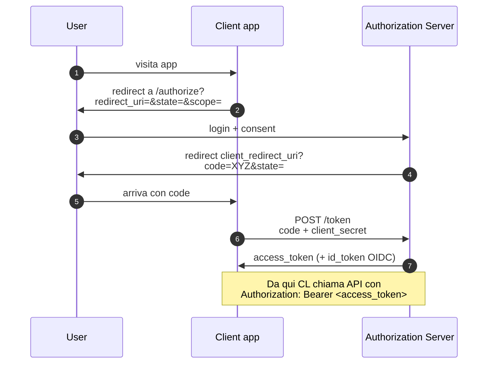
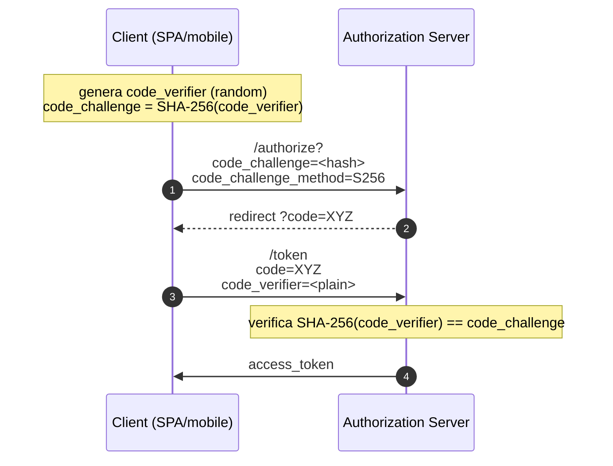

# Web hacking avanzato

> Le categorie di sezione 10 sono il 70% di quello che troverai. Questa sezione copre il 30% che fa la differenza tra report da BSCP/OSWA e da junior con sqlmap.

## Race conditions / TOCTOU web

Quando un'operazione "atomica" lato server non lo è davvero, due richieste quasi simultanee fanno cose contraddittorie. Esempi:

- **Doppio uso di un buono / coupon**: il check "già usato?" e l'application "usalo" non sono atomici → mando 30 richieste insieme → 5 vanno a buon fine.
- **Withdraw doppio**: balance check + decrement → 2 richieste vedono balance abbastanza, entrambe scalano.
- **Account creation race**: 2 user con stessa email se la check unique non è in transaction.
- **MFA bypass**: invio molteplici tentativi del codice OTP nello stesso "window" prima di lockout.

### Come si testa
Strumento: **Burp Repeater "Send group in parallel"** (Tab Group nel 2022.10+), **Turbo Intruder** (estensione, script Python), o **race-the-web**.

Tecnica chiave: **single-packet attack** di James Kettle (2021). Su HTTP/2, mandi N stream nel **last frame** simultaneo → arrivano al backend con offset di sub-millisecondi. Quasi atomic dal punto di vista del backend.

```python
# Turbo Intruder snippet
def queueRequests(target, wordlists):
    engine = RequestEngine(endpoint=target.endpoint, concurrentConnections=1, requestsPerConnection=30, engine=Engine.BURP2)
    for i in range(30):
        engine.queue(target.req, gate='race1')
    engine.openGate('race1')
```

### Mitigazione
- **Lock** a livello DB (`SELECT FOR UPDATE` su PostgreSQL).
- Transazioni con livello isolamento serializable + retry.
- **Idempotency key** per pagamenti/azioni critiche.
- Rate limit + lockout MFA reali.
- Tutto-uno operazioni: `UPDATE ... WHERE balance >= amount`.

## Prototype Pollution (JS)

In JS, ogni oggetto eredita da `Object.prototype`. Se l'app mergia ricorsivamente un input utente in un oggetto target con chiavi tipo `__proto__`, può finire a modificare `Object.prototype` → influenza globale del runtime.

```js
// vulnerable merge
function merge(target, source) {
  for (let key in source) {
    if (typeof source[key] === 'object') {
      merge(target[key], source[key]);  // niente check __proto__ / constructor
    } else {
      target[key] = source[key];
    }
  }
}
merge({}, JSON.parse('{"__proto__":{"isAdmin":true}}'));
console.log(({}).isAdmin);  // true!!
```

Conseguenze:
- **Bypass auth/authorization**: l'oggetto user diventa admin.
- **DoS** modificando metodi base.
- **RCE in Node**: se l'app usa proprietà polluable in funzioni dangerose (`child_process` envs, template engine config). Famoso: blitz.js, kibana CVE-2019-7609.

### Test
- Cerca `Object.prototype.x` modificato.
- Burp DOM Invader o estensioni dedicate.
- nuclei template `prototype-pollution-check`.

### Mitigazione
- `Object.create(null)` come container, non `{}`.
- Libreria merge sicura (lodash >= 4.17.12, mergerino).
- `Object.freeze(Object.prototype)` in entry point (rompe codice legacy).
- Schema validation (Ajv) sull'input.

## JWT attacks

Vedi sezione 5 per base. Attacchi pratici:

### 1. `alg: none`
Header `{"alg":"none"}` → token senza signature. Server vulnerabile accetta.

```text
header: {"alg":"none","typ":"JWT"}
payload: {"user":"admin"}
signature: (vuoto)
```

### 2. HS256 vs RS256 confusion
Server si aspetta RS256 (firma asimmetrica con private key, verify con public). L'attaccante manda con HS256 usando come "chiave HMAC" la **public key del server** (spesso esposta). Il server, se prende la public key e la usa come "secret HMAC", verifica con successo.

### 3. Weak secret HS256
Brute force con `hashcat -m 16500` su wordlist comuni. Se la secret è `secret`, `password`, `s3cret`, … → game over.

### 4. `kid` injection
Header `kid` (key id) può essere usato per SQL injection / LFI / command injection se il server lo passa a query DB / path file. Esempio: `kid: ../../../../../dev/null` → server legge `/dev/null` come chiave → la chiave è vuota → HS con secret vuoto valido.

### 5. `jku` / `jwk` / `x5u` confusion
Header dice "dove prendere la chiave pubblica" (`jku`, JWK Set URL). Server vulnerabile la fetcha senza validare il dominio → attaccante punta a un proprio JWK → firma valida con sua chiave privata.

### 6. ECDSA invalid signature (CVE-2022-21449)
Java 15–18: la verifica ES256 con `(r=0, s=0)` accettava qualunque firma. Patch obbligatoria.

### Tool: jwt_tool
```bash
jwt_tool eyJ... -M at        # tutti gli attacchi tampering
jwt_tool eyJ... -X k -pk pubkey.pem    # tenta HS/RS confusion
jwt_tool eyJ... -C -d wordlist.txt     # crack HS secret
```

### Mitigazione
- Algoritmi specifici esposti (`alg` whitelist).
- Reject `alg: none`.
- Verify firma con chiave corretta (separate JWK per alg).
- Secret HS256 → 256-bit random, mai user-provided.
- `kid` come UUID, lookup whitelist.
- Validate `iss`, `aud`, `exp`, `nbf`.
- Revocation server-side (token blacklist o token short-lived + refresh).

## OAuth 2.0 / OIDC attacks

Flow OAuth Authorization Code:



### I "perché" del flow OAuth (la parte sottintesa)

- **Perché si manda `code` invece di `access_token`?** Perché il code viaggia in URL del browser (visibile in cronologia, log proxy, Referer). Mandarlo al posto del token vero limita il danno: il code è single-use, short-lived (30-60 sec), e serve `client_secret` per scambiarlo → un attaccante che intercetta il code non ottiene il token senza il secret server-side.
- **Perché `state`?** È un random opaco che il client genera e include nella request, il server lo restituisce identico. Se l'attaccante prova a far iniziare un flow OAuth nel browser della vittima (CSRF), non conosce `state` → il client legitimate lo rifiuta → niente "social account linking" non voluto.
- **Perché PKCE** (Proof Key for Code Exchange)? In mobile/SPA non c'è `client_secret` lato client (sarebbe visibile a chiunque ispezioni l'app). Senza un secret, l'attaccante che ruba il code può chiamare `/token` come se fosse il client. PKCE risolve:
  1. Client genera `code_verifier` random (43-128 byte).
  2. Calcola `code_challenge = SHA-256(code_verifier)`.
  3. `/authorize?code_challenge=...&code_challenge_method=S256`.
  4. Al `/token` invia `code_verifier`.
  5. Server verifica `SHA-256(code_verifier) == code_challenge`.

   L'attaccante che intercetta il code **non ha** il `code_verifier` (random nel client, non in transit) → non può scambiare. Genio.



**Attacchi:**

- **Open redirect via `redirect_uri`**: server validate parziale → leak code.
- **State CSRF**: se `state` non è verificato, attaccante impone un code suo → vittima logga il proprio account su attacker → account takeover via "linka social".
- **Implicit flow + XSS**: deprecato per ragione.
- **PKCE missing**: SPAs senza PKCE sono vulnerabili a code interception.
- **`response_type` confusion**: switch `code` ↔ `token`.
- **`scope` escalation**: aggiungere scope durante token request che il consent non copriva.
- **JWT id_token**: gli attacchi visti sopra.
- **Public client secret in JS bundle**: confidential client mal configurato.
- **`prompt=none`** in iframe + targets fragili = silent token exfil via XSS.
- **Cross-Site Scripting in OAuth providers** → catastrofico.

### Mitigazione
- Authorization Code + PKCE obbligatorio per SPA / mobile.
- `redirect_uri` exact match (no wildcard).
- `state` randomico verificato.
- HTTPS ovunque.
- Short-lived access token + refresh token rotation.
- Audience/issuer validation rigorosa.

## GraphQL security

GraphQL è una API query language: il client compone una query, il server risponde.

### Vulnerabilità tipiche

- **Introspection abilitata in produzione** → l'attaccante scopre schema completo.
  - Tool: **graphw00f**, **clairvoyance** (se introspection off, schema-leak via response diff).
- **Authorization mancante a livello field/object** (BFLA, BOLA): si controlla "puoi chiamare la query"? E i singoli field?
- **Denial of Service via nested query**: `user { friends { friends { friends { ... } } } }` → load enormi.
- **Batch queries** (alcuni server) → DoS, e bypass rate limit per password testing.
- **Field suggestion** (`__schema` errors) leak info.
- **SQL injection via argomenti**: ogni resolver è codice.
- **GraphQL specific CSRF**: se accetta `application/json` da form (raro), CSRF possibile.

### Tool
- **InQL** (Burp extension).
- **graphw00f**: detect server type.
- **clairvoyance**: infer schema senza introspection.
- **gqlmap**.

### Mitigazione
- Disable introspection in prod.
- Query depth/complexity limit (graphql-depth-limit).
- Persisted queries.
- Authorization a livello resolver.

## HTTP Request Smuggling

Discrepanza nell'interpretazione dei confini delle request tra frontend (CDN/proxy) e backend.

### Tipologie
- **CL.TE**: frontend usa `Content-Length`, backend usa `Transfer-Encoding`.
- **TE.CL**: opposto.
- **TE.TE**: entrambi processano `Transfer-Encoding` ma uno ne è "ingannato" da varianti (`Transfer-Encoding: chunked` con spazio, `TrAnSfEr-eNcOdInG`, ...).
- **H2.CL / H2.TE**: HTTP/2 downgrade a HTTP/1.1 sul backend.
- **CL.0**: backend ignora Content-Length se non c'è body.

### Impatto
- **Bypass front-end ACL** (file riservati).
- **Cache poisoning** (la risposta di un'altra request viene servita ad altri).
- **Credential theft** (header injection).
- **Take-over admin** dirottando la richiesta di un altro utente.

### Studio
PortSwigger Academy ha una sezione completa (raccomandata, gratuita) basata sui paper di James Kettle.

## Web Cache Poisoning / Web Cache Deception

### Poisoning
Inietti contenuto nella cache CDN/server. Quando un altro user fa la stessa richiesta, riceve quello che hai messo tu. Vettori:
- Header non-key che influiscono sulla response ma non sulla cache-key (`X-Forwarded-Host`, `X-Original-URL`).
- Parametri unkeyed.

### Deception
Persuadi la cache a salvare risposte private. Es: `GET /profile/john.css` → cache pubblica salva perché finisce in `.css` → attaccante poi richiede `/profile/john.css` e ottiene la pagina profilo della vittima.

## SSRF avanzato + cloud metadata

Già visto base in sezione 10. In dettaglio:

- **AWS IMDSv1**: GET `http://169.254.169.254/latest/meta-data/iam/security-credentials/<role>` → AccessKey/Secret/SessionToken. Tutti i pentest AWS partono da qui.
- **AWS IMDSv2**: richiede PUT con header `X-aws-ec2-metadata-token-ttl-seconds`, ottieni token, poi GET con `X-aws-ec2-metadata-token`. Mitigation **dell'**SSRF generico (richiede metodo PUT non comune in SSRF "ingenuo").
- **Azure IMDS**: header `Metadata: true` obbligatorio → block di SSRF "header pass through".
- **GCP**: header `Metadata-Flavor: Google` obbligatorio.
- **Kubernetes**: pod service account token in `/var/run/secrets/kubernetes.io/serviceaccount/token` (LFI-style se SSRF su `file://`).

### DNS rebinding per SSRF
Server "valida" l'host risolvendo, vede public IP → ok. Poi richiama (separata chiamata) → DNS server attaccante risponde con 169.254.169.254. Mitigazione: validate l'IP, fetch con quell'IP fisso (no nuova risoluzione).

## Server-Side Template Injection (SSTI) — pratica

Ogni engine ha payload diversi. Esempi:

```text
# Jinja2 (Python Flask)
{{ config.items() }}                            # leak config
{{ ''.__class__.__mro__[1].__subclasses__() }}  # gadget chain
{{ cycler.__init__.__globals__.os.popen('id').read() }}

# Twig (PHP)
{{ _self.env.registerUndefinedFilterCallback("system") }}{{ _self.env.getFilter("id") }}

# Freemarker (Java)
<#assign x="freemarker.template.utility.Execute"?new()>${x("id")}

# Velocity
#set($x=$class.inspect("java.lang.Runtime").type.getRuntime().exec("id"))
```

Detection: input come `${7*7}` o `{{7*7}}` → output `49`. Riferimento: PayloadsAllTheThings/Server Side Template Injection.

## DOM clobbering, postMessage, SOP-related

- **DOM clobbering**: `` "clobera" `window.alert` (vecchi browser/IE). Moderno: `<form id="config"><input name="adminMode" value="true">` → `document.config.adminMode` legge "true" attribute.
- **postMessage misuse**: receiver senza `event.origin` check → l'attaccante invia messaggi da iframe controllato.
- **Window.opener** + `noopener` missing.

## Insecure direct API design

- **Mass assignment**: l'API accetta tutti i field del JSON → l'attaccante manda `{"isAdmin":true}` durante registrazione.
- **Over-fetching**: API restituisce più field di quanti il client mostra → leak via DevTools.

## Esercizi

### Esercizio 11.1 — Race condition reale
Su PortSwigger Academy → "Race conditions" (5+ lab). Completa:
- "Limit overrun race conditions" (coupon riusato).
- "Bypassing rate limits via race conditions" (MFA).
- "Multi-endpoint race conditions" (creazione gift card + check).

### Esercizio 11.2 — JWT cracking
Lab: prendi un JWT debole (genera con secret "secret"):
```python
import jwt
token = jwt.encode({"sub":"alice","role":"user"}, "secret", algorithm="HS256")
print(token)
```

Crack con hashcat:
```bash
hashcat -m 16500 token.txt /usr/share/wordlists/rockyou.txt
```

Quindi forgia un nuovo token con `role:admin`.

### Esercizio 11.3 — JWT alg none + RS/HS confusion
PortSwigger Academy → "JWT attacks". Tutti i lab.

### Esercizio 11.4 — Prototype pollution
Lab: scrivi un piccolo Express con `merge` ricorsivo "fai da te". Inserisci endpoint `/login` che legge `req.body.user` da un merge. Dimostra escalation a admin via `__proto__`.

### Esercizio 11.5 — SSRF AWS
Hai un endpoint `?url=` su una sandbox EC2 con IMDSv1 (per puro lab — Localstack o un container ec2-metadata-mock):
- Estrai role.
- Estrai credenziali.
- Verifica con `aws sts get-caller-identity --profile leaked`.

Discuti la differenza con IMDSv2 e perché tutto cloud moderno dovrebbe averlo on.

### Esercizio 11.6 — Request smuggling
PortSwigger Academy ha la migliore palestra: completa "HTTP request smuggling - Basic" (CL.TE e TE.CL).

### Esercizio 11.7 — GraphQL enum
Trova un'API GraphQL pubblica (con autorizzazione del programma):
- Verifica introspection.
- Estrai schema.
- Identifica query/mutation con argument utenti.
- Test BOLA.

### Esercizio 11.8 — OAuth via PortSwigger
PortSwigger Academy → "OAuth authentication". Completa almeno 4 lab.

### Esercizio 11.9 — DOM Invader
Burp ha DOM Invader (in browser embedded). Usalo su un sito vulnerabile a postMessage o DOM-XSS. Cosa segnala?

### Esercizio 11.10 — Mass assignment
Su una vulnerable REST API (Juice Shop, vAPI, crapi), trova un endpoint user-update che accetta più di nome/email. Sfruttalo per escalare.

## Concetti chiave

1. **Race conditions** sono ovunque dove c'è check-then-act.
2. **Prototype pollution** è la categoria moderna di "configuration object hacking".
3. **JWT**: alg none, HS/RS confusion, weak secret, kid injection — sempre testare.
4. **OAuth**: redirect_uri, state, PKCE, exact match.
5. **GraphQL**: introspection + complex query + field-level authz.
6. **Request smuggling** è hard ma high-impact: chi lo padroneggia lo monetizza in bug bounty.
7. **SSRF + cloud metadata** = takeover infrastrutturale.
8. **SSTI** sempre da provare quando vedi reflection di input in HTML/template.

Adesso scendiamo dalla web app alla rete: MITM, AD, network attacks.
