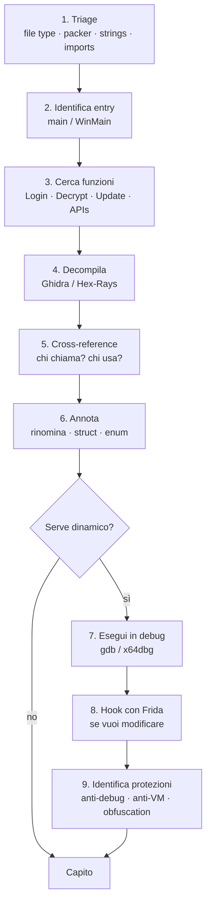

# Reverse engineering

> Capire un binario senza il sorgente. Necessario per: malware analysis, vulnerability research, valutazione di software proprietario, CTF, audit di firmware.

## Cosa è un binario

Su disco: header + sezioni di codice + dati + symbol table + relocation. Formati:

- **ELF** (Linux/Unix). Header inizia con `\x7fELF`.
- **PE/COFF** (Windows). Inizia con `MZ` (DOS stub) e poi `PE\0\0`.
- **Mach-O** (macOS/iOS). Magic `0xFEEDFACE`/`0xFEEDFACF`.
- **APK** (Android) = ZIP di `classes.dex` (Dalvik bytecode) + native libs ELF.
- **IPA** (iOS) = ZIP di Mach-O + risorse + Info.plist.
- **firmware embedded** — può essere raw, ELF, custom.

Esegui:
- `file binary`
- `Detect It Easy (DIE)` per Windows — riconosce compilers, packer, framework.
- `binwalk binary` per firmware (estrae filesystem embedded).
- `strings binary`, `strings -e l binary` (UTF-16 per stringhe Windows).
- `nm binary` (symbol table di ELF).
- `objdump -d -M intel binary` (disasm).
- `readelf -a`, `dumpbin` (Windows).

## Assembly che devi conoscere

### x86-64 essenziale

Registri general-purpose: `RAX, RBX, RCX, RDX, RSI, RDI, RBP, RSP, R8-R15`. Sub-registri: `EAX` (32), `AX` (16), `AH`/`AL` (8).

Calling convention SysV (Linux): args in `RDI, RSI, RDX, RCX, R8, R9`; ulteriori sullo stack; ritorno in `RAX`. Calling convention Microsoft x64 (Windows): `RCX, RDX, R8, R9`; shadow space 32 byte.

Istruzioni base:

```asm
mov rax, rbx          ; rax = rbx
lea rax, [rbx+8]      ; rax = rbx+8 (load effective address; aritmetica senza accesso memoria)
add rax, 1
sub rax, 5
xor rax, rax          ; rax = 0 (idiomatico)
push rax              ; rsp -= 8; [rsp] = rax
pop rax
call funct            ; push return; jmp
ret                   ; pop into rip
jmp label
je / jne / jg / jl / jz / jnz / ja / jb   ; salti condizionali
cmp rax, 10           ; setta flag (ZF, SF, CF, OF)
test rax, rax         ; AND e setta flag (non altera operandi)

; loop di stringhe
mov rdi, dst
mov rsi, src
mov rcx, length
rep movsb             ; copia rcx byte da rsi a rdi
```

### ARM64 (AArch64) essenziale
Registri: `X0-X30`, `XZR` (zero), `SP` (stack), `PC`. Calling: `X0-X7` args, `X0` ritorno. RISC fixed-size (4 byte/instr).

```asm
mov x0, #1
add x0, x0, x1
ldr x0, [x1, #8]       ; load
str x0, [x1, #8]       ; store
bl funct                ; branch with link (call)
ret                     ; ramo a X30 (link register)
```

### x86 vs ARM mood
- x86 CISC: tante istruzioni complesse, lunghezza variabile.
- ARM RISC: poche istruzioni, ortogonali, lunghezza fissa.

Per IoT/mobile saprai ARM bene.

## Statico vs dinamico

### Statico
Analizzi senza eseguire. Vedi *tutto* il codice, identifichi pattern, capisci la logica.

**Pro:** sicuro (non esegui malware potenzialmente nocivo), completo.
**Contro:** lento; obfuscation/packing ti blocca; flussi complessi sono difficili senza esecuzione.

Tool:
- **Ghidra** (NSA, open source): decompiler eccellente, gratis, multi-arch. **Il mio default**.
- **IDA Pro** (Hex-Rays, commerciale): standard industria. **IDA Free** ha solo x86-64 e nessun decompiler.
- **Binary Ninja** (Vector 35, commerciale): UX moderna, plugin Python belli.
- **radare2 / Rizin**: open source, CLI. Steep learning curve.
- **Cutter**: GUI per Rizin.

### Dinamico
Esegui in sandbox o debugger.

**Pro:** vedi *il vero* comportamento, scoprire input dipendenti.
**Contro:** rischio (malware), anti-debug, copertura limitata.

Tool:
- **gdb** + pwndbg/gef (Linux).
- **x64dbg** (Windows).
- **WinDbg** (Microsoft, anche kernel).
- **lldb** (macOS/iOS).
- **Frida**: hooking runtime cross-platform.
- **DBI** (Dynamic Binary Instrumentation): PIN (Intel), DynamoRIO.

### Emulazione
- **qemu-user** per eseguire binari di altre architetture.
- **unicorn** / **qiling** per emulazione parziale a livello CPU/funzione.
- **angr**: symbolic execution.

## Workflow tipico



1. **Triage**: file type, packer/protector, strings, imports, sections (DIE, `strings`, `file`, IDA's auto-analysis).
2. **Identifica entry**: `main` (o `WinMain`, `wmain`).
3. **Cerca funzioni interessanti**: nomi (es. `Login`, `Decrypt`, `Update`), API import (es. `socket`, `CryptEncrypt`).
4. **Decompila** e leggi pseudo-C.
5. **Cross-reference** (xrefs): chi chiama questa funzione? chi accede a questa variabile?
6. **Annota** (rinomina variabili, struct, enum).
7. **Esegui in dinamico** se serve (breakpoint su funzioni chiave).
8. **Hook con Frida** quando vuoi modificare comportamento.
9. **Identifica protezioni** (anti-debug, anti-VM, obfuscation).

## Anti-RE — riconoscere e bypassare

### Anti-debug Windows
- `IsDebuggerPresent` API → patcha return a 0.
- `CheckRemoteDebuggerPresent`, `NtQueryInformationProcess` (ProcessDebugPort).
- `PEB.BeingDebugged` flag → patch in-memory.
- `int 3` / `int 2d` / `int 3 esercitazione`.
- `RDTSC` timing checks: se debugger, tempo aumenta.
- `OutputDebugString` quirks.
- Thread Local Callbacks (eseguiti prima di main, breakpoint su entry li bypassa).
- TLS callbacks.
- `NtSetInformationThread(ThreadHideFromDebugger)`.

### Anti-VM
- Hardware fingerprint: MAC vendor (VMware, VirtualBox), BIOS/system manufacturer, file/registry indicatori.
- CPUID hypervisor bit.
- Tempo di sleep effettivo (sleep evasion).
- Numero di CPU, RAM, dischi (VM ne hanno meno).
- Path `C:\Windows\System32\drivers\VBoxSF.sys` etc.

### Anti-disasm
- Junk bytes che confondono linear disassembly (`db 0xE8` davanti a un ret per spaventare).
- Opaque predicates (`if (true)` mascherato).
- Control flow flattening.
- Virtualization (VMProtect, Themida): converte istruzioni in bytecode interpretato da una VM custom.
- Packers (UPX, ASPack, Themida, Enigma...). Spesso firmare con `pestudio` o `DIE`.

### Stringhe cifrate
Spesso il malware cifra le stringhe a compile time e le decifra runtime. Tu identifichi la funzione di decifratura → la chiami in **Frida**/**angr**/**unicorn** per ottenere stringhe.

## Decompile vs disasm

Decompilatore (Ghidra/Hex-Rays) ti dà pseudo-C. **Comodo**, ma **non sempre giusto**. Per code complesso (vector intrinsics, ottimizzazioni inline, jump table, custom CC) leggi disasm direttamente.

## Reverse engineering Java/.NET/Android

- **Java JAR / class**: `jd-gui`, `procyon`, `cfr`, `JADX` (Android e Java).
- **.NET** PE: **dnSpy**, **ILSpy**, **dotPeek**. Possono *recompile* in IL e decompile in C#.
- **Obfuscation .NET**: ConfuserEx, .NET Reactor; deobfuscator esistono (de4dot).
- **Android**: APK → `apktool` (smali), `JADX` (Java decompiled), MOBSF per analisi automatica.

## Reverse engineering script obfuscati

- **JS**: beautify, devtools "Pretty print", **JS Nice**, prendi tempo a rinominare. Tool: **JSHint**, **AST exploration**.
- **PowerShell**: PSDecode, AMSI bypass deobfuscation. `Invoke-Obfuscation` reverse: cerca pattern di concat + `IEX`/`Invoke-Expression`.
- **VBA macro Office**: `oledump.py`, `olevba`, `ViperMonkey`.
- **HTA/JScript**: pattern `eval(unescape(`.

## Frida — instrumentation runtime

Su un binario nativo (Linux/macOS/Windows/Android/iOS):

```js
// js
var crypto = Module.findExportByName("libssl.so.3", "EVP_DecryptUpdate");
Interceptor.attach(crypto, {
    onEnter(args) {
        var len = args[5].toInt32();
        console.log("decrypt", len, "bytes from", args[3]);
        console.log(hexdump(args[3], { length: len }));
    }
});
```

```bash
frida -U -l hook.js -f com.target.app   # USB, Android
```

Per crackme: bypass check di licenza modificando `retval` di `validate()`.

## Symbolic execution

Usa **angr** per esplorare automaticamente tutti i path:

```python
import angr
proj = angr.Project("./challenge", auto_load_libs=False)
state = proj.factory.entry_state()
sm = proj.factory.simulation_manager(state)
sm.explore(find=0x401234, avoid=[0x401200])
print(sm.found[0].posix.dumps(0))   # stdin che porta al win
```

Funziona ma esplode con loop e crypto. Usa per piccole funzioni.

## Reversing firmware

```bash
binwalk -e firmware.bin           # estrae filesystem (squashfs, jffs2, etc.)
binwalk --signature firmware.bin
strings firmware.bin | grep -i password
file extracted/
```

Trova UART/JTAG sul device (sezione 21), dump flash chip (SOIC clip + bus pirate). Estrai bootloader, kernel, root fs. Cerca:
- credenziali hardcoded.
- chiavi RSA private nelle firmware update.
- web admin con CGI vulnerabili.
- shell aperte.

Tool:
- **Ghidra** con MIPS/ARM extension.
- **emulazione qemu** del binario.
- **FACT** (Firmware Analysis and Comparison Tool).

## Cracking software (esercizio etico)

[crackmes.one](https://crackmes.one) ha migliaia di crackme legalmente disponibili creati apposta. Categorie da easy a brutali.

Tecniche comuni:
1. Trova la funzione "validate" (`strings | grep "Wrong"`).
2. Inverti la logica (jne → je via patch).
3. Patch in memory (Frida `Interceptor.replace` o setting Z flag).
4. Capisci serial algorithm → scrivi keygen.

## Esercizi

### Esercizio 15.1 — Crackme guidato
Scarica da crackmes.one un crackme livello 1-2. Apri in Ghidra. Trova `main`. Identifica la funzione di check. Trova la password.

### Esercizio 15.2 — Bandit-style binario
Crea tu un binario semplice:

```c
#include <stdio.h>
#include <string.h>
int main(int argc, char **argv) {
    char secret[] = "\x6c\x65\x74\x6d\x65\x69\x6e";  // "letmein" XOR ovviamente offuscabile
    if (argc < 2) return 1;
    if (strcmp(argv[1], secret) == 0) {
        printf("flag{w3ll_d0n3}\n");
    } else {
        printf("nope\n");
    }
    return 0;
}
```

Compila stripped (`-s`). Ora:
- senza eseguirlo, trova la flag con `strings` + Ghidra.
- offusca un po' (XOR string) e ripeti.

### Esercizio 15.3 — Ghidra deep dive
[Ghidra Class](https://github.com/HackOvert/GhidraSnippets) — repo con cheatsheet. Apri un binario reale (anche un `coreutils` come `/bin/ls`). Identifica `main`, segui la struttura, ricava il prototipo di `getopt`.

### Esercizio 15.4 — Frida hooking
Su un crackme con check `int validate(char*)` che ritorna 0/1:

```js
const sym = Module.findExportByName(null, 'validate');
Interceptor.replace(sym, new NativeCallback(function() { return 1; }, 'int', ['pointer']));
```

Bypassi controllo. Funziona? Quanto è facile?

### Esercizio 15.5 — Analizza malware (LAB!)
**Solo in VM isolata**. Scarica un sample noto educational (es. **MalwareBazaar**, **theZoo**). Analisi statica:
- DIE → packer?
- strings → URL/IOC?
- import table → API sospette (`CreateRemoteThread`, `WriteProcessMemory`, `InternetOpen`)?

Poi (con cautela) detonazione in sandbox (Cuckoo, ANY.RUN, joesandbox).

### Esercizio 15.6 — Reverse Engineering for Beginners
Libro gratuito di Dennis Yurichev. Capitoli 1-5 sono essenziali. Studiali.

### Esercizio 15.7 — pwn.college reversing
Modulo "Reverse engineering" di pwn.college. Eccellente.

### Esercizio 15.8 — IDA Free vs Ghidra
Apri lo stesso binario in entrambi. Confronta:
- velocità di analisi.
- qualità del decompiler.
- workflow.

Non c'è "il migliore" assoluto.

## Concetti chiave

1. **Statico + dinamico**: ti servono entrambi.
2. **Ghidra è gratis e ottimo.** Imparalo bene.
3. **Saper leggere assembly (almeno x86-64) e calling conventions.**
4. **Anti-debug e packers**: riconoscili, bypassali.
5. **Frida** per cracking runtime di app non kernel.
6. **angr** per piccole funzioni / CTF.
7. **Reverse Engineering for Beginners** (Yurichev), pwn.college, crackmes.one.

Adesso il prossimo: cosa il reverse engineering analizza più spesso — il malware.
