# Malware: tassonomia e analisi

> **Safety first.** Analizza malware **solo** in VM isolata, snapshotted, senza condivisioni con host, senza accesso internet "vero" (fakedns/inetsim) a meno che non sia voluto. Pretendi che il sample uscirà dall'isolamento. Lavora di conseguenza.

## Tassonomia (e perché non ti basta una sola etichetta)

Un malware reale **non è un'unica categoria**. È un sistema modulare con un loader, uno o più payload, un canale C2, capacità di persistence ed exfil. Ma sapere le etichette aiuta nella comunicazione e CTI.

| Categoria | Cosa fa |
|---|---|
| **Virus** | si replica infettando altri file/programmi |
| **Worm** | si propaga in rete autonomamente (worm Conficker, WannaCry, NotPetya) |
| **Trojan / RAT** | si maschera da software legittimo; RAT = Remote Access Trojan (controllo remoto della vittima) |
| **Ransomware** | cifra i file e chiede riscatto (Conti, LockBit, BlackCat/ALPHV, Akira) |
| **Wiper** | distrugge dati senza richiesta (NotPetya, Shamoon, HermeticWiper) |
| **Stealer / Infostealer** | ruba credenziali browser, wallet, cookie (RedLine, Vidar, Raccoon, Lumma, StealC) |
| **Banker / Banking trojan** | ruba credenziali finanziarie via web inject (Zeus, Emotet, IcedID, TrickBot, Qakbot) |
| **Loader / Dropper** | scarica/installa il payload finale (SmokeLoader, Bumblebee, Gozi loader, Pikabot) |
| **Backdoor** | accesso persistente non autorizzato (PoisonIvy, ShadowPad) |
| **Rootkit** | nasconde se stesso al sistema (user-mode, kernel-mode, hypervisor, firmware) |
| **Bootkit** | persiste a livello bootloader/firmware (BlackLotus, MoonBounce) |
| **Adware / PUA** | grey-area: pubblicità invasiva, browser hijack |
| **Spyware** | monitoraggio (Pegasus, FinFisher, Predator) — spesso targeting di alto profilo |
| **Cryptominer / Cryptojacker** | mina criptovalute (XMRig wrapped, CoinMiner) |
| **Botnet** | infetta in massa per costituire una rete di bot (Mirai, Emotet) |
| **APT custom malware** | tool specifici di gruppi state-sponsored (Sandworm Industroyer, Equation Group implant, ...) |

## Vettori di accesso iniziale (Initial Access)

Sapere come arrivano è la base per detection.

- **Phishing email** con allegato (DOC/XLS macro, ISO/IMG, LNK, OneNote, ZIP-encrypted, HTML smuggling) o link a finto OAuth/login.
- **Drive-by download** / malvertising / exploit kit (raro nel 2026).
- **Supply chain**: software update compromesso (3CX, SolarWinds), libreria npm/PyPI typosquatting.
- **Vulnerabilità esposta**: web (Log4j, MOVEit), VPN/firewall, Exchange (ProxyLogon, ProxyShell), Ivanti.
- **Brute force / spray**: RDP esposto, OWA/Webmail.
- **USB drop** (Stuxnet, BadUSB).
- **Compromessa MSP / IT remoto**: AnyDesk, ScreenConnect.
- **Insider** (eseguito o complice).

## Cyber Kill Chain — la mappa dell'attacco

```mermaid
flowchart LR
    A[1. Reconnaissance<br/>OSINT, scan] --> B[2. Weaponization<br/>genera payload]
    B --> C[3. Delivery<br/>email, USB, web]
    C --> D[4. Exploitation<br/>vuln, social eng]
    D --> E[5. Installation<br/>persistence]
    E --> F[6. C2<br/>contatta operatore]
    F --> G[7. Actions on Obj.<br/>exfil / impatto]
    style A fill:#11171a,stroke:#00e6ff
    style D fill:#3a2a00,stroke:#ffe066
    style G fill:#3a0b0b,stroke:#ff4d4d
```



Fermare l'attacco al primo step risparmia tutto il resto. **Defense in depth** = controlli a ogni livello.

## Le tecniche difensive da conoscere (MITRE ATT&CK)

[MITRE ATT&CK](https://attack.mitre.org) è una **tassonomia gerarchica** del comportamento avversario, mantenuta dal MITRE basandosi su attacchi reali osservati. Tre livelli:

- **Tactics** (14): **il "perché"** (Initial Access, Execution, Persistence, ..., Impact). Ogni tactic è una fase dell'attacco.
- **Techniques** (~200): **il "come"**. Es: T1059 — Command and Scripting Interpreter.
- **Sub-techniques** (~600): **il "come specifico"**. Es: T1059.001 — PowerShell.

Per ogni tecnica, l'enciclopedia ATT&CK include: descrizione, procedure (gruppi che l'hanno usata), mitigazioni, detezioni, riferimenti.

### Come si legge un ID

```
T1003.001
│ │    │
│ │    └── Sub-technique: LSASS memory dumping
│ └────── Technique: OS Credential Dumping
└──────── "T" = Technique (gli ID con "M" sono mitigation, "S" sono software)
```

### Matrici

ATT&CK ha **più matrici**:
- **Enterprise**: Windows, macOS, Linux, Cloud (AWS/Azure/GCP/M365), Network devices, Containers, ESXi.
- **Mobile**: Android, iOS.
- **ICS**: industriale (SCADA, PLC).

### ATT&CK Navigator — strumento operativo

[Navigator](https://mitre-attack.github.io/attack-navigator/) ti permette di:
- **Mappare la coverage** delle tue detection rule → heatmap.
- **Confrontare** TTP di due gruppi (es. APT29 vs APT28).
- **Esportare** in JSON per integrazione tool.

Tutti i report CTI moderni includono una "ATT&CK Navigator layer" come allegato.

### Esempio di mapping di un alert

Alert SIEM: "Process `wmic.exe` con argomenti `process call create powershell.exe`".

Mapping ATT&CK:
- **Tactic**: TA0002 Execution.
- **Technique**: T1047 Windows Management Instrumentation.
- **Related sub-technique**: T1059.001 PowerShell.

Da qui, sa il SOC analyst: probabilmente lateral movement / execution remota, contesto = AD attacks. Cerca correlazioni: 4624 logon, network connect, ecc.

Da memorizzare la mappa generale:

| Tactic | Esempi di Technique |
|---|---|
| TA0001 Initial Access | T1566 Phishing, T1190 Exploit Public-Facing App |
| TA0002 Execution | T1059 Command/Scripting Interpreter, T1204 User Execution |
| TA0003 Persistence | T1547 Boot/Logon Autostart, T1053 Scheduled Task, T1543 System Service |
| TA0004 Privilege Escalation | T1068 Exploit, T1078 Valid Accounts |
| TA0005 Defense Evasion | T1027 Obfuscation, T1055 Process Injection, T1218 LOLBins |
| TA0006 Credential Access | T1003 OS Cred Dumping, T1110 Brute Force, T1555 Credentials from Stores |
| TA0007 Discovery | T1083 File/Dir Discovery, T1018 Remote System Discovery |
| TA0008 Lateral Movement | T1021 Remote Services, T1570 Lateral Tool Transfer |
| TA0009 Collection | T1005 Data from Local System, T1056 Input Capture |
| TA0011 Command and Control | T1071 Application Layer Protocol, T1573 Encrypted Channel |
| TA0010 Exfiltration | T1041 Exfil over C2, T1567 Exfil over Web Service |
| TA0040 Impact | T1486 Data Encrypted for Impact, T1485 Data Destruction |

## Tecniche tecniche di malware Windows (devi riconoscerle)

### Execution & loader

- **AMSI bypass**: patch `AmsiScanBuffer`/`AmsiOpenSession`.
- **ETW bypass**: patch `EtwEventWrite` o ETW provider GUID.
- **Reflective DLL injection**: carica DLL in memory di un processo bersaglio senza disco.
- **Process Hollowing**: avvia processo legittimo sospeso, sostituisci sezione image, resume.
- **Process Doppelgänging / Herpaderping**: abusano transactional NTFS / handle ordering.
- **Process Ghosting**: rinomina/cancella PE prima di mappa.
- **Module Stomping**: carica DLL legittima, sovrascrivi sezione code.
- **APC injection**: queue APC su thread alertable.
- **Atom Bombing**: usa atom table per copiare codice.

### Persistence

- **Run keys** (`HKCU/HKLM\...\Run`).
- **Scheduled Tasks** (`schtasks /create ...`).
- **Services** (`sc create`, autorun).
- **WMI Event Subscription** (filtro + consumer + binding).
- **DLL hijacking / search order**.
- **COM hijacking** (HKCU CLSID override).
- **AppInit_DLLs**, **Image File Execution Options** debugger.
- **Office add-ins**, **Outlook rules**, **Custom desktop.ini**.
- **Logon scripts**, **Shortcut hijack**, **PowerShell profile**.
- **Bootkit, UEFI**.

### Defense evasion

- **Living off the Land Binaries (LOLBins)**: `certutil`, `bitsadmin`, `msbuild`, `regsvr32`, `mshta`, `wmic`, `rundll32`, `installutil`, `cmstp`. Usano binari firmati Microsoft per fare il dirty.
- **Signed driver abuse** (BYOVD — Bring Your Own Vulnerable Driver: rwdrv, gigaboot, ASUS, Avast aswSnx).
- **Obfuscation**: packer, encryption a riposo, runtime decoder.
- **Sandbox evasion**: check CPU/RAM/MAC/process list/uptime.
- **Timer/sleep evasion** (`NtDelayExecution` >5min per esaurire sandbox).
- **Indirect syscall**: chiamare `Nt*` direttamente con syscall numbers per evitare hook user-mode.
- **Module unhooking**: ricaricare ntdll.dll fresh da disco per "unpatchare" gli hook EDR.

### Credential Access

- **LSASS dumping** (Mimikatz, `procdump lsass.exe`, MiniDump). Comdotti via SilentLsassDump, NanoDump.
- **DPAPI** dumping per browser cookie/password.
- **SAM/SYSTEM** hive backup (`reg save`).
- **NTDS.dit** dump dal DC (DCSync o copy via VSS).
- **Browser cookie/login**: SQLite `Login Data`, `Cookies`.

### C2 (Command and Control)

- **HTTPS** beacon (Cobalt Strike default).
- **DNS** tunnel (Cobalt Strike DNS, dnscat2).
- **Domain fronting** (storicamente CloudFront, ora limitato).
- **Slack / Discord / Telegram / Github / Pastebin** come C2 (legitimo cloud traffic).
- **Email** (smtp/imap exfil).
- **Custom protocol over TCP/UDP** (raro, più sospetto).

Framework C2 famosi:
- **Cobalt Strike** (commerciale, leak abusato).
- **Sliver** (open source moderno, BishopFox).
- **Havoc** (open source).
- **Mythic** (modulare, multi-implant).
- **Brute Ratel C4** (commerciale).

## Workflow di analisi

### 1. Triage (5 min)
- File hash (MD5/SHA1/SHA256). Cerca su VT (con cautela, l'upload diffonde il sample).
- PE info: timestamp, sezioni, entropia.
- Imports: API "interessanti" → categoria.
- Strings (UTF-8 + UTF-16) → URL, mutex, registry path, error messages.
- Detect packer (DIE, Exeinfo).

### 2. Statica
- Ghidra/IDA decompile.
- Identifica entry, init, main loop.
- Decifra stringhe (manualmente, con Python in Ghidra, o con `FLOSS`).
- Mappa API call.
- YARA rule (vedi sotto).
- `capa` di FireEye/Mandiant analizza capability automaticamente.

### 3. Dinamica
- Snapshot VM.
- Procmon + Process Hacker + Wireshark + RegShot.
- Lancia. Cattura per N minuti.
- Cosa scrive su disco? Quale registry key? Quale rete?
- Riprendi snapshot. Fai detonazioni successive con varianti d'ambiente (locale, no internet, con fakedns).

### 4. Debug
- x64dbg → break su funzioni interessanti (`VirtualAllocEx`, `WriteProcessMemory`, `CreateRemoteThread`, `LoadLibraryA`).
- Patchi anti-debug.
- Trace della catena di unpacking.

### 5. Reporting
- IOCs: hash, URL, IP, mutex, file path, registry key, persistence mechanism.
- TTPs: mappa su MITRE ATT&CK.
- Sigma rule per detection.
- YARA rule per identificare varianti.
- Comportamento: "fa X, poi Y, comunica con Z".

## YARA — pattern matching su file

```yara
rule EmotetLikeLoader {
    meta:
        author = "you"
        date   = "2026-05-19"
        description = "Detect Emotet-like loader"
    strings:
        $api1 = "VirtualAllocEx"
        $api2 = "WriteProcessMemory"
        $api3 = "CreateRemoteThread"
        $hex1 = { 48 8B 05 ?? ?? ?? ?? 48 89 C1 E8 }
        $url  = /https?:\/\/[a-z0-9.-]+\/[A-Za-z0-9_-]{8,}/
    condition:
        uint16(0) == 0x5A4D and (2 of ($api*)) and ($hex1 or $url)
}
```

Esegui: `yara rule.yar sample.bin`.

Tool: **yarGen** auto-generate rules da campioni; **yarAnalyzer** misura qualità.

## Sigma — pattern per log

[Sigma](https://github.com/SigmaHQ/sigma) è "lo YARA dei log". Specifichi pattern in YAML, converti per il SIEM.

```yaml
title: Suspicious whoami after PsExec
id: 12345678-...
status: experimental
logsource:
    category: process_creation
    product: windows
detection:
    selection_psexec:
        ParentImage|endswith: '\PSEXESVC.exe'
    selection_whoami:
        Image|endswith: '\whoami.exe'
    condition: selection_psexec and selection_whoami
level: high
```

`sigma-cli convert -t splunk -p ...` → query Splunk. Tool: pySigma, Sigma online converter.

## Sandbox automatiche

- **ANY.RUN** — interattiva, gratis con limiti.
- **Joe Sandbox** — alta qualità, commerciale.
- **Hybrid Analysis** (Falcon Sandbox) — gratuita.
- **VirusTotal** Behavior tab.
- **CAPE Sandbox** — self-hosted open source (fork di Cuckoo).
- **Tria.ge** — community-friendly.

**Privacy**: upload a sandbox pubblica = sample pubblico. Per malware sensibile o targeted, self-host.

## Threat intel feed e fonti

- [Malware Bazaar](https://bazaar.abuse.ch) — Free sample DB di abuse.ch.
- [URLhaus](https://urlhaus.abuse.ch) — URL malevoli.
- [ThreatFox](https://threatfox.abuse.ch) — IoCs strutturati.
- [VirusTotal Intelligence](https://www.virustotal.com) — commerciale.
- [Mandiant Advantage], **CrowdStrike Falcon Intelligence**, **Recorded Future**, **Microsoft Defender Threat Intelligence** — commerciali.
- Twitter/Mastodon: profili (vx-underground, Malwarebytes, Trend Micro Research, Sekoia, ...) — fonti rapide.

## Persistence detection (recap)

Da blue team, su Windows guardare:
- Sysmon event 1 (Process Create) + 11 (File Create) + 13 (Registry Set) + 7 (Image Load).
- Autoruns (Sysinternals) — snapshot iniziale.
- Scheduled Tasks (`Get-ScheduledTask`).
- WMI Event Subscriptions (`Get-WMIObject -Namespace root\subscription -Class __FilterToConsumerBinding`).
- Services creati di recente.
- COM hijack: confronto registry CLSID.

Linux:
- crontab/anacrontab/systemd timers (vedi sezione 02).
- `.bashrc`, `.profile`, `/etc/profile.d/`.
- LD_PRELOAD nel env di processi sospetti.
- `/etc/init.d`, `/etc/systemd/system`.
- Kernel modules: `lsmod`, `cat /proc/modules`.

## Esercizi

### Esercizio 16.1 — Setup malware lab
1. VM Windows 10 + Flare-VM (https://github.com/mandiant/flare-vm).
2. VM REMnux (https://remnux.org) per analisi linux + network simulation.
3. Rete: "internal only" tra le due VM, REMnux fa fakedns + inetsim.
4. Snapshot pulito.

### Esercizio 16.2 — Triage di un sample educational
Scarica da MalwareBazaar (account gratuito) un sample taggato "educational" / vecchio (es. WannaCry, NotPetya — ATTENZIONE: alcuni sono ancora pericolosi se esci dall'isolamento):
- File info, hash.
- VT result.
- Strings → URL, mutex.
- Pestudio → indicators.
- Capa → capabilities.

### Esercizio 16.3 — Detonazione semplice
In Flare-VM, lancia un sample sicuro (es. da MalwareTrafficAnalysis.net training exercise). Procmon + Wireshark. Per N minuti. Reggi alla calma. Esamina:
- File created.
- Registry mod.
- Network: DNS, HTTP, C2 attempt.

Genera report breve.

### Esercizio 16.4 — Scrivi una YARA rule
Prendi 2-3 sample dello stesso family. Trova stringhe comuni / sequenze hex. Scrivi rule che matchi tutti senza falsi positivi su benign sample. Verifica.

### Esercizio 16.5 — Sigma rule
Genera Sysmon event per:
- PowerShell con `-EncodedCommand`.
- Office che spawn `cmd.exe`.

Scrivi Sigma rule. Converti per il tuo SIEM (Splunk, ES, Sentinel).

### Esercizio 16.6 — Ransomware lab safe
NON usare ransomware reale. Usa `RansomwareSimulator` (Malware Analyst SR) o scrivi un finto: itera su `.txt` in una dir, cifra con AES, scrivi `README.txt`. Esegui in VM. Vedi cosa rivela Procmon. Scrivi Sigma per "cifratura massiva di file utente".

### Esercizio 16.7 — Practical Malware Analysis (libro)
Sikorski & Honig — il libro standard. Ha decine di laboratori con sample inclusi. Falli tutti.

### Esercizio 16.8 — MalwareBazaar challenge
Cerca un sample recente in una family che ti interessa (Emotet, IcedID, Pikabot, Bumblebee). Analizza, scrivi report di 1 pagina con IoCs e TTPs.

### Esercizio 16.9 — TryHackMe
Path "Cyber Defense":
- "MAL: Malware Introductory"
- "MAL: REMnux - The Redux"
- "Static Analysis Practical Tactics"

## Concetti chiave

1. **Malware ≠ single category**: sistemi modulari con loader+payload+C2+persistence.
2. **MITRE ATT&CK** lingua franca dei comportamenti.
3. **Workflow**: triage → statica → dinamica → debug → report.
4. **YARA** per file pattern, **Sigma** per log pattern.
5. **Sandbox isolata sempre**.
6. **LOLBins, indirect syscall, BYOVD, AMSI/ETW patch**: evasioni moderne.
7. **C2 moderno** vive in HTTPS legittimo + servizi cloud → detection è statistical/behavioral, non signature.

Prossimo: mobile.
