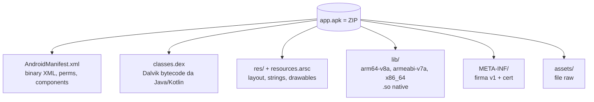

# Mobile security: Android e iOS

> App mobile è "una webapp che parla un'API + un binario native + token salvati nel dispositivo". Le vulnerabilità tipiche stanno nei tre punti.

## OWASP Mobile Top 10 (2024)

| # | Categoria |
|---|---|
| M1 | Improper Credential Usage |
| M2 | Inadequate Supply Chain Security |
| M3 | Insecure Authentication / Authorization |
| M4 | Insufficient Input/Output Validation |
| M5 | Insecure Communication |
| M6 | Inadequate Privacy Controls |
| M7 | Insufficient Binary Protections |
| M8 | Security Misconfiguration |
| M9 | Insecure Data Storage |
| M10 | Insufficient Cryptography |

## Android: anatomia di un'app



Un APK = ZIP con:
- `AndroidManifest.xml` (compilato in binary XML).
- `classes.dex` (Dalvik bytecode, compilato da Java/Kotlin via D8/R8).
- `resources.arsc` + `res/` (risorse).
- `lib/` (native `.so` per ABI: armeabi-v7a, arm64-v8a, x86, x86_64).
- `META-INF/` (firma APK).
- `assets/` (file inclusi).

Vita di un'app:
- Build → AAB (Android App Bundle) o APK.
- Sign con jar/apksigner v1/v2/v3/v4.
- Install via Play Store / sideload (`adb install app.apk`).
- Eseguito in Android Runtime (ART), su Linux kernel modificato.
- Sandbox per app: ogni app ha UID dedicato, dir `/data/data/<pkg>/` privata.

### Estrazione e analisi
```bash
# scarica APK da device
adb shell pm path com.example.app
adb pull /data/app/.../base.apk app.apk

# o da apkpure / Aurora Store

# unzip
apktool d app.apk -o app/
jadx-gui app.apk           # decompila in Java
jadx -d out app.apk

# strings/ASCII
strings app/lib/arm64-v8a/libnative.so

# MobSF
docker run -p 8000:8000 opensecurity/mobile-security-framework-mobsf
# upload app.apk → report
```

## AndroidManifest — cosa cercare

```xml
<manifest ...>
  <uses-permission android:name="android.permission.INTERNET"/>
  <uses-permission android:name="android.permission.READ_EXTERNAL_STORAGE"/>
  <application
      android:allowBackup="true"
      android:debuggable="true"
      android:networkSecurityConfig="@xml/network_security_config"
      android:usesCleartextTraffic="true">
    <activity android:name=".LoginActivity" android:exported="true"/>
    <activity android:name=".AdminActivity" android:exported="false"/>
    <provider
        android:authorities="com.example.provider"
        android:exported="true"
        android:readPermission="..."/>
    <receiver android:name=".SmsReceiver" android:exported="true">
      <intent-filter><action android:name="android.provider.Telephony.SMS_RECEIVED"/></intent-filter>
    </receiver>
  </application>
</manifest>
```

**Red flag:**
- `debuggable="true"` in build production.
- `allowBackup="true"` (un attaccante con ADB può fare backup dei dati app).
- `usesCleartextTraffic="true"` (HTTP plain in app).
- `exported="true"` su component sensibili (activity admin, provider con dati privati).
- `READ_LOGS`, `READ_SMS` perms se non necessarie.

## Storage insicuro (M9)

App scrive su:
- `/data/data/<pkg>/` (privato, ma se root → leggibile).
- SharedPreferences (XML in `shared_prefs/`).
- SQLite DB (`databases/`).
- External storage (`/sdcard`) — accessibile a tutte le app con permission.

Cercare:
- credenziali / token / API key in plaintext.
- DB SQLite con dati sensibili non cifrati.
- File esportati su sdcard.

```bash
adb shell run-as com.example.app ls /data/data/com.example.app/
```

### EncryptedSharedPreferences / SQLCipher / Android Keystore
La libreria Android Jetpack Security offre EncryptedSharedPreferences/EncryptedFile (chiave nel **Keystore**, hardware-backed quando disponibile). Usalo per token.

## Insecure Communication (M5) — SSL pinning bypass

App moderne fanno *certificate pinning*: accettano solo cert specifici / hash di chiave pubblica. Bypass:

### Frida + Objection
```bash
pip install frida-tools objection
adb push frida-server /data/local/tmp/
adb shell "chmod +x /data/local/tmp/frida-server && /data/local/tmp/frida-server &"

objection -g com.example.app explore
> android sslpinning disable
> android root disable
> android hooking watch class_method com.example.AuthManager.login
```

### Frida scripts dedicati
[frida-codeshare.com](https://codeshare.frida.re) ha decine di SSL pinning bypass per OkHttp, Conscrypt, Cronet, Cordova, Flutter, Xamarin, …

```bash
frida -U --codeshare pcipolloni/universal-android-ssl-pinning-bypass-with-frida -f com.example.app
```

### Network Security Config
File `res/xml/network_security_config.xml`:
```xml
<network-security-config>
    <base-config cleartextTrafficPermitted="false">
        <trust-anchors>
            <certificates src="system"/>
            <!-- in debug: <certificates src="user"/> -->
        </trust-anchors>
    </base-config>
    <domain-config>
        <domain includeSubdomains="true">api.example.com</domain>
        <pin-set>
            <pin digest="SHA-256">...</pin>
        </pin-set>
    </domain-config>
</network-security-config>
```

Per fare MITM con Burp:
1. Installa certificato Burp come **system CA** (richiede root o emulatore senza Google Play services).
2. Bypass pinning con Frida.
3. Setta proxy WiFi su Android verso il PC.

In emulator AOSP rootable da Studio: `emulator -writable-system` poi `adb root && adb remount` per installare cert in `/system`.

## Insecure IPC: deep link e content provider

### Deep link & app link abuse
Un activity esportata con intent-filter `BROWSABLE/DEFAULT` riceve URL `app://...` o `https://example.com/...` (App Link). Se l'activity processa parametri senza validazione → XSS in WebView interno, redirect open, account takeover.

```text
adb shell am start -W -a android.intent.action.VIEW \
    -d "app://example/path?token=stolen" com.example.app
```

### Content provider non protetti
Provider con `exported=true` senza permission → qualsiasi app legge/scrive.

```bash
adb shell content query --uri content://com.example.app/users
adb shell content insert --uri content://com.example.app/users --bind 'admin:s:true'
```

### Broadcast receiver con intent extra non sanitizzati
Receiver esportato che fa logica su `getStringExtra("cmd")` senza validation → app malicious manda intent.

## Native code (M7)

Lib `.so` in C/C++:
- Reverse con **Ghidra/IDA + ARM/AARCH64**.
- **Frida** per hook nativo.
- Funzioni JNI (`Java_com_example_native_method`) sono entrypoint.
- Stringhe hardcoded → API key spesso lì.

```bash
strings -e l lib/arm64-v8a/libapp.so | grep -i key
```

## Root detection bypass

App banking spesso si rifiutano su device root. Tecniche di detection:
- Existence di `/system/bin/su`, `/system/xbin/su`, `magisk`.
- Presenza pkg di Magisk Manager.
- `mount` con `rw` su `/system`.
- Build tags `test-keys` (vs `release-keys`).
- SafetyNet/Play Integrity attestation.

Bypass:
- **Magisk Hide / Zygisk** + DenyList.
- **Frida hook**: intercetta `File.exists("/system/bin/su")` ritorna false.
- **Objection**: `android root disable`.
- Per **Play Integrity** è molto più difficile (server-side check).

## iOS — overview

App = **IPA** = ZIP con bundle `.app` (Mach-O binary + risorse + Info.plist).

- App sandbox stretta.
- Codice firmato Apple, App Store o enterprise.
- Per analizzare devi **jailbreakare** un device (iOS legacy: checkra1n; iOS recenti: palera1n/Dopamine semi-untethered).
- Su simulator iOS (Mac only) puoi analizzare alcune cose ma il TEE / Keychain è simulato.

Cattura app:
- `frida-ios-dump` o `bagbak` (richiede device JB) → dump binario decifrato.
- `ipatool` per scaricare IPA da App Store.

Reverse:
- **Hopper Disassembler** (popolare Mac).
- **Ghidra** anche per Mach-O.
- **class-dump-z** estrae header Objective-C.
- **r2** / **rabin2** per simboli.

Frida funziona anche su iOS JB. Objection ha pinning bypass iOS.

Storage:
- **NSUserDefaults** → file plist.
- Keychain → hardware-backed, ma export possibile su JB.
- File system app: `/var/mobile/Containers/Data/Application/<UUID>/`.

## Pegasus & spyware mobile

NSO Pegasus, Intellexa Predator, FinSpy — spyware commerciali venduti a stati. Catene di **0-day** browser + LPE kernel + persistenza firmware. Targeting di giornalisti, attivisti, avvocati.

Forensics:
- **MVT** (Mobile Verification Toolkit) di Amnesty International — analizza iOS/Android per IOC Pegasus.
- **iOS** lascia trace in `DataUsage.sqlite`, `Spotlight`/`KnowledgeC.db`.

## Esercizi

### Esercizio 17.1 — Setup ambiente Android
- Android Studio + AVD (Pixel arm64 API 33, *no Google Play services* per root facile).
- ADB funzionante.
- Frida + frida-server.
- Burp Suite + cert installato in system.

### Esercizio 17.2 — Static analysis: Damn Vulnerable Hybrid Mobile App
DVHMA, [InsecureBankv2](https://github.com/dineshshetty/Android-InsecureBankv2), Pivaa, **OWASP-MASWE**: serie di app vulnerabili. Analisi statica con MobSF e jadx:
- Hardcoded credentials.
- Cleartext traffic.
- Exported activities/providers.
- Insecure storage.

### Esercizio 17.3 — Burp + bypass pinning
Su un'app open source con pinning (es. una versione modificata di Nextcloud Android per training): configura proxy, intercetta. Quando il pinning ti blocca, usa Frida `universal-pinning-bypass`.

### Esercizio 17.4 — Deep link injection
Su una app vulnerabile (DIVA, Pivaa) che apre WebView su URL deep-link:
```bash
adb shell am start -a android.intent.action.VIEW -d "diva://internal/webview?url=javascript:alert('XSS')" jakhar.aseem.diva
```

XSS in WebView?

### Esercizio 17.5 — Content provider leak
DIVA Lesson 8: query content provider per estrarre dati senza permission.

### Esercizio 17.6 — Frida hook native
App con check di licenza in funzione native `Java_..._validate(JNIEnv, jstring)`:

```js
Java.perform(() => {
  const M = Java.use("com.example.MainActivity");
  M.checkLicense.implementation = function(s) {
    console.log("called with:", s);
    return true;
  };
});
```

### Esercizio 17.7 — TryHackMe & HTB
- TryHackMe: "**Android Hacking 101**", "**Insekube**".
- HackTheBox: macchine mobile sono rare ma ce ne sono (vedi categoria).

### Esercizio 17.8 — Read iOS forensics
Leggi il report MVT sul caso Pegasus contro ricercatori Sahar. Quali IOC sono cercati? Quali file?

## Concetti chiave

1. **App mobile = client web + binary + storage locale**.
2. **Android**: APK structure, Manifest red flags, IPC abuse, storage insicuro.
3. **SSL pinning bypass** è quasi sempre fattibile su device controllato (Frida).
4. **Native (`.so`)** contiene logica e secret — analizza.
5. **iOS** richiede jailbreak per analisi profonda.
6. **Pegasus & co.**: 0-day catene; difesa = Lockdown Mode, patch, hygiene.
7. **OWASP Mobile Top 10** come tassonomia.

Avanti: il cloud, dove ormai vivono tutte le aziende.
