# Cloud security: AWS, Azure, GCP

> Tutto il mondo va in cloud. Significa che le vulnerabilità web/network/AD vengono ridistribuite su servizi managed con modelli IAM che pochi capiscono davvero. Le bug bounty più pagate hoggidì sono spesso cloud takeover.

## Shared responsibility

Il provider è responsabile della **sicurezza DEL cloud** (hardware, hypervisor, datacenter). Il cliente è responsabile della **sicurezza NEL cloud** (config, IAM, app, network, dati).

Tipico errore di novizio: "sono su AWS, quindi sicuro". No: l'S3 bucket pubblicato pubblicamente è colpa tua.

| Service type | Provider responsibility | Customer |
|---|---|---|
| IaaS (EC2, VM) | hardware, hypervisor | OS, network, app, data |
| PaaS (Lambda, App Service) | + OS, runtime | app, config IAM, data |
| SaaS (Office 365, Salesforce) | + app | config, dati, IAM identity |

## AWS — i concetti chiave

### IAM
Il cuore. Componenti:
- **User**: identità a lungo termine, può avere access keys.
- **Group**: insieme di user.
- **Role**: identità *assumibile* da entità (utenti, servizi, federated). Usata da EC2/Lambda/ECS via instance profile.
- **Policy**: documento JSON che concede permessi (Effect, Action, Resource, Condition).
- **Identity-based** (attached a user/group/role) vs **resource-based** (su S3 bucket, KMS key, …).
- **Service Control Policy (SCP)** — Organizations level, limit assoluto.
- **Permission boundary** — limit per role/user.
- **Session policy** — limit per assume-role.

Effettivo permesso = intersezione di:
SCP ∩ (identity policy ∪ resource policy) − ACL deny ∩ permissions boundary ∩ session policy.

### IAM misconfig red flag
- Policy `*/*` (action+resource entrambi wildcard).
- Cross-account trust troppo permissivo (es. `"Principal": {"AWS": "*"}`).
- MFA non required per privileged.
- Root account usato per operations.
- Long-lived access keys per umani (preferisci SSO + temporary credentials).

### S3
Bucket: oggetti + ACL + policy + Block Public Access settings + versioning + encryption.

**Top misconfig:**
- Bucket pubblicamente leggibile / scrivibile.
- "AuthenticatedUsers" group nelle ACL = qualunque utente AWS (chiunque con account!).
- Pre-signed URL leak.
- Cross-account access errato.

Test: `aws s3 ls s3://bucket --no-sign-request`.

### EC2 / Lambda / metadata
- **IMDSv1** (path GET solo) → SSRF disastri.
- **IMDSv2** (require token via PUT) → mitigation.
- Verifica: `curl -v http://169.254.169.254/latest/meta-data/iam/security-credentials/<role>`.

Se ottieni credentials role:
```bash
aws sts get-caller-identity --profile leaked
aws iam list-attached-role-policies --role-name X
# poi enum risorse accessibili
```

### Lambda
- Function URL pubbliche con auth `NONE` = endpoint pubblico.
- Function policy con `Principal:*` = chi vuole può `Invoke`.
- Code injection in environment variables.
- Secret in env var (visibile in console se hai `lambda:GetFunction`).
- Layer compromessi.

### CloudTrail, CloudWatch, GuardDuty
- **CloudTrail** logga tutte le API call. Verifica multi-region, S3 protetto, integrity validation.
- **GuardDuty** ML-based detection (anomalie).
- **Detective** investigation post-fatto.
- **Security Hub** aggregatore.
- **Config** monitoraggio resource drift / compliance.

## Azure (Entra ID + Azure RM)

### Identità
- **Entra ID** (ex Azure AD): tenant, users, groups, app registrations, service principals.
- **Azure RM**: management plane delle risorse, RBAC role assignment.

Due "mondi" che coesistono. Permessi diversi (Entra ID directory roles vs Azure RBAC).

### Attacchi tipici
- **Pass-the-PRT** — PRT è il "TGT" di Entra ID, vive in TPM su workstation joined.
- **Token theft** via XSS o malware.
- **Illicit consent**: phishing su OAuth consent → app malicious con scope `Mail.Read offline_access`.
- **Device code phishing**: l'utente entra il code in un device-code flow attivato dall'attaccante → l'attaccante ottiene token.
- **Application/Service Principal compromise**: client_secret in repo Git → autenticazione come app.
- **Conditional Access bypass** (anomalie: legacy auth non bloccato, mobile mobile bypass, country spoofing).
- **Storage account anonymous access**.
- **Managed Identity abuse** → IMDS Azure simile a AWS, ma con header `Metadata: true`.

Tool: **ROADtools** (recon), **AADInternals**, **MicroBurst**, **TokenTactics**, **GraphRunner**.

## GCP

Concetti:
- **Project** = boundary di risorse + billing.
- **Organization** > Folders > Projects (gerarchia).
- **IAM**: principals (user, group, service account, domain) + role.
- **Service Account**: identità "macchina" — con chiavi JSON o impersonation.

### Misconfig tipiche
- **Bucket GCS** publicly accessible.
- **Service account key** committate in Git.
- **Compute Engine metadata** SSH keys pubbliche enable.
- **OAuth consent screen** verifica laxa.
- **Cloud Functions** triggered pubblicamente.
- **Service account impersonation** trust troppo permissivo.

Tool: **gcp_scanner** (Google), **GCPBucketBrute**, **TRGRMI** (Google CIS posture), Prowler GCP.

## Audit automatizzato (multi-cloud)

| Tool | Linguaggio | Note |
|---|---|---|
| **Prowler** | Python | AWS+Azure+GCP+K8s, oltre 500 check |
| **ScoutSuite** | Python | NCC Group, multi-cloud |
| **CloudSploit** (Aqua) | Node | open source |
| **CFRipper** | Python | CloudFormation static |
| **tfsec, Checkov** | varia | Terraform/IaC |
| **kube-bench, kubeaudit** | | K8s |
| **trivy** | | container + IaC + repo |

Esempio:
```bash
prowler aws --profile audit -o csv,html
```

## Attacchi reali studiati

- **Capital One 2019**: SSRF su WAF mal config → IMDSv1 → role → S3 con 100M record.
- **Code Spaces 2014**: AWS root compromise → l'attaccante cancellò tutto in poche ore — la società chiuse.
- **Tesla 2018**: Kubernetes dashboard esposto senza auth, AWS keys nei secrets → cryptominer.
- **SolarWinds 2020**: SUNBURST → token golden SAML in Entra ID → email Microsoft, US Gov.
- **MOVEit 2023**: SQLi 0-day in MOVEit Transfer (Cl0p).
- **Snowflake 2024**: customer credentials in info-stealer + nessuna MFA enforced → mass exfil tra cui Ticketmaster, Santander, AT&T.

## Hardening base (cloud-agnostic)

1. **Identity**: MFA ovunque (FIDO2 dove possibile). Zero long-lived human credentials → SSO + JIT. Conditional Access / OPA.
2. **IAM least privilege**: niente `*`, role per attività.
3. **Networking**: private subnet di default, security group restrictive, VPC endpoints per AWS services.
4. **Secrets**: gestore (Secrets Manager, Vault, Key Vault) con rotation. Mai env variable cleartext per app sensitive.
5. **Encryption**: at-rest (KMS-managed) + in-transit (TLS).
6. **Logging**: tutto in centralized log, immutable, alert su action critiche (root login, IAM changes).
7. **Patch**: managed services aiutano, ma container/EC2 self-managed va patchato.
8. **Backup**: separati dal account principale, MFA delete su versioned S3.
9. **Posture management** (CSPM): Prowler, Wiz, Orca, Lacework, Tenable.cs.
10. **Threat detection**: GuardDuty / Defender / SCC + EDR su VM + WAF + CDN.

## Cloud-native attack chain tipica

```mermaid
flowchart LR
    IA[1. Initial Access<br/>phish / leaked key /<br/>public bucket] --> CD[2. Cred Discovery<br/>env · IMDS · git history]
    CD --> LM[3. Lateral via IAM<br/>AssumeRole chain]
    LM --> PE[4. Privesc<br/>iam:PassRole + Lambda/Glue]
    PE --> PR[5. Persistence<br/>nuova AccessKey ·<br/>role trust attacker]
    PR --> EX[6. Exfil<br/>S3 / RDS snapshot copy<br/>verso account attacker]
    EX --> CO[7. Cover tracks<br/>stop CloudTrail · retention]
    style IA fill:#11171a,stroke:#00e6ff
    style PE fill:#3a2a00,stroke:#ffe066
    style EX fill:#3a0b0b,stroke:#ff4d4d
```



1. **Initial access**: phish, exposed dev API key, public S3 con backup.
2. **Cred discovery**: env, IMDS, codes commits.
3. **Lateral via IAM**: assume role + chain (`AssumeRole` da role A a B a C).
4. **Persistence**: nuova access key per utente, role trust che include identity attacker.
5. **Privesc**: IAM policy "iam:PassRole" + service that runs code (Lambda, Glue Job).
6. **Data exfil**: S3 / RDS snapshot copia a account proprio.
7. **Pulizia tracce**: stop CloudTrail (lo segna GuardDuty), modifica retention.

## Esercizi

### Esercizio 18.1 — Setup AWS lab
- Account free tier AWS, separato da tutto.
- Crea VPC, subnet, EC2 t2.micro.
- Bucket S3 (privato).
- Lambda hello-world.
- IAM user separato per "operator", no console root.

### Esercizio 18.2 — SSRF + IMDSv1
Setup intenzionalmente vulnerabile:
- EC2 con `MetadataOptions HttpTokens=optional` (IMDSv1 enabled).
- Webapp che fetcha URL dato (es. preview).
- Da fuori: SSRF a `169.254.169.254` → estrai role.
- Configura `--profile leaked`, `aws sts get-caller-identity`.

Poi switch a IMDSv2 + risolvi. Quale flag impedisce SSRF "ingenuo"?

### Esercizio 18.3 — Bucket pubblico
Setup bucket con policy che permette `s3:GetObject` a `*` su un prefix. Carica un finto file. Verifica con `curl https://bucket.s3.amazonaws.com/x.txt`. Poi remove + Block Public Access tutto. Re-verify.

### Esercizio 18.4 — Audit con Prowler
```bash
docker run -ti --rm -v $PWD/output:/output \
  -e AWS_ACCESS_KEY_ID=... -e AWS_SECRET_ACCESS_KEY=... \
  toniblyx/prowler:latest aws --output-modes csv,html
```

Quanti finding HIGH? Hai aperto bucket esposto? IMDSv1?

### Esercizio 18.5 — PACU (offensive AWS)
[Pacu](https://github.com/RhinoSecurityLabs/pacu) framework simile a Metasploit per AWS.

```bash
pip install pacu
pacu
> set_keys (importa key leaked dal lab)
> run iam__enum_permissions
> run iam__privesc_scan
> run lambda__enum
```

Trovi privesc? Bug bounty in pratica.

### Esercizio 18.6 — Azure lab
Tenant trial Azure. Esegui [AzureGoat](https://github.com/ine-labs/AzureGoat) — labvulnerabili modulari.

### Esercizio 18.7 — flAWS / flaws2 / wizer / hackthebox cloud
- [flaws.cloud / flaws2.cloud](http://flaws.cloud) — AWS gamified.
- [hackthebox Pro Labs "Offshore"](https://www.hackthebox.com/news/pro-labs) (cloud + AD ibridi).

### Esercizio 18.8 — Threat hunting in CloudTrail
Su un account con CloudTrail attivo, simula:
- `CreateAccessKey` per IAM user.
- `PutBucketPolicy` con Principal:*.
- `AssumeRole` su una role di un altro account.

Cerca questi event in CloudWatch Logs Insights. Scrivi query per allertarli.

### Esercizio 18.9 — Read incident reports
Leggi il post-mortem di Capital One (Krebs, Brian) e il [Capital One DOJ filing](https://www.justice.gov/usao-wdwa/pr/seattle-tech-worker-arrested-data-theft-involving-large-financial-services-company). Identifica la catena: SSRF → IMDS → role → S3 → exfil. Cosa avrebbe mitigato ogni step?

## Concetti chiave

1. **Shared responsibility**: tu sei responsabile della **config**.
2. **IAM è il piano di sicurezza**: poca user, lo lasci aperto → game over.
3. **Metadata service** è la porta da SSRF a cloud takeover. IMDSv2 mandatory.
4. **Audit tooling** (Prowler, ScoutSuite) ti dà 80% delle issue in pochi minuti.
5. **Identity > Network**: in zero trust il perimetro è l'identità.
6. **Secret in repo, key di servizio in chiaro** sono ancora la #1 causa di breach cloud.
7. **CSPM + CIEM + CWPP**: termini buzzword ma reali — sapere differenze.

Avanti: container e Kubernetes.
